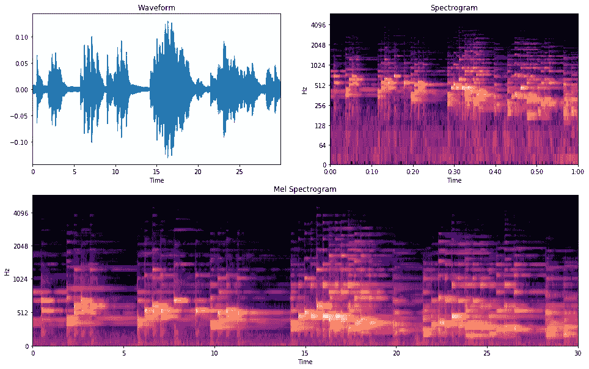
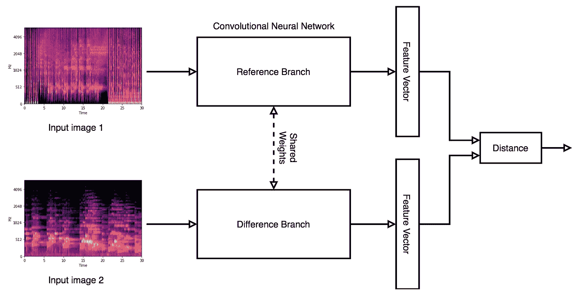

# 使用连体神经网络计算音频歌曲相似度

> 原文：<https://towardsdatascience.com/calculating-audio-song-similarity-using-siamese-neural-networks-62730e8f3e3d?source=collection_archive---------14----------------------->

# 介绍

在 AI Music，我们的内容目录每天都在增长，我们越来越有必要创建更智能的系统来搜索和查询音乐。这样做的一个系统可以由定义和量化歌曲之间的相似度的能力来决定。这里描述的核心方法处理声学相似性的概念。

使用描述性标签搜索歌曲通常会引入语义不一致的问题。标签可以是高度主观的，取决于听众的年龄组、文化和个人偏好。例如，像“明亮”或“寒冷”这样的描述对不同的人来说可能意味着完全不同的东西。当谈到流派时，音乐也可能处于模糊的区域。像*野兽男孩*的*破坏*这样的歌曲主要被称为*嘻哈/说唱*歌曲，然而它包含了许多我们传统上认为属于*摇滚*歌曲的声音品质。使用示例参考轨道从大型目录中检索相似歌曲或相似歌曲的排序列表的能力避免了这样的问题。

然而，当我们认为两首或更多的歌曲彼此相似时，这实际上意味着什么呢？这种感觉上的相似性通常很难定义，因为它包括许多不同的方面，如流派、乐器、情绪、节奏等等。使问题进一步复杂化的是，相似性往往是由这些特征的无限制组合构成的。歌曲相似性是一个如此主观的概念，我们如何解决定义一个基本事实的问题？

# 我们是如何解决这个问题的？

确定歌曲之间相似性的传统方法需要您从音频中选择和提取音乐特征。这些特征在一个空间内彼此有多近或多远被假定为各个轨迹的感知相似性。采用这种方法的一个问题是如何确定哪些特征最好地映射到感知的相似性。在 AI Music，我们通过采用基于暹罗神经网络(SNN)的方法来解决这个问题。

SNN 架构基于卷积神经网络架构，这意味着我们需要将音频转换为图像。音频最常见的图像表示是波形，其中信号幅度相对于时间绘制。对于我们的应用程序，我们使用一种称为声谱图的音频视觉表示，特别是 mel 声谱图。

*   ***频谱图*** 使用傅立叶变换产生信号相对于时间的频率分布。
*   一个 ***梅尔频谱图*** 是一个频谱图，其中频率被映射到梅尔标度。
*   ***梅尔标度*** 是对数间隔的，从而产生与人类听觉更密切相关的表示。

我们选择了梅尔频谱图，因为已经发现它们很好地代表了声音的音色，因此更好地代表了歌曲的声学特征。

图 1:波形、谱图和 mel 谱图对比

从上图中我们可以看到，相关的音乐信息在 mel 声谱图中展现得更加清晰。

# **数据对**

暹罗网络基于 2 个“分支”，这些分支在结构上完全相同，并具有相同的权重。基本功能是一个分支接受*‘参考’*轨道 mel 谱图作为输入，而另一个分支接受*‘差异’*轨道 mel 谱图作为输入。通过计算每个数据点之间的相似性，为该输入创建数据对。每个数据点都被用作“参考”来产生 5 个正的和 5 个负的“差异”对。通过采用基于 2 个数据点共享的描述性标签和音乐成分的数量的相似性系数来生成数据集的相似性矩阵。然后可以使用该矩阵选择相似和不相似的轨迹。

我们使用以下规则生成配对:

5 个正对:

*   参考轨道本身
*   从 10 个最相似的音轨中随机选择 4 个阳性匹配

5 个负对:

*   从 10 个最不相似的音轨中随机选择 5 个负匹配

这些图像对被传递到模型中，在模型中为每个图像对生成一个特征向量(嵌入)。欧几里德距离被用作这些特征向量之间的距离度量。计算这两个特征向量之间的欧几里德距离，得到相似性得分。对比损失用于指示如何更新模型权重。对比损失旨在最小化相似对之间提取的特征向量之间的距离，并根据基于元数据计算的距离余量来分离不相似对。

图 1:连体神经网络流程图

# 我们如何使用训练过的暹罗模型

一旦我们剩下一个训练有素的模型，我们分裂暹罗网络。这给我们留下了一个没有计算欧几里德距离的最终层的单个分支。在这种形式中，模型本质上是一个特征提取器。然后可以处理我们希望能够从中搜索的音乐的整个后备目录，给我们留下相应特征向量的数据库。然后，可以通过这个相同的模型发送一首新的“未听过的歌曲”,并且可以计算得到的特征向量和数据库中所有特征向量之间的欧几里德距离。得分最低的结果表示最相似的歌曲。

音频示例 1 —嘻哈音乐

音频示例 2—流行音乐

音频示例 3—国家

# **结论&进一步工作**

使用暹罗网络来计算歌曲相似性意味着我们允许系统确定准确表示我们希望量化的感知相似性的特征。这给我们留下了一个仅依赖于音频信号的歌曲推荐系统。话虽如此，创造地面真相的局限性依然存在。提出更智能的方法来构建数据对数据集是我们在深度学习领域需要克服的更大挑战之一，在深度学习领域，大型数据集并不容易获得。

为了在训练网络时不需要计算和提供数据对的数字相似性分数，我们尝试使用三元组损失函数。这里我们在网络中有 3 个分支，一个用于参考歌曲，一个用于肯定匹配，另一个用于否定匹配。这意味着在训练期间，参考和正例的特征向量将被推得彼此更近，而参考轨迹和负匹配的特征向量将被推得更远。

歌曲相似性的固有感知估计也可能因人而异或因用例而异。使用条件相似性网络可以允许用户选择他们认为最重要的音乐特征或特性。

在 AI Music 注册我们的[时事通讯，了解我们在这里所做的最新研究，并发现更多关于该公司探索人工智能如何帮助塑造音乐制作和交付的信息](https://www.aimusic.co.uk/newsletter-sign-up)

# 参考

Pranay Manocha，Rohan Badlani，Anurag Kumar，Ankit Shah，Benjamin Elizalde 和 Bhiksha Raj。"使用连体神经网络的基于内容的音频表示."(2018) IEEE 声学、语音和信号处理国际会议(ICASSP)。

梁浩庭、曾东火、、小山圭三《三胞胎网络个性化音乐推荐》( *2019)*

李宗弼，尼古拉斯 j .布莱恩，贾斯汀萨拉蒙，金泽宇，朱汉南。"解开音乐相似性的多维度量学习."(2020) IEEE 声学、语音和信号处理国际会议(ICASSP)。

[使用 Keras 对暹罗网络进行一次性学习](/one-shot-learning-with-siamese-networks-using-keras-17f34e75bb3d)