# 用自举法计算置信区间

> 原文：<https://towardsdatascience.com/calculating-confidence-interval-with-bootstrapping-872c657c058d?source=collection_archive---------4----------------------->

## 如何用 bootstrapping 计算置信区间？

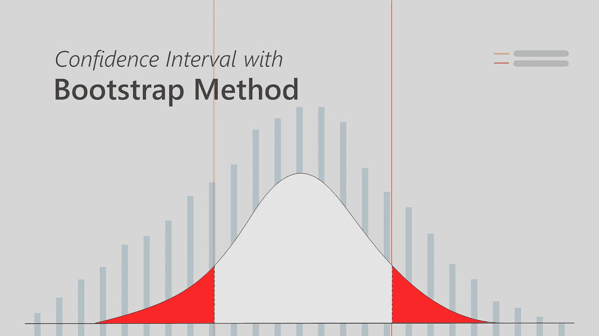

*故事横幅，作者图片*

## 大家好，

在这篇文章中，我将尝试解释如何通过使用 Bootstrap 方法找到一个置信区间。 ***统计*** 和 ***Python*** 知识需要更好的理解。

在深入研究该方法之前，让我们记住一些统计学概念。

***方差:*** 它是由一个数据点与每个数据点的均值之间的距离平方之和除以数据点的个数得到的。

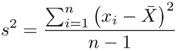

采样离散

***标准差:*** 它是一个向我们展示我们的数据点如何从均值向外扩散的度量。它是通过求方差的平方根得到的

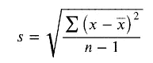

样品标准偏差

***累积分布函数*** :可用于任何一种变量 X(离散、连续等。).它向我们展示了变量的概率分布。因此允许我们从给定的概率分布中解释小于或等于 x 的值的概率

***经验累积分布函数:*** 又称经验分布函数。CDF 和 ECDF 之间的唯一区别是，前者向我们展示了任何给定人口的假设分布，而后者是基于我们观察到的数据。

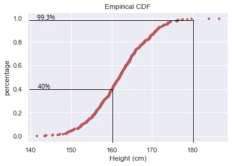

例如，我们如何解释上图所示数据的 ECDF？我们可以说，40%的身高小于或等于 160cm。同样，身高低于或等于 180 厘米的人口比例为 99.3%

***概率密度函数:*** 它向我们展示了连续变量的分布。曲线下的面积给出了概率，所以面积必须总是等于 1

***正态分布:*** 又称*高斯分布*。它是统计学中最重要的概率分布函数，呈钟形对称。

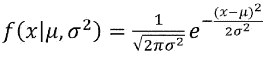

正态(高斯)分布

***置信区间:*** 是数值在总体中可能存在的范围。它是根据原始样本估计的，通常定义为 95%的置信度，但也可能不同。您可以考虑下图，该图显示了 95%的置信区间。由对应于第一个和最后 2.5 个百分点的值定义的置信区间的下限和上限。

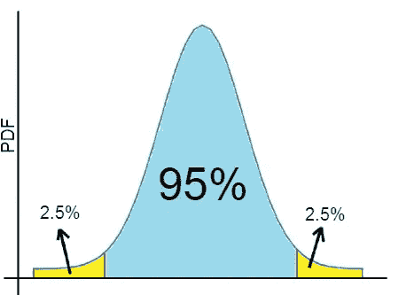

95%置信区间，*作者图片*

# 什么是自举法？

Bootstrap 方法是数据科学中常用的一种重采样方法。布拉德利·埃夫隆在 1979 年提出了这种方法。主要包括用替换( ***Bootstrap 样本*** )重新采样我们的原始样本，以及使用*汇总统计生成 ***Bootstrap 复制*** 。*

# 人高的置信区间

在本文中，我们将使用[***ka ggle***](https://www.kaggle.com/majidarif17/weight-and-heightcsv)中的一个数据集。这是*体重-身高*数据集。它包含 10，000 人的身高(英寸)和体重(磅)信息，按性别分类。

> 如果你想看完整的代码，你可以通过 [**链接**](https://github.com/Bhasfe/statistics/tree/master/bootstrapping) 找到 IPython 笔记本*。*

我们将只使用随机选择的 500 个人的身高，并通过使用 Bootstrap 方法计算 95%的置信区间

让我们从导入我们将需要的库开始。

数据帧的前五行如下

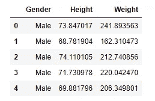

显然，高度是以*英寸*表示的，让我们将高度从英寸转换为*厘米*并存储在新的列 *Height(cm)* 中。

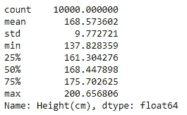

从上面我们可以看到，数据集中的最大和最小身高分别是 137.8 cm 和 200.6 cm。

我们可以用熊猫。DataFrame 的 ***采样*** 方法选择 500 个随机选择的高度。之后，我们将打印汇总统计数据。

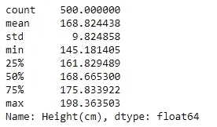

根据输出，我们的样本最小高度为 145 cm，最大高度为 198 cm。

让我们看看 ECDF 和 PDF 是什么样子的？

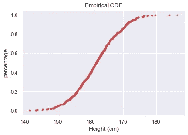

*ECDF，作者图片*

经验 CDF 表明我们样本中 50%的人身高不超过 162 cm。

PDF 呢？

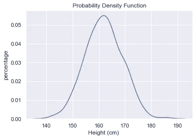

*PDF，作者图片*

PDF 向我们展示了高度的分布过于接近正态分布。不要忘记曲线 *下的 ***区域给出了概率。****

现在，花点时间想想。我们的样本中只有 500 个观察值，但世界上有几十亿人我们无法测量他们的身高。因此，我们的样本不能对总体做出推断。如果我们一次又一次地对不同的样品进行同样的测量，那么高度的平均值是多少？

例如，假设我们对相同数量的人(500)进行了 1000 次相同的测量，并以覆盖第一次观察的 ECDF 的方式绘制了每个人的 ECDF。它看起来会像下面这样。

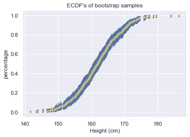

*ECDF，作者图片*

正如我们在上面看到的，我们得到了不同的高度，但是我们可以很容易地发现这些点在一个特定的范围内扩散。这就是我们想要了解的置信区间

你可能会说实验不可能重复这么多次，你没有错。我们使用自举方法的确切原因。它帮助我们将同一个实验模拟数千甚至数十亿次。

怎么会？

事实上，Bootstrap 方法非常简单易懂。首先，它通过在原始样本中随机选择，从原始样本中生成引导样本。之后，它会应用一个汇总统计数据(如变异、标准偏差、平均值等)来获取重复数据。我们将使用“mean”来生成我们的引导复制。

为了理解该方法，让我们将它应用于一个仅包含 5 个高度的小样本。我们可以像下面这样生成我们的引导样本。不要忘记这样一个事实，我们可以多次选择任何观测值(替换重采样)

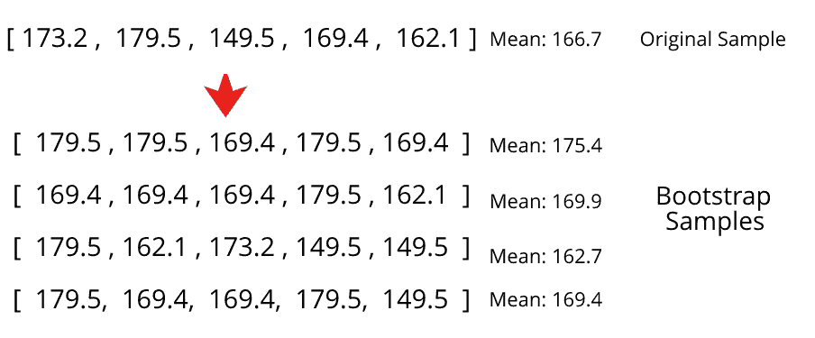

*重采样，作者图像*

正如我们在上面看到的，我们创建了 4 个 bootstrap 样本，然后计算它们的平均值。我们将这些方法称为我们的引导复制。我们可以选择方差、标准差、中位数或其他任何值，而不是“均值”。

回到我们的项目。下一步，我们将从我们的原始样本生成我们的引导样本，我们将应用均值来获得引导复制。我们将在一个 for 循环中重复这个过程 15.000 次(drawing ),并将副本存储在一个数组中。为此，我们可以定义如下函数

通过调用函数得到 15.000 个复制后，我们可以比较原始样本和引导复制的平均值

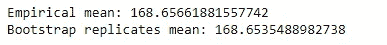

他们的手段太接近了。

那么，我们要怎么计算 95%的置信区间呢？

获得 bootstrap 复制后，剩下的就是这么简单了。众所周知，我们的下限和上限是对应于 2.5 和 97.5 百分位的值。

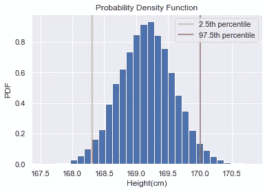

百分位数，*作者图片*

我们可以用下面简单的 Python 代码找到边界

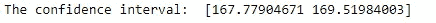

我们的边界在 167.7 和 169.5。因此，我们可以说，如果对整个人群做同样的实验。身高的平均值将在 167.7 厘米和 169.5 厘米之间，有 95%的可能性

# 摘要

让我们总结一下我们所做的。我们随机选择了 500 个高度并生成了引导样本。我们从这些样本中计算“平均值”,并得到平均值的 bootstrap 复制。最终我们计算出 95%的置信区间。

祝你数据之旅好运:)

# 参考

 [## 用一个例子介绍统计学中的 Bootstrapping——Jim 的统计学

### Bootstrapping 是一种统计过程，它对单个数据集进行重新采样，以创建许多模拟样本。这个过程…

statisticsbyjim.com](https://statisticsbyjim.com/hypothesis-testing/bootstrapping/)  [## Python 中的统计思维(第 2 部分)

### 做统计推断的时候，我们说的是概率的语言。描述您的…的概率分布

www.datacamp.com](https://www.datacamp.com/courses/statistical-thinking-in-python-part-2)  [## 自助法简介

### 关于 bootstrap 方法、动机及其工作原理的探讨

towardsdatascience.com](/an-introduction-to-the-bootstrap-method-58bcb51b4d60)