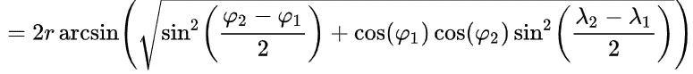
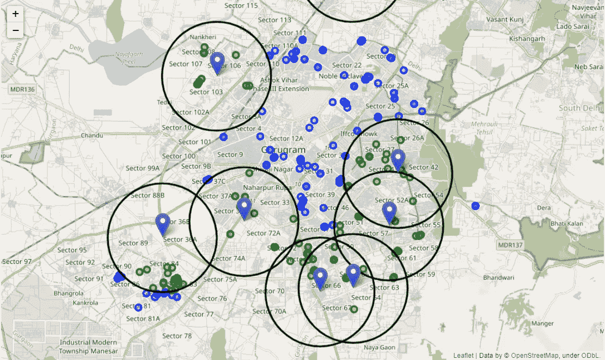

# 用 Python 计算两个地理位置之间的距离

> 原文：<https://towardsdatascience.com/calculating-distance-between-two-geolocations-in-python-26ad3afe287b?source=collection_archive---------5----------------------->


照片由[捕捉人心。](https://unsplash.com/@dead____artist?utm_source=medium&utm_medium=referral) on [Unsplash](https://unsplash.com?utm_source=medium&utm_medium=referral)

几个月前，我在从事一个可视化地理位置数据(即纬度和经度)的自由职业项目，在这个项目中，我必须在地图上可视化中心设施和客户位置。根据一个客户的要求，我必须找到距离不同设施 3 公里范围内的所有客户位置。为此，我必须计算所有位置之间的距离。这是我第一次使用原始坐标，所以我尝试了一个天真的尝试，使用欧几里德距离来计算距离，但很快意识到这种方法是错误的。

欧几里得距离适用于平面，就像笛卡尔平面一样，然而，地球不是平的。所以我们必须使用一种特殊类型的公式，称为**哈弗辛距离。**

> 哈弗线距离可以定义为地球表面两个位置之间的角距离。

哈弗线距离可以计算为:



来源:[https://en.wikipedia.org/wiki/Haversine_formula](https://en.wikipedia.org/wiki/Haversine_formula)

看起来令人生畏，是的，如果你必须使用原始的 python 代码来应用它，这将是令人生畏的，但是感谢 python 充满活力的开发者社区，我们有一个专门的库来计算称为 haversine 的 Haversine 距离(使用 python 的好处之一)。

介绍完毕，让我们开始实施吧:

**步骤 1:安装“哈弗辛”**

在 jupyter 笔记本上安装以下命令的 haversine 类型。

```
!pip install haversine
```

如果您通过 anaconda 提示符安装，请删除“！”从上面的命令中标记。

**步骤 2:导入库**

安装完库后，导入它

```
import haversine as hs
```

**步骤 3:计算两个位置之间的距离**

```
loc1=(28.426846,77.088834)
loc2=(28.394231,77.050308)
hs.haversine(loc1,loc2)
```

产量:5.229712941541709

默认情况下，哈弗辛函数返回以千米为单位的距离。如果要将距离的单位改为英里或米，可以使用如下所示的哈弗辛函数的单位参数:

```
from haversine import Unit
#To calculate distance in meters 
hs.haversine(loc1,loc2,unit=Unit.METERS)
```

输出:58660 . 68868686861

```
#To calculate distance in miles 
hs.haversine(loc1,loc2,unit=Unit.MILES)
```

产量:3.245363636765

同样，你也可以用英寸来计算距离。

如果使用原始位置数据，计算两个位置之间的距离是一项基本要求。它不仅能帮助你更好地可视化，还能为你的机器学习算法提供优势。它可能会给你的模型增加一个优势，并通过增加一个新的维度“距离”来提高它的整体效率。

这是我在本文前面提到的项目的输出:



作者图片

如果你想看完整的代码，你可以访问我的 github 页面:[https://github.com/ashutoshb418/Foodies-Visualization](https://github.com/ashutoshb418/Foodies-Visualization)