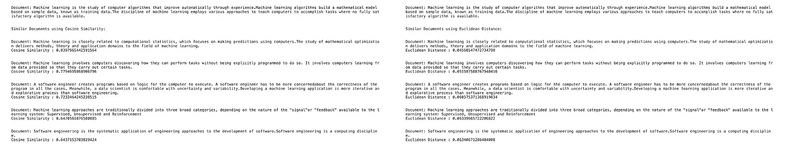
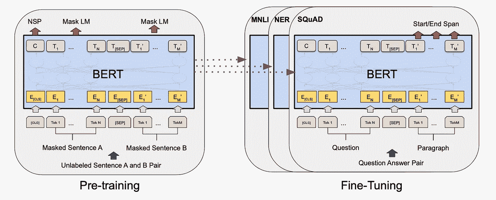

# 使用 BERT、word2vec 和其他模型计算文档相似度

> 原文：<https://towardsdatascience.com/calculating-document-similarities-using-bert-and-other-models-b2c1a29c9630?source=collection_archive---------1----------------------->

## [入门](https://towardsdatascience.com/tagged/getting-started)


由[维克多·塔拉舒克](https://unsplash.com/@viktortalashuk?utm_source=medium&utm_medium=referral)在 [Unsplash](https://unsplash.com?utm_source=medium&utm_medium=referral) 上拍摄的照片

**简介**

文档相似性是自然语言处理中最关键的问题之一。寻找文档间的相似性被用于几个领域，例如推荐相似的书籍和文章、识别剽窃的文档、法律文档等。

如果两个文档在语义上相似，并且定义了相同的概念，或者它们是重复的，我们可以称之为相似的。

为了让机器找出文档之间的相似性，我们需要定义一种方法来数学地测量相似性，并且它应该是可比较的，以便机器可以告诉我们哪些文档最相似，哪些最不相似。我们还需要以可量化的形式(或数学对象，通常是向量形式)表示文档中的文本，以便我们可以在此基础上执行相似性计算。

因此，将文档转换成数学对象和定义相似性度量主要是让机器执行这项工作所需的两个步骤。我们将研究做这件事的不同方法。

**相似度函数**

计算相似性的一些最常见和最有效的方法是，

*余弦距离/相似度*——是两个向量之间角度的余弦，它给了我们向量之间的角距离。计算两个向量 A 和 B 之间余弦相似性公式为:


在二维空间中，它看起来像这样，


二维空间中两个向量 A 和 B 之间的角度(图片由作者提供)

你可以很容易地计算出数学公式，并使用余弦定律来证明这个公式。

余弦在θ= 0°时为 1，在θ= 180°时为-1，这意味着对于两个重叠的矢量，余弦在两个完全相反的矢量中最高和最低。正因如此，所以称之为相似。你可以把 1 余弦当作距离。

*欧氏距离*——这是 p=2 时闵可夫斯基距离的形式之一。其定义如下:


在二维空间中，欧几里德距离会是这样的，


二维空间中两个向量 A 和 B 之间的欧氏距离(图片由作者提供)

*Jaccard 距离-* Jaccard 指数用于计算两个有限集之间的相似度。Jaccard 距离可以认为是 1 - Jaccard 指数。


如果我们可以在向量空间中表示文档，我们可以使用余弦或欧几里德距离。如果我们认为我们的文档只是没有任何语义意义的单词集或集合，则可以使用 Jaccard 距离。

余弦和欧几里德距离是最广泛使用的度量，我们将在下面的例子中使用这两个。

**嵌入**

嵌入是文本的向量表示，其中具有相似含义或上下文的单词或句子具有相似的表示。


单词的三维矢量表示(图片由作者提供)

下面是一些计算文档嵌入的算法和例子，

***Tf-idf -*** Tf-idf 是词频和逆文档频的组合。它为文档中的每个单词分配一个权重，该权重是使用该单词在文档中的频率以及该单词在整个文档语料库中的文档频率来计算的。关于 tf-idf 的更多细节请参考这个[故事](https://medium.com/analytics-vidhya/the-quantitative-value-of-text-tf-idf-and-more-e3c7883f1df3)。

让我们将以下定义为我们想要计算相似性的文档的语料库(集合),


文档语料库(图片由作者提供)

我们将执行基本的文本清理，删除特殊字符，删除停用词，并将所有内容转换为小写。然后，我们将把文档转换成它们的 tf-idf 向量，并使用余弦和欧几里德距离计算成对的相似度。

成对余弦相似度将只是 tf-idf 向量的点积，因为来自 sklearn 的 tf-idf 向量已经被归一化，并且这些向量的 L2 范数是 1。所以在这种情况下，余弦相似性公式的分母是 1。

```
print (tfidf_vectors[0].toarray())print (pairwise_similarities.shape)print (pairwise_similarities[0][:])
```


```
# documents similar to the first document in the corpus
most_similar(0,pairwise_similarities,'Cosine Similarity')
```


基于余弦相似性和欧几里德距离与第一个文档相似的文档(图片由作者提供)

***Word2vec -*** 顾名思义 Word2vec 将单词嵌入向量空间。Word2vec 将文本语料库作为输入，并将单词嵌入作为输出。word2vec 主要有两种学习算法:连续单词包和连续跳格。


连续单词袋(CBOW)和跳格模型(图片由[https://arxiv.org/pdf/1301.3781.pdf](https://arxiv.org/pdf/1301.3781.pdf)提供)

如果有足够的数据和计算可用，我们可以训练我们自己的嵌入，或者我们可以使用预训练的嵌入。我们将使用由 [Google](https://code.google.com/archive/p/word2vec/) 提供的预训练嵌入。

我们将从标记和填充每个文档开始，使它们都具有相同的大小。

```
# tokenize and pad every document to make them of the same size
from keras.preprocessing.text import Tokenizer
from keras.preprocessing.sequence import pad_sequencestokenizer=Tokenizer()
tokenizer.fit_on_texts(documents_df.documents_cleaned)
tokenized_documents=tokenizer.texts_to_sequences(documents_df.documents_cleaned)
tokenized_paded_documents=pad_sequences(tokenized_documents,maxlen=64,padding='post')
vocab_size=len(tokenizer.word_index)+1print (tokenized_paded_documents[0])
```


标记化文档(作者图片)

让我们加载预训练的嵌入。每个单词都被表示为一个 300 维的向量。

```
# loading pre-trained embeddings, each word is represented as a 300 dimensional vectorimport gensimW2V_PATH="GoogleNews-vectors-negative300.bin.gz"
model_w2v = gensim.models.KeyedVectors.load_word2vec_format(W2V_PATH, binary=True)
```

使用这种嵌入，我们可以将文档语料库中的每个单词转换成 300 维向量。因为我们有 6 个文档，并且我们已经将每个文档填充为最大大小 64，所以语料库的向量表示将是 6X64X300 的形状。

```
# creating embedding matrix, every row is a vector representation from the vocabulary indexed by the tokenizer index. 
embedding_matrix=np.zeros((vocab_size,300))
for word,i in tokenizer.word_index.items():
    if word in model_w2v:
        embedding_matrix[i]=model_w2v[word]# creating document-word embeddings
document_word_embeddings=np.zeros((len(tokenized_paded_documents),64,300))for i in range(len(tokenized_paded_documents)):
    for j in range(len(tokenized_paded_documents[0])):
        document_word_embeddings[i][j]=embedding_matrix[tokenized_paded_documents[i][j]]document_word_embeddings.shape
```


文档-单词嵌入形状(图片由作者提供)

现在我们必须将每个文档表示为一个向量。我们可以对每个单词向量进行平均或求和，并将每个 64X300 表示转换为 300 维表示。但是对所有单词进行平均或求和将会失去文档的语义和上下文含义。文件的长度不同也会对此类行动产生不利影响。

一种更好的方法是使用 tf-idf 权重对单词向量进行加权平均。这可以在一定程度上处理可变长度问题，但是不能保持单词的语义和上下文含义。之后，我们可以使用成对距离来计算类似的文档，就像我们在 tf-idf 模型中所做的那样。

```
# calculating average of word vectors of a document weighted by tf-idfdocument_embeddings=np.zeros((len(tokenized_paded_documents),300))
words=tfidfvectoriser.get_feature_names()for i in range(len(document_word_embeddings)):
    for j in range(len(words)):
        document_embeddings[i]+=embedding_matrix[tokenizer.word_index[words[j]]]*tfidf_vectors[i][j]print (document_embeddings.shape)pairwise_similarities=cosine_similarity(document_embeddings)
pairwise_differences=euclidean_distances(document_embeddings)most_similar(0,pairwise_similarities,'Cosine Similarity')
most_similar(0,pairwise_differences,'Euclidean Distance')
```



基于余弦相似性和欧几里德距离与第一个文档相似的文档(图片由作者提供)

***GloVe-***Global Vectors for word Embedding(GloVe)是一种无监督学习算法，用于产生单词的向量表示。在来自语料库的聚集的全局单词-单词共现统计上执行训练，并且所得的表示展示了单词向量空间的有趣的线性子结构。

我们将使用来自[斯坦福](https://nlp.stanford.edu/projects/glove/)的预训练手套嵌入。所有步骤都与 word2vec 嵌入相同，只是在这种情况下，我们将使用手套预训练模型。我们使用 100 维的手套嵌入，因为嵌入文件很大。你也可以使用更高的维度。


基于余弦相似性和欧几里德距离与第一个文档相似的文档(图片由作者提供)

***doc 2 vec-***[doc 2 vec](https://cs.stanford.edu/~quocle/paragraph_vector.pdf)是一种无监督学习算法，产生句子/段落/文档的向量表示。这是 word2vec 的改编版。Doc2vec 可以把一个完整的文档表示成一个向量。因此，我们不必取单词向量的平均值来创建文档向量。


段落向量分布式单词包版本(PVDOBW)和段落向量分布式内存版本(PVDM)(图片来自[https://arxiv.org/pdf/1405.4053.pdf](https://arxiv.org/pdf/1405.4053.pdf))

我们将使用 gensim 在我们的语料库上训练 Doc2vec 模型，并创建文档的向量表示。


基于余弦相似性和欧几里德距离与第一个文档相似的文档(图片由作者提供)

***BERT-*** [来自变形金刚的双向编码器表示(BERT)](https://arxiv.org/abs/1810.04805) 是 Google 开发的自然语言处理预训练的最新技术。BERT 在包括维基百科和书籍语料库在内的未标记文本上接受训练。BERT 使用 transformer architecture，一种注意力模型来学习单词的嵌入。

BERT 包括两个预训练步骤:掩蔽语言建模(MLM)和下一句预测(NSP)。在 BERT 中，使用三种嵌入来表示训练文本，即标记嵌入+片段嵌入+位置嵌入。



伯特训练建筑(图片来自[https://arxiv.org/pdf/1810.04805.pdf](https://arxiv.org/pdf/1810.04805.pdf))


伯特输入表示(图片来自[https://arxiv.org/pdf/1810.04805.pdf](https://arxiv.org/pdf/1810.04805.pdf))

我们将使用来自 [Huggingface](https://huggingface.co/sentence-transformers/bert-base-nli-mean-tokens) 的预训练 BERT 模型来嵌入我们的语料库。我们正在加载 BERT 基本模型，它有 12 层(变压器块)，12 个注意头，1.1 亿个参数，隐藏大小为 768。


基于余弦相似性和欧几里德距离与第一个文档相似的文档(图片由作者提供)

您已经看到了用向量形式表示文档和度量相似性的多种方法。您可以针对自己的问题定制它们，看看哪种最适合您。

这里有这个故事的完整代码-[https://github . com/varun 21290/medium/blob/master/Document % 20 similarities/Document _ similarities . ipynb](https://github.com/varun21290/medium/blob/master/Document%20Similarities/Document_Similarities.ipynb)

*参考文献:*

[](https://en.wikipedia.org/wiki/Law_of_cosines) [## 余弦定律

### 在三角学中，余弦定律(也称为余弦公式、余弦法则或阿尔-卡希定理)与…

en.wikipedia.org](https://en.wikipedia.org/wiki/Law_of_cosines) [](https://code.google.com/archive/p/word2vec/) [## 密码

### 编辑描述

code.google.com](https://code.google.com/archive/p/word2vec/)  [## 向量空间中单词表示的有效估计

### 我们提出了两种新的模型架构，用于从非常大的数据中计算单词的连续向量表示…

arxiv.org](https://arxiv.org/abs/1301.3781) [](https://nlp.stanford.edu/projects/glove/) [## GloVe:单词表示的全局向量

### GloVe 是一种无监督学习算法，用于获取单词的矢量表示。培训在…进行

nlp.stanford.edu](https://nlp.stanford.edu/projects/glove/)  [## 句子和文档的分布式表示

### 许多机器学习算法要求将输入表示为固定长度的特征向量。当谈到…

arxiv.org](https://arxiv.org/abs/1405.4053)  [## BERT:用于语言理解的深度双向转换器的预训练

### 我们介绍了一种新的语言表示模型，称为 BERT，代表双向编码器表示…

arxiv.org](https://arxiv.org/abs/1810.04805) [](https://huggingface.co/sentence-transformers/bert-base-nli-mean-tokens) [## 句子变形/bert-base-nli-mean-tokens 拥抱脸

### 这是句子变形库的 bert-base-nli-mean-tokens 模型。句子-变形金刚…

huggingface.co](https://huggingface.co/sentence-transformers/bert-base-nli-mean-tokens) [](https://medium.com/analytics-vidhya/the-quantitative-value-of-text-tf-idf-and-more-e3c7883f1df3) [## 文本、tf-idf 等的量化价值…

### 定义、计算和变化

medium.com](https://medium.com/analytics-vidhya/the-quantitative-value-of-text-tf-idf-and-more-e3c7883f1df3)