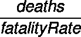
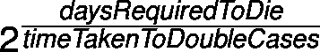
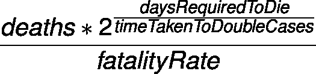
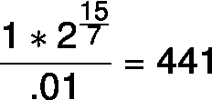
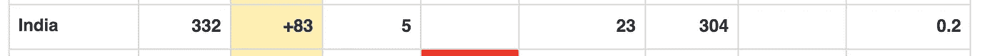
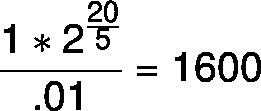

# 根据死亡人数计算活跃的新冠肺炎病例

> 原文：<https://towardsdatascience.com/calculating-live-covid-19-cases-from-deaths-e70e5df45f60?source=collection_archive---------13----------------------->

## 通过统计数据预测数字

在 [Unsplash](https://unsplash.com/s/photos/death?utm_source=unsplash&utm_medium=referral&utm_content=creditCopyText) 上由 [Aron 视觉](https://unsplash.com/@aronvisuals?utm_source=unsplash&utm_medium=referral&utm_content=creditCopyText)拍摄的照片

昨天，我和我的家人通了电话，他们受过足够的教育，知道现在出门的风险。但是，令我震惊的是，他说了一句让我吃惊的话:“人们不必要地害怕。我们是一个有 13 亿人口的国家，到目前为止只有 250 例报告病例。没什么好怕的。”即使在他的城市已经报道了病毒的时候，他还是这样说。

我感到困惑、沮丧和愤怒。

我感觉如果能算出‘真实活跃案例’，人们会更认真对待事情。

目前，我们对我们的情况—全球、国家和城市—有不正确的信息。我们真的没有对活跃病例的正确概念。

> 活动案例不同于报告的案例。

# 问题

目前不可能有正确的真实活动案例，因为:

*   我们没有足够的测试设备
*   人们不知道他们是否有正确的症状
*   有症状的人在接受检测之前，正等着情况变得更糟

> 250 不吓人。但是如果这个数字是 2500 呢？

# 方法

让我们用简单的数学和我们从其他国家学到的知识。我现在在印度的孟买，想计算一下当天的死亡人数。

为了计算真实的活动案例，计算需要非常具体的国家，并且还需要足够的案例才能在统计上正确。如果到目前为止只有一人死亡，下面的计算可能是不正确的。如果有 1000 人死亡，计算将接近真实值。

因此，我们将尝试计算真实值的下限和上限。

# 假设

让我们来看一些大概的数字。

> 死亡率→1%至 5 %
> 
> 死亡所需天数→ 15 到 20 天
> 
> 案件翻倍所需时间→ 5 至 7 天

> 我们想计算第 x 天的活动病例，给出第 x 天的死亡人数，而不是第 x 天的累计病例总数。

# 公式

让我们假设大数定律已经生效了，尽管它还没有生效，因为印度还处于萌芽阶段。

人要死，肯定有过死亡/(病死率)人。

由于死亡发生在感染疾病的几天后，病例以双倍的速度增长。

因此，鉴于当天的死亡人数，当天的活跃病例为

# 下界

让我们计算一下印度目前的情况。

一天只有 1 人死亡的情况下有哪些活跃的案例？

为了计算下限，让我们取最保守的数字。

> 死亡率→ 1%
> 
> 我们会选择 1%，因为最初的死亡率很低，这是因为有现成的医疗保健。当医疗保健失败时，情况会变得更糟。我们看到更多的老年人死亡，他们的死亡率更高，但我们需要平均死亡率。
> 
> 死亡所需天数→ 15 天
> 
> 案件翻倍所需时间→ 7 天

我们有 441 个病例。这在某种程度上与印度目前报告的病例相吻合。我们有 304 个案子。

[https://www.worldometers.info/coronavirus/](https://www.worldometers.info/coronavirus/)

注意:这里要理解的一点是，我们使用了非常保守的数字，如果我们的假设是正确的，441 是一个下限。

# 上界

为了计算上限，让我们取较高的数字。

> 死亡率→ 1%
> 
> 我们会选择 1%，因为最初的死亡率很低，这是因为有现成的医疗保健。当医疗保健失败时，情况会变得更糟。我们看到更多的老年人死亡，他们的死亡率更高，但我们需要平均死亡率。
> 
> 死亡所需天数→ 20 天
> 
> 案件翻倍所需时间→ 5 天

注意:这里需要理解的一点是，我们使用了较高的数字，如果我们的假设是正确的，1600 是一个上限。真实病例不能超过 1600 例，除非死亡报告不正确。

# 结论

如果你想做更好的计算，请把前一天的天数增加一倍，因为在一个国家疫情的不同阶段，天数会有所不同。此外，随着医疗保健变得不堪重负，死亡率也会发生变化。

我希望这是有意义的，有助于我们更仔细地了解情况。

保重，注意安全，✌️