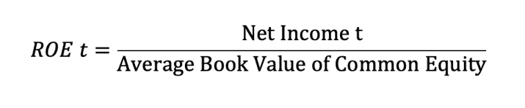
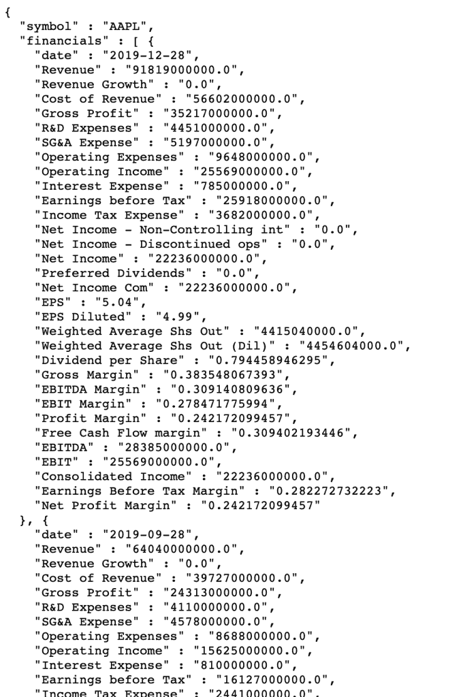
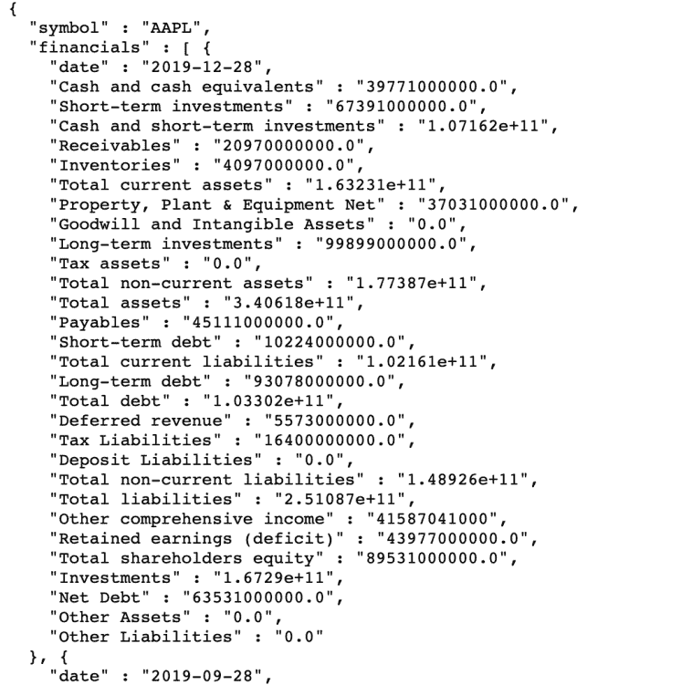

# 用 Python 计算股本回报率

> 原文：<https://towardsdatascience.com/calculating-return-on-equity-with-python-1ea583cd53bd?source=collection_archive---------27----------------------->

## 构建一个 Python 脚本来逐步计算股本回报率

沃伦巴菲特最喜欢的指标之一是净资产收益率(ROE)。他将净资产收益率作为投资决策过程的一部分。

股本回报率表明公司用股东投入的资金产生了多少净收入。在这个故事中，我们将使用 Python 计算您感兴趣的任何股票的股本回报率。


[NeONBRAND](https://unsplash.com/@neonbrand?utm_source=unsplash&utm_medium=referral&utm_content=creditCopyText) 在 [Unsplash](https://unsplash.com/s/photos/return-on-equity?utm_source=unsplash&utm_medium=referral&utm_content=creditCopyText) 上的照片

# 如何计算净资产收益率？

股本回报率的计算方法是:普通股股东可获得的净利润除以一段时间内(如一个季度、一年等)普通股的平均账面价值。).



**净收益**代表普通股股东可获得的净收益。而**权益账面价值**是企业资产减去负债的价值。除了在分母中使用普通股的平均账面价值，我们还可以使用期初的账面价值。

如果普通股权益的账面价值在不同时期变化很大，那么一个时期的平均账面价值是最合适的。对于我们的计算，**我们将使用权益的平均账面价值**。

# 如何解读 ROE？

在投资界，较高的净资产收益率被视为一个积极的信号。然而，我们需要对公司如何增加净资产收益率保持谨慎。如果一家公司承担更多的债务，ROE 将会增加，因为该公司可能会通过发行债务来减少自己的权益(即购买自己的权益)。这将导致更高的风险，因此，净资产收益率将增加。

另一方面，如果一家公司增加净收入而不增加债务，那么净资产收益率的增加**将是一个非常好的迹象。**

# 用 Python 计算股本回报率

既然我们理解了为什么 ROE 如此重要，那么让我们构建一个 Python 脚本来自动计算我们感兴趣的任何公司的 ROE。

这超级简单。我们将使用一个免费的 API， [Financialmodelingprep](https://financialmodelingprep.com/developer/docs/) ，来检索财务报表和股票数据。我们将向 API 端点发出 get 请求来检索财务报表，我们将解析计算 **ROE** 所需的值。

首先，我们需要导入构建 Python 脚本所需的唯一库。

由于我们想重用代码来计算不同公司的 ROE，我们将构建一个函数调用 *getROE* 。 *getROE* 将把公司股票作为一个参数，该参数将作为 url 的一个参数传递:

Python ROE 函数

如果我们现在打印我们的损益表，我们将有一个很好的易于解析的格式字典。请注意，在 url 中，*股票*将被作为参数传递的公司股票代码替换，例如“ *AAPL* ”。

```
print(income_statement)
```



Python 损益表

# 计算净收入

现在，我们可以通过解析字典轻松提取出苹果的*净收入。关键的*财务*包含所有季度损益表数据。因为我们对最近一个季度感兴趣，所以我们提取列表的第一个元素。在第一个元素中，我们需要提取关键字 *Net Income Com* 的值:*

```
net_inc_common1 = float(income_statement['financials'][0]['Net Income Com'])
```

# 检索权益的账面价值

太好了，我们有了我们的 *ROE* 的分子。**接下来，**我们需要计算 ***股权的账面价值*** 。股权的账面价值可以通过查看财务报告中的资产负债表来提取。

幸运的是，Python 将完成这项工作，并为我们提取价值。我们将向 [Financialmodelingprep API 端点](https://financialmodelingprep.com/api/v3/financials/balance-sheet-statement/AAPL?period=quarter)发出 get 请求，以提取资产负债表季度数据:

```
BS = requests.get(f"https://financialmodelingprep.com/api/v3/financials/balance-sheet-statement/{stock}?period=quarter")BS = BS.json()
```

我们的回应如下所示。



资产负债表苹果公司

和以前一样，我们的响应包含一个字典列表。最新季度是列表中的第一个元素。我们现在可以解析字典来**提取*股东权益总额*** 值:

```
tot_equity_now = float(BS['financials'][0]['Total shareholders equity'])
```

因为我们需要计算该期间的平均值，所以我们还需要检索去年的权益账面价值。这将是列表中的第四个元素，即四个季度前:

```
tot_equity_previous = float(BS['financials'][4]['Total shareholders equity'])
```

很好，我们现在可以计算平均股本，并将其用作分母来获得 ROE 值。

```
Average_equity = (tot_equity_now + tot_equity_previous)/2ROE = net_inc_common1/Average_equity
```

# 将我们的 Python 金融脚本放在一起

我们构建了一个非常有用的 **Python 脚本，用任何公司的 Python 来** **计算股本回报率**。它非常容易使用，我们只需要调用函数并传递一个公司股票作为参数。然后，我们的函数将提取所需的财务数据，并为我们计算 ROE。

参见下面的最终代码。

Python 计算 ROE

如果我们现在传递 *AAPL* 和 *MSFT* 作为我们 *getROE* 函数的参数，Python 将计算苹果和微软的 ROE:

```
Apple = getROE('AAPL')#Format number as percentage 
Apple = "{:.2%}".format(Apple) MSFT = getROE('MSFT') 
MSFT = "{:.2%}".format(MSFT) print('MSFT:', MSFT ) print('AAPL:', Apple )
```

这将使微软的净资产收益率为 11.5%，苹果的净资产收益率为 21.44%。苹果的净资产收益率高于微软。这是因为更高的债务水平还是更高的净收入？我会让你自己分析这个。下面随意提供这个问题的答案！

感谢您阅读文章。希望你喜欢它！

*原载于 2020 年 2 月 10 日 https://codingandfun.com*[](https://codingandfun.com/calculating-return-on-equity-with-python/)**。**