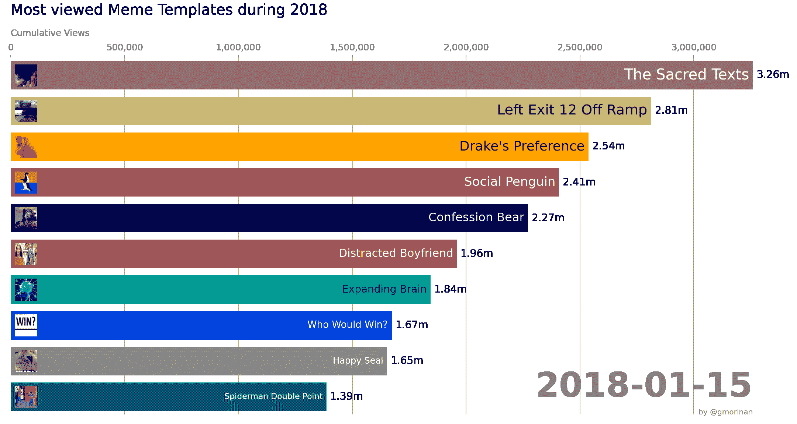
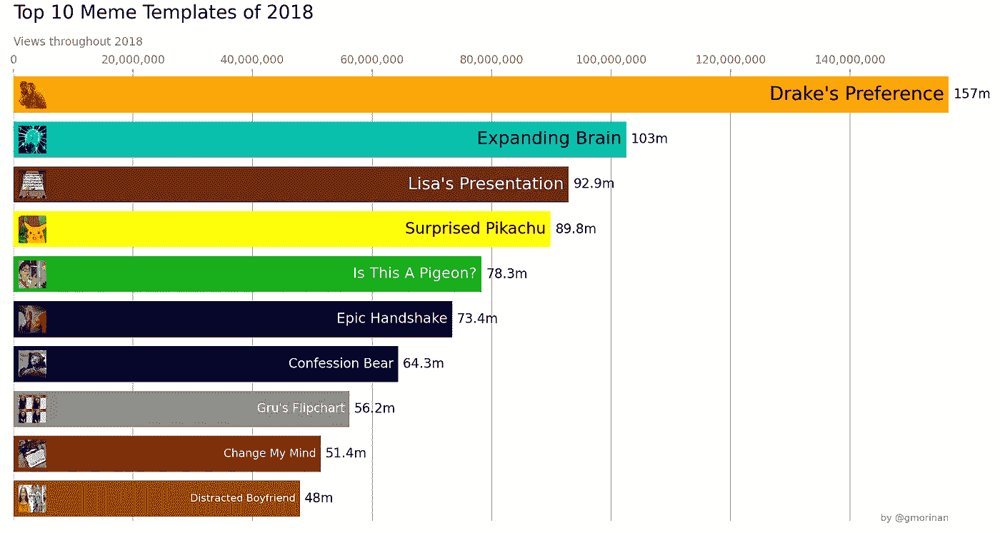
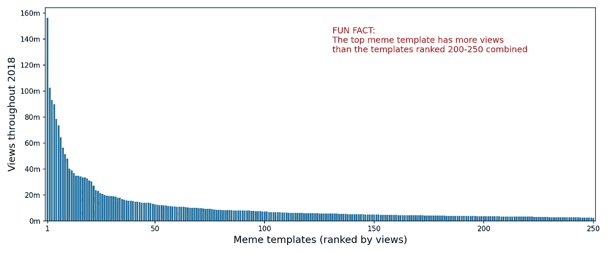

# 计算 10 个点击率最高的迷因

> 原文：<https://towardsdatascience.com/calculating-the-10-most-viewed-memes-dc8e1e24caf3?source=collection_archive---------41----------------------->

## 以及实现这一目标所需的 5 项数据科学原则

作者图。根据[合理使用原则](https://www.copyright.gov/title17/92chap1.html#107)的规定，出于评论的目的，在此复制模因的缩略图是允许的

[尼尔森收视率](https://en.wikipedia.org/wiki/Nielsen_ratings)估计广播电视节目的观众人数，但我们没有独立估计**迷因**(一种在过去十年中流行起来的艺术形式)的观众人数。所以我创造了一些！

我将描述上面图表中显示的视图计数是如何使用大约 43k 张图像的数据集和 **5 个数据科学原则**得出的(这些原则是我多年来在许多项目中应用的)。

# 1)明确定义您想要评估的内容

文字是可以解释的。我已经记不清有多少次两个人会在谈话中就一个项目的目标达成一致...只是后来发现他们对一个关键词有不同的解释。如果你在项目开始时就彻底辩论每个单词的定义，你将会节省时间。

例如，假设您想要估计“2019 年英国人口”。这是指 2019 年开始、结束或中期的人口吗？还是三者的平均值？人口是指永久居民，还是包括游客和临时居民在内的每个人？没有正确答案！

所以回到迷因。需要澄清的是，我说的不是模因的[学术定义](https://en.wikipedia.org/wiki/Meme)，而是互联网图像模因***(在网上分享的图像和文本的组合)。更确切地说，我感兴趣的是找出最流行的 [**模因模板**](https://imgflip.com/memetemplates) (用于模因的底层图像)。所以当我说“点击率最高的迷因”时，我实际上是指:***

> ***被浏览次数最多的**模因模板**(我们通过使用该模因模板将所有**互联网图片模因**的浏览次数相加得出)***

***因此，现在是时候开始收集数据了。***

# ***2)以最小化偏差的方式采样数据***

***尼尔森系统不可能监控每一台电视机，就像我无法下载网上分享的每一个 meme 一样。在这两种情况下，[采样](https://en.wikipedia.org/wiki/Sampling_(statistics))都是必要的。***

***如果一个数据样本真正代表了更广泛的人群，我们说它是无偏的，但在许多情况下这是不可能的。**通常，我们必须以尽可能合理地减少偏差的方式对数据进行采样**。然后在以后分析数据时尽最大努力纠正偏差。***

***在这个项目中，迷因是从世界上最大的图片分享网站之一 Reddit 上采集的。一天中有几次，一个网页抓取器会查看网站上几个以迷因为中心的部分，并收集 100 个最受欢迎的帖子。这些模因中有许多是在发布观看数据的网站 Imgur 上托管的，所以交叉引用他们的数据可以让我们推断 Reddit 帖子的观看数据。多亏了 Reddit & Imgur 的 API，用几行 python 就可以完成这个采样。为了简洁起见，我在这里就不解释了，但是所使用的代码可以在本文中找到:***

*** [## 哪个分支得票最多？

### 结合 Reddit 和 Imgur Python APIs 来确定用户参与度在子编辑之间如何变化

towardsdatascience.com](/which-subreddit-upvotes-the-most-18ab20567e25) 

现在的问题是**这种采样方法能使偏差最小化吗？** Reddit 只是一个网站，所以并不能真正代表整个互联网。我们可以通过对发布到其他网站的模因进行采样来减少偏见，比如 Instagram 或脸书。然而，这些网站提供的公共数据有限，不具有可比性，在网站之间进行比较的唯一方法是做出疯狂的假设，这可能会给我们的最终估计带来更大的偏差。

有时你只需要接受没有正确答案的事实，然后做出判断。我认为最好从一个最好的来源取样，而不是把许多来源结合起来，最后得到一个不可靠的数据集。我说 Reddit 是最好的来源，因为它是最大的图片分享网站，你可以从中推断出合理准确度的观看数据(通过与 Imgur 数据的交叉引用)。*** 

# ***3)复杂模型只针对复杂问题***

***我们需要识别数据集中每个迷因所使用的迷因模板。这是一个图像分类问题，但更重要的是一个简单的图像分类问题。**不要使用复杂的解决方案，简单的解决方案就可以了**。***

***最新技术水平的图像分类器，如那些赢得 [Image-Net](http://image-net.org/challenges/LSVRC/) 竞赛的图像分类器，是深度神经网络，无论角度、光照或背景如何，都能够进行对象识别。观察迷因并识别潜在的迷因模板是一项简单得多的任务，因此需要比 100 层神经网络简单得多的东西。***

***模因模板只有这么多，它们都有独特的调色板。**我们可以通过计数像素**并将这些计数传递给线性[支持向量机](https://en.wikipedia.org/wiki/Support_vector_machine)来准确地对迷因进行分类，这需要几秒钟的训练(而神经网络需要几天)。如何构建这一精确模型的有效示例可在此处找到:***

*** [## 迷因视觉:对迷因进行分类的科学

### 图像识别并不总是需要神经网络；使用更简单的模型可以实现效率和准确性

towardsdatascience.com](/meme-vision-framework-e90a9a7a4187)*** 

# ***4)验证，如果可能的话，请使用人工***

***很多次，一个热切的年轻数据科学家跑到我的办公桌前，骄傲地宣布一个了不起的结果，但当被问及他们做了什么来验证结果时，他们的信心消失了。在一点基本的验证发现一个主要的缺陷之后，辉煌的结果往往会消失。***

***当涉及到验证图像分类模型的结果时，人眼是无可替代的。你可能认为在这个数据集(大约 43000 张图像)上的图像分类器的结果需要很长时间来验证，但是有许多工具可以加快速度。使用这个标签工具，我能够在几个小时内验证结果(并标记任何不正确的分类):***

*** [## 在 Jupyter 笔记本中点击鼠标来标记图像

### 训练图像识别模型的关键是拥有大量手动标记的图像。这需要时间，所以…

towardsdatascience.com](/one-mouse-click-to-label-an-image-within-a-jupyter-notebook-40053095333a) 

我平均花费 20 秒来验证 100 张图像(在 10x10 的网格中查看)，所以我最终在不到 3 小时的时间内看完了所有 43000 张图像。不是我每天都想做的事情，但是一年一次也可以。*** 

# ***5)仔细考虑每一个假设***

***统计模型依赖于数据和假设。通常你不能改进原始数据，但是你可以改进假设。***

***这项工作的最后一步是获取数据集，并提取每个模因模板的观看数据。由于数据的限制，这个分析需要几个额外的假设，我将在下面解释。如果你想知道这一步的完整代码，可以在 Kaggle 笔记本中找到:***

*** [## 创建 meme 模板视图时间线

### 使用 Kaggle 笔记本探索和运行机器学习代码|使用 2018 年最流行的 memes 模板中的数据

www.kaggle.com](https://www.kaggle.com/gmorinan/creating-meme-template-view-timeline) 

第一个假设与缺失值有关。当数据集中的某个条目有缺失值时，是移除该条目(从而减少样本大小)还是推断该值(从而可能导致不准确)更好？**这取决于您的数据集中有多少比例的数据缺少值**；对于低比例来说，删除它们通常更好，但对于高比例来说(对于这个 meme 数据集来说)，删除所有这些值会显著降低样本的代表性，因此我尽可能填充那些缺失的值更有意义。

第二个假设是关于纠正我们数据集中对 Reddit 用户的偏见。我使用下面的“传播”假设来解决这个问题。我从 Reddit 的几十个不同版块中取样，这样我就可以测量每个模因模板出现在多少个版块中。我假设一个迷因在 Reddit 内传播得越广，它在 Reddit 外传播得就越广，因此这些迷因的浏览量被夸大以反映这一点。

**说到假设，从来没有一个正确的答案。你唯一能做的就是做出一个你能向他人证明的判断。***** 

# ***结果；点击率最高的模因模板(2018 年)***

***该方法在 2018 年全年运行，共下载了 40 万张图片，其中 43，660 张被确定为使用了 250 种最常见的 meme 模板之一。***

***正如我们所见，德雷克·梅梅在 2018 年是迄今为止观看次数最多的，观看次数超过 1.57 亿次(根据这一分析，这很可能低估了真实数字)。***

******

***作者图。在[合理使用原则](https://www.copyright.gov/title17/92chap1.html#107)下，出于评论的目的，在此复制模因的缩略图是允许的***

***并且顶部模板中总视图计数的分布大致类似于帕累托分布。***

******

***按作者分列的数字***

# ***介意看看吗？***

***您可以在此下载所有约 43k 的图像和元数据:***

*** [## 2018 年最受欢迎的模因模板

### 43k 图像，带有元数据和估计观看次数

www.kaggle.com](https://www.kaggle.com/gmorinan/most-viewed-memes-templates-of-2018) 

# 最后的想法

有很多事情很难准确衡量；迷因流行是其中之一。有时候我们不得不接受这一点，尽可能做到最好。我讨论了在这项工作中使用的 5 个原则，可以总结为:在采取行动之前，仔细考虑项目的每一步。***