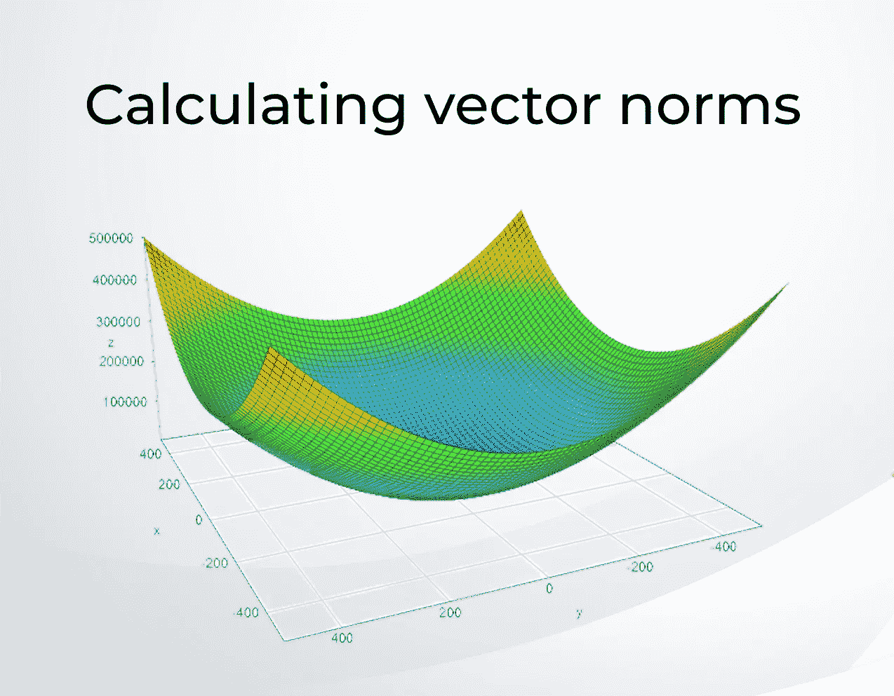
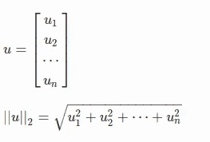
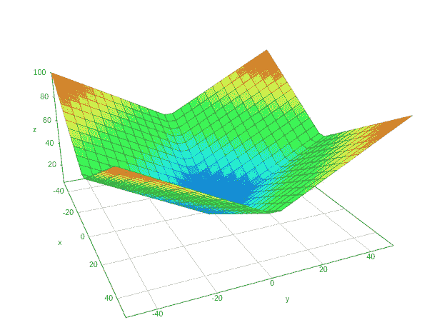
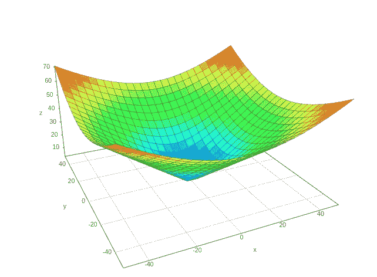
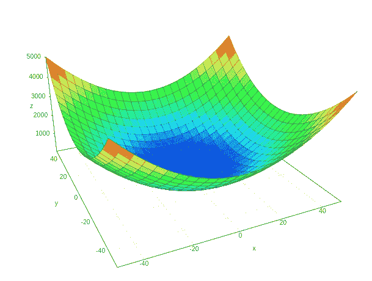

# 计算向量 P-范数——数据科学中的线性代数(ⅳ)

> 原文：<https://towardsdatascience.com/calculating-vector-p-norms-linear-algebra-for-data-science-iv-400511cffcf0?source=collection_archive---------7----------------------->

## 支持机器学习中正则化方法的数学原理



在[线性代数系列](https://www.youtube.com/playlist?list=PLIkXejH7XPT_uPvD-XaTKJIX4aG3m5Lc5)中，快速回顾一下，我们已经学习了什么是[向量、矩阵&张量](/introduction-to-vectors-and-matrices-using-python-for-data-science-e836e014eb12?source=---------16------------------)、[如何计算点积来解线性方程组](/dot-product-in-linear-algebra-for-data-science-using-python-f113fb60c8f?source=---------15------------------)，以及[什么是单位矩阵和逆矩阵。](/linear-algebra-for-data-science-ep-3-identity-and-inverse-matrices-70820a3fbdb9?source=---------13------------------)

继续这个系列，下一个非常重要的话题是**向量范数。**

所以，

## 什么是向量范数？

向量范数是将向量映射到正值的任何函数，该正值是向量的大小或向量的长度。现在，有不同的函数，为我们提供了不同的计算向量长度的方法。

> 没关系，但是**为什么**我们要研究这个，这个向量长度代表什么…？

## 为什么要学习规范？？

范数是机器学习和深度学习中非常重要的概念，通常用于计算 ML/DL 模型预测中的误差。

向量的长度通常表示预测和实际观察值之间的误差(标签)。

我们经常需要计算向量的长度或大小，要么直接用作 ML 中的正则化方法，要么作为更广泛的向量或矩阵运算的一部分。

> 那么，这些是什么功能呢？

# 范数函数的特征

范数是由以下性质表征的任何函数:

1.  范数返回非负值，因为它是向量的大小或长度，不能为负。
2.  当且仅当向量为零向量时，范数为 0。
3.  范数遵循三角不等式，即两个(或更多)向量之和的范数小于或等于单个向量的范数之和。它只是简单地说明，从几何学上讲，任意两点之间的最短路径是一条直线。
    用方程表示:
    ∑a+b∨≤∑a ∨+∨b∨
    其中 a 和 b 是两个向量，竖线∨一般表示范数。
4.  向量乘以标量的范数等于这个标量的绝对值乘以向量的范数。
    代表方程:∥k⋅*x*∥=|k|⋅∥*x*

# 计算 P-范数的步骤

P-norm 的计算基于中心公式:

∩*x*∩*ₚ*=(∑ᵢ|*x*ᵢ|ᵖ)/ᵖ

这里有一个快速的 4 步过程来得到一个向量的 p 范数

1.  得到向量每个元素的绝对值。
2.  将这些绝对值提高到幂 *p.*
3.  计算所有这些提高的绝对值的总和。
4.  得到 *p* ₜₕ根或者根据上一步的结果将功率提高到 1/p。

现在，基于公式*、*中的 *P* 的值，我们得到不同类型的规范。让我们逐一讨论这些:

# L⁰常模

在公式中放入 p = 0 将得到 L⁰范数。

除了 0 之外，任何 0 次幂都将返回 1。L⁰并不是一个真正的标准，因为它没有表现出特征 **#4** (如上所述)。乘以一个常数会给我们这个数本身。

# l 范数

放 *p = 1* 得到我们 L 范数。本质上，该公式将计算矢量绝对值的总和。

公式:|x|₁=(∑ᵢ |xᵢ|)

这用于计算平均绝对误差。

## Python 代码

我们可以使用 Numpy 包的线性代数模块获得 L 范数，该模块提供了一个 norm()方法。默认情况下，范数函数被设置为计算 L2 范数，但是我们可以将 p 的值作为参数传递。因此，对于 L 范数，我们将传递 1 给它:

```
from numpy import linalg#creating a vector
a = np.array([1,2,3])#calculating L¹ norm
linalg.norm(a, 1)##output: 6.0
```

# l 范数

放入 p = 2 得到 L 范数。该公式将计算矢量值的平方和的平方根。

也被称为欧几里德范数。这是机器学习中广泛使用的规范，用于计算均方根误差。

∥x∥₂ = (∑ᵢ xᵢ ) /

所以，对于向量 *u，* L 范数将变成:



## Python 代码

同样，使用相同的范数函数，我们可以计算 L 范数:

```
norm(a) # or you can pass 2 like this: norm(a,2)## output: 3.7416573867739413
```

# 平方 L 范数

∑ᵢ|xᵢ|

平方 L2 范数是简单的 L2 范数，但没有平方根。对上面计算的 L2 范数求平方将得到 L2 范数。

这很方便，因为它去掉了平方根，我们得到的是向量的每个平方值的简单和。

平方欧几里德范数在机器学习中被广泛使用，部分是因为它可以通过向量运算*x*ᵀ*x*来计算

## Python 代码

让我们用 python 代码验证这一点:

```
x = np.array([[1], [3], [5], [7]])
euclideanNorm = x.T.dot(x)## output: array([[84]])np.linalg.norm(x)**2
##ouput: 84.0
```

# 最大范数

这是 L∞范数，它简单地返回向量最大元素的绝对值。

公式变成:

‖x‖∞=maxᵢ|xᵢ|

## Python 代码

让我们用 python 代码来验证这一点，我们只需将无穷大传递给 norm 函数:

```
x = np.array([[1], [3], [5], [7]])
norm(x, np.inf)##output: 7.0
```

您可以在这里试用所有 python 代码:

[](https://colab.research.google.com/drive/1DEqeWjD0kby5LhrShNzAIPSqWN6Wdsck?usp=sharing) [## 谷歌联合实验室

### 计算规范

colab.research.google.com](https://colab.research.google.com/drive/1DEqeWjD0kby5LhrShNzAIPSqWN6Wdsck?usp=sharing) 

# 图形可视化

让我们试着用图表来分析这些情节。我在 2 维(x，y)中使用了相同的公式，第 3 维表示规范本身。

你可以看看这个[表面绘图仪](https://academo.org/demos/3d-surface-plotter/)，我用它来得到这些图。

## l 范数



使用[https://academo.org/demos/3d-surface-plotter/](https://academo.org/demos/3d-surface-plotter/)创建

更像是彼此相连的飞机。x 和 Y 是这里的参数。

## l 范数



https://academo.org/demos/3d-surface-plotter/

## 平方 L 范数



【https://academo.org/demos/3d-surface-plotter/ 

L2 范数的平方和 L2 范数看起来相似，但在零标记附近(中间蓝色区域)的图的陡度方面有一个重要的区别。平方 L2 范数不能很好地区分零和其他更小的值。因此，这揭示了其使用的一个问题。

# 摘要

在本教程中，我们研究了计算向量长度或大小的不同方法，称为向量范数。

具体来说，我们学习了如何:

*   计算 L1 范数，该范数计算为矢量绝对值的和。
*   计算 L2 范数，其计算方式为矢量值平方之和的平方根。
*   计算作为最大向量值计算的最大范数。

# [数据科学与 Harshit](https://www.youtube.com/c/DataSciencewithHarshit?sub_confirmation=1)

通过这个渠道，我计划推出几个覆盖整个数据科学领域的[系列](/hitchhikers-guide-to-learning-data-science-2cc3d963b1a2?source=---------8------------------)。以下是你应该订阅[频道](https://www.youtube.com/channel/UCH-xwLTKQaABNs2QmGxK2bQ)的原因:

*   这些系列将涵盖每个主题和子主题的所有必需/要求的高质量教程，如[数据科学的 Python 基础](/python-fundamentals-for-data-science-6c7f9901e1c8?source=---------5------------------)。
*   解释了为什么我们在 ML 和深度学习中这样做的数学和推导。
*   [与谷歌、微软、亚马逊等公司的数据科学家和工程师以及大数据驱动型公司的首席执行官的播客](https://www.youtube.com/watch?v=a2pkZCleJwM&t=2s)。
*   [项目和说明](/building-covid-19-analysis-dashboard-using-python-and-voila-ee091f65dcbb?source=---------2------------------)实施到目前为止所学的主题。了解新的认证、训练营以及破解这些认证的资源，如谷歌的 [**TensorFlow 开发者证书考试。**](https://youtu.be/yapSsspJzAw)