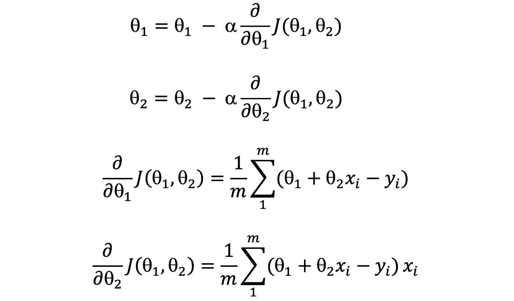

# 线性回归背后的微积分

> 原文：<https://towardsdatascience.com/calculus-behind-linear-regression-1396cfd0b4a9?source=collection_archive---------20----------------------->

## 理解线性回归的数学方面

线性回归通常是任何机器学习课程的起点。目标是预测输入变量和目标变量之间的线性关系。

最简单的例子是穿过空间原点的直线。在这里，我们被限制在二维空间，因此笛卡尔平面。让我们从头开始逐步开发，从 **y=mx** 格式开始，然后是 **y=mx+c** 回归。

# y=mx 的简化场景

在这种情况下，我们知道我们要对通过原点的数据拟合一条线。这是一个简单的例子，可能是一个很好的起点。让我们发展我们的损失函数，看看它如何表现。让我们把我们的估计改写如下。


**h(x)** 是估计函数 **J(θ)** 是损失函数

注意，我们使用平方误差除以 **2m** ，其中 **m** 是我们拥有的数据点的数量。因此，我们可以认为这是一个平均值。准确地说，这是均方误差的一半。当我们得到损失函数的导数时，除以 2 背后的直觉将是可见的。这有助于我们得到一个更简单的损失函数的导数。让我们考虑以下几点。


2D 平面上的点集

我使用添加了噪声的 **y=5x** 图生成了这些点。因此，理想情况下，我们对 **θ** 的估计值应该更接近 **5** 的值。现在，如果我们绘制不同 **θ** 值的损失函数，我们将得到如下结果。


损失函数

注意，我们有一个更接近 **θ=5** 的损失函数的最小值。让我们看看如何通过计算得出这个特定的最小值。

注意橙色的切线和它的梯度。它是一个正的梯度，这给了我们一个想法，我们必须向相反的方向去寻找一个更低的值。

# 梯度下降

梯度下降的概念，正如通常解释的那样，是仅使用周围斜坡的知识在未知的地形中穿过下坡。因此，在本例中，目标是使用坡度找到穿过的**方向，并决定移动的**步长**。**


寻找遍历方向

很明显，我们必须向左走。步长呢？。这就是学习率发挥作用的地方。这被称为 **⍺** 。步长越小，速度越慢。然而，迈出更大的一步可能会让你错过最小值(想象你从θ= 7°步进到θ= 1°，没有意义)。所以我们可以把 **θ** 的变化公式化为**。**


θ计算的下一个值和损失函数的导数

由于这种线性回归的情况是独立于数据的，这可以用作计算损失和进行梯度下降的标准方程。这应该强调这样一个事实，即我们总是坚持标准损失函数，而没有建立自己的损失函数。用 python 实现这一点非常简单。我们用 **len(x)** 表示 **m** ，用 **0.001** 表示 **⍺.x** 和 **y** 是训练数据集或我们要估计的点集。

```
#Loss function(1/2* len(x)) * sum([(theta* x[i] - y[i])**2 for i in range(len(x))])#Change of thetatheta - 0.0001 * (1/len(x)) * sum([x[i]*(theta*x[i] - y[i]) for i in range(len(x))])
```

我们可以迭代地进行梯度下降，直到我们达到最小值或者直到损失函数低于某个阈值。我们也可以决定迭代的次数。因为我们保证在线性回归中有一个最小值，所以我们可以如下实现 descend。

```
loss = float('inf')
theta = 8

while True:
    theta = descend(theta)

    if loss > loss_function(theta, x, y):
        loss = loss_function(theta, x, y)
    else:
        break
```

**下降**函数返回下一个 **θ** 值，而**损失 _ 函数**返回 **θ** 值处的损失。我们可以将梯度遍历可视化如下。


随着损失函数的下降


梯度下降中每次迭代的估计变化

# 完整场景 y=mx+c

这是前一种情况的扩展，我们可以对估计方程和损失函数建模如下。


**h(x)** 是估计函数 **J(θ1，θ2)** 是损失函数

以下是我将尝试拟合的一组点。我使用函数 **y=5 + 3x** 生成了这个图，带有一点噪声。


**y=5 + 3x** 带噪声

现在我们有了一个包含两个变量的损失函数，我们的损失函数将是一个 3D 图，第三个轴对应于损失值。用图解法，我们可以说明如下。


损失函数的变化。圆圈中间是最小损失点。

我们的梯度下降可以被类似地导出以达到下面的方程组。



梯度下降函数的求导

请注意，梯度必须同时更新，以便一个 **θ** 值的更新不会影响另一个。在 python 中，该操作如下所示。

```
theta1_new = theta1 - 0.01 * (1/len(x)) * sum([theta1 + theta2*x[i] - y[i] for i in range(len(x))])theta2_new = theta2 - 0.01 * (1/len(x)) * sum([x[i]*(theta1 + theta2*x[i] - y[i]) for i in range(len(x))])theta1, theta2 = theta1_new, theta2_new
```

损失函数如下。对我们之前场景的唯一更新是，现在我们有了第二个变量 **θ2** 。

```
(1/2* len(x)) * sum([(theta1 + theta2* x[i] - y[i])**2 for i in range(len(x))])
```

我通过梯度下降更新了我的迭代，如下所示。除了前面检查下降损失的场景之外，我还考虑了下降损失的数量，以确保我不会迭代到非常接近最小值的点。

```
loss = float('inf')
theta1 = 10
theta2 = -1

while True:
    theta1, theta2 = descend(theta1, theta2)

    if loss > loss_function(theta1, theta2, x, y) and \
            abs(loss - loss_function(theta1, theta2, x, y)) > 0.001:
        loss = loss_function(theta1, theta2, x, y)
    else:
        break
```

我们可以将损失函数在梯度上的下降形象化如下。


随着损失地形移动

当我们的θ值变化时，我们的回归拟合与表上的值非常吻合。它看起来像下面这样。


梯度下降中每次迭代的估计变化

我们在最终拟合中分别得到截距和梯度的值 **6.5** 和 **2.7** ，考虑到数据中的噪声，这是合理的。

感谢阅读。干杯！