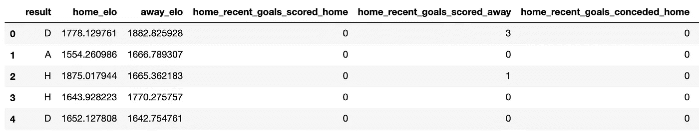
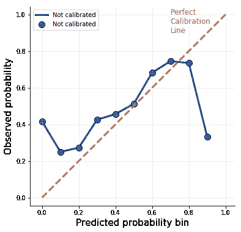
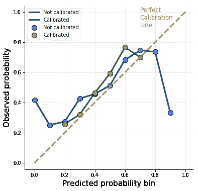

# 校准分类器

> 原文：<https://towardsdatascience.com/calibrating-classifiers-559abc30711a?source=collection_archive---------19----------------------->

## 你确定你的模型返回概率吗？🎲

由[希德·沙尔姆](https://unsplash.com/@hdsfotografie95?utm_source=unsplash&utm_medium=referral&utm_content=creditCopyText)在 [Unsplash](https://unsplash.com/s/photos/meter?utm_source=unsplash&utm_medium=referral&utm_content=creditCopyText) 拍摄的照片

大多数用于分类的机器学习模型输出介于 0 和 1 之间的数字，我们倾向于将其解释为样本属于各个类别的概率。例如，在 scikit-learn 中，我们可以通过在模型上调用一个`predict_proba()`方法来获得它们。 *Proba* ，就像在*Proba*abilities 里，对吧？这些数字通常对所有类别加起来都是 1，这证实了我们的信念，即它们是概率。但是他们是吗？嗯，**通常没有**，下面是原因。

## 到底什么是概率？

好吧，好吧，这些数字在某种意义上是概率，但不是我们希望的那样。它们满足被如此对待的大多数条件:它们在 0 和 1 之间，总和为 1，并且具有这样的性质，即数字越高，相应样本的类成员越可能。最后一点意味着，如果你只关心硬分类，你可以通过这些伪概率对你的样本进行分类，并应用阈值处理，例如，在每一类中取 *x%* 个最可能的样本。

然而，如果你也关心你的分类的确定性，这些数字是没有用的。这是因为**它们不是频率主义意义上的概率**。这是什么意思？一个常客会告诉你

> “一个事件的概率是它在许多试验中相对频率的极限”。

比如为什么骰子掷出六的概率是 1/6？因为如果你滚动它 6 00 万次，你会得到大约 1 00 万个 6。如果你滚动它无限次，那么正好 1/6 次滚动将会是 6 次。

这与分类模型有什么关系？**如果您的模型会产生频率主义意义上的概率，那么在所有情况下，当模型预测第 1 类的概率为 80%时，它在大约 80%的情况下是正确的。**

正如我们已经说过的，对于大多数模型来说，情况并非如此。但是为什么重要呢？让我们实际一点，试着从足球比赛的赌注中赢得一些现金。

## 赌足球比赛

我收集了一个数据集，包含过去几年英超联赛的足球比赛结果。一排就是一局。看起来是这样的:

结果栏写明谁赢了这场比赛: **H** ome 队， **A** way 队，或者有一个 **D** raw 队。我们将构建一个二元分类器，尝试预测主队是否获胜。数据集中有 18 个特征:[两支球队的 ELO 评分](https://en.wikipedia.org/wiki/Elo_rating_system)以及许多不同的统计数据，这些数据总结了两支球队在最近的比赛中在进攻和防守方面的表现。如果我们能预测主队是否会赢，我们就赌他们会发财。

数据集中有 5588 个游戏。我已经将其中的十分之一作为测试集，并为剩余的训练集拟合了一个随机森林。由于有许多特征，我们将首先使用主成分来降低维数。

我们得了 0.63 分。不好，也不可怕。当然比总是预测主场获胜的虚拟模型要好——这样的模型将获得 0.46 的准确度(因为东道主往往会赢得几乎一半的比赛)。

## 校准曲线

在你冲向投注网站之前，查看一下**校准曲线**。它告诉你模型返回的概率与理想的常客概率相差多少。在这里，我们按照以下方式对测试数据进行计算:我们将所有预测的概率分成宽度为 0.1 的箱，对于每个箱，我们计算主队获胜的样本的百分比:

通过使用 scikit-learn 的`calibration_curve()`函数，您也可以更快地得到类似的结果，但是我们所做的手工工作会明确地告诉您发生了什么。我们现在可以绘制得到的`df`来得到所谓的校准曲线:

理想情况下，所有点都应该在对角线上。这将意味着该模型是完美校准的，其概率估计是可信的。然而，事实并非如此。

实际情况是，如果模型预测主队获胜的概率在 0%到 10%之间(水平轴上的第一个框)，实际上，主队在大约 40%的情况下获胜。**如果我们只对模型确定主场获胜(> 90%概率)的游戏下注，会怎么样？我们只能在大约 30%的游戏中做对。**这是一个可怕的下注策略！

## 为什么这么没校准？

我们刚刚看到的校准曲线显示了一个 S 形图案。许多分类模型经常出现这种情况，其结果通常是高估低概率和低估高概率。(对于我们的数据来说，似乎是反过来的，可能是由于极端箱中的观察数量，但要点仍然成立:概率估计相当差。)

那么，为什么很多模型会产生这种有偏的概率估计，尤其是对于很低和很高的值？根据工作方式的不同，每个型号的原因略有不同。这里，我们使用了一个随机森林，它是决策树的集合。森林的预测是通过对单棵树的预测进行平均而得到的，并且它们之间总是存在一些差异。由于概率以[0，1]为界，在这个区间的边界上总会有一些偏差。例如，假设一个模型应该预测某个测试样本的概率为零。一些基础树将正确预测零，但一些将预测稍高的值。取平均值会使森林的预测值远离零。在[0，1]区间的另一侧，这种效应类似但相反。

许多其他分类器，如朴素贝叶斯、支持向量机或决策树，也会产生 S 形校准曲线。这种情况的一般原因是，大多数分类模型针对二进制度量进行了优化，并根据二进制度量进行评分。准确性只看我们是对是错，不考虑确定性。基尼系数——决策树用来决定分割的杂质，它优化了尽可能精确和尽可能快速的分割。例子不胜枚举。

## 校准模型

幸运的是，有一种方法可以修正，即校准概率估计值。实际上，甚至有两个！

一种是将随机森林中的概率估计值输入到逻辑回归模型中，并用原始目标对其进行训练。这行得通，因为**逻辑回归是一种罕见的野兽，它实际上产生校准的概率**。其背后的秘密是，它优化了对数优势，这使得概率实际上存在于模型的成本函数中。这种方法被称为**普氏规模**。

另一个是所谓的**等张回归**。例如，这是一个非参数模型，它将分段常数、非递减函数与随机森林预测的概率相拟合，以便将它们映射到真实的概率空间。

使用这两种方法之间的实际差异是，普拉特标度在纠正 S 形概率估计方面更好，就像我们从我们的足球数据集获得的那样。另一方面，保序回归可以处理任何偏差形状，但代价是容易过度拟合。**在实践中，我建议使用 plat-scaling，除非你发现它不太好用，而且你的数据集很大**。

请注意，无论您选择哪种方法，校准模型都应该基于与随机森林所适用的数据不同的数据。因此，您需要一个单独的验证集(您将随机森林与训练集相匹配，对验证目标进行概率预测，并根据随机森林对这些目标的预测来匹配预测验证目标的校准模型)，或者您可以简单地使用交叉验证，就像我们现在要做的那样。

校准分类器就像将它传递给 scikit-learn 的`CalibratedClassiferCV`一样简单。方法参数可以是`sigmoid`(缺省值，用于逻辑回归，也称为 Platt-scaling)或`isotonic`。

现在让我们在上一个模型的基础上绘制这个新的校准模型的校准曲线。

这里有两件有趣的事情可以看:

*   校准的概率估计被校准。它们平均更接近对角线，因此更可靠。
*   校准模型根本不输出极端概率。它生产的最低值在 20 年代，最高值在 70 年代。这是一种常见的模式。

最后一句话:**校准模型并不能保证其类分配能力的提高**。准确性、精确度或召回率等指标有时甚至会下降。在这种情况下，校准模型的精度为 62%，而原始随机森林的精度为 63%。然而，校准得到了正确的概率，我们不会输给庄家。

## 结论

*   许多分类模型，如随机森林、决策树、支持向量机或朴素贝叶斯返回类成员的有偏概率估计。
*   这些有偏概率可以用于阈值处理，但不能作为确定性度量。例如，如果根据这样的模型，一个样本有 70%的概率属于某个类别，而另一个样本有 50%的概率属于某个类别，那么前者确实更有可能属于该类别，但是这种情况为真的概率实际上不需要达到 70%。
*   对于非常高和非常低的预测概率来说尤其如此:如果模型预测的是 2%，那么真实的概率很可能不止这个；如果它预测 97%，通常会更低。
*   修正有偏概率的过程称为校准。它归结为在初始模型之上训练一个校准分类器。两种流行的校准模型是逻辑回归和保序回归。
*   训练校准模型需要有单独的验证集或执行交叉验证，以避免过度拟合。
*   这在 scikit-learn 中非常容易做到。

感谢阅读！

如果你喜欢这篇文章，为什么不在我的新文章上 [**订阅电子邮件更新**](https://michaloleszak.medium.com/subscribe) ？通过 [**成为媒介会员**](https://michaloleszak.medium.com/membership) ，你可以支持我的写作，并无限制地访问其他作者和我自己的所有故事。

需要咨询？你可以问我任何事情，也可以在这里 预定我 1:1 [**。**](http://hiretheauthor.com/michal)

也可以试试 [**我的其他文章**](https://michaloleszak.github.io/blog/) 中的一篇。不能选择？从这些中选择一个:

 [## 线性分类器:综述

### 本文讨论了四个流行的线性函数的数学性质和 Python 的实际应用

towardsdatascience.com](/linear-classifiers-an-overview-e121135bd3bb)  [## 线性回归中收缩法和选择法的比较

### 详细介绍 7 种流行的收缩和选择方法。

towardsdatascience.com](/a-comparison-of-shrinkage-and-selection-methods-for-linear-regression-ee4dd3a71f16)  [## 增强你对助推的把握

### 揭秘著名的竞赛获奖算法。

towardsdatascience.com](/boost-your-grasp-on-boosting-acf239694b1)