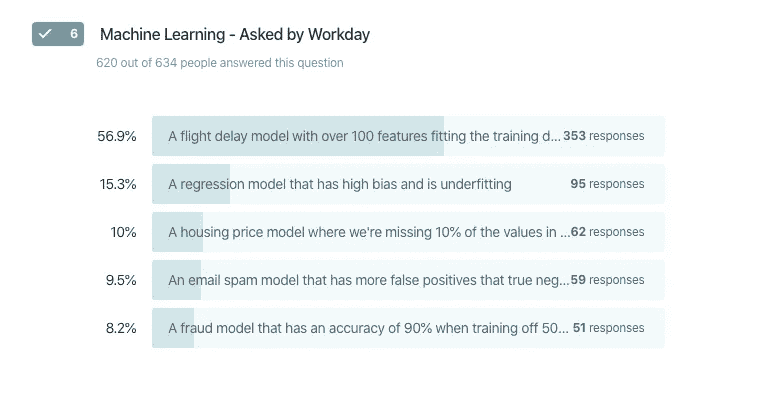
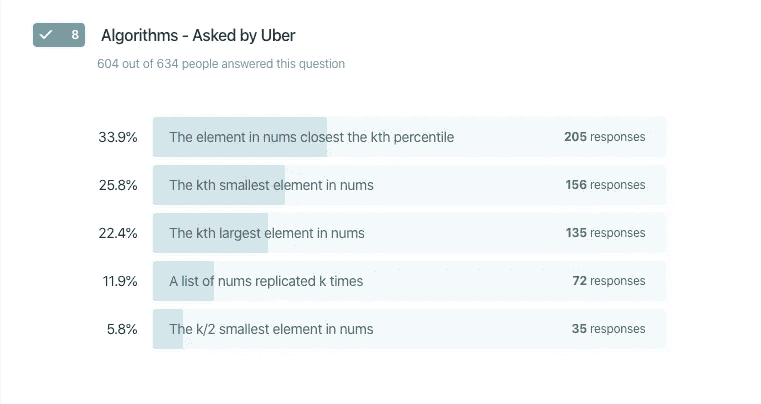
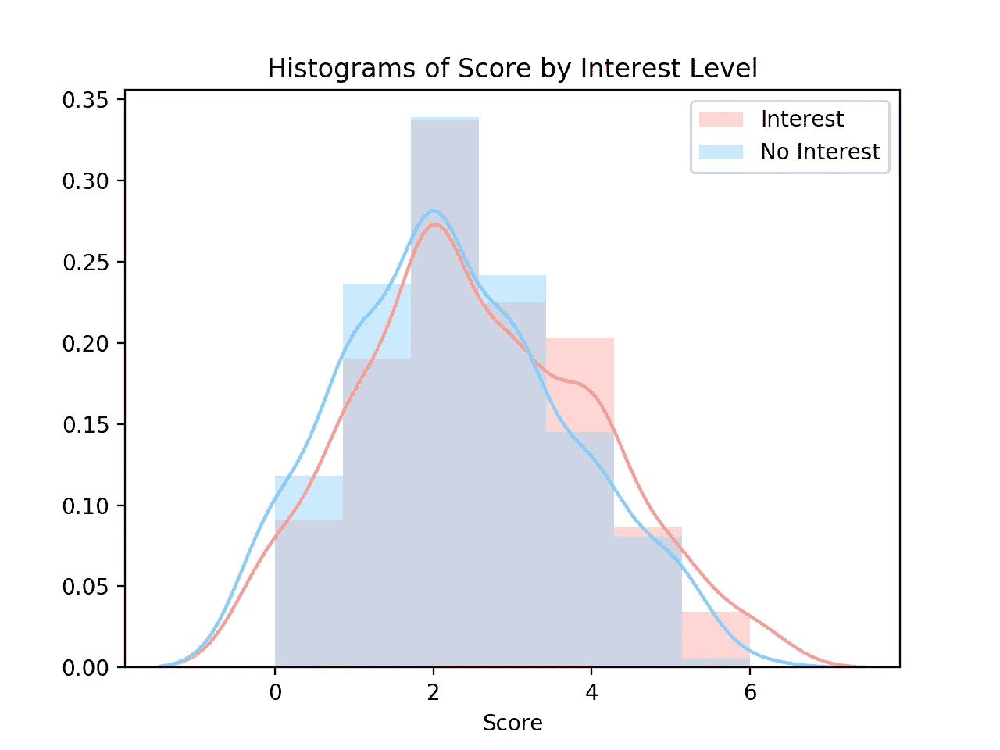

# 校准数据科学面试评估

> 原文：<https://towardsdatascience.com/calibrating-the-data-science-interview-assessment-751e2db64198?source=collection_archive---------52----------------------->

几个月前，我写了一篇关于[校准数据科学面试问题](https://www.interviewquery.com/blog-calibrating-data-science/)的帖子，看看数据科学家与他们的同行相比得分如何。我们最终让 600 多名数据科学家参加了我们的测验，这是数据科学面试中不同主题的八个问题。

> *附:如果你还没做测验，不想看到结果来影响你的分数，* [*拿去这里，别读了！*](https://interviewquery.typeform.com/to/t6mTPN)

快速总结。我们收到了 600 多份回答，其中包括六道选择题和两道简答题。我很想知道我们会得到什么样的简短回答，但一般来说，它们都不是很有描述性，有时完全是随机的。所以我把它们排除在了最后的测验得分之外。

测验中最简单的问题是关于正则化的机器学习问题，其中超过 56%的受访者答对了。

测验中最难的问题是算法问题。正确答案实际上是第二多的答案。一般来说，这并不奇怪，因为这需要最深入的思考和最复杂的理解。

当我们绘制总分时，我们发现有趣的是**接近正态分布**。大多数人只答对了两个问题，平均值为 2.35，标准差为 1.37。如果你答对了六个问题中的四个，你就已经是前 20%的人了！

最后一个有趣的发现是，在最后，我们问我们的用户，如果他们得分高，他们是否愿意接受公司的邀请。我们绘制了两种分布图，看看基于他们求职行为的结果是否会有差异。

潜在的轻微增长，但没有真正突出。在低问题样本量的情况下，很难看出其中的显著差异。

最终，这个测验是一个有趣的测试，可以了解我们的问题有多精确。但是我认为很明显，也许结果中最大的差异是基于**每个用户决定在测验**上多努力。虽然这意味着是相同的，但每个用户对应该花多少时间以及他们对测验的总体投入有不同的预期。

此外，在测验中得分高的用户在数据科学面试中是否表现出色？数据科学领域有如此广泛的角色和职责，可能无法通过您对技术问题的回答来衡量。但更常见的是，它们确实充当了一面旗帜，是许多招聘经理清除误报的初步尝试。例如，我非常喜欢测验中的 SQL 问题，因为它测试了两个概念；如果你**了解左连接如何工作以及查询结果的分布情况。**

最后，如果我们增加测验中的问题数量，是否会更好地分配和衡量每位数据科学家的熟练程度？一方面，我们不想降低问答游戏的转化率，让用户中途退出。但与此同时，更多的问题意味着更多的数据点可以信任结果，并用来单独了解用户在数据科学面试技能方面可以改进的地方。

最终，虽然数据科学面试将继续是一个黑箱，但我们将继续不时地尝试照亮那里，看看我们是否能找出更多的东西！

*原载于 2020 年 4 月 1 日 https://www.interviewquery.com***。**