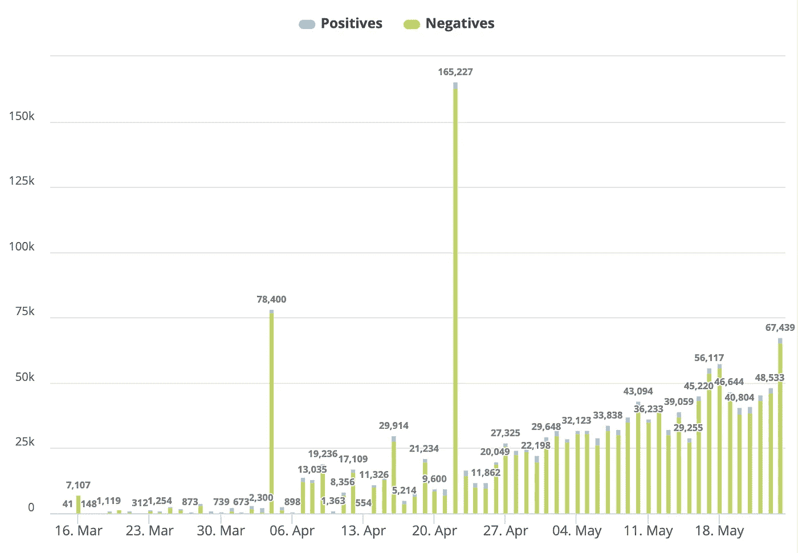

# 加州的大赌博

> 原文：<https://towardsdatascience.com/californias-big-gamble-1c67f282d3ac?source=collection_archive---------77----------------------->

## 新冠肺炎的数据可能并不像一些人认为的那样充满希望

蒂姆·莫斯霍尔德在 [Unsplash](https://unsplash.com?utm_source=medium&utm_medium=referral) 上的照片

***编者按:*** [*走向数据科学*](http://towardsdatascience.com/) *是一份以数据科学和机器学习研究为主的中型刊物。我们不是健康专家或流行病学家，本文的观点不应被解释为专业建议。想了解更多关于疫情冠状病毒的信息，可以点击* [*这里*](https://www.who.int/emergencies/diseases/novel-coronavirus-2019/situation-reports) *。*

旧金山湾区是全国第一个发起就地避难的地方。阿拉米达、康特拉科斯塔、马林、圣马特奥和圣克拉拉等县以及旧金山和伯克利市于 2020 年 3 月 17 日采取行动，敦促人们留在家中。加利福尼亚州紧随其后，州长加文·纽瑟姆于 2020 年 3 月 19 日发布了全州就地避难令。

到目前为止，加州是应对新冠肺炎最谨慎和负责任的州之一。就我个人而言，我很感激生活在一个重视这种威胁的州。在过去的几个月里，加文·纽瑟姆州长为遏制这种病毒的传播所采取的迅速而果断的措施给我留下了深刻的印象。

也就是说，我认为封锁限制的放松可能是令人担忧的原因。为了解释原因，我们需要看一下数据。

加州每日新新冠肺炎病例图表(来源:[加州新冠肺炎仪表板](https://www.knowi.com/coronavirus-dashboards/california-2/)

上图显示了一段时间以来每天新增的新冠肺炎病例。我强调了自 3 月 19 日以来每天新增病例的数量，这一天是纽瑟姆州长发起就地安置的日子。你可以看到那天有 177 个新病例。

加州每日新新冠肺炎病例图表(来源:[加州新冠肺炎仪表板](https://www.knowi.com/coronavirus-dashboards/california-2/)

现在看这张图表。这是同一个图表，但是突出显示了 5 月 23 日星期六新增病例的数量。当天新增病例 2287 例。

> 新冠肺炎每日新增病例比封锁开始时增加了 10 倍

177 对 2287。即使我很慷慨，将第一个数字四舍五入到 200，将第二个数字四舍五入到 2000，这仍然是 10 倍的增长。新冠肺炎每日新病例比封锁开始时增加了 10 倍。

# 增加测试怎么办？

是的，那是一个重要的考虑。毕竟国家一直在疯狂测试。根据该州的冠状病毒数据网页,他们现在已经进行了 150 万次测试。

(来源:CA 的[冠状病毒数据网页](https://update.covid19.ca.gov/#top))

但不幸的是，提供这些数据的图表并没有显示我们实际上需要知道什么来评估检测对确诊新病例率的影响。为了理解这一点，我们需要每天进行的测试数量。此图表显示了进行的测试总数。这意味着，对于该图表显示的每一天，与该天相关联的数字是所有时间内进行的实验室测试的总数。这意味着每个数据点是当天进行的测试数量加上前几天进行的所有测试的总和。像这样的图表实际上除了向我们显示测试总数之外并没有多大用处——这个数字已经在顶部给出了。

我觉得奇怪的是，他们没有在页面上显示每天进行的测试数量的图表。如果你有这两组数据中的一组，你几乎肯定有另一组。

幸运的是，[冠状病毒数据中心](https://www.knowi.com/coronavirus-dashboards/)确实有一个测试图表，如果你添加一个专门针对加州的过滤器的话。

图表显示了一段时间内加州进行的新冠肺炎测试的数量(来源: [Knowi 新冠肺炎测试仪表板](https://www.knowi.com/coronavirus-dashboards/testing-data/)

从这个图表中我们可以看到，在 3 月 19 日，该州为新冠肺炎进行了大约 1100 次测试。而在 5 月 24 日，他们进行了大约 67000 次测试。这意味着该州正在进行的测试是这一切开始时的 60 倍。

## 等等，还有很多测试。那一定是个好兆头，对吧？

嗯，是也不是。是的，这意味着比加州第一次开始检测时，检测结果呈阳性的比例更小了。但不幸的是，它实际上并没有告诉我们事情是否正在好转。为了给我们提供可操作的信息，我们必须从一开始就进行随机抽样——这不是疫情测试的方式。

一开始，我们只测试那些表现出最严重和最明显的新冠肺炎症状的人。现在，随着我们检测能力的提高，我们能够检测越来越多的人，包括许多没有表现出症状的人。因此，随着我们测试的人越来越多，阳性测试的百分比会下降，这是我们测试程序的自然结果。

# 我们仍然不知道真实的数字

事实是，当我们第一次开始测试时，每天新感染的数量可能比每天 200 多，但因为我们没有做足够的测试，我们不知道实际情况有多糟糕。

> 在没有数据或数据不确定的情况下做决定是赌博。这就是我们正在做的，放松加州的封锁。

加利福尼亚州有 3951 万人口。这意味着，即使我们每天进行 67，000 次测试的最高测试率，我们每天也只测试 0.2%的人口。因此，我们得到的每日新病例的数字可能仍然与新病例的真实数字相差甚远。

> 如果每天 200 个新案例足以成为在 3 月份启动锁定的理由，那么现在这个数字的 10 倍应该足以成为继续锁定的理由

# 最后的想法

我们只是不知道足够的信息来确定打开它是否安全。由于人们的生命悬而未决，在我们有真正的数据表明它是安全的之前，保持限制可能是谨慎的。不仅仅是越来越好，而是它实际上是安全的。目前，没有任何数据能确切地告诉我们这一点。

在没有数据或数据不确定的情况下做出决策，是一种赌博。这就是我们正在做的，放松加州的封锁。

如果每天 200 个新案例是 3 月份启动封锁的充分理由，那么 10 倍的数字应该是现在继续封锁的充分理由。