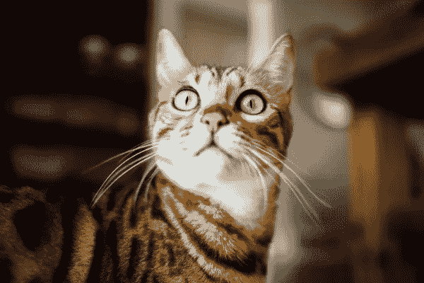
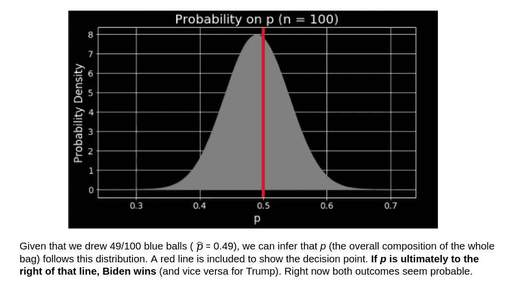
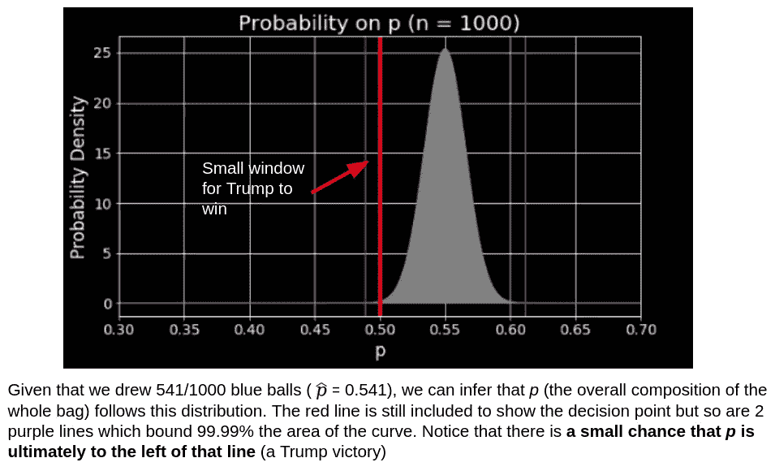
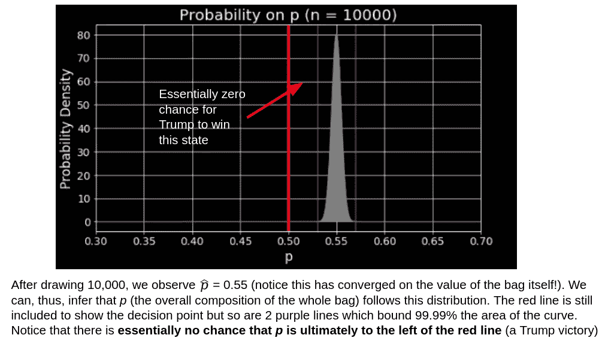

# 提前选举:假新闻还是统计数据？

> 原文：<https://towardsdatascience.com/calling-elections-early-fake-news-or-statistics-dd2e8cc196c5?source=collection_archive---------49----------------------->

## 调用选举背后的推理引擎的高级、可访问的演练

美国东部时间晚上 8 点 40 分，尽管州官员只报告了大约 50 万张选票，但大多数主要新闻站都呼吁伊利诺伊州支持拜登。这仅仅是估计的 6%的选票！一个候选人怎么可能这么早就赢了？这是某种假新闻/压制选民吗？

图片来源:[保罗·花冈](https://unsplash.com/@plhnk)

嗯…事实证明他们是对的，所以让我们看看我们是否能解开统计数据背后的魔力，他们在最终投票数天前用来推断这些结果(在撰写本文时，他们仍在计算)。

我想象这里发生的是一个简单的风险分析，再加上全美争先的驱动力。

一方面，在某一点上，我们几乎“知道”谁赢了，这似乎是合理的，对吗？另一方面，你也不想在这种事情上犯错。这些新闻来源不断争夺我们的眼球(和信任)。先下手为强和不犯错成为一种平衡行为。想象一下第一篇 10 句话的文章在密歇根被调用的时候得到了多少点击量(翻译:$$$)。

最好把那些喜欢做数学的怪人叫来。看看他们能否解决这个问题…

> 可访问性说明:
> 
> 这是[系列](/what-in-the-world-happened-in-virginia-tuesday-night-117d13cd318b)其余部分的基础。下面有一些数字和图表…如果没有的话，就很难用统计学来解释了。然而，我意识到我是为普通读者写的，所以我尽我所能保持通俗易懂，并希望展示统计学的基本原理实际上是多么简单和强大。

# 1 .大理石

我不知道他们打这些电话所用的信息，但我可以给你看一些我觉得很酷的东西，可以作为我认为幕后发生的事情的一阶近似。

像任何自尊的统计学家一样，我首先假设选票实际上不是选票，而是弹珠。但不是普通的弹珠。这些是特殊的投票弹珠，它们的颜色代表一个人的投票(让我们疯狂一点，说蓝色代表拜登，红色代表特朗普)。在选举日，人们不用去各个投票站、邮箱等地方，而是把他们特殊的弹珠放在一个位于州府的大弹珠袋里投票。现在，一旦这样做了，这个州就有了一个巨大的弹珠袋，它有效地代表了这个州的人民希望谁成为他们的下一任人类自毁按钮的管理者。

作者图片

好了，现在好戏开始了。我们首先摇动袋子以确保它完全混合。然后我们开始画弹珠并记录结果。当我们画每一个新的弹珠时，我们对袋子的红/蓝成分有了更好的理解。我们知道，如果袋子的成分有 50%以上是红色，那么川普就赢了。否则，拜登会赢。

因此，让我们这样表述这个问题:需要抽取多少个这样的弹珠，才能有信心指定一个获胜者(例如，假设袋子中有多于或少于 50%的单一颜色)。

# 扮演上帝

好吧，让我们量化一下。假设伊利诺伊州 55%的人投票给拜登。这意味着这个魔法包的成分是 55%蓝色和 45%红色。很简单。但是还没有人知道！

有那么一会儿，让我们假装我们知道它…也许我们就是上帝。所以我们观察人类从画 100 个弹珠开始，他们看到只有 49 个是蓝色的。作为理性生物的人类得出结论，就他们所知，袋子的成分有 49%是蓝色的，因此特朗普赢了(红色人种万岁)。

作为上帝，我们在这里可能会感到困惑…他们怎么会弄错呢？如果袋子本身是 55%蓝色的，人类画出少于 50%蓝色的几率有多大？为了回答这个问题，我们决定将同一个实验(从袋子里取出 100 个，然后放回原处)运行一百万次，并绘制出每个观察结果的数字(如下所示)。啊，现在我们看到，在 30%的情况下，人类可能画了少于 50 个蓝色弹珠(见红线),并错误地得出袋子里有更多红色弹珠的结论。好的，都检查过了。

作者图片

幸运的是，人类很聪明。他们也意识到，如果他们只抓住 100 个弹珠，他们有很高的概率得到错误的答案。所以他们很快增加到 1000 颗弹珠。在告诉你他们看到了什么之前，让我们先猜一猜。一种直观的方法是制作与上面相同的图表(从袋子中抽取 *n* = 1000 个弹珠一百万次，并绘制结果),看看它能告诉我们什么。

作者图片

现在你可以看到，在绝大多数情况下，超过了人类获得正确答案(拜登获胜)所需的 501 个蓝色弹珠(见红色)。事实上，这些愚蠢的人类现在回答错误的几率不到 0.1%(或者说答对的几率是 99.9%)。好了，我们现在感觉好多了。让人类继续数吧。我们和世界上的其他人坐在一起，打开 CNN/FOX 新闻，让戏剧展开。

但是等等，我们不是上帝(至少我不是……尽管我非常尊重我的读者)。因此，虽然上帝可能对上述练习感到满意，但我们不能仅仅为了看看我们的 1000 个大理石样本有多精确而画 1000 万次。这意味着我们已经画了 10 亿颗弹珠，只是为了表达我们对这 1000 颗弹珠有多自信！在这种情况下，我们应该放弃，数一数他们…对吗？

# 第三步:贝叶斯推理拯救

如上所述，我们想要回答的问题是:袋子里的弹珠是由什么组成的？换句话说，多少百分比的弹珠是蓝色的，多少百分比的弹珠是红色的？

既然拜登赢了伊利诺伊州，我们姑且称蓝色弹珠的比例为" *p* "这就允许我们说，如果 *p* > 50%(也写成 *p* > 0.5)，那么拜登赢了。我们已经确定，我们将使用一个 *n* 弹珠的样本来估计这个 *p* 。我们的猜测将是我们在图画中观察到的蓝色大理石的比例(自然)。既然这个猜测不一定是包里面的真值 *p* ，那我们就称它为其他类似但不相同的东西吧。在统计中，我们给 *p* 一个可爱的小帽子，就像这样， *p^* 说:“这实际上不是 *p* ，但它是我们基于一些数据的最佳猜测。”好了，让我们来回顾一下:

作者图片

如果有一种方法可以说，我 99.99%确信 p 在两个数字之间。然后我们可以评估我们猜测中的不确定性，如果我们错了，就掩盖我们的错误。

我很高兴你这么问，因为这正是我们发明置信区间的目的。它们给了我们一种方法来获取一些观察到的数据，并用它来推断产生这些数据的世界。它们告诉我们，我们对数字在一个范围(“区间”)内有多“自信”。

在我们的例子中，我们想知道我们认为大理石袋中蓝色大理石的比例 *p* 将落入的范围(记住如果我们知道 *p* 我们就知道谁赢了)。那么我们如何做到这一点呢？这就是统计推断的用武之地。为了让大家更容易理解，我打算简单讲一下，然后我们再跳回来。

> {深呼吸}

原来画大理石的情况叫做超几何过程。对于那些不关心这是什么的人来说，重要的是它有一个名字，意思是有人聪明的想出了用它做什么。事实上，到目前为止，我就是这样模拟所有的情节的(如果你告诉 python 发行版的名称，python 会自动完成)。深入研究发现，当袋子里的弹珠数量增加时，它接近一种不同的(更容易处理的)情况，称为二项式过程。我提出这些的唯一原因是，二项式过程有一个重要的参数，你可能已经猜到了，它叫做 *p* ，我们可以很容易地估算出它的置信区间。我不打算进入近似置信区间的方法，但我会说，如果你感兴趣，查找这些术语:二项分布，置信区间，贝叶斯推断，共轭先验。(这感觉像是我在逃避，所以我可能会就此写另一篇博客，敬请关注。)

> {大呼气}

# 第四步:少错多对

对于我们其余的人，让我们只看图片，好吗？假设我们是之前的那些人，他们从一个只有上帝知道有多少个蓝球的袋子里抽取了 49/100 个红球。所以我们的 *p* ^由此估计是……你猜是 0.49(统计学家就是这么写 49%)。给定 n=100，关于 *p* 我们能说什么？嗯，使用前面提到的，不要再提了，贝叶斯推理方法，我们可以在选择 49/100 个蓝色弹珠( *n* =100)后，猜测(袋子的)值 *p* 。当然，这是一个概率分布。

作者图片

红线位于决策阈值处，如果 *p* 向左，特朗普获胜，如果向右，拜登获胜。我们看到很有可能 *p* 在 0.35 到 0.65 之间。因此，由于 *p* 的可能值有很大的“差异”,我们仍然不知道谁会赢。当然，大部分概率集中在 0.49 的 *p* 附近(由于一次不吉利的抽签，我们知道这是错误的)。

所以我们继续画，增加 n = 1000。现在，结果可能反映了一些更现实的东西，比如说，541 个蓝色球(即 *p^* ~ 0.541)，这更接近于包的蓝色球的真实比例( *p* = 0.55)。我在下面的图上画的洋红色的线显示了它们之间 99.99%概率的边界。因为我们有 99.99%的信心认为 p 在这两条线之间，任何超出这两个界限的值都代表一个不可想象的、不可能的事件。当我们这样做时，分布的扩散大大减小(即分布变得更薄)。这意味着，即使我们没有统计所有样本，我们也只有很小的窗口来猜测，没有一个样本预示着特朗普的胜利。

作者图片

如果我们再增加 n(T27 ),现在计数到 10，000 个弹珠，我们可以看到价差继续缩小到几乎为零。事实上，它收缩得如此之大，以至于我们看到 *p* 小于 0.5(川普获胜)的概率实质上是不存在的。因此，当我们在计数过程中达到这一点时，我们已经 99.99%确信 *p* 在 0.53 和 0.57 之间。换句话说，甚至在数一万颗弹珠之前，我们就知道拜登会赢。

作者图片

但是…好像没那么多票？还有… [弗吉尼亚](https://sfroncza.medium.com/what-in-the-world-happened-in-virginia-tuesday-night-117d13cd318b)怎么样？

在创造这个假的挑选大理石的世界时，我对你做了两个假设(并有点隐瞒),这两个假设在现实生活中肯定不成立。这些是:

> 1.弹珠被很好地混合在一起(以便任何人都有平等的机会被选中)。只有一个包

但是主要的要点仍然是:在一袋混合良好的弹珠的情况下，你不需要选择那么多弹珠来确定袋子其余部分的成分。我发现这很吸引人，有时很难相信。

# 进一步阅读

如果这让你对打电话给摇摆州需要多长时间或你的投票是否重要感到失望…我用以下州作为案例研究写了几篇文章:

*   [弗吉尼亚州](/what-in-the-world-happened-in-virginia-tuesday-night-117d13cd318b)被称为拜登，即使他输了
*   德克萨斯真的会摇摆不定吗？
*   [宾夕法尼亚州](/what-took-so-long-in-the-swing-states-c7ee8d4eb778)邮寄选票

> 如果你喜欢这篇文章，考虑鼓掌(或 10？)所以 TDS 会更容易与他人分享