# 电脑会画画吗？

> 原文：<https://towardsdatascience.com/can-a-computer-draw-6a3c397a16d7?source=collection_archive---------37----------------------->

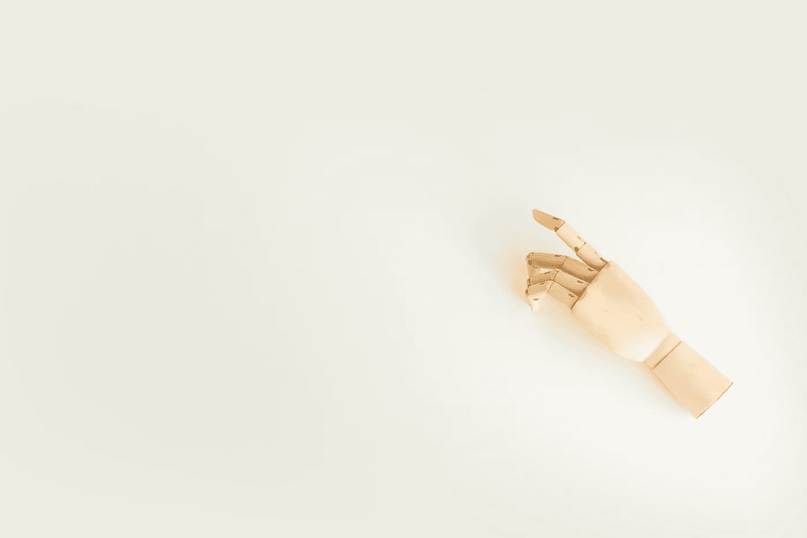

乔安娜·科辛斯卡在 [Unsplash](https://unsplash.com/photos/8gYCAkMuvsY) 上的照片

## 教计算机使用 GANs 绘制物体草图

上周，我的小弟弟向我介绍了 skribbl.io，这是一个在线猜字游戏。一个人画一个选定的单词，其他人必须猜出来。在一些激烈的战斗和欢笑之后，我想知道计算机在猜词方面是否比人更有效。这时候我碰到了[快，画！由谷歌创意实验室开发的一款游戏，一个神经网络试图猜测你在画什么。超过 1500 万玩家创作的涂鸦是开源的，任何人都可以玩。我们来探究一下数据。](https://quickdraw.withgoogle.com/)

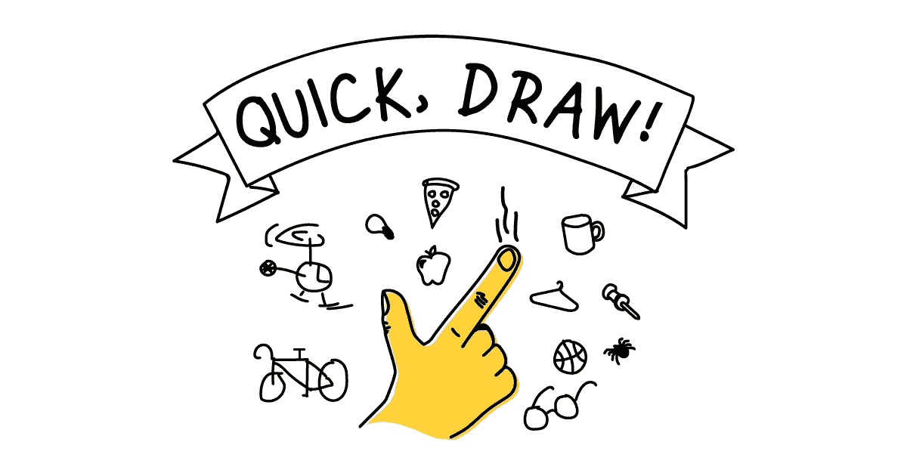

来源:[谷歌](https://quickdraw.withgoogle.com)

## 获取数据

快，拔枪！数据集在[谷歌云存储](https://console.cloud.google.com/storage/browser/quickdraw_dataset)上公开，在那里你可以找到 345 个类别的 5000 多万张图纸。使用 [gsutil](https://cloud.google.com/storage/docs/gsutil_install) ，您可以本地下载并浏览图纸。数据集的简化版本仅包含必要的信息。每个类别是一个`ndjson`文件，其中每一行是一个包含单个图形信息的`json`。让我们看看这幅画是如何表现的:

```
[ 
  [  // First stroke 
    [x0, x1, x2, x3, ...],
    [y0, y1, y2, y3, ...]
  ],
  [  // Second stroke
    [x0, x1, x2, x3, ...],
    [y0, y1, y2, y3, ...]
  ],
  ... // Additional strokes
]
```

在该格式中，`x`和`y`是草图的实值像素坐标。为了得到草图，我们需要在所有这些像素坐标之间“画一条线”。我们可以使用 [Bresenham 的直线算法](https://en.wikipedia.org/wiki/Bresenham%27s_line_algorithm)来做到这一点，该算法逼近我们在空白画布上绘制的笔画中每两点之间的直线所包含的点。

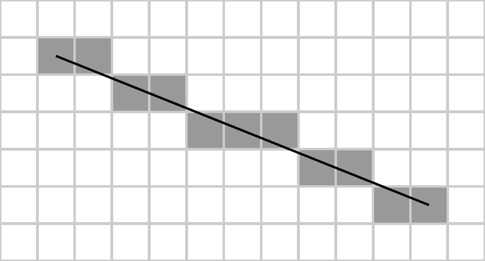

来源:[维基百科](https://en.wikipedia.org/wiki/Bresenham's_line_algorithm#/media/File:Bresenham.svg)

此时，我们能够显示一些草图。这里有一对来自`airplane`和`cat`类别的夫妇。

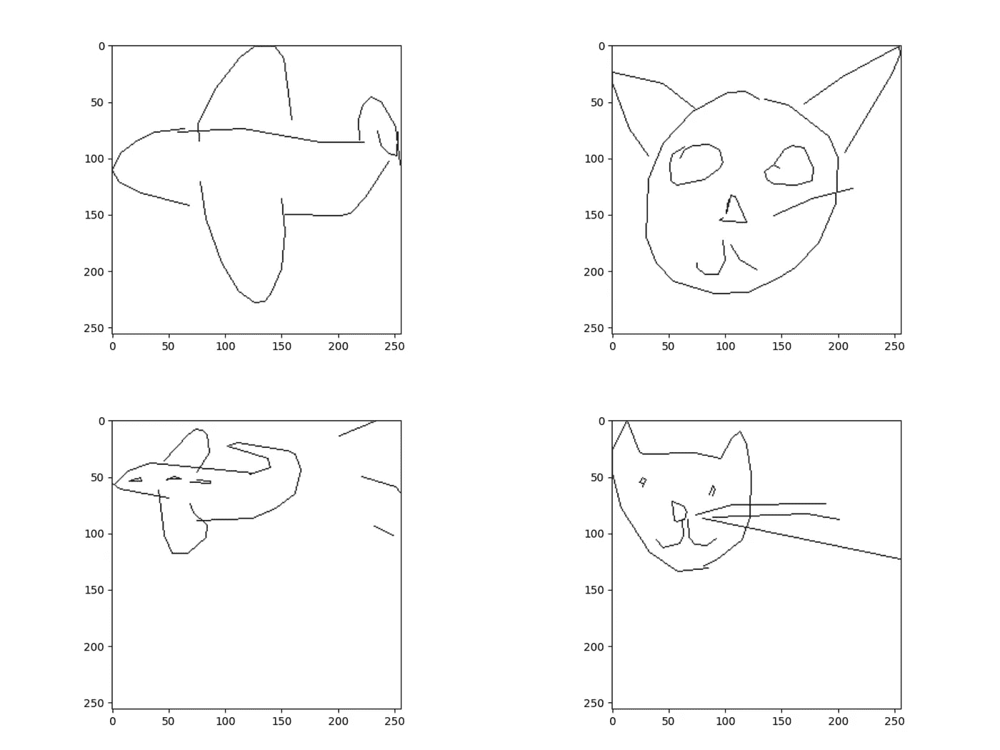

这些绘图包含在一个`256 x 256`画布中，但是我们将它们作为一个`28 x 28`画布输入到我们的模型中。`784`像素足以捕捉我们绘画的意义，它们让我们在计算上更有效率。

## 教计算机画画

我给大家介绍一下生成对抗网络(GANs)，这是一类机器学习框架，用来学习生成与训练集统计数据相同的新数据。

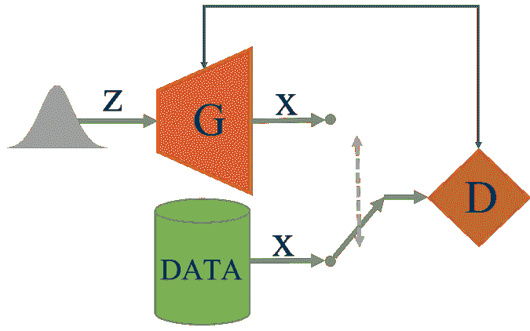

来源:[斯坦福大学](https://www.arxiv-vanity.com/papers/1707.02392/) [ [arXiv:1707.02392](https://arxiv.org/abs/1707.02392) ]

生成模型 **G** 捕捉训练数据的数据分布，试图欺骗判别模型 **D** 来估计样本来自训练数据而不是 G 的概率。

你现在可以想象我们如何应用这个框架来解决我们的问题。生成器将生成图纸，而鉴别器将尝试从*真*图纸中识别出*假*。这是一个[零和游戏](https://en.wikipedia.org/wiki/Zero-sum_game)，其中 D 和 G 相互竞争优化他们各自的效用函数。结果是神经网络(G)能够产生努力与训练数据相似的绘图。

我们将要使用的模型的架构可在此处[获得](https://github.com/eriklindernoren/Keras-GAN#gan)，并在 Ian Goodfellow 及其同事于 2014 年撰写的[本文](https://arxiv.org/abs/1406.2661)中介绍。

## 让我们画素描

此时，我们创建一个脚本来加载我们的绘图数据集，并准备好训练我们的模型。

首发简单:*画一个* ***的圆***

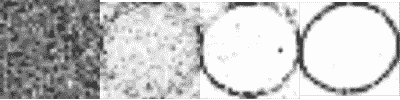

0–500–5000–30000 个纪元

首先，模型是无线索的，输出基本上是随机的。经过 500 个时代，我们可以看到形状是模糊可见的，一旦我们达到 5000 个时代，我们可以清楚地认识到一个圆。经过 30，000 个纪元后，形状看起来非常独特，噪音也在消失。

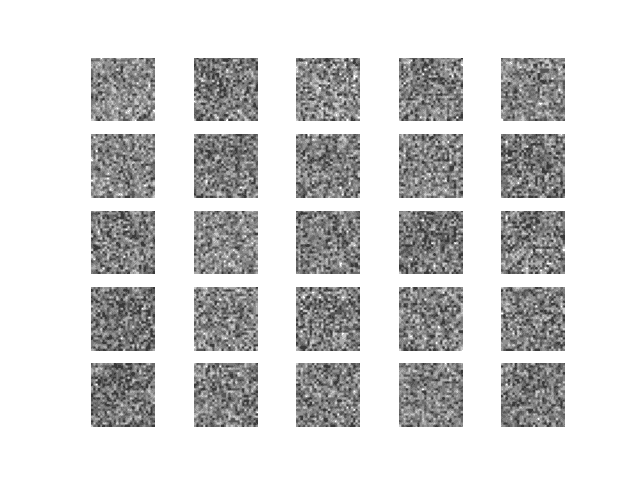

升级:*画一架* ***飞机***

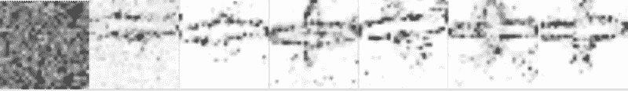

0–5–10–15–30–40–50 个纪元(千)

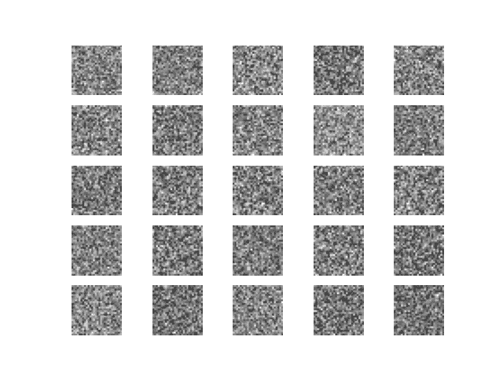

终极挑战:*画一只* ***猫***

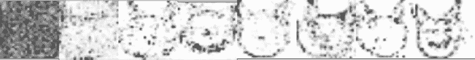

0–1–5–10–20–30–40–50 个纪元(千)

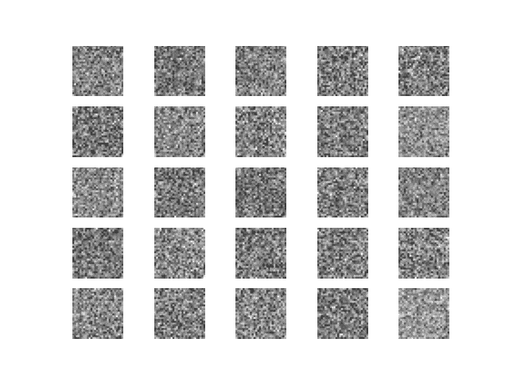

## 轮到你了

这就结束了我们的创造性实验，其源代码可在[这里](https://github.com/edoardolanzini/SketchGAN)获得。我鼓励你探索这个数据集，并提出你自己的创意项目。你也可以从谷歌创意实验室的其他人工智能实验的[集合中寻找更多灵感。您需要的一切只需点击一下鼠标。](https://experiments.withgoogle.com/collection/ai)

*如有任何问题或想法，欢迎直接联系我。*