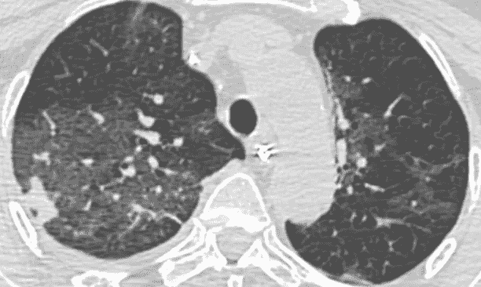
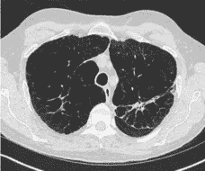
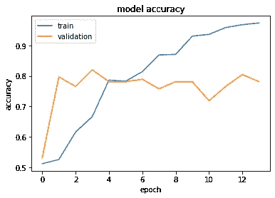
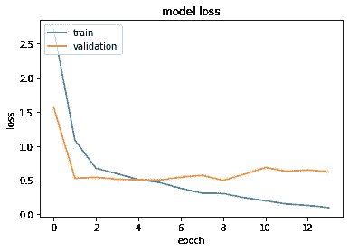
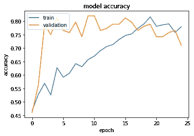
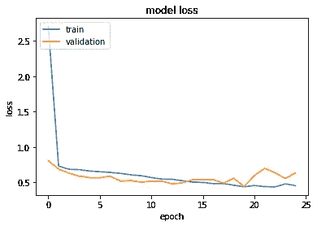
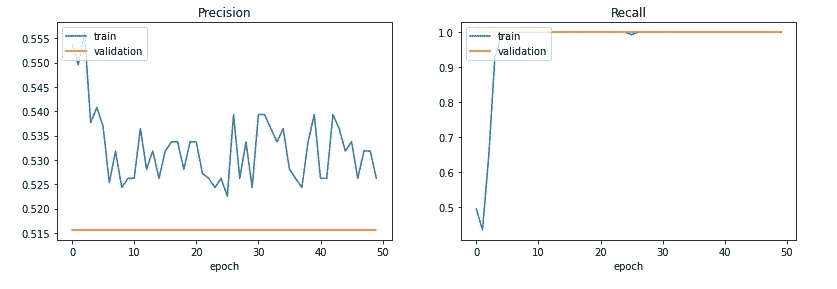
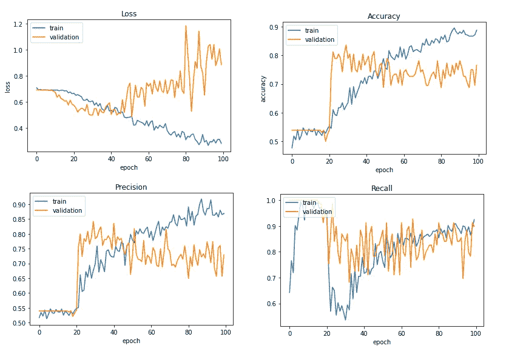
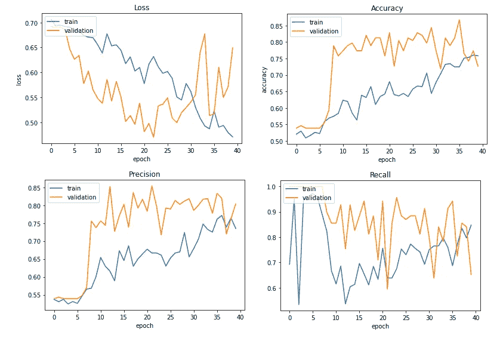

# 卷积神经网络能通过肺部 CT 扫描诊断新冠肺炎吗？

> 原文：<https://towardsdatascience.com/can-a-convolutional-neural-network-diagnose-covid-19-from-lungs-ct-scans-4294e29b72b?source=collection_archive---------44----------------------->

## 卷积神经网络教程使用计算机断层肺扫描新冠肺炎诊断。

当前的形势使人类面临新的挑战和机遇。在这个不稳定的今天，我们将回归科学，并通过使用一些公开可用的数据，从肺部计算机断层扫描(CT)扫描中创建用于诊断新型冠状病毒的图像分类模型的完整过程。在本练习中，我们将使用[下一个数据集](https://www.kaggle.com/luisblanche/covidct)、Keras 和 Tensorflow。完整代码的链接是[这里](https://www.kaggle.com/dergel/cnn-on-covid-19-ct-lungs-scans)。

***免责声明:*** *这是一个从零开始构建用于图像分类的卷积神经网络的练习/教程，应用于热点话题新冠肺炎诊断。我们对当前的形势不做任何结论。我们得出的唯一结论是我们的模型在可用数据范围内有多好。*



新冠肺炎(左)和新冠肺炎(右)没有病例(来源: [Kaggle](https://www.kaggle.com/luisblanche/covidct)

首先，了解区分两个类有多容易是有好处的——这可以给我们一些贝叶斯分类器错误率的估计。根据[这个来源](https://www.statnews.com/2020/04/16/ct-scans-alternative-to-inaccurate-coronavirus-tests/)，人类水平的精确度可以估计为 0.97(发现的病毒病例)，召回率为 0.7(100 个阴性诊断的人中有 30 个实际被感染)。此外，在数据集描述中，有一个到[存储库](https://github.com/UCSD-AI4H/COVID-CT)的链接，该存储库具有一个 F1 分数为 0.85 的模型。

当我们设计这个模型时，我们应该考虑到错过新冠肺炎案例的所有严重性。因此，我们应该密切关注召回度量和第二类错误。更简单地说，当我们的模型预测假阳性时，最好说“对不起，你实际上是健康的”，而不是让感染者照常进行。

# 数据

我们有 349 个阳性样本和 397 个阴性样本。幸运的是，这个数据集没有偏向任何一个类。所有的图像都有不同的形状，这意味着重塑的必要性。因为我们有一个小的数据集，我们将使用一个验证集作为测试集。但是，我们不会设置种子，这将允许我们在每次重新运行笔记本电脑时获得不同的数据子集，因此它将提供更可靠的性能评估，并保存数据用于培训。在这种情况下，首先将在验证集上调整超参数，但在此之后，我们重新分割数据，在新分割的训练集中重新训练模型，并在看不见的(在此运行中)验证集上进行评估。这样一来，我们的验证集将不会正式成为测试集，因为我们的模型已经在不同的运行中以某种方式(以较小的方式)暴露给它了。但这可能是我们对如此大量的数据所能做的最好的事情了。

# 准备

让我们从定义超参数开始，稍后我们将对其进行调整:

```
EPOCHS = 30
BATCH_SIZE = 64
OPTIMIZER = tf.keras.optimizers.Adam(learning_rate=0.01)
img_height, img_width = 248, 248
```

我们的图像存储在两个文件夹中，每个班级一个。我们将处理 64 个图像块中的数据，我们将把我们的图像重塑成 248x248px 像素的尺寸，因为它们都有不同的形状。我们将使用学习率为 0.01 的 [Adam 优化器](https://www.tensorflow.org/api_docs/python/tf/keras/optimizers/Adam)。在我们的实验中，历元的数量将会改变。

首先，我们需要建立一种将数据输入模型的方法。为此，我们将使用跟随发电机的[。由于我们没有用于培训和验证的单独文件夹，我们将让 Keras 处理此事:](https://keras.io/preprocessing/image/)

```
train_datagen = ImageDataGenerator(
    rescale=1./255,
    validation_split=0.2)train_generator = train_datagen.flow_from_directory(
    DIR,
    target_size=(img_height, img_width),
    batch_size=BATCH_SIZE,
    class_mode='binary',
    color_mode="grayscale",
    subset='training')validation_generator = train_datagen.flow_from_directory(
    DIR, 
    target_size=(img_height, img_width),
    batch_size=BATCH_SIZE,
    class_mode='binary',
    color_mode="grayscale",
    subset='validation')
```

# 模型

现在，让我们定义并拟合一些基本模型——三个卷积层，每个卷积层之后是最大池，之后是密集层，用于生成诊断。由于这是一个二元分类问题，我们将使用 sigmoid 作为输出的激活函数。

```
def create_model():
    model = Sequential([
        Conv2D(128, 4, padding='same', activation='relu', input_shape=(img_height, img_width, 1)),
        MaxPooling2D(),
        Conv2D(64, 8, padding='same', activation='relu'),
        MaxPooling2D(),
        Conv2D(32, 16, padding='same', activation='relu'),
        MaxPooling2D(),
        Flatten(), #the curve!
        Dense(128, activation='relu'),
        Dropout(0.3),
        Dense(1, activation='sigmoid')
    ])
    model.compile(optimizer=OPTIMIZER,
                  loss='binary_crossentropy',
                  metrics=['accuracy', 'Precision', 'Recall'])
    return modeles = EarlyStopping(monitor='val_loss', mode='min',
                   verbose=1, 
                   patience=7, restore_best_weights=True)hist = model.fit_generator(
        train_generator,
        steps_per_epoch=train_generator.samples // BATCH_SIZE,
        validation_data=validation_generator, 
        validation_steps=validation_generator.samples // BATCH_SIZE,
        epochs=EPOCHS,
        verbose=1, 
        callbacks=[es])
```



我们可以看到，即使是基本模型也仅在几个时期内就达到了相当好的性能。然而，在医疗保健这样重要的领域，这样的表现肯定是不够的。此外，由于我们没有测试集，我们希望有一个健壮的模型，在每次重新运行后都能给出接近的性能——否则，我们可以假设过度适合验证集。

我们可以看到过度拟合很快就发生了——在纪元 5 之后。为了克服它，让我们添加一些数据增强(你可以在这里[了解每个参数的作用](https://fairyonice.github.io/Learn-about-ImageDataGenerator.html)):

```
train_datagen = ImageDataGenerator(
    horizontal_flip=True,
    rotation_range=5,
    width_shift_range=0.05,
    height_shift_range=0.05,
    shear_range=0.05,
    zoom_range=0.05,    
    rescale=1./255,
    validation_split=0.2)
```

> *即使使用轻微的数据扩充也可能显著提高模型的概化能力！*

最初，我们有 598 张图像用于训练，148 张图像用于验证。在引入数据扩充之后，我们现在具有形式上无限数量的样本(因为每个图像可以被无限扩充，例如旋转 1、2、3 度)，但是我们在这里实际感兴趣的是获得更鲁棒的模型，该模型将能够做出正确的诊断，尽管图像被轻微旋转或移位。



不幸的是，我们没有得到显著的改善，我们的模型在 10-15 个时期后仍然过拟合——我们可以看到，训练损失开始减少，而验证损失开始增加。另一个问题是，由于我们的验证损失从一开始就很低，我们可以假设我们只是获得了良好的初始参数，因此，我们的模型并不稳健(记住，由于我们没有测试集，我们希望用新的分割重新评估我们的模型)。如果我们检查模型摘要，我们将看到我们的模型有 4，987，361 个参数——对于这样一个小数据集来说，这是一个巨大的数字。让我们通过添加更多具有 max-pooling 的卷积层来减少它们(我们还将添加几个密集层，以查看这是否会提高性能):

```
def create_model():
    model = Sequential([
        Conv2D(16, 1, padding='same', activation='relu', input_shape=(img_height, img_width, 1)),
        MaxPooling2D(),
        Conv2D(32, 3, padding='same', activation='relu'),
        MaxPooling2D(),
        Conv2D(64, 5, padding='same', activation='relu'),
        MaxPooling2D(),
        Conv2D(64, 5, padding='same', activation='relu'),
        MaxPooling2D(),
        Conv2D(64, 5, padding='same', activation='relu'),
        MaxPooling2D(),

        Flatten(),
        Dense(128, activation='relu'),
        Dropout(0.4),
        Dense(64, activation='relu'),
        Dropout(0.5),
        Dense(8, activation='relu'),
        Dropout(0.3),
        Dense(1, activation='sigmoid')
    ])model.compile(optimizer=OPTIMIZER,
                  loss='binary_crossentropy',
                  metrics=['accuracy', 'Precision', 'Recall'])

    return model
```

现在我们的模型有 671，185 个参数，数量明显更少。



但是，如果我们尝试训练我们的模型，我们将看到下一步。我们的模型开始过于“悲观”，并预测所有患者的 COVID。看来我们把模型做得太简单了。

让我们将结构简化如下:

```
def create_model():
    model = Sequential([
        Conv2D(16, 1, padding='same', activation='relu', input_shape=(img_height, img_width, 1)),
        MaxPooling2D(),
        Conv2D(32, 3, padding='same', activation='relu'),
        MaxPooling2D(),
        Conv2D(64, 5, padding='same', activation='relu'),
        MaxPooling2D(),
        Conv2D(64, 5, padding='same', activation='relu'),
        MaxPooling2D(),

        Flatten(),
        Dense(128, activation='relu'),
        Dropout(0.4),
        Dense(64, activation='relu'),
        Dropout(0.5),
        Dense(8, activation='relu'),
        Dropout(0.3),
        Dense(1, activation='sigmoid')
    ])

    model.compile(optimizer=OPTIMIZER,
                  loss='binary_crossentropy',
                  metrics=['accuracy', 'Precision', 'Recall'])

    return model
```

这个模型有 2，010，513 个参数——比“不够复杂”的模型多几倍，但比“太复杂”的模型少几倍。因此，该模型在计算上更便宜且更容易训练。



现在我们开始看到相当好的结果。在训练期间，该模型经历了“对每个人都预测为正面”的阶段，但是克服了它并回到正确的预测。在大约 40 个时期之后，它仍然开始过度拟合(并且我们在我们的数据的每个片段中看到相同的图片)，因此，我们将让我们的模型训练 40 个时期，并在之后评估它。

# 结果



决赛成绩

*注意验证和训练集指标之间的差距——这是正常的，并且正在发生，因为我们在预测过程中没有应用丢弃，这为模型提供了全部潜力。*

我们观察到模型没有过度拟合，因为验证损失比训练好。然而，如果我们添加额外的神经元、层或过滤器，模型将开始表现不佳，因此我们可以得出结论，我们在模型中没有可移除的偏差。

我们可以使用下一个脚本生成最终报告:

```
y_pred = (model.predict_generator(validation_generator) > 0.5).astype(int)
y_true = validation_generator.classes

for name, value **in** zip(model.metrics_names, model.evaluate_generator(validation_generator)):
    print(f'**{**name**}**: **{**value**}**')

print(f'F1 score: **{**sklearn.metrics.f1_score(y_true, y_pred)**}**')pd.DataFrame(sklearn.metrics.confusion_matrix(y_true, y_pred), 
             columns=['pred no covid', 'pred covid'], 
             index=['true no covid', 'true covid'])
```

这将为我们提供:

```
loss: 0.5895
accuracy: 0.7702
Precision: 0.8358
Recall: 0.7088
F1 score: 0.4625

             pred no covid | pred covid
true no covid   35         |    34
true covid      45         |    34
```

由于我们没有设定种子，性能可能会略有不同，但准确性在 70–80%之间。我们的模型远非完美——它往往有假阴性问题(与可接受的误差相反——假阳性，正如我们在开始时定义的那样)。

这种模型可以用作预诊断和优先化患者的助手。我们应该记住，我们的模型会给出假阳性和假阴性，因此我们不应该仅仅根据它来做决定。然而，我们可以优先对模型预测到病毒的患者进行医生调查。

# 结论

我们能够通过从零开始训练模型来取得相当好的结果。由于训练集大小只有大约 600 幅图像，因此该模型的可推广性有限。此外，有可能包括其他类似肺炎的疾病的图像，并看看是否有可能建立一个模型来正确区分它们。这项任务可能会非常困难，我们只需要两个类别——健康人和冠状病毒/其他疾病，因为仅通过 CT 扫描区分肺炎/冠状病毒可能非常困难。

**如何制作一个更好的模型** —我们可以采用一个能够诊断类似疾病的预训练模型(或自己对其进行预训练)，并对新冠肺炎数据集应用迁移学习。根据我接触过的几位医生的专业知识，肺炎患者的 CT 肺部扫描可能与冠状病毒患者的 CT 扫描非常接近，因此，可以使用这样的数据/模型。我们还可以添加一个辅助输入，比如温度，如果这些数据可用的话。

完整的代码可以在[这里](https://www.kaggle.com/dergel/cnn-on-covid-19-ct-lungs-scans/)找到。数据集可以在这里找到[。](https://www.kaggle.com/luisblanche/covidct)

注意安全，感谢阅读！