# 数据科学家能代替 DJ 吗？使用 Python 操作 Spotify

> 原文：<https://towardsdatascience.com/can-a-data-scientist-replace-a-dj-spotify-manipulation-with-python-fbbd4a45ffd5?source=collection_archive---------16----------------------->

## 使用 Spotify 的 API 创建和调整您自己的播放列表

*“…一个美丽的旅程，开始是为了调查音乐背后潜在的统计“证据”，最终发现(对于一个数据科学家来说)在方程式背后也有“音乐……”*

[诺贝特·布杜茨基](https://unsplash.com/@buduczki?utm_source=unsplash&utm_medium=referral&utm_content=creditCopyText)在 [Unsplash](https://unsplash.com/photos/BZO2k7sCsWk) 上的照片

数据科学非常庞大，并不断扩展到新的行业，提供了大量有价值的(主要是企业)应用。音乐行业就是其中之一。如果我们像对待一个“黑盒”一样对待这些应用程序，我们会观察到一个输入( ***数据*** )和一个输出( ***产品*** )。这个项目旨在用 Python 操作 Spotify 音乐数据，有两个范围:

✔️证明了 API(应用编程接口)的存在是非常重要的，在馈送算法方面具有额外的精细 ***数据*** 。

✔️展示了简单的统计数据(当正确应用时)如何编码日常行为，将它们分解成基本元素，并在此基础上构建有价值的 ***产品*** 。

## 概念

我们将建立一个假设的场景。最近，我作为一名数据科学家工作的数据公司记录了他们的青年营销部门的显著利润，正因为如此，它决定用一个聚会来奖励其年轻客户。在没有 DJ 的情况下，我的主管让我负责音乐，让派对持续到早上！她给了我一些公共关系部门已经创建好的 Spotify 播放列表，以便检查它们并创建最终的播放列表。一般来说，对现代音乐趋势的漠视让我想到了一个微妙的选择:

使用 Python 访问所有播放列表，提取每首歌曲的每一个音频特征，对它们进行统计推理，并将最适合(我们聚会)的歌曲打包成最终播放列表，如何？当然，有一个技术性的问题:我不会听到他们中任何一个人的任何声音！

为了更好地交流结果，提出了一些假设:

#1:我的个人 Spotify 播放列表代表公司给我的播放列表。

#2:该党的目标群体是 18 至 30 岁的年轻人，这意味着…跳舞！然而，他们中的许多人可能会有家人陪同，也就是说，一小部分客人会更好地欣赏欢快的音乐。

#3:在 Spotify 为其开发者提供的音频功能中，仅考虑了`danceability`、`energy`、`tempo`、`loudness`、&、`valence`(见第 2 节)。这是因为，在我看来，它们能更好地表达一首曲目是否适合一场舞会。

#4:有两种方法可以改善选择的播放列表；分别移除或添加被视为“坏”或“好”的轨道(涉及一个或多个音频特征)。为了扩大最终的播放列表，我只采用了后者。

## 作案手法

为了完成我们的使命，必须遵循以下路线图:

1.  设置**环境**来运行代码。
2.  向 Spotify **API** 发出请求，获取所有相关的音乐数据并提供简要说明。
3.  使用 Numpy、Pandas &多个额外的 Python 库执行 **EDA** (探索性数据分析)，以数字和视觉方式探索候选播放列表。
4.  选择—使用几个**统计**技术优化最合适的播放列表。

## 1.建立

在这一节中，我们将设置所需的环境，以便应用分析技术。如果您已经准备了下面列出的任何部分，您可以分别跳过它们。

*   [申请](https://developer.spotify.com/dashboard/)一个 Spotify 开发者账号，创建一个 app。[ *在这个过程中，您将创建一个客户端 ID，并为您的应用程序提供一个客户端密码*。
*   安装[Jupyter](https://jupyter.org/index.html)Notebook——一个开源网络应用程序，用于创建/共享包含实时代码、公式、可视化和叙述性文本的文档。你可以在这里按照步骤[进行](https://jupyter.org/install.html)。
*   安装[spot ipy](https://spotipy.readthedocs.io/en/2.9.0/)——一个用于访问 Spotify Web API & [请求的轻量级 Python 库](https://2.python-requests.org/en/master/)——一个用于处理 API 的 Python 模块。您可以使用 CLI(命令行界面)或 Jupyter 笔记本来运行以下命令:

install.py

*   导入必要的库:

import.py

*   执行授权代码流。【*我写的一个分步指南在*[*GitHub*](https://github.com/makispl/Spotify-Data-Analysis)*上有；照着做，你就会没事的。*

授权. py

⚠️请注意，您可以选择通过相应地设置环境变量来临时提供凭据，而不是直接通过笔记本来声明凭据:

set_env_var.py

## 2.数据解释和获取

Spotify 为其开发者提供了许多描述音轨特征的音频功能(参见[此处](https://developer.spotify.com/documentation/web-api/reference/tracks/get-several-audio-features/)了解音频功能对象的更全面的解释)。下面我列出了我们将要使用的特性，以及一个简短的解释:

*   `Valence` : [0.0 -1.0]描述轨道听起来有多“积极”。高价意味着更积极的声音(如愉快、欣快等)。
*   `Loudness` : [-60.0 - 0db]描述音轨的整体响度，或者说是声音的质量，它是与体力(振幅)相关的主要心理因素。
*   `Tempo`:以 BPM(每分钟节拍数)描述轨道的整体估计速度，直接从平均节拍时间长度得出。
*   `Energy`:【0.0-1.0】描述活动和强度的感知度量。高能量的轨道感觉很快，很响，很吵。
*   `Danceability`:【0.0-1.0】根据音乐元素(速度、稳定性、节拍强度等)的组合，描述轨道是否适合跳舞。较低的值意味着适合跳舞的轨道较少。

**数据获取**部分分 3 步完成:( **a** )访问用户播放列表，( **b** )获取每个播放列表的曲目，以及(c)获取每个曲目的音频特征。对于每一步，我都创建了一个函数，它实现了相应的 Spotipy 方法。

**(a)访问用户的播放列表**

fetch_plst.py

该函数返回一个数据帧，包含用户的播放列表'`id`、`name`和曲目数量`#tracks`。显然，有 4 个候选播放列表:

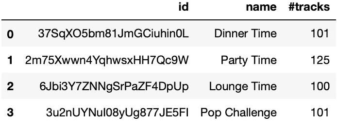

`playlists`数据帧

**(b)获取播放列表的曲目**

fetch_trcs.py

这个函数将`playlist_id`作为一个参数，并返回一个数据帧，包括每个音轨的`track_id`和`track_name`。我们不直接调用它，而是在下面的函数中使用它。

**(c)提取音轨的音频特征**

fetch_aud_ftrs.py

给定`playlist_id`作为参数，该函数返回每个音轨的`track_id`、`name`和音频特征(`danceability`、`energy`、`tempo`、`loudness`、`valence`)。因此，对于 4 个播放列表中的每一个，我们都创建了相应音频特征的数据帧:

aud_ftrs.py

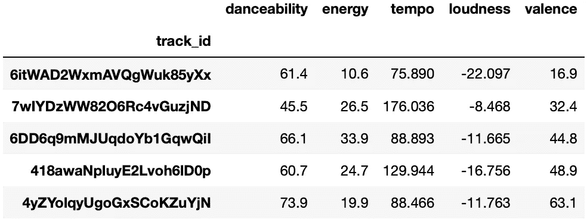

`df_dinner`数据帧样本

我们只是通过纯粹的编码获得了所有必要的数据，仅仅依靠 API 的力量！让我们看一下分析的主要部分。

## 3.电子设计自动化(Electronic Design Automation)

*在减少杂乱的脉络中，我这里不包括数据可视化代码，但是在 GitHub*[*repo*](https://github.com/makispl/Spotify-Data-Analysis/blob/master/Spotify_Data_Manipulation_Python.ipynb)*上有。*

首先，我们在一个单独的情节中描绘了所有播放列表的音频特征，以便容易地察觉哪个(些)最适合聚会。

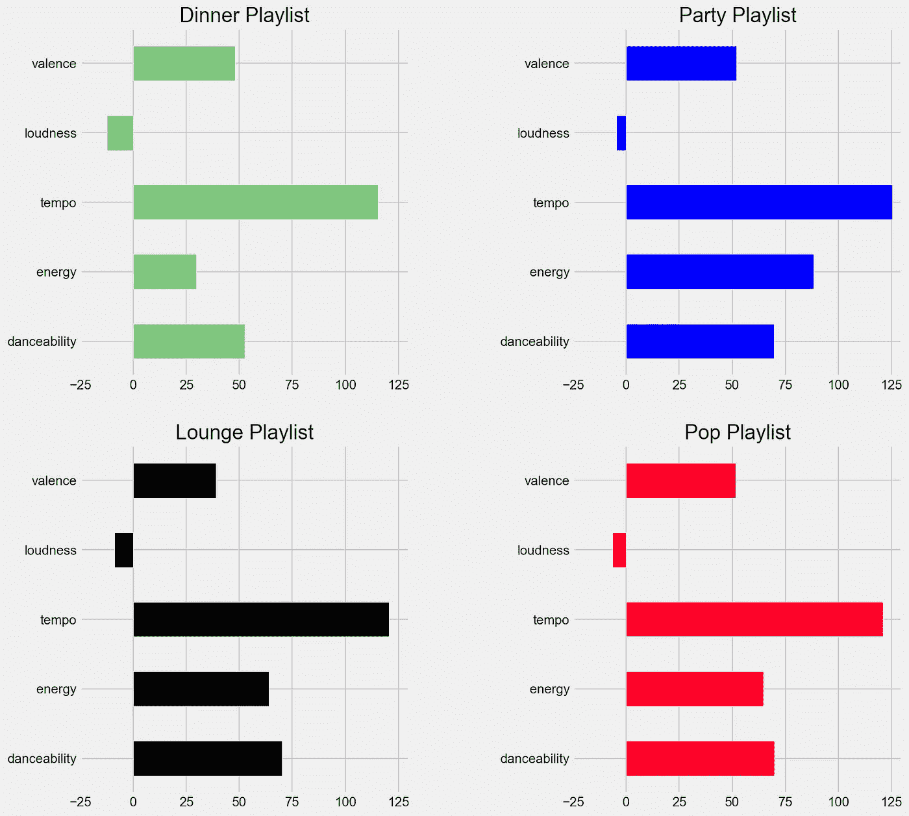

音频功能水平条形图

显然， *Party* 和 *Pop* 播放列表取代了其他两个，从整体上考虑了这些特性。仔细观察这两者，我们可以更好地了解哪一个占优势…

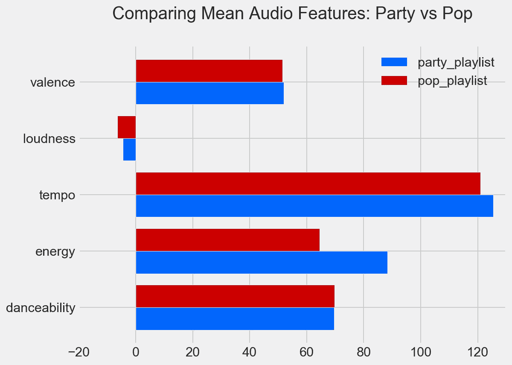

`df_party` & `df_pop`横条图

除了`danceability`特性，其余都是针对*党*播放列表的较高。这意味着这是我们必须选择和构建的一个，以便完善最终的播放列表。

## 4.播放列表优化

主要范围是尽可能增加*方*播放列表的音频功能。但是，增加一个功能可能会减少另一个功能，因此我们必须优先考虑它们。个人感觉按照假设#2，`danceability` ( *少年*)应该是首要特征，其次才是`valence` ( *家庭成员*)。

变量是定量的，同时也属于测量的比例尺度。因此，盒须图可以有效地描述每个特征的个体分布。这样的图和描述性统计表(通过`pandas.DataFrame.describe`方法)一起，可能会给我们提供一个很好的视觉直觉，告诉我们属于每个特定四分位数的值的比例。

下面详细介绍了原始的`df_party`数据框架，突出显示了`danceability`和`valence`平均值、第二(中间)和第三四分位数:

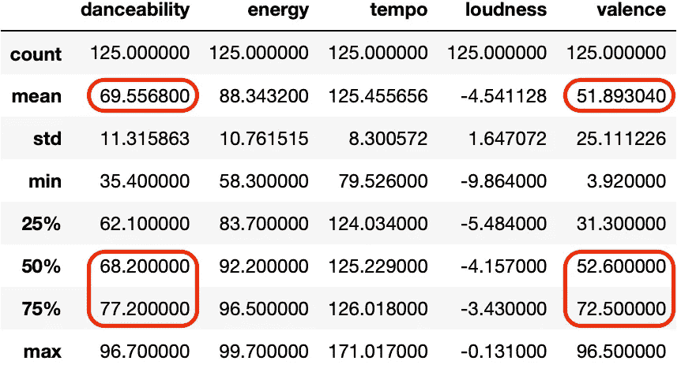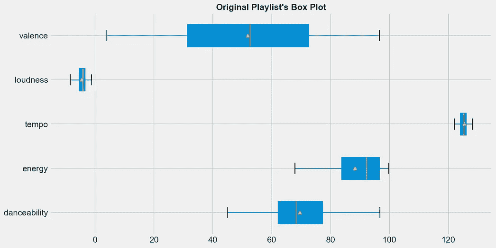

df _ 交易方描述性统计&箱线图

垂直的黄线是中间值，而▴符号象征着中间值。我们通常的目标是将每个特性的分布尽可能向右“推”，也就是说，沿着玩家的轨迹增加它们，以获得更好的“聚会”体验！假设#4，我们添加来自`df_pop`(第二个入围播放列表)的曲目，每次寻找机会:

*   要么向右移动平均值(增加平均音频特征)
*   或者将中间值移到平均值的右边(确保至少 50%的歌曲高于平均值)
*   或者两者都有

**方法一**

一个好的起点是从`df_pop`中抽取一个样本，并将其添加到主样本(`df_party`)中，除了它不会是随机的。通过利用`pandas.DataFrame.sample()`函数和`weights`参数，我们可以预先配置`danceability`值越大，越有可能对相应的行进行采样。这种方法产生的数据帧是`df_party_exp_I` ( *exp* 代表 *expanded* )。

样本 _I.py

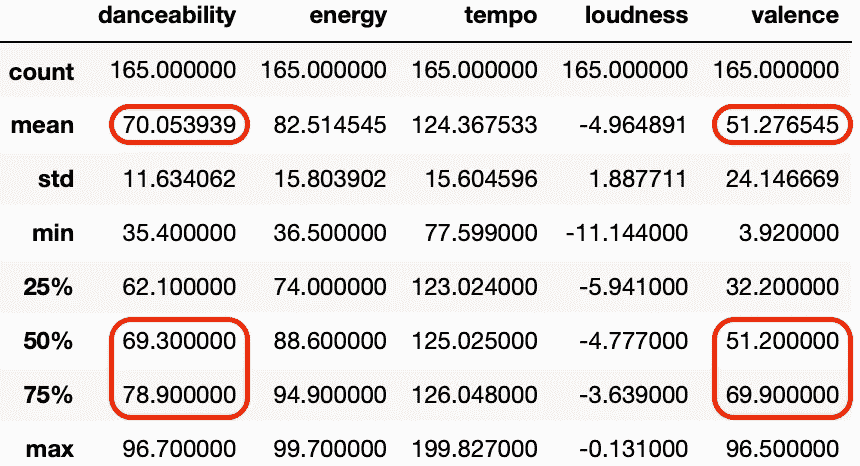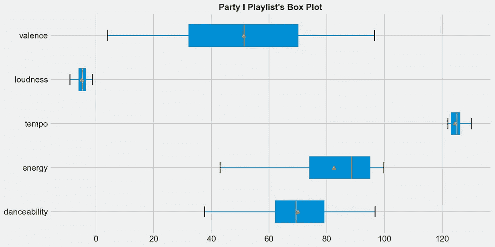

df_party_exp_I 描述性统计&箱线图

*   主音频特性`danceability`增加；平均值上升了近 0.5，分布也略有优化。中位数和第三(上)四分位数已经向右移动，分别从 68.20 移动到 69.30，从 77.20 移动到 78.90。
*   然而，`valence`特征减少了 0.61，并且没有一个四分位数向右移动。考虑到这一点，我们应该寻找进一步优化的机会。

**方法二**

这一次，我们将实现 NumPy 布尔索引，并过滤 *Pop* 播放列表，只返回符合我们指定标准的行。特别是我们将`danceability`和`valence`的特性分别设置在*党*播放列表的各自均值之上，分别为 69.55 和 51.89(参考笔记本)。

样本 _II.py

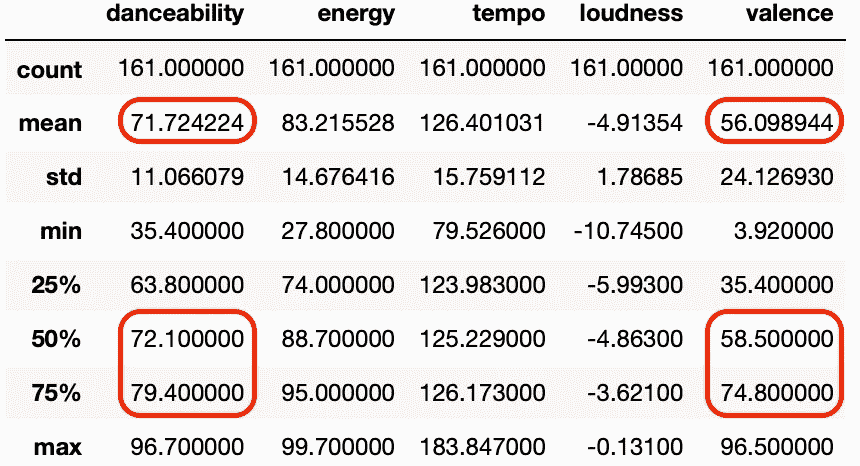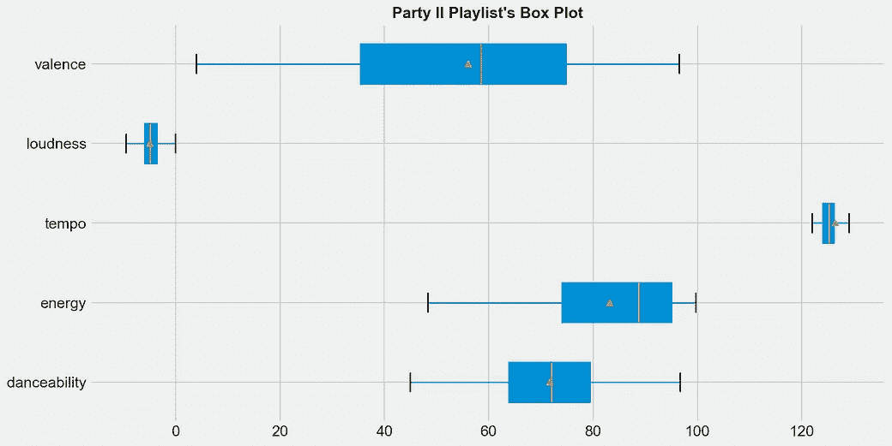

df_party_exp_II 描述性统计和箱线图

*   `danceability`增加了更多。这次均值涨了差不多 2.17！随着中值和上四分位数向右移动，沿该特征的音轨分布也被优化，这实质上意味着至少 50%的播放列表高于主要声学特征的“新的”较高平均值(71.71)。
*   然而，`valence`特性下降了 4.21，第二和第三四分位数仍然高于平均值。

**方法三**

一个特性的优化并不一定意味着其他特性都是一样的。为了改善这个缺点，我们将引入一个方程，其变量是声学特征，参数是我们分配给它们的权重。由于我们非常重视`danceability`的特性，因此相应的权重应该更高。我的拆分如下:

得分=(可跳舞性* 30) +(能量* 20) +(速度* 20) +(响度* 10) +(价数* 20)

我们为播放列表的每一首曲目计算这个分数(创建一个新列`score`)，然后计算各自的描述性统计数据。这样，我们可以更好地评估丰富`df_party`的每个动作，同时在每个特性上实现更均匀的(根据权重)优化。

简而言之，`df_party`、`df_party_exp_I`、&、`df_party_exp_II`分别表示`score`为 7355、7215、7416。显然，尽管**方法 I** 带给我们比原始播放列表更好的`danceability`，但它恶化了派对的整体体验(平均值`score`从 7355 下降到 7215)。就第二种方法而言，平均值`score`上升了将近 62 分。然而，我们可以永远超越这些方法…

这一次，通过使用新引入的`score`列，我们将过滤`df_pop`数据帧，并获取注意到比`df_party`平均值更高的`score`的行。从而，增加后者！

sample_III.py

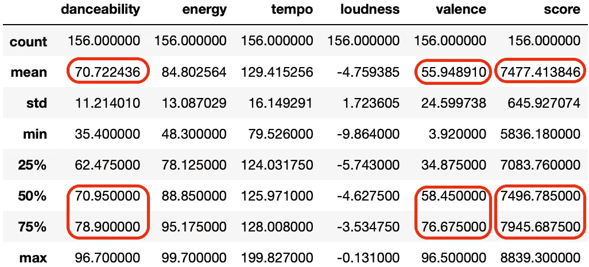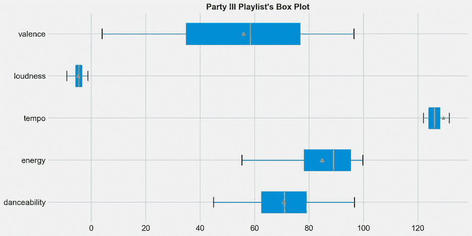

df_party_exp_III 描述性统计&箱线图

事实上，这一次:

*   `danceability`特征上升了近 1.17，`valence`上升了 4.06 ( *均值右移*)
*   两种分布都得到了改善(*中值移至平均值*的右侧)
*   `score`注意到了 122.3 的数值，这是目前为止最好的！(*在上下文中意味着更高的潜力，播放列表在加权音频特征中更加一致*)

作为健全性检查，我们应该一次描绘和比较所有的盒状图——这可能看起来有点拥挤。幸运的是，变量的性质(见上文)允许使用 KDE(内核密度图)。

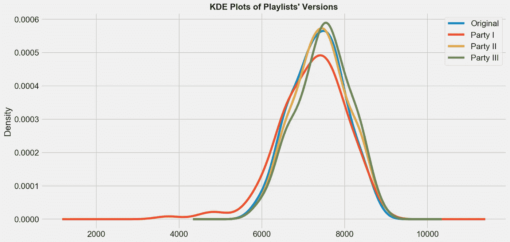

KDE 地块

现在，越来越清楚的是，**方法 III** (绿色分配)是最好的，因为它实现了更高的右移。

最后，我们最终得到的数据帧(`df_party_exp_III`)包含了最终的音轨。唯一悬而未决的行动是将其转换成一个真正的播放列表。下面，第一个函数创建最终的播放列表，参数是它的名字(熊猫…还有什么？)和一段描述。另一个是从数据帧迁移磁道。请注意，授权流将再次运行，这一次使用不同的范围(`playlist-modify-public`)。你只需再次跟随[向导](https://github.com/makispl/Spotify-Data-Analysis/blob/master/README.md)即可。

create_plst.py

enrich_plst.py

create_plst.py

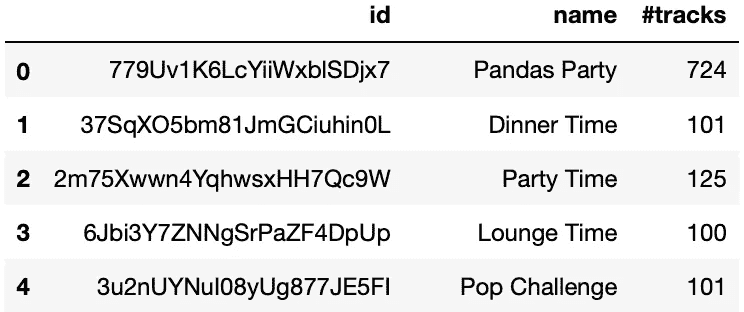

播放列表数据帧

瞧啊！

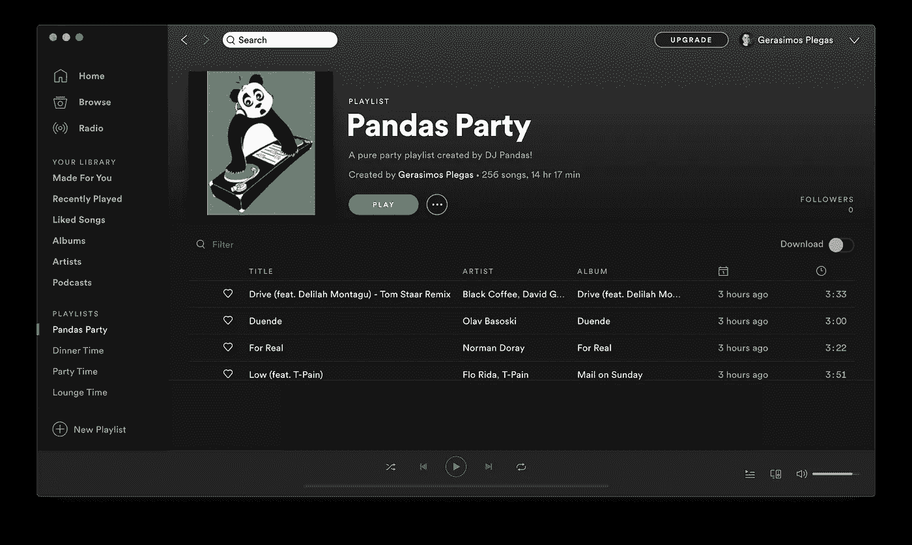

作者照片

## 结论

迄今为止，我们已经走了很长的路；我们处理了数百首曲目，检查了它们的音频特征，最终选择了最适合派对的曲目，只使用了 Python 和。这样，我们设法完成了最初提出的任务:

✔️:我们展示了简单的(描述性的)统计和编码——当适当结合时——是如何计算出像这样耗时的活动的。

✔️:我们“尝到了”请求一个可用 API 的重要性，以便提取有意义的数据。

回到题目的问题，几乎不可能(至少目前)很自信地回答这个问题。无论我们是否从 DJ 或数据科学家的角度“深入”音乐现实，(本质上的意思是)无论工作是在甲板上还是在桌子上完成，无论是关于调音乐器还是只是…解方程，当然没有人会反对前者。更别说去打扰这样一个时刻的壮丽…

由 [Jamakassi](https://unsplash.com/@jamakassi?utm_source=unsplash&utm_medium=referral&utm_content=creditCopyText) 在 [Unsplash](https://unsplash.com/photos/wejxKZ-9IZg) 拍摄的照片

但是，就精确度、灵活性和对大量音乐数据集的彻底处理而言，后者可以通过几行代码指导计算机体面地执行任务。也就是说，有一件事是理所当然的:

> 数据科学已经找到了另一个扩展和繁荣的“利基”，这意味着统计数据背后确实有“音乐”，就像节拍背后有数学一样…

感谢您的阅读&祝您度过愉快的一周！Jupyter [笔记本](https://github.com/makispl/Spotify-Data-Analysis/blob/master/Spotify_Data_Manipulation_Python.ipynb)准备立即运行。如果有任何问题，请在下面留言。无论如何…

克隆 [repo](https://github.com/makispl/Spotify-Data-Analysis) ，运行代码……让`Pandas`摇滚起来！