# 机器可以进行性别分类吗？

> 原文：<https://towardsdatascience.com/can-a-machine-classify-genders-3119d6e39377?source=collection_archive---------28----------------------->


照片由[艾丽莎·斯蒂文森](https://unsplash.com/@alyssastevenson?utm_source=medium&utm_medium=referral)在 [Unsplash](https://unsplash.com?utm_source=medium&utm_medium=referral) 上拍摄

## 使用 matplotlib 探索美国 100 年的名字，并建立一个机器学习模型来从名字中分类性别。

# 前言

我们的名字并不总是定义我们，但它们确实给了我们一种认同感。给我们自己贴上一系列字母和单词的标签给我们的自我意识提供了一种结构，并锚定了我们在这个世界上的存在。

> “他们怎么称呼你并不重要，重要的是你如何回应。”—厕所场地

# 动机

不知何故(*和非常奇怪的*)，通过我们的生活经历，我们知道，如果一个人名叫“ *XYZ* ，那么他或她很可能是一个“*小的像这个*或有一点点“*那个*”。

在将一个人的个性映射到一个名字的过程中，我们可能正确，也可能不正确(在我的例子中，大部分是不正确的)，但我想知道机器是否能做得比我更好。

作为一个简单的试金石，我认为性别是一个人的身份之一。激励性的问题是—

> 你能从一个人的名字预测他或她的性别吗？

出奇的简单，不是吗？然而，这并不像看起来那么容易。文化和语言的差异使得这项任务变得困难。

这促使我建立了一个基本的机器学习模型，看看它是否能比我更好地预测一个人的性别。

> 完整的代码可以在我的 [GitHub](https://github.com/ani-rudra-chan/Predicting-Gender-Project.git) 资源库中找到。

# 数据源

那么，机器从哪里可以获得大量的生活经验呢？当然是通过历史上精心整理的数据！一个这样的来源是美国婴儿名字目录，可以在 data.gov 买到。

这一数据由社会保障管理局免费提供和公布。它包含从 1919 年到 2018 年每个州的社会保障卡应用程序中的名字及其出现频率。

# 数据预处理

我下载了这个数据，它是每个州的文本文件的集合。每个文本文件包含在给定年份中出现至少 5 次的所有名字。我稍微清理了一下数据，最终的串联数据集占用了将近 320 MB 的内存！

```
<class 'pandas.core.frame.DataFrame'>
Int64Index: 6028151 entries, 0 to 28019
Data columns (total 6 columns):
 #   Column  Dtype 
---  ------  ----- 
 0   yob     int64 
 1   name    object
 2   gender  object
 3   number  int64 
 4   state   object
 5   chk     int64 
dtypes: int64(3), object(3)
memory usage: 321.9+ MB
```

*(注:此处为每个姓名指定的性别与文本文件中的数据一致。可下载的 zip 文件中还有一个有用的自述文件，它解释了数据集的某些特性)*

# 探索性数据分析

我想探索一下数据，并可视化一些汇总统计数据。

## 1)过去 100 年中最常见和最不常见的 100 个名字

每年都有一些父母喜欢的名字，而单词云有助于形象地表现这种现象。

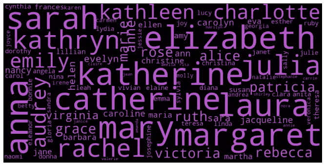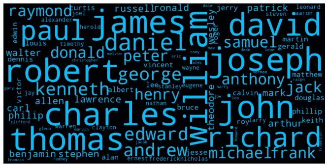

过去 100 年中最常见的 100 个名字(图片来源:作者)

举个例子，女孩通常被称为**伊丽莎白**或**凯瑟琳**或**玛格丽特** ( *仅举几个*)而**詹姆斯**或**威廉**或**约翰**一直是男孩的流行名字。除了常见的名字，了解一点不常见的名字也很有趣。

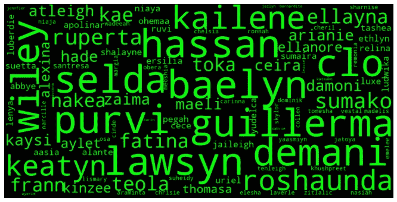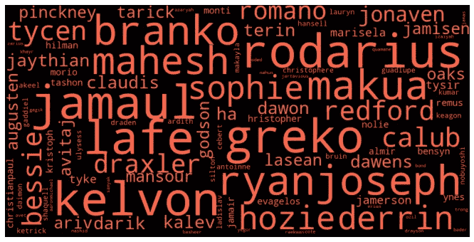

过去 100 年中最不常见的 100 个名字(图片来源:作者)

一些真正有趣且不常见的女孩名字是**拜林**、**塞尔达**和**德马尼**，而男孩的名字是**罗德里乌斯**、**贾马尔**和**凯尔冯**！

## 2)2018 年前五名

2018 年的前 5 名是女孩中的**艾玛**、**奥利维亚**、**艾娃**、**伊莎贝拉**和**索菲亚**。利亚姆**、**诺亚**、**威廉**、**詹姆斯**和**奥利弗**是排名最高的男孩名。**

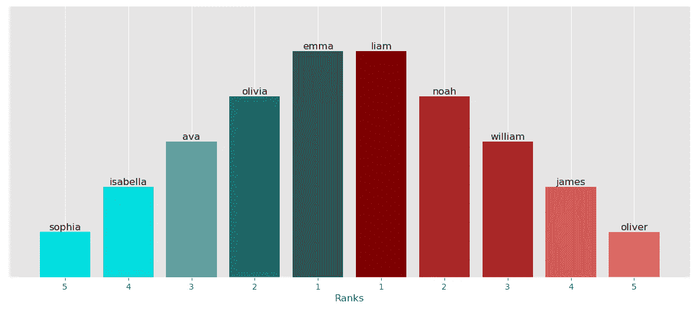

2018 年前 5 名(图片鸣谢:作者)

## 3)2018 年排名靠前的名字的历史

为了了解这些名字过去的受欢迎程度，我绘制了 2018 年前 5 名名字的时间序列。有趣的是，**艾玛**和**奥利维亚**一直是历史上流行的女孩名字，而**艾娃**、**伊莎贝尔**和**索菲亚**在 20 世纪 80 年代后开始流行。

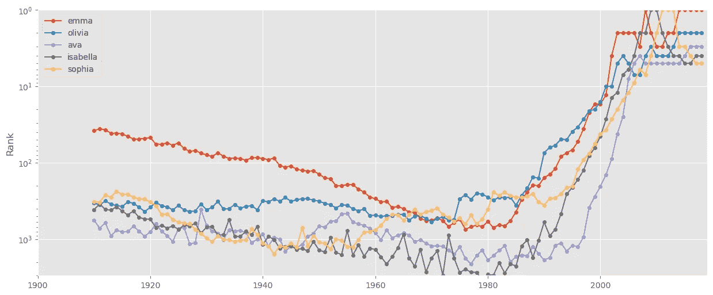

2018 年排名靠前的女性名字的历史受欢迎程度(图片来源:作者)

在男孩的名字中也可以观察到类似的趋势。**詹姆斯**和**威廉**这些年来一直很受欢迎，位列前 10 名。**利亚姆**、**诺亚**和**奥利弗**在 1980 年后越来越受欢迎。

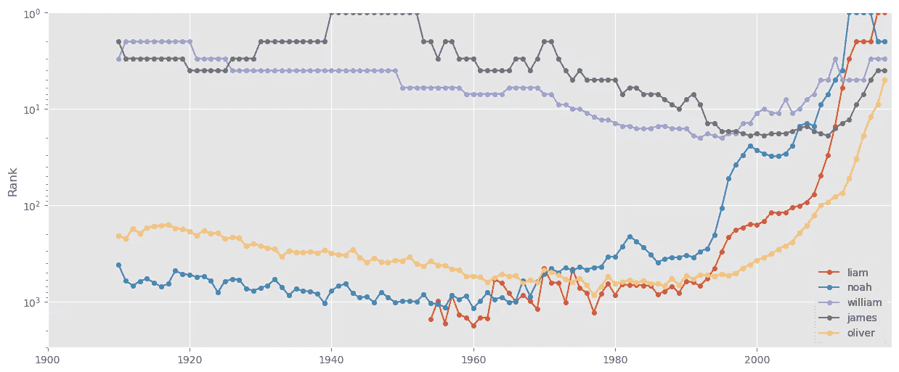

2018 年排名靠前的男性名字的历史受欢迎程度(图片来源:作者)

## 4)可视化 2018 年各州的姓名流行度

我还想可视化 2018 年排名前 10 名的受欢迎程度，一个简单的方法是创建一个排名的合唱团。

(*这也给了我玩* [*Imageio*](https://imageio.readthedocs.io/en/stable/sec_gettingstarted.html) *的机会，一个创建 gif 的简单库。这个* [*岗位*](https://medium.com/swlh/python-animated-images-6a85b9b68f86) *由* [*崔永*](https://medium.com/u/88ff1e2545d0?source=post_page-----3119d6e39377--------------------------------) *博士担任真是大用*

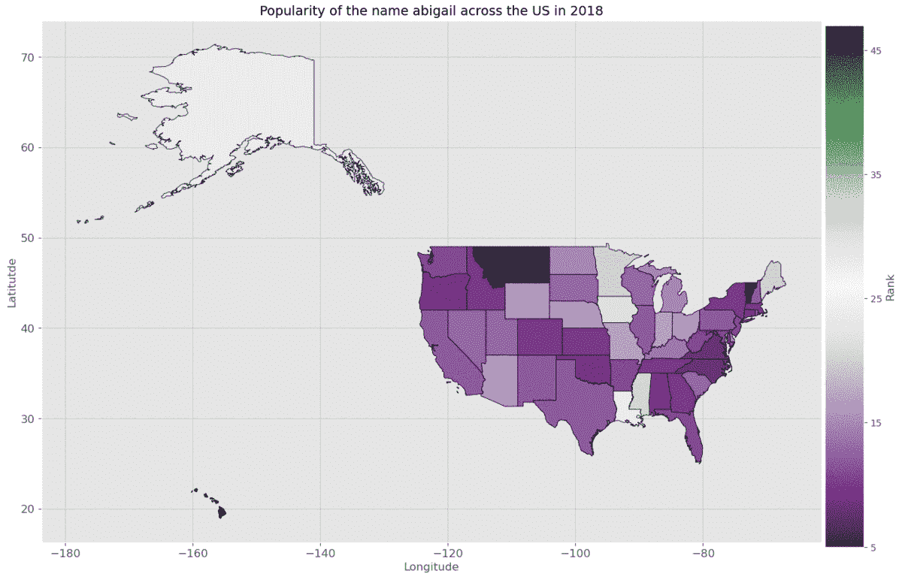

2018 年十大女名人气(图片鸣谢:作者)

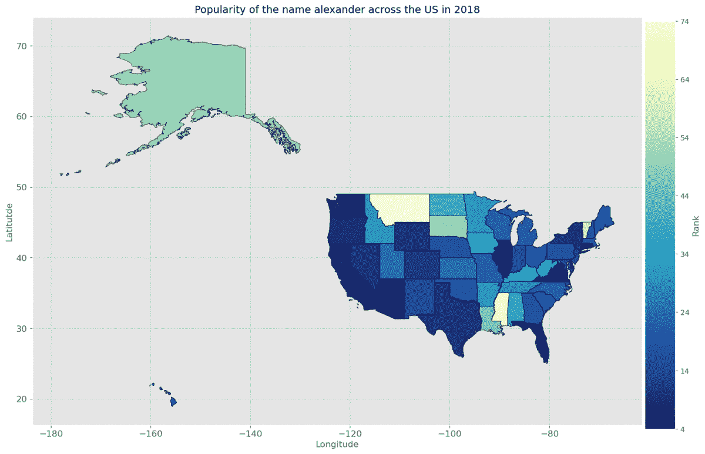

2018 年十大男性名字人气(图片鸣谢:作者)

## 5)名称的长度

我想知道男孩的名字是否比女孩短。所以我把名字长度绘制成直方图。似乎女孩的名字比男孩稍长，大多数名字大约有 5 个字母长。

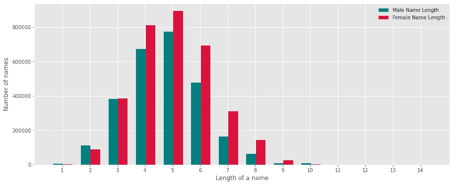

过去 100 年的名称长度(图片来源:作者)

## 6)名字的最后一个字母是元音

我有一种奇怪的感觉，女孩的名字往往以元音结尾，而男孩却没有。为了测试这一点，我绘制了一个饼图。我的假设是正确的。女孩的名字大多以元音结尾，尤其是“a”和“e ”,而男孩的名字大多以“e”或“o”结尾。

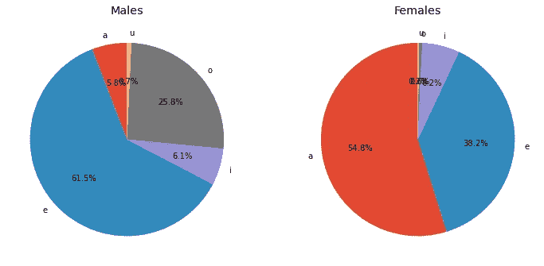

以元音结尾的姓名百分比(图片来源:作者)

# 从名字预测性别

好了，现在让我们开始有趣的东西。机器能从名字预测性别吗？为了帮助它，我根据从数据探索中获得的见解设计了一些功能。

## 1)特征工程

**将名称转换成 ASCII 值**

名字是专有名词，我真的不想遵循语义的方法。相反，我将名称中的每个字母转换成它的 ASCII 值，并计算每个名称的平均 ASCII 值。

```
ascii_mean('Albert')
>>> 100.33333333333333ascii_mean('Amelia')
>>> 97.5
```

**名称的长度**

我创建了一个包含每个名字长度的新特性，即每个名字的字母总数。

**元音和辅音的数量**

我假设，一般来说，女孩的名字中有更多的元音，而男孩有更多的辅音。为了量化这个假设，我创建了两个额外的特征——一个名字中元音和辅音的数量

**姓名的最后一个字母**

假设是女孩的名字比男孩的名字更可能以元音结尾。为了量化这种信念，我创建了一个具有二进制值的特性——如果一个名字的最后一个字母是元音字母，则为 1，否则为 0。

有了这 4 个特征，我想让我的二元分类器把名字分为“男”类或“女”类。

> (这是一个纯粹基于数据可用性的 2 类问题。数据集仅识别了这两种性别)

## 2)从名字中分类性别

我建立了两个非常简单的模型——一个逻辑回归分类器和一个支持向量分类器。我按照 70:30 的比例将数据分为训练集(24245 个名字)和测试集(10392 个名字)。

> 我感兴趣的是构建一个没有过多修饰、没有过多超参数调整的模型。所以我完全避免创建验证集。其目的是做有趣的，不严肃的预测！

**逻辑回归分类器**

逻辑回归模型具有 67.8%的灵敏度(或回忆)和大约 68.3%的特异性，这相对好于随机预测。预测女性的准确率为 76%，预测男性的准确率为 58%。

这意味着，尽管该模型可以在 68%的情况下正确预测性别，但它在预测女性时比男性犯的错误要少得多。

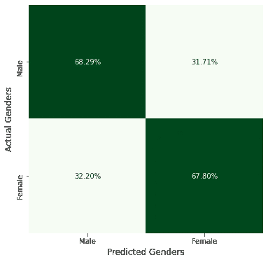

**支持向量分类器**

具有线性核的 SVC 给出了比逻辑回归模型更低的灵敏度(64.5%)。特异性为 72.5%，优于以前的模型。预测女性的准确率接近 78%，预测男性的准确率为 57%。

换句话说，SVC 可以正确地预测一个名字属于男性，比预测一个名字属于女性要好得多。但是，与预测男性相比，预测女性的错误要少得多。

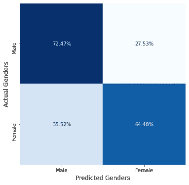

# 我对机器


图片提供:【https://gph.is/g/aQQ9R9V 

现在真正的考验来了——我能比我建造的机器更好地预测性别吗？？

为了找到答案，我从数据集中随机选择了 10 个名字(*当然掩盖了他们的性别*)，并让我自己与训练过的机器进行对抗。

游戏结果如下所示—

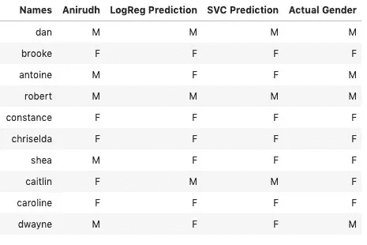

玩家的表现可以通过一系列问题来理解—

**Q1:当名字实际上属于女性的时候，玩家正确 *(*** *专业术语:回忆或者敏感* ***)* ？**

我:83%的时间

机器(两者):83%的时间

**Q2:当玩家预测一个名字为女性时，玩家正确的几率有多大****专业术语:精度* ***)* ？***

*我:100%的时间*

*机器(两者):71%的时间*

***Q3:当名字实际上属于男性的时候，玩家正确 *(*** *用专业术语来说:回忆或者敏感* ***)* ？***

*我:100%的时间*

*机器(两者):50%的时间*

***Q4:当玩家预测一个名字为男性时，玩家正确 *(*** *用专业术语来说:精度* ***)* 的几率有多大？***

*我:80%的时间*

*机器(两者):67%的时间*

# ***谁赢了？？你决定吧。***

**原来如此！**

*对我来说，这是一个快速而有趣的项目，让我学到了许多有趣的概念。我希望你喜欢它，并欢迎任何改进或调整模型的意见！*

*再见！*