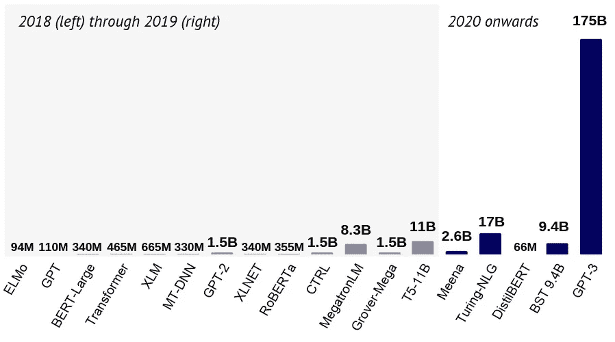
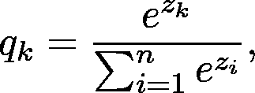
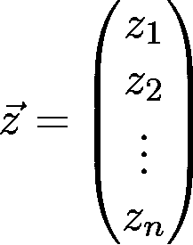
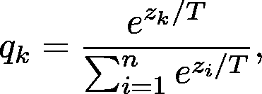
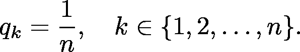
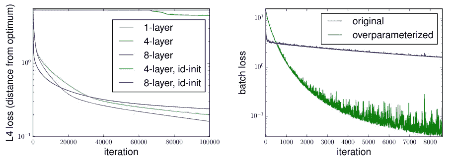
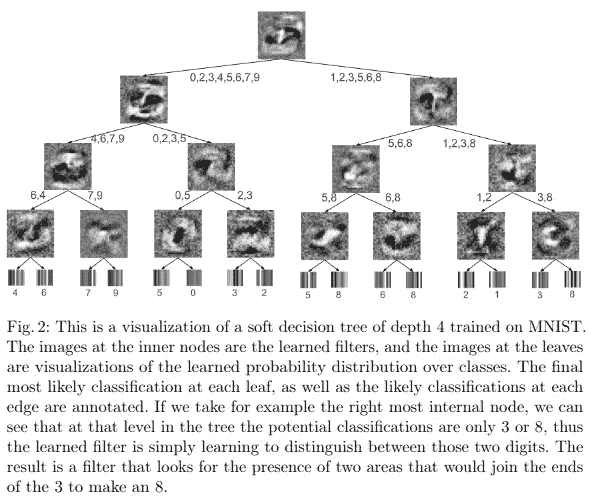
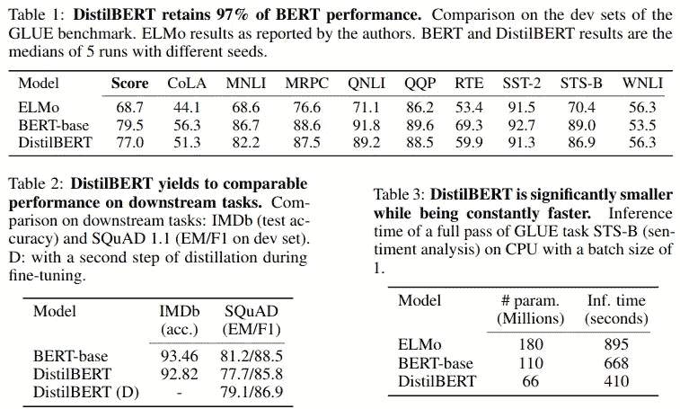

# 一个神经网络可以训练其他网络吗？

> 原文：<https://towardsdatascience.com/can-a-neural-network-train-other-networks-cf371be516c6?source=collection_archive---------18----------------------->

## 知识提炼导论

如果你曾经使用过神经网络来解决一个复杂的问题，你就会知道它们的规模可能是巨大的，包含数百万个参数。例如，著名的伯特模型大约有 1.1 亿英镑。

为了说明这一点，这是 NLP 中最常见架构的参数数量，正如最近由[内森·贝纳奇](https://www.twitter.com/nathanbenaich)和[伊恩·霍加斯](https://www.twitter.com/soundboy)撰写的《2020 年人工智能报告的[状态》中所总结的。](https://www.stateof.ai/)

给定架构中的参数数量。资料来源:【2020 年人工智能状况报告作者[内森·贝纳奇](https://www.twitter.com/nathanbenaich)和[伊恩·霍加斯](https://www.twitter.com/soundboy)

在 Kaggle 竞赛中，获胜者模型通常是由几个预测器组成的集合。虽然它们在精确度上可以大幅度击败简单模型，但它们巨大的计算成本使它们在实践中完全无法使用。

有什么方法可以在不扩展硬件的情况下，利用这些强大而庞大的模型来训练最先进的模型？

目前，在保持预测性能的同时压缩神经网络有三种主要方法:

*   [*权重修剪*](/can-you-remove-99-of-a-neural-network-without-losing-accuracy-915b1fab873b) ，
*   [*量化*](/how-to-accelerate-and-compress-neural-networks-with-quantization-edfbbabb6af7) ，
*   和*知识的升华*。

在这篇文章中，我的目标是向你介绍*知识提炼*的基本原理，这是一个令人难以置信的令人兴奋的想法，建立在训练一个更小的网络来接近大网络的基础上。

# 什么是知识蒸馏？

让我们设想一个非常复杂的任务，比如对几千个类进行图像分类。通常情况下，你不能简单地使用 ResNet50 并期望它达到 99%的准确率。所以，你建立了一个模型集合，平衡了每个模型的缺陷。现在你有了一个庞大的模型，尽管它表现出色，但没有办法将其部署到生产中并在合理的时间内得到预测。

然而，该模型对看不见的数据进行了很好的概括，因此可以放心地相信它的预测。(我知道，情况可能不是这样，但现在让我们开始思想实验吧。)

如果我们使用来自庞大而笨重的模型的预测来训练一个更小的，所谓的*学生*模型来逼近大模型，会怎么样？

这实质上是知识的提炼，在 Geoffrey Hinton、Oriol Vinyals 和 Jeff Dean 的论文[中介绍了这一点。](https://arxiv.org/abs/1503.02531)

大致来说，这个过程如下。

1.  训练一个执行和概括都非常好的大型模型。这就是所谓的*教师模型*。
2.  利用你所有的数据，计算教师模型的预测。包含这些预测的总数据集被称为*知识、*，预测本身通常被称为*软目标*。这是*知识提炼*步骤。
3.  利用之前获得的知识训练较小的网络，称为*学生模型*。

为了形象化这个过程，您可以考虑以下内容。

知识升华(图片由作者提供)

让我们稍微关注一下细节。知识是如何获得的？

在分类器模型中，类别概率由一个 *softmax* 层给出，将 [*逻辑*](https://en.wikipedia.org/wiki/Logit) 转换成概率:

在哪里

是由最后一层产生的逻辑。代替这些，使用稍微修改的版本:

其中 *T* 是一个称为*温度*的超参数。这些值被称为*软目标*。

如果 *T* 较大，则类概率“较软”，即它们之间的距离会更近。在极端情况下，当 *T* 接近无穷大时，

如果 *T = 1* ，我们得到 softmax 函数。出于我们的目的，温度被设置为高于 1，因此命名为*蒸馏*。

Hinton、Vinyals 和 Dean 表明，一个经过提炼的模型可以和由 10 个大型模型组成的集合表现得一样好。

知识提取由 Geoffrey Hinton、Oriol Vinyals 和 Jeff Dean 撰写的论文[在神经网络中提取知识](https://arxiv.org/abs/1503.02531)中的一个语音识别问题

## 为什么不一开始就培养一个小网络呢？

你可能会问，为什么不从一开始就训练一个更小的网络呢？不是更容易吗？当然，但是它不一定会起作用。

经验证据表明，更多的参数导致更好的泛化和更快的收敛。例如，Sanjeev Arora、Nadav Cohen 和 Elad Hazan 在他们的论文《深度网络的优化:过度参数化的隐式加速》中对此进行了研究。

左图:单层网络与 4 层和 8 层线性网络。右图:使用张量流教程的 MNIST 分类的过度参数化与基线模型。来源:[深度网络优化:过度参数化的隐式加速](https://arxiv.org/abs/1802.06509)作者:Sanjeev Arora、Nadav Cohen 和 Elad Hazan

对于复杂的问题，简单的模型很难在给定的训练数据上进行很好的归纳。然而，我们拥有的不仅仅是训练数据:教师模型对所有可用数据的预测。

这对我们有两方面的好处。

首先，教师模型的知识可以教会学生模型如何通过训练数据集之外的可用预测进行归纳。回想一下，我们使用教师模型对所有可用数据的预测**来训练学生模型，而不是原始的训练数据集。**

第二，软目标提供了比类别标签更多的有用信息:**表示两个类别是否相似** *。*例如，如果任务是对狗的品种进行分类，那么像*“柴犬和秋田犬非常相似”*这样的信息对于模型的泛化非常有价值。

左:秋田犬。右图:柴犬。来源:维基百科

# 迁移学习的区别

正如 [Hinton et al.](https://arxiv.org/pdf/1503.02531.pdf) 所指出的，通过转移知识来压缩模型的最早尝试之一是重用经过训练的集合的某些层，正如 [Cristian Bucilu、Rich Caruana 和 Alexandru Niculescu-Mizil 在他们 2006 年题为“模型压缩](https://dl.acm.org/doi/10.1145/1150402.1150464)的论文中所做的那样。

用 Hinton 等人的话说，

> “…我们倾向于用学习到的参数值来识别训练模型中的知识，这使得我们很难看到如何改变模型的形式，但保持相同的知识。对知识的一个更抽象的观点是，它是从输入向量到输出向量的一种习得性映射，这种观点将知识从任何特定的实例化中解放出来。”— [在神经网络中提取知识](https://arxiv.org/pdf/1503.02531.pdf)

因此，与迁移学习相反，知识提炼不直接使用学习到的权重。

# 使用决策树

如果您想进一步压缩模型，可以尝试使用更简单的模型，如决策树。虽然它们的表达能力不如神经网络，但它们的预测可以通过单独查看节点来解释。

这是由 Nicholas Frosst 和 Geoffrey Hinton 完成的，他们在论文[中将神经网络提取为软决策树](https://arxiv.org/abs/1711.09784)中对此进行了研究。

来源:[将神经网络提取为软决策树](https://arxiv.org/abs/1711.09784)

他们表明提取确实有一点帮助，尽管甚至更简单的神经网络也胜过它们。在 MNIST 数据集上，提取的决策树模型达到了 96.76%的测试准确率，这比基线 94.34%的模型有所提高。然而，一个简单的两层深度卷积网络仍然达到了 99.21%的准确率。因此，在性能和可解释性之间有一个权衡。

# 蒸馏伯特

到目前为止，我们只看到了理论结果，而没有看到实际例子。为了改变这一点，让我们考虑一下近年来最流行和最有用的模型之一:BERT。

最初发表在 Google 的 Jacob Devlin 等人的论文 [BERT:用于语言理解的深度双向转换器的预训练](https://arxiv.org/abs/1810.04805)中，它很快被广泛用于各种 NLP 任务，如文档检索或情感分析。这是一个真正的突破，推动了几个领域的技术发展。

然而，有一个问题。BERT 包含约 1.1 亿个参数，需要大量时间来训练。作者报告说，训练需要 4 天，在 4 个吊舱中使用 16 个 TPU 芯片。按照[目前可用的 TPU pod 每小时价格](https://cloud.google.com/tpu/pricing#pod-pricing)计算，培训成本将在 10000 美元左右[，还不包括碳排放等环境成本](https://www.technologyreview.com/2019/06/06/239031/training-a-single-ai-model-can-emit-as-much-carbon-as-five-cars-in-their-lifetimes/)。

通过[拥抱脸](https://huggingface.co/)成功尝试了减少 BERT 的大小和计算成本。他们使用知识提炼来训练 DistilBERT，它的大小是原始模型的 60%，速度快 60%，并保持了 97%的语言理解能力。

蒸馏器的性能。来源:[蒸馏伯特，伯特的蒸馏版本:更小、更快、更便宜、更轻](https://arxiv.org/abs/1910.01108)作者:维克多·桑、弗拉达利·佩登、朱利安·肖蒙德、托马斯·沃尔夫

较小的架构需要更少的时间和计算资源:在 8 个 16GB V100 GPUs 上运行 90 小时。

如果你对更多细节感兴趣，你可以阅读原文 [DistilBERT，一个 BERT 的蒸馏版本:更小，更快，更便宜，更轻](https://arxiv.org/abs/1910.01108)，或者总结文章是其中一位作者写的。这是一个奇妙的阅读，所以我强烈建议你这样做！

 [## 🏎更小，更快，更便宜，更轻:介绍伯特，伯特的精华版本

### 你可以在这里找到代码来重现呆伯特的训练以及呆伯特的预训练权重。

medium.com](https://medium.com/huggingface/distilbert-8cf3380435b5) 

# 结论

知识提炼是压缩神经网络并使其适用于功能较弱的硬件的三种主要方法之一。

与权重剪枝和量化这两种强大的压缩方法不同，知识提取并不直接减少网络。相反，它使用原来的模型来训练一个更小的模型，叫做*学生模型*。由于教师模型甚至可以对未标记的数据进行预测，因此学生模型可以学习如何像教师一样进行归纳。

在这里，我们已经看到了两个关键的结果:最初的论文，介绍了这个想法，以及后续的，表明简单的模型，如决策树，可以用作学生模型。

如果您对该领域的更广泛概述感兴趣，我推荐下面这篇文章，它就发表在这里的《走向数据科学》:

 [## 知识蒸馏——穿越时间的调查

### 通过这个博客，你将回顾知识蒸馏(KD)和六篇后续论文。

towardsdatascience.com](/knowledge-distillation-a-survey-through-time-187de05a278a) 

[***如果你喜欢把机器学习概念拆开，理解是什么让它们运转，我们有很多共同点。看看我的博客，我经常在那里发表这样的技术文章！***](https://www.tivadardanka.com/blog)

 [## 如何用量化加速和压缩神经网络

### 从浮点数到整数

towardsdatascience.com](/how-to-accelerate-and-compress-neural-networks-with-quantization-edfbbabb6af7)  [## 你能移除 99%的神经网络而不损失准确性吗？

### 权重剪枝简介

towardsdatascience.com](/can-you-remove-99-of-a-neural-network-without-losing-accuracy-915b1fab873b)