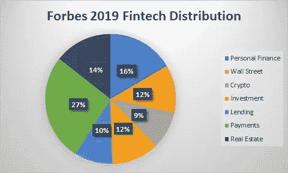
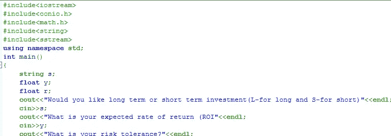

# 人工智能如何帮助金融科技算法管理你的财务？

> 原文：<https://towardsdatascience.com/can-ai-facilitate-fintech-algorithm-to-manage-your-finances-2c11a1afec74?source=collection_archive---------53----------------------->

## “小心小开支。一个小漏洞能使一艘大船沉没。”——本杰明·富兰克林

Austin Distel 在 Unsplash 上拍摄的照片

根据 GoBanking Rules 2019 年的一项调查，约 70 %的美国人储蓄不足 1000 美元。调查还显示，甚至有 45 %的人根本没有存款或证券。这些数字是从一项调查中反映出来的，当时*美国*经济强劲，由于新冠肺炎疫情的高失业率，这一数字可能会增加。

人工智能(AI)和对金融领域的理解的一致新兴趋势，可以为努力优化其货币目标的个人创造机会。机器学习技术可以识别漏洞，并产生最大化个人财富的意识。有效地管理自己的收入和支出是走向财务自由的第一步。不幸的是，大多数个人甚至公司都在努力优化他们的财富管理，并经常在金融危机期间宣布破产。技术已经意识到这种新兴的需求，并通过有效设计的算法为个人和公司提供了改善其财务活动的空间。

正如俗话所说*“小心小开支。一个小漏洞能使一艘大船沉没。*

克里斯·里德在 Unsplash 上拍摄的照片

# 什么是 Fintech？

*Fintech* 是科技与金融领域的新兴合作产业。首要目标是创新和改进传统的财务方法。它应用于保险、银行、股票交易，甚至企业项目的风险分析和管理。最受欢迎的金融科技应用之一是移动银行和支付。这个选项允许个人以更方便和更快的速度进行金融交易。它被认为是个人使用第三多的移动应用程序。

根据 statista.com 的数据，截至 2020 年 2 月，北美约有 8775 家金融科技初创公司。这是从 2019 年起 ***大约 52%的增量*** 。技术和金融是最受欢迎的领域，因此两者之间的合作可以创造新的机会。在地理领域的采用中发挥主要作用的一些因素包括互联网可用性和金融科技公司对其网络安全的信任。

金融科技公司的各个类别包括:*个人金融、华尔街、投资、借贷、房地产、加密和区块链以及支付选项。*

福布斯 2019 金融科技公司资金分布【数据来源:Forbes 2019/Fintech】

该饼图显示了金融科技公司各个类别的资金分布情况。最高的大多偏向支付选项，加密货币最少。*在积累资金方面，crypto 落后于*的原因是因为(I)它是一个相对较新的概念，(ii)价格波动，(iii)政府管制对自由大规模渗透到主流交易中的障碍。*支付*专业的金融科技公司设计算法来监管现金流分析。*房地产*金融科技平台(fintech platforms)作为一个自动借贷平台，提供了识别房地产合格投资者的机会。*投资* fintech 应用程序通过分析个人客户的财务目标和风险承受能力，提供资产管理方面的 rob-advisors。

# 人工智能在金融科技中的作用

照片由 Unsplash 上的 David Shares 拍摄

人工智能算法可以发挥预测作用，以改善个人或大公司的资产管理。它可以跟踪导致客户债务组合增加的显著和经常性支出。金融数据管理对于预测经济的未来至关重要。AI 算法可以通过智能编程处理这些大的金融数据，预测客户投资策略。这些数据也可以用来预测欺诈活动。

**机器学习在财富管理中的应用**

*第一步*

机器学习可以在优化投资组合选择中发挥关键作用。在量化投资组合管理中，人工智能可以调查驱动因素，如跨多样化投资组合的分析、历史数据、股权价值、风险管理和其他关键驱动因素。数学模型可以从这样的数据管理中发展出来。

*第二步*

风险管理是投资组合管理的一个重要因素，因此人工智能可以帮助识别多样化的股票并分配比例权重以最小化风险。

*第三步*

确定单个投资组合的时间表和风险水平。根据可用数据进行预测分析

*第四步*

改变变量，以确定能产生最佳 ROI(投资回报)的理想投资组合。

**使用人工智能进行客户投资组合管理的示意原型**

智能人工智能驱动的投资组合管理设计的定量算法相对复杂。网络安全方面也成为需要纳入设计的重要参数。但是，我们采用了一种方法来显示客户财富管理的拟议用户界面和示意流程图设计的简要概述。

移动或桌面用户界面(UI)是需要仔细设计的主要目标，以确保客户参与应用程序或平台。用户登录和密码加密是确保客户隐私和数据安全的一部分。

本杰明·罗宾·叶斯柏森在 Unsplash 上的照片

为了为你的客户获得满足他们期望的最佳投资组合，充分理解他们的期望是至关重要的。这通常包括一系列问卷调查，旨在更好地了解你的客户。这些问题可能包括一些细节，例如:你的客户的目标是长期投资(至少一年)还是短期投资(3 个月)。你的客户愿意投资的最大金额，风险承受能力，例如，如果客户的风险承受能力较低，更安全的选择如政府债券(是首选)，或者对于更高的风险承受能力，投资者可以选择华尔街投资(高风险高回报)。需要理解风险回报概念，并且应该对算法进行编码，以最好地定制风险回报预期。

下面的 c++代码可以简要概述客户和金融科技平台之间关于投资组合管理的预期查询。

关于客户投资组合管理的基本查询的 C++代码

**蒙特卡罗树搜索(MCTS)** 是 AI 驱动的概率算法。它包括分析不同的选项，以找到一个比当前操作更优化的选项。MCTS 算法在其学习阶段(机器学习)评估备选策略，并确定它是否比以前或现在的交易提供更好的回报。这种技术已经应用于模拟游戏环境，但应用于金融领域时，可以提供更好的预测结果。

# 结论

回答题目上的第一个问题，是绝对的**是的**。人工智能在金融领域的集成可以持续显示出改进的性能。机器学习提供了对大量金融数据更快的评估和执行。与人工交互相比，它耗时相对较少，并且可以以更高的准确度处理大多数数据。金融科技初创公司表现出更快的增长率，这表明市场对该技术的需求正在上升。

**参考文献**

[1]帕特里克·舒费尔(2016)。驯服野兽:金融科技的科学定义。创新管理杂志。第 32-54 页

[2]梁家杰和宋(2018 年)。FinTech(金融科技):什么是 fintech，如何利用技术以 fin tech 的方式创造商业价值？。*国际创新、管理与技术杂志*， *9* (2)，74–78。

[3]卡尔卡特拉，卡尔，W. A .，&拉奥，V. K. (2019)。稳定的加密货币-一阶原理。*可在 SSRN 3402701* 处获得。

[4]刘，刘春明，戴德思，2020 .量化交易中基于组合优化的长短期记忆网络股票预测。*应用科学*， *10* (2)，437 页。

[5]法博齐，F.J 投资管理的理论与实践:资产配置、估价、投资组合构建和策略，第 2 版。；约翰·威利父子公司:美国新泽西州霍博肯，2011 年；第 198 卷，第 289-290 页。

[5]露西娅，R. J. (2012 年)。*美国专利申请号 12/957，211* 。