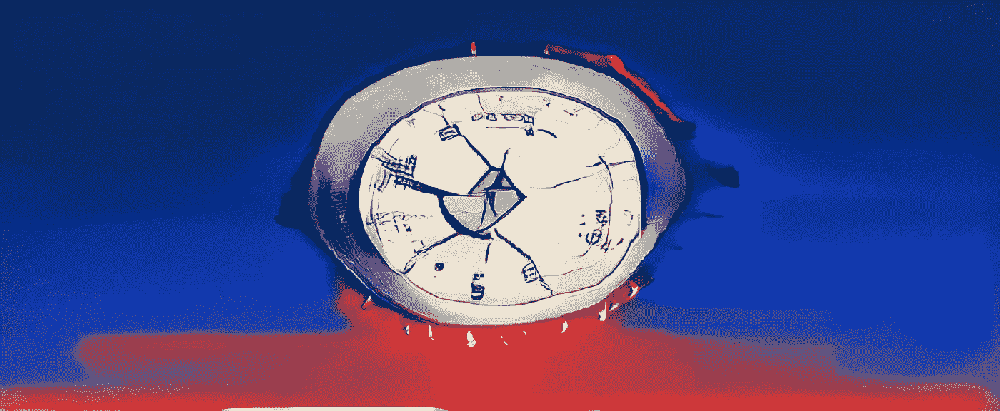
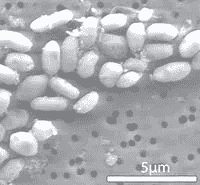
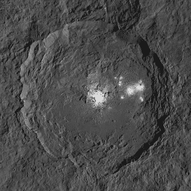

# AI 能找到 ET 吗？

> 原文：<https://towardsdatascience.com/can-ai-find-et-eb752c1737e5?source=collection_archive---------38----------------------->

## 人为因素是一个重大障碍。

图片作者:Merzmensch

2010 年 12 月。美国宇航局的紧急电话。关于一项可能颠覆我们对宇宙生命的所有概念的重大发现的新闻发布会。社交媒体上充斥着关于即将到来的不明飞行物和绿人的谣言:

> 美国宇航局将于美国东部时间 12 月 2 日周四下午 2 点举行新闻发布会，讨论一项天体生物学**发现，该发现将影响对外星生命证据的搜寻**。([来源](https://www.nasa.gov/home/hqnews/2010/nov/HQ_M10-167_Astrobiology.html))

数百万人盯着电视屏幕和直播。因此，美国国家航空航天局首先介绍了上个世纪最具革命性的科学发现。

> “生命的定义刚刚扩大了”,美国宇航局科学任务理事会副主任埃德·魏勒说。“当我们继续努力寻找太阳系中的生命迹象时，我们必须更广泛、更多样化地思考，并考虑我们不了解的生命。”([来源](https://www.nasa.gov/home/hqnews/2010/dec/HQ_10-320_Toxic_Life.html))

**GFAJ-1(来源:**[**NASA**](https://www.nasa.gov/home/hqnews/2010/dec/HQ_10-320_Toxic_Life.html)**)**

这是他们的发现。**菌株 GFAJ-1** ，γ原生菌。一种微生物。住在加州砷莫诺湖。在一个普通生物无法生存的湖中。

> “我们知道一些微生物可以呼吸砷，但我们发现的是一种**微生物正在做一些新的事情** — **用砷**构建自身的一部分，”Felisa Wolfe-Simon 说，他是美国宇航局天体生物学研究员，在加利福尼亚州门洛帕克的美国地质调查局常驻，也是该研究小组的首席科学家。“如果地球上有什么东西能做出如此出人意料的事情，那么生命还能做什么我们还没见过的事情呢？”([来源](https://www.nasa.gov/home/hqnews/2010/dec/HQ_10-320_Toxic_Life.html))

 [## “砷虫”的发现扩大了生命的定义

### 2010 年 12 月 2 日:美国国家航空航天局支持的研究人员发现了地球上第一个已知的微生物能够茁壮成长和…

science.nasa.gov](https://science.nasa.gov/science-news/science-at-nasa/2010/02dec_monolake) 

很快，失望的声音似乎溢出了溪流。公众感到被愚弄了，因为他们没有看到双头外星人。其他科学家正试图揭穿这一发现。《石板》以“[这篇论文本不该发表](https://slate.com/technology/2010/12/the-nasa-study-of-arsenic-based-life-was-fatally-flawed-say-scientists.html)”为题总结了所有这些说法*电影之火荒谬。”*致命缺陷。

[**Wired** 对批评](https://www.wired.com/2011/03/arsenic-paper-reviewer-cant-see-out-of-ivory-tower/)进行了评估，并在争论中发现了许多不一致之处，其主要目标似乎是平息围绕这一发现的炒作。

因为核心信息仍未被听到:

> [生命的定义扩大了](https://science.nasa.gov/science-news/science-at-nasa/2010/02dec_monolake)。

这确实意味着:我们以前对生命和生命友好环境的概念是狭隘的，只与我们知道的东西有关。科学保守主义，作为对投机和江湖骗子的防御措施，使科学对新方法视而不见。

回想一下，几个世纪前，学术界的同事嘲笑让·弗朗索瓦·商博良的断言，那些装饰性的古埃及图片和装饰品是书面语言，而不仅仅是一些仪式符号，这是众所周知的！

## 人工智能寻找外星生命？

十年后，我们有了新的问题。我们从事深度学习是为了科学需求:疾病检测([电晕任何人](https://qz.com/1791222/how-artificial-intelligence-provided-early-warning-of-wuhan-virus/)？)，模式探测，现在——寻找外星生命形式。

但这是主要的障碍。

> 今天，我们生活在人工智能在许多科学和技术应用中的使用激增的时代，包括寻找外星智能(SETI)。然而，**人类感知**和**决策**仍然是任何数据分析或解释结果或结果*的最后一环——加布里埃尔 G .德拉托雷**在他的论文***[中写道:“人工智能会梦到非地球的技术签名](https://www.sciencedirect.com/science/article/abs/pii/S009457651931392X?dgcid)？”

这就是问题所在。

> 甚至计算机也可能倾向于将形状识别为外星文明的证据[…]——然后人类可能会被欺骗而相信它们是真实的— [*独立*](https://www.independent.co.uk/life-style/gadgets-and-tech/news/aliens-nasa-found-ai-mars-jupiter-planet-artificial-intelligence-a9307511.html) 写道。

加百利·g·德拉托雷和加的斯大学**的其他科学家进行的一项研究证明了这种情况:**

奥卡托尔，谷神星上的一个[陨石坑](https://apod.nasa.gov/apod/ap150916.html)有不寻常的形成和亮点，来源:[美国宇航局](https://en.wikipedia.org/wiki/Occator_(crater)#/media/File:PIA20350_crop_-_Occator_from_LAMO.jpg)

1.  **Occator 上的神秘建筑**被剪短给人类和 AI
2.  **人类**探测到*几何图形*和*正方形*
3.  **AI** (训练正方形和三角形)找到*三角形*
4.  在人工智能的结果展示给人类之后，他们倾向于像以前一样看到更多的三角形。他们现在受人工智能结果的影响。

这些实验表明了以下问题:

*   在特定数据库上训练的人工智能只检测与训练数据一致的模式(=重新认知)
*   人类受到高度影响；此外，他们更有可能相信人工智能的感知(=反馈偏差)

简而言之，如果我们使用人工智能来检测不寻常的模式和形成，我们不能依赖我们的人类感知。我们也不能依赖人工智能，如果它在人类准备的特定数据库中接受训练(这意味着识别已知模式)。

寻找其他外星生命形式时，我们无法记住自己众所周知的生物概念和生存策略。我们必须换一种方式思考。

## 让熟悉变得陌生

我们应该改变我们的思维模式。

> 让熟悉变得陌生。

这是来自麻省理工学院人类学和科学史专业学生克莱尔·韦伯的建议，被 Space.com 引用在一篇标题为:

> 为了找到智慧的外星生命，人类可能需要开始像外星人一样思考。

我们应该防止路灯效应。我们应该**想出这个框**——这个现在流行的词的原意。

而如果我们应用 AI，正确的方式应该是什么，你觉得呢？

*   让深度学习以未知的方式蓬勃发展？
*   在偏差减少的数据库上进行无监督学习？
*   用完全不同的思维方式来感知人工智能的结果？

我们如何才能让人工智能像人类一样思考——而不仅仅是以更好的计算方式？但是以新人工智能视觉的方式？

我们正面临着感知的新时代，它在许多方面不同于传统的时代。因为:**感知是一种约定俗成的东西**，对文化或全球心态有偏见和影响。就像我们的人工智能模型在数据集上被训练，被人类贴上了糟糕的标签。

灵感来自[周刊 AI 摘要](https://medium.com/all-things-machine-learning/what-happened-in-ai-ml-this-week-31st-jan-2020-3cb562c1f3db)作者[里士满阿拉克](https://medium.com/u/88797ba3f2f6?source=post_page-----eb752c1737e5--------------------------------)。