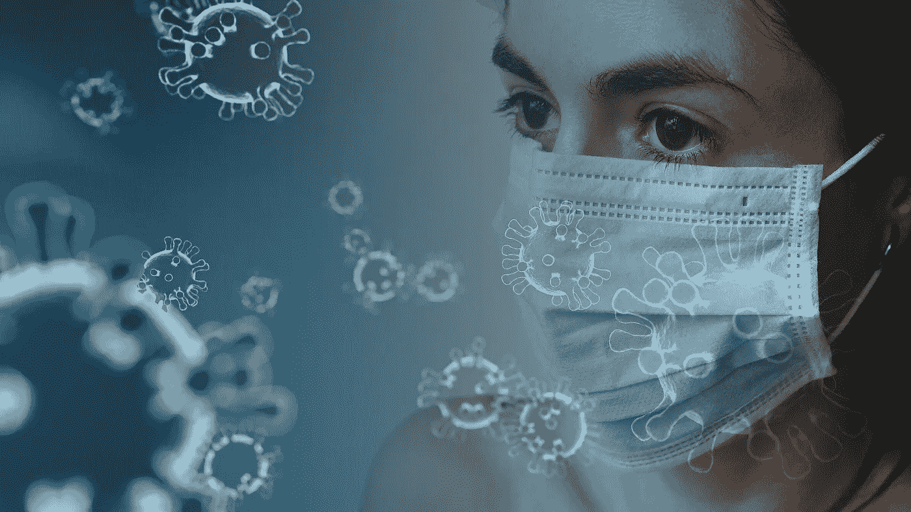
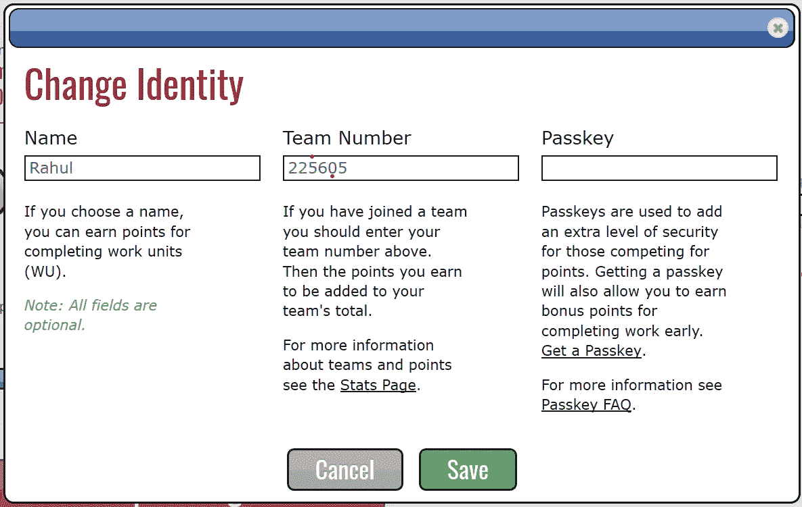
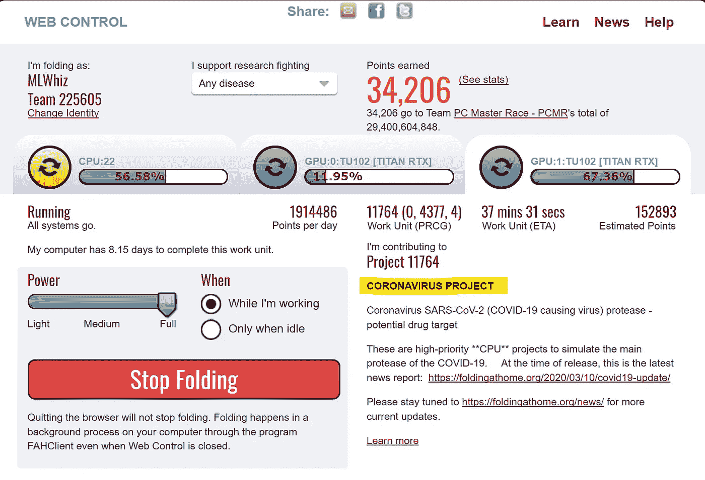
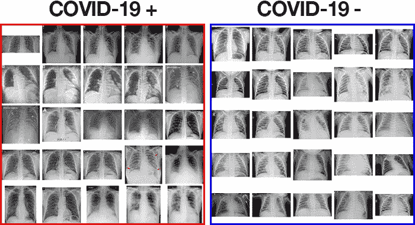

# AI 能帮助对抗电晕吗？

> 原文：<https://towardsdatascience.com/can-ai-help-in-fighting-against-corona-72cdb9c4e2e0?source=collection_archive---------43----------------------->

图片来自 [Pixabay](https://pixabay.com/?utm_source=link-attribution&utm_medium=referral&utm_campaign=image&utm_content=4914026) 的[图米苏](https://pixabay.com/users/Tumisu-148124/?utm_source=link-attribution&utm_medium=referral&utm_campaign=image&utm_content=4914026)

## 在这个艰难的时刻，呼吁数据专业人员采取行动

感到无助？我知道我是。

随着整个关闭的情况，我认为曾经是我内向的自我的天堂，当它实际发生时，看起来并不那么好。

我真的无法想象在家里呆多久。这种无能为力的无助感于事无补。

老实说，我很想在这种可怕的情况下提供更多帮助，但这里有一些小想法，我们作为人工智能从业者和数据科学家可以有所帮助。

# 捐赠你的计算能力

NVIDIA 正在要求游戏玩家捐赠他们的计算能力来支持 folding@home。

我想说的是 ***我们数据科学家手头肯定有基础设施在这方面提供帮助。***

我们只需点击几下鼠标就可以完成很多事情。这有点像即时的满足感，但总比什么都不做好。

你只需要在这里下载并安装他们的软件[。我为我的 windows 系统下载了](https://foldingathome.org/alternative-downloads/)[fah-installer _ 7 . 5 . 1 _ x86 . exe](https://download.foldingathome.org/releases/public/release/fah-installer/windows-10-32bit/v7.5/fah-installer_7.5.1_x86.exe)文件。你也可以为 MAC 和 Linux 下载它。如果你没有图形处理器，你也可以帮助 CPU 资源。

当被问及“自定义安装”或“快速安装”时，我选择了推荐的选项“快速安装”。你可以给团队“电脑大师赛-PCMR”编号 225605。您可以将密钥保留为空，或者如果您想要跟踪您所做的工作，您可以获得一个密钥。

还可以控制捐赠给事业的系统资源。如果您不使用任何大量的计算，我建议您使用 full。我捐赠了我的两个 GPU 和 CPU。到目前为止，我已经能够捐赠大约 3 个工作单位。

# 想出新颖的方法来帮助

引起很多关注的一件事是缺乏适当的测试程序。例如，在英国，目前的建议是，由于缺乏测试，在出现轻微感冒症状时进行自我隔离。此外，由于缺乏测试，许多数字并不完全可靠，可能是错误的。

[来源](https://www.pyimagesearch.com/2020/03/16/detecting-covid-19-in-x-ray-images-with-keras-tensorflow-and-deep-learning/)

所以当我看到 Adrian Rosebrock 的博客时，我感到惊喜，他试图使用新冠肺炎 X 射线[图像数据集](https://github.com/ieee8023/covid-chestxray-dataset)(由[Joseph Cohen](https://josephpcohen.com/w/)**)**以及来自 [**Kaggle 胸部 X 射线图像(肺炎)数据集**](https://www.kaggle.com/paultimothymooney/chest-xray-pneumonia) 的正常 X 射线图像来创建一个自动新冠肺炎探测器。

至于结果，他们看起来很有希望:

> 正如您从上面的结果中看到的，我们的自动新冠肺炎检测机仅基于 X 射线图像(没有其他数据，包括地理位置、人口密度等)在我们的样本数据集上获得了大约 90–92%的准确率。用来训练这个模型。我们也获得了 100%的灵敏度和 80%的特异性

这些结果太棒了。100%的灵敏度意味着能够捕捉到所有的积极因素。并且它可以被用作电晕的初步测试。但是，我不确定这些 X 射线是在哪个阶段拍摄的，因为这也将发挥重要作用。你可以在 [pyimagesearch](https://www.pyimagesearch.com/2020/03/16/detecting-covid-19-in-x-ray-images-with-keras-tensorflow-and-deep-learning/) 上查看详细帖子。他提到的*缺乏数据，这在这个时间点上是完全可以理解的。但是，如果这种方法可行，并与手头的其他变量一起工作，它可能有助于检测日冕。*

> *我们能想出其他新颖的方法来帮助那些需要帮助的人吗？*

# *通过数据传播意识，缓解谣言*

*处理数据的一个好处是我们养成了理解各种偏见的习惯。许多数据科学家同事一直在做的另一件重要的事情是创造意识和唤起不同的偏见。*

*我特别喜欢这篇由 fast.ai 创始人*杰瑞米·霍华德和雷切尔·托马斯发表的[帖子](https://www.fast.ai/2020/03/09/coronavirus/)，它提供了关于冠状病毒的数据科学观点。**

*此外，请仔细阅读 Cassie Kozyrkov 的这篇文章，它讨论了围绕 Corona 的各种偏见，并试图对整个情况采取假设检验的方法。我特别喜欢她帖子中的这一部分:*

> *如果没有相关信息，继续做你计划要做的事情。当不同的动作被触发时，执行它。*

* [## 更明智的新冠肺炎决策

### 如何将决策科学的合理原则应用于疫情

towardsdatascience.com](/smarter-covid-19-decision-making-39dbff2ab2ba)* 

# *这还不够，但是…*

*我知道这还不够，说实话还非常少。*

*要解决整个局势，需要在实地做很多工作。但除了洗手，我还想到了其他一些事情。*

*此外，我们可以讨论数据科学界可以帮助应对这一巨大挑战的任何想法。我想做得更多。*