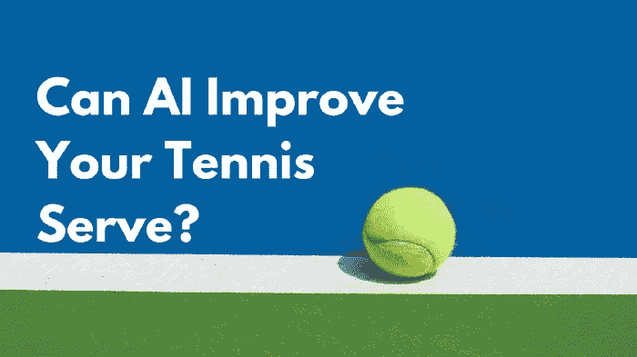
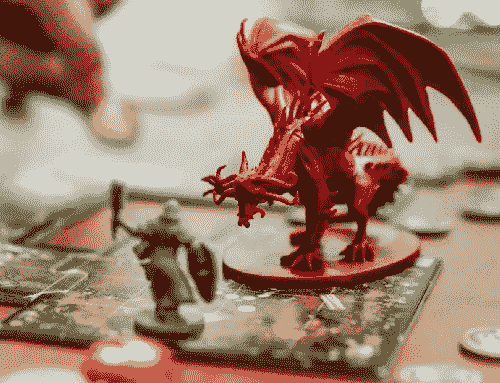
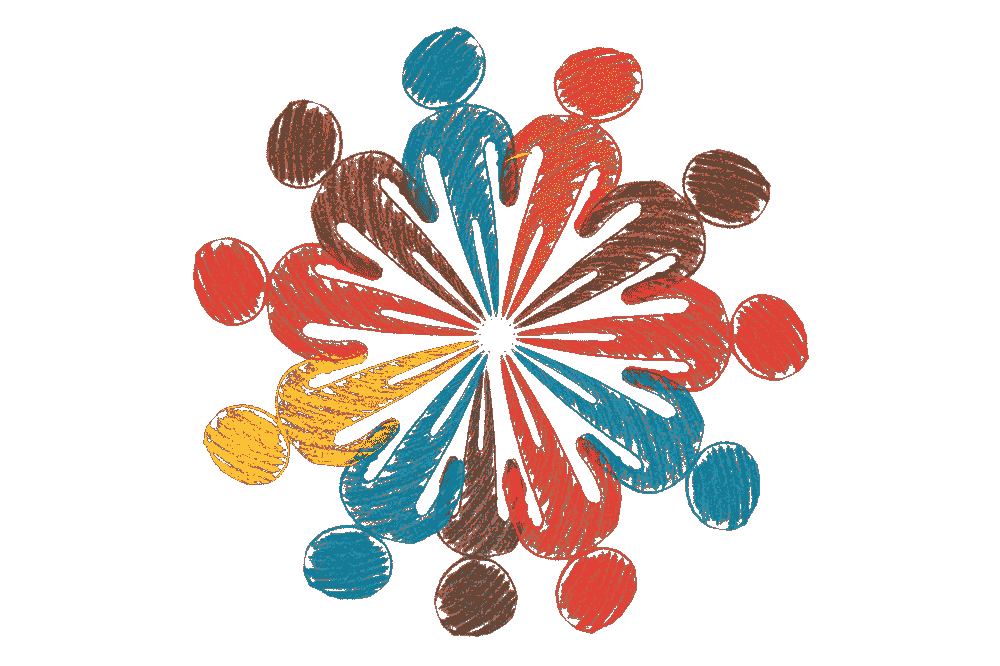

# AI 能让你成为更好的运动员吗？

> 原文：<https://towardsdatascience.com/can-ai-make-you-a-better-athlete-74dc0c041cce?source=collection_archive---------72----------------------->

## [利用机器学习分析网球发球和点球](/can-ai-make-you-a-better-athlete-using-machine-learning-to-analyze-tennis-serves-and-penalty-kicks-f9dd225cea49)

由[戴尔·马科维茨](https://medium.com/u/1b81dbdfe1ea?source=post_page-----74dc0c041cce--------------------------------) — 11 分钟阅读

啊，*体彩*。你能忘记第一次你抓住那个传球，飞向球场，把那个冰球直接投进球网，而你的球迷在看台上崇拜地大喊，*触地得分！*

没有吗？没有印象吗？我也没有。这就是你在高中学习微积分和在饼干蛋糕上涂圆周率而不是做运动的结果。

Clint Bustrillos 在 Unsplash 上拍摄的照片

## [用机器学习对地下城&龙族中的角色分类](/classifying-character-classes-in-dungeons-dragons-with-machine-learning-86751240594d)

由[丹·奎奇](https://medium.com/u/54bda6357ba5?source=post_page-----74dc0c041cce--------------------------------) — 10 分钟读完

几个月前，一个朋友邀请我加入他的在线龙与地下城活动。尽管我有着令人尊敬的书呆子名声，但我从未真正玩过 DnD。我并不是反对它，事实上，它听起来很有趣，我喜欢它鼓励合作和机智的创造力。也许这可以避免我在新冠肺炎的单独禁闭中写论文所带来的单调生活。

图片由 Gerd Altmann 在 Pixabay 上提供

## [嵌入图形数据库的计算节点:Neo4j & its 图形数据科学库](/computing-node-embedding-with-a-graph-database-neo4j-its-graph-data-science-library-d45db83e54b6)

通过 [Estelle Scifo](https://medium.com/u/506d892fb653?source=post_page-----74dc0c041cce--------------------------------) — 7 分钟阅读

现在的机器学习都是关于向量的。执行分类任务要求将数据排列成行(观测值)，每行包含相同数量的要素(列)。虽然这很容易从最初存储在 Excel 表或 SQL 或 noSQL 数据库中的数据中获得，但当问题涉及复杂对象(如文本、图像或图形)时，转换就远不明显了。

图片来自 Pixabay 的 Thomas Breher

## [基于学习嵌入的推荐系统](/recommender-systems-from-learned-embeddings-f1d12288f278)

通过[纳希德·阿拉姆](https://medium.com/u/9c3cc6db069e?source=post_page-----74dc0c041cce--------------------------------) — 6 分钟读取

推荐系统是试图预测用户偏好的现代消费者网络应用的基本构件。有不同的方法来建立推荐系统。我们对基于最近邻的方法特别感兴趣。我们研究一个项目的配对之间的相似性，并推荐给用户

马文·朗斯多夫在 Unsplash 上的照片

## [期望最大化解释](/expectation-maximization-explained-c82f5ed438e5)

由 [Ravi Charan](https://medium.com/u/393ce2bbf82c?source=post_page-----74dc0c041cce--------------------------------) — 11 分钟阅读

期望最大化(EM)是 60 年代和 70 年代发展起来的经典算法，具有多种应用。它可以用作无监督聚类算法，并扩展到 NLP 应用，如潜在的狄利克雷分配、用于隐马尔可夫模型的 Baum–Welch 算法和医学成像。