# AI 能让你成为更好的运动员吗？利用机器学习分析网球发球和点球

> 原文：<https://towardsdatascience.com/can-ai-make-you-a-better-athlete-using-machine-learning-to-analyze-tennis-serves-and-penalty-kicks-f9dd225cea49?source=collection_archive---------38----------------------->

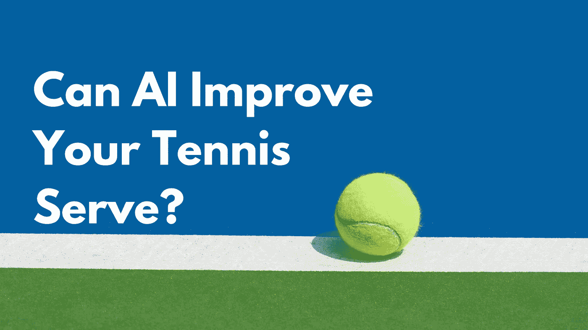

啊，*运动球*。你能忘记第一次你抓住那个传球，飞向球场，把那个冰球直接投进球网，而你的球迷在看台上崇拜地大喊，*触地得分！*

没有吗？没有印象吗？我也没有。这就是你在高中学习微积分和在饼干蛋糕上涂圆周率而不是做运动的结果。

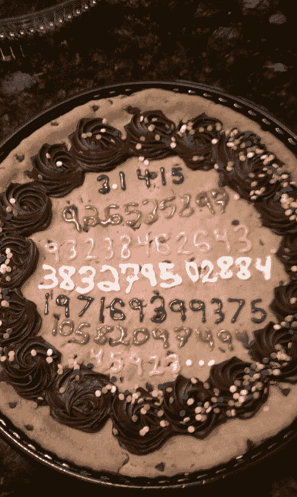

*你认为这让我交了多少朋友？*

是时候让你一去不复返了。当然，除非你想出一种方法，利用高中的数学知识成为一名更好的运动员。

这就是我们今天要看的！在这篇文章中，我将向你展示如何使用机器学习来分析你在自己选择的运动中的表现(例如，我将使用我的网球发球，但你可以很容易地将该技术应用到其他比赛中)。顺便说一下，这个项目的灵感来自于我最近对扎克·阿基尔的采访，他用同样的技术分析了足球比赛中的点球。

用机器学习制作关于用人工智能跟踪点球的剧集。

机器学习已经在体育运动中发挥了作用:公司[用它来](https://www.nytimes.com/2020/04/08/technology/ai-sports-athletes-machine-learning.html)识别球员的独特才能，更早地发现伤病，并安排最佳球员交易。此外，几乎每项职业运动(NFL、NHL、MLB、NBA、足球、高尔夫、板球等)都使用 ML 技术进行跟踪。例如，NBA 已经在球场上部署了一个复杂的基于视觉的系统，跟踪球员的动作，读取他们球衣上的数字，分析他们传球的速度，并确定他们在压力下的投篮精度。

但是作为一个初学者，我喜欢用同样的技术简单地告诉我哪里做错了，哪里出错了。理想情况下，当我在网球场上时，我会在我的手机上安装一个应用程序，分析我发球的视频，并给我提供有用的提示(例如，“伸直你的手臂”，“弯曲你的膝盖”)。在这篇文章中，我将向你展示让这样的应用成为可能的核心技术。

*想直接跳到代码？在 Github 上查看* [*代码*](https://github.com/google/making_with_ml) *。*

# 利用机器学习分析我的网球发球

几周前，我去了一个网球场，支起三脚架，拍了一些我发球的镜头。我把它寄给了我的朋友 JT，他是一名网球教练，我问他我做错了什么。他给我发回来一堆我和职业网球运动员的对比照片，并指出了我们所有的不同之处——我手臂的整个轨迹和肘部的角度都相差很远。

JT 所做的很有用——他分析了我发球中与专业运动员不同的关键部分。如果机器学习模型可以做同样的事情，那不是很好吗？将你的表现与专业人士进行比较，让你知道自己做的有什么不同？

根据 JT 的反馈，我决定关注服务的三个方面:

1.  我发球时膝盖弯曲了吗？
2.  我击球时手臂是直的吗？
3.  我击球后球的实际速度是多少？(这只是出于我个人的兴趣)

# 通过姿势检测分析姿势

为了计算我的膝盖和手臂的角度，我决定使用姿势检测——一种机器学习技术，它分析人类的照片或视频，并试图定位他们的身体部位。有很多工具可以用来做姿势检测(如 [TensorFlow.js](https://www.tensorflow.org/lite/models/pose_estimation/overview) )，但对于这个项目，我想尝试一下新人检测(beta！)谷歌云[视频智能 API](https://cloud.google.com/video-intelligence/docs) 的特性。(你可能会从我的[人工智能视频存档](https://daleonai.com/building-an-ai-powered-searchable-video-archive)中认出这个 API，在那里我用它来分析我的家庭视频中的对象、文本和语音。)人物检测功能可以识别一大堆身体部位、面部特征和服装。来自[文档](https://cloud.google.com/video-intelligence/docs/feature-person-detection):

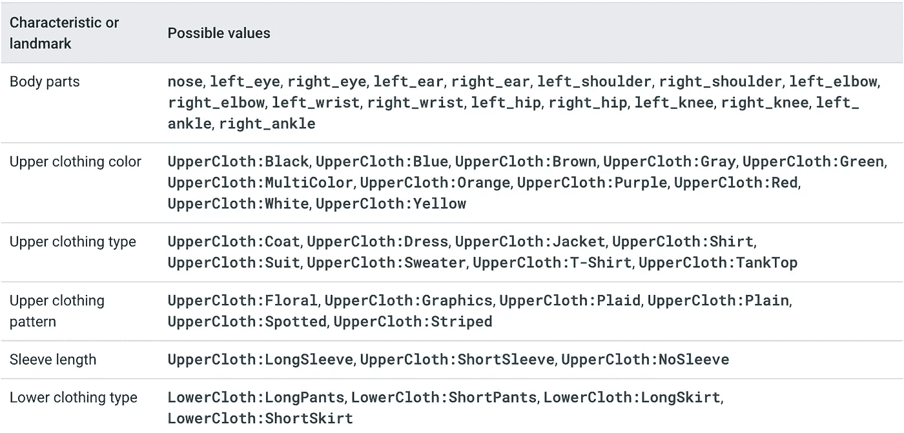

首先，我把我网球发球的视频剪辑到我发球的部分。因为我只拍到了 17 次发球，这花了我大约一分钟的时间。接下来，我将视频上传到谷歌云存储，并通过视频智能 API 运行它。所有这些代码都被方便地记录在一个 [Colab 笔记本](https://github.com/google/making_with_ml/blob/master/sports_ai/Sports_AI_Analysis.ipynb)中，你可以在自己的视频上运行它(你只需要一个谷歌云账户)。该笔记本甚至向您展示了如何设置身份验证和创建存储桶等等。有趣的是——分析姿势——是这样的:

```
def detect_person(input_uri, output_uri):
    """Detects people in a video."""

    client = videointelligence.VideoIntelligenceServiceClient(credentials=service_account.Credentials.from_service_account_file(
    './key.json'))

    # Configure the request
    config = videointelligence.types.PersonDetectionConfig(
        include_bounding_boxes=True,
        include_attributes=True,
        include_pose_landmarks=True,
    )
    context = videointelligence.types.VideoContext(person_detection_config=config)

    # Start the asynchronous request
    operation = client.annotate_video(
        input_uri=input_uri,
        output_uri=output_uri,
        features=[videointelligence.enums.Feature.PERSON_DETECTION],
        video_context=context,
    )

    return operation
```

要调用 API，您需要传递云存储中存储视频的位置，以及云存储中视频智能 API 可以写入结果的目的地。

在这里，我调用视频智能 API 的异步版本。它分析谷歌后端的视频，在云中，甚至在我的笔记本电脑关闭后。这对于长视频来说很方便，但是也有这个 API 的同步和流版本！

当视频智能 API 分析完我的视频后，我用[这个由](https://github.com/wbobeirne/video-intelligence-player) [@wbobeirne](https://github.com/wbobeirne) 打造的简洁工具将结果可视化。它会吐出这样简洁的可视化视频:

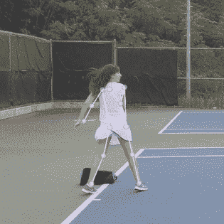

使用视觉 API 来可视化我在发球时的姿势。

姿态检测是训练机器学习模型的重要预处理步骤。例如，我可以使用 API 的输出(我的关节随时间的位置)作为第二个机器学习模型的输入特征，该模型试图预测(例如)我是否在发球，或者我的发球是否会过网。但是现在，我想做一些更简单的事情:用高中数学分析我的发球！

首先，我绘制了我的左手腕和右手腕随时间变化的 y 位置:

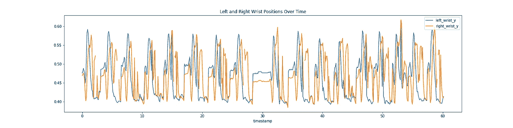

一段时间内我手腕的高度(以像素为单位)

这看起来可能很混乱，但是这些数据实际上非常清楚地显示了一个服务的生命周期。蓝线显示了我左手腕的位置，在我用球拍击球前几秒钟，我的左手腕达到了最高点(右手腕的最高点，或橙色线)。

利用这些数据，我可以非常准确地说出我在什么时间点投球并击球。我想把它和我击球时肘部的角度对齐。为此，我必须将视频智能 API 的输出——原始像素位置——转换成角度。你是怎么做到的？余弦定律，*咄*！(开个玩笑，这个我肯定忘了，得查一下。这里有一个很好的解释和一些 Python 代码。)

余弦定律是将空间中的点转换成角度的关键。在代码中，这类似于:

```
class Point:
  def __init__(self, x, y):
    self.x = x
    self.y = y 

def getAngle(a, b, c):
    ang = math.degrees(math.atan2(c.y-b.y, c.x-b.x) - math.atan2(a.y-b.y, a.x-b.x))
    return ang

 def computeElbowAngle(row, which='right'):
  wrist = Point(row[f'{which}_wrist_x'], row[f'{which}_wrist_y'])
  elbow = Point(row[f'{which}_elbow_x'], row[f'{which}_elbow_y'])
  shoulder = Point(row[f'{which}_shoulder_x'], row[f'{which}_shoulder_y'])
  return getAngle(wrist, elbow, shoulder)

def computeShoulderAngle(row, which='right'):
  elbow = Point(row[f'{which}_elbow_x'], row[f'{which}_elbow_y'])
  shoulder = Point(row[f'{which}_shoulder_x'], row[f'{which}_shoulder_y'])
  hip = Point(row[f'{which}_hip_x'], row[f'{which}_hip_y'])
  return getAngle(hip, shoulder, elbow)

def computeKneeAngle(row, which='right'):
  hip = Point(row[f'{which}_hip_x'], row[f'{which}_hip_y'])
  knee = Point(row[f'{which}_knee_x'], row[f'{which}_knee_y'])
  ankle = Point(row[f'{which}_ankle_x'], row[f'{which}_ankle_y'])
  return getAngle(ankle, knee, hip)
```

查看笔记本，了解所有细节。使用这些公式，我绘制了我的肘部角度随时间的变化曲线:

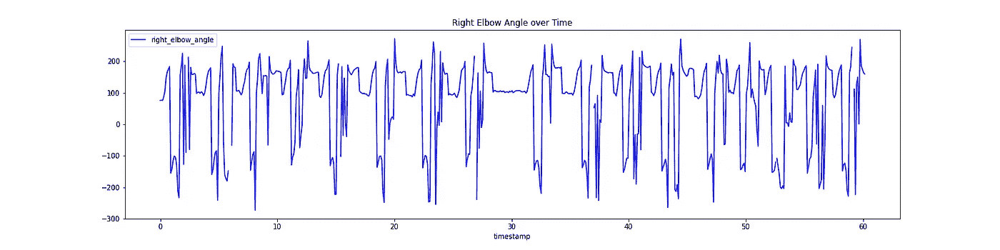

随着时间的推移，我右肘的角度

通过对齐我手腕的高度和我肘部的角度，我能够确定角度大约是 120 度(不是直的！).如果 JT 没有告诉我要寻找什么，这将是一个很好的应用程序来捕捉我的手臂角度与专业人士不同，并让我知道。

我用同样的公式计算了我的膝盖和肩膀的角度。同样，在笔记本上查看更多细节。

# 计算我发球的速度

姿势检测让我计算我身体的角度，但我还想计算我用球拍击球后的速度。为了做到这一点，我必须能够随着时间的推移跟踪微小、快速的小网球。

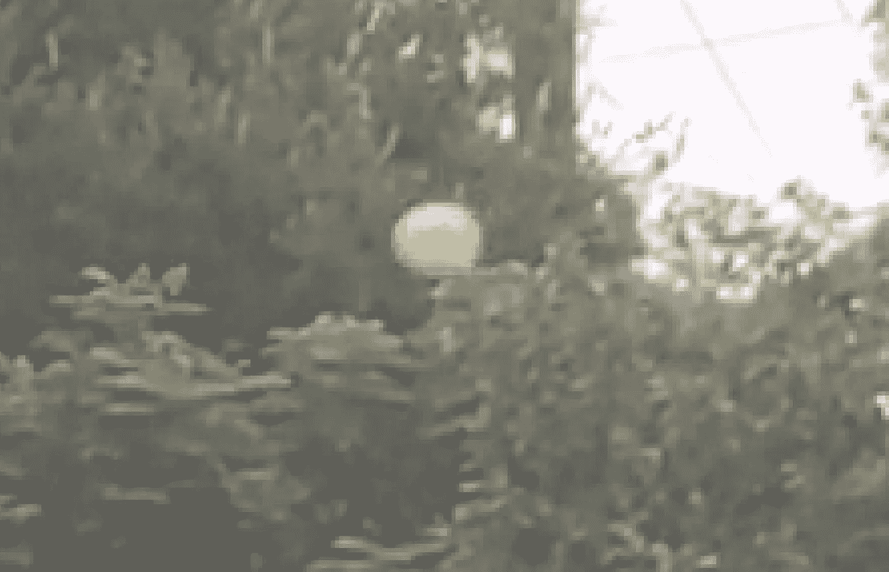

*正如你在这里看到的，这个网球有点难以辨认，因为它很模糊而且很远*。

我用 Zack 在他的[足球码头](https://www.youtube.com/watch?v=yLrOy2Xedgk)项目中的方式处理这件事:我训练了一个定制的自动视觉模型。

如果你不熟悉 [AutoML Vision](https://cloud.google.com/vision/automl/docs) ，这是一种使用深度神经网络建立计算机视觉模型的无代码方式。最棒的是，你不需要了解任何关于 ML 的知识就可以使用它！最糟糕的是成本。它很贵(一分钟后会详细说明)。

AutoML Vision 允许您上传自己的标记数据(即带有标记的网球)并为您训练一个模型。

# 用自动视觉训练目标检测模型

首先，我拍摄了一段 30 秒钟的我上菜的视频，并将其分割成单独的图片，我可以用这些图片作为视觉模型的训练数据:

```
ffmpeg -i filename.mp4 -vf fps=10 -ss 00:00:01 -t 00:00:30 tmp/snapshots/%03d.jpg
```

您可以从我提供的[笔记本](https://github.com/google/making_with_ml/blob/master/sports_ai/Sports_AI_Analysis.ipynb)中运行该命令，或者如果您安装了 ffmpeg，也可以从命令行运行该命令。它采用 mp4 并创建一组快照(这里 fps=20，即每秒 20 帧)作为 jpg。`-ss`标志控制快照应该在视频中多远开始(即在 1 秒时开始“搜索”),标志`-t`控制应该包括多少秒(本例中为 30 秒)。

创建完所有快照后，您可以使用以下命令将它们上传到 Google 云存储:

```
gsutil mb gs://my_neat_bucket  # create a new bucket
gsutil cp tmp/snapshots/* gs://my_neat_bucket/snapshots
```

接下来，导航至谷歌云控制台，并从左侧菜单中选择**视觉**:

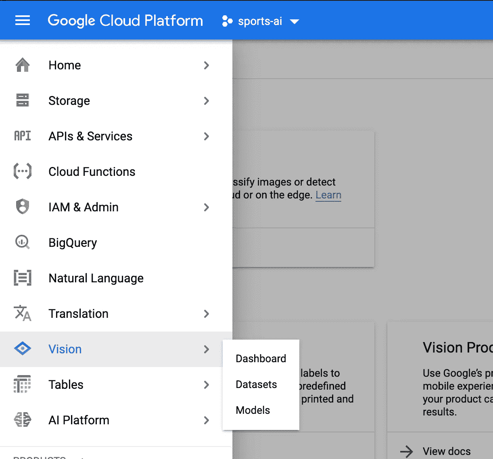

创建一个新的 AutoML 视觉模型并[导入你的照片](https://cloud.google.com/vision/automl/docs/prepare)。

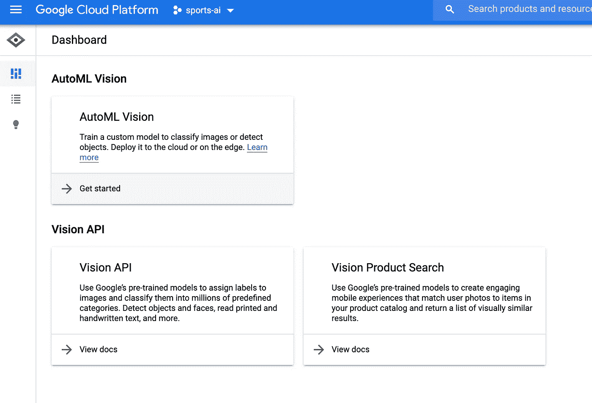

快速回顾:什么是机器学习分类器？这是一种*从例子中学习*如何标记事物的模式。因此，为了训练我们自己的 AutoML 视觉模型，我们需要提供一些带标签的训练数据供模型学习。

上传数据后，您应该会在 AutoML Vision 的“图像”选项卡中看到它:

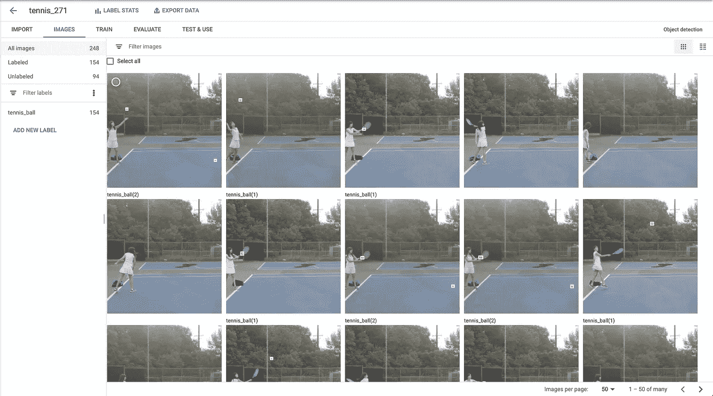

在这里，你可以开始应用标签。点击进入图像。在编辑视图(如下)中，您可以单击并拖动一个小边框:

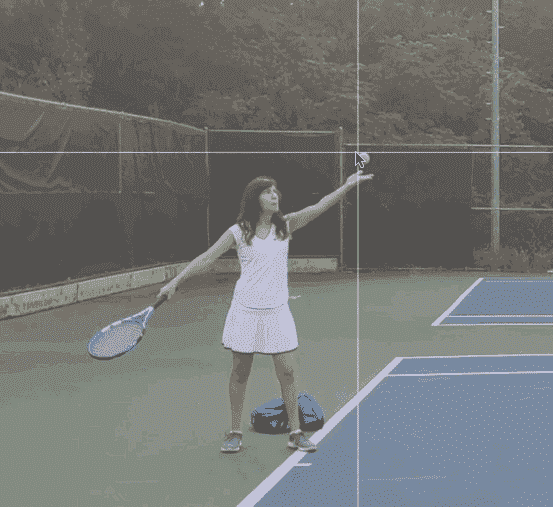

*AutoML 视觉数据标注界面 Gif 图*

恭喜你，你刚刚开始了一个漫长而有益的职业生涯作为一个数据标签。下一站，麻省理工！

对于我的模型，我手工标记了大约 300 张图片，花了我大约 30 分钟。一旦你标记完数据，只需点击一下就可以用 AutoML 训练一个模型——只需点击“训练新模型”按钮，然后等待。

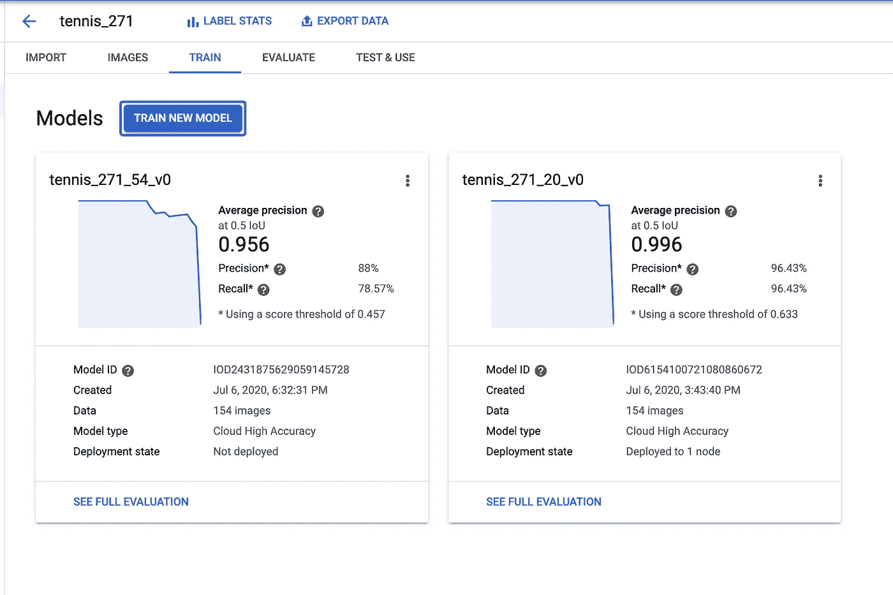

当您的模型完成训练后，您可以在下面的“评估”选项卡中评估其质量。

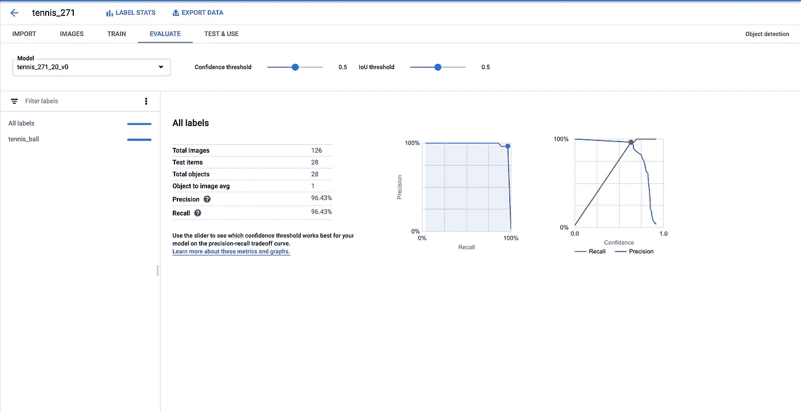

如你所见，我的模型相当精确，大约 96%的精确度和召回率——热狗！

这足以让我在照片中追踪球的位置，从而计算出它的速度:

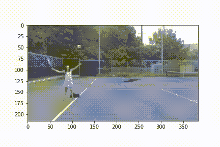

这里非常小，但是你可以看到那个小的边界框在跟踪网球。

一旦你训练好了你的模型，你就可以使用 Jupyter notebook 中的代码来制作一个可爱的 lil 视频，就像我上面画的那样。

然后，您可以使用它来绘制球随时间变化的位置，以计算速度(有关更多详细信息，请参阅笔记本):

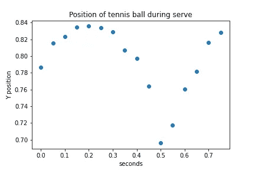

网球随时间的 y 位置

不幸的是，我意识到我犯了一个严重的错误，但为时已晚。什么是速度？距离随时间的变化，对吗？但是因为我实际上不知道我、玩家和摄像机之间的距离，所以我不能用英里或米来计算距离，只能用像素！所以我知道我以大约每秒 200 像素的速度发球。*好听*。

*自从我写了这篇文章，一些人认为我应该用一个网球的大小来估计距离。我觉得听起来是个好主意！

现在你有了——一些你可以用来构建自己的运动机器学习训练器应用的技术！

# 关于成本的一个注记

声明:我在谷歌工作，我免费使用谷歌云。我尽可能在这里推荐免费工具，但是我本能地求助于 GCP，有时我没有注意到代价。

当谈到汽车视觉时，这并不是一个好主意。这是这个项目让我付出的代价:

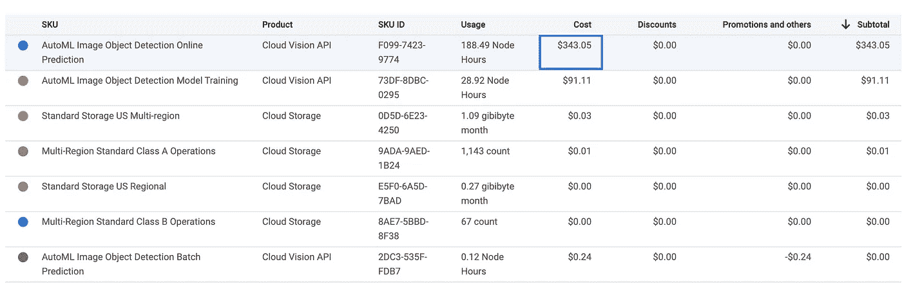

整件事大约要 450 美元。但是，在你被$$完全拒绝之前，让我们来分解一下:

我训练了两个 AutoML 模型，两个模型的训练成本都是 91.11 美元。当然，这是昂贵的，但质量相当高，也许对于某些业务用例来说，这是有意义的。

真正的成本来自于第一项——自动图像目标检测在线预测。那是什么？这是谷歌为*在云中托管*你的模型收取的费用，这样你就可以用标准的 REST API 调用它。奇怪的是，即使你没有对这种模式进行预测，你也会不断地被收取托管这种模式的费用，这真的会使成本快速攀升。

好消息是 AutoML Vision 实际上以三种方式运行:

1.  您可以将模型配置为托管在云中，您可以在任何时候在 REST 端点访问它(最昂贵)。
2.  您只能在批处理模式下使用它(预测是以异步方式运行的，而不是用于实时用例)，这样可以消除大部分额外成本。
3.  您实际上可以将您的模型训练为可导出的，允许您将其作为 TensorFlow 模型下载并离线使用。这也大大降低了成本。
4.  或者，您可以完全放弃 AutoML，使用 TensorFlow 或 PyTorch 独自尝试。祝你好运，并让我知道你的选择！

*原载于 2020 年 7 月 7 日*[*【https://daleonai.com】*](https://daleonai.com/machine-learning-for-sports)*。*