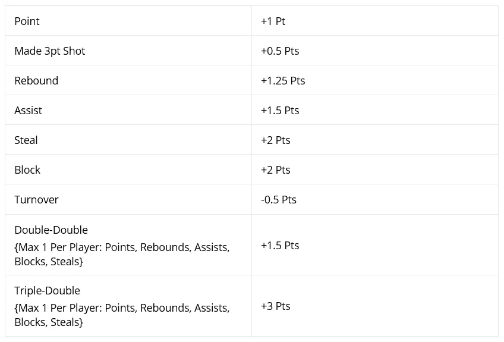
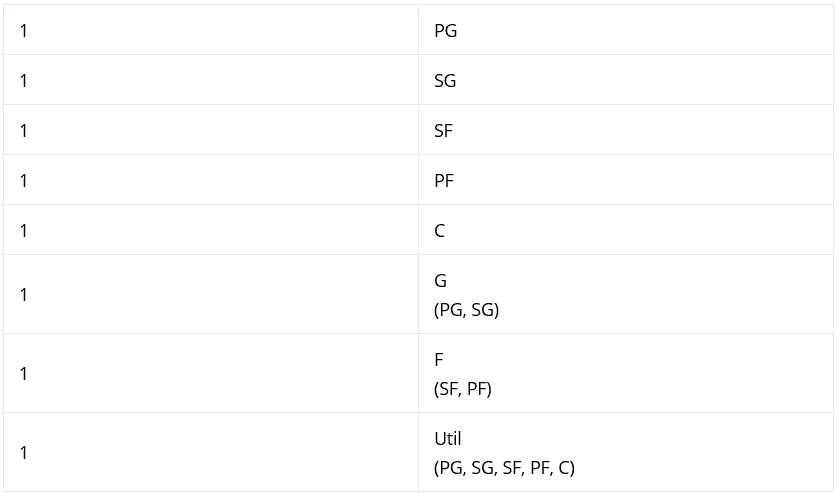
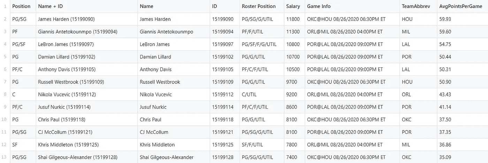
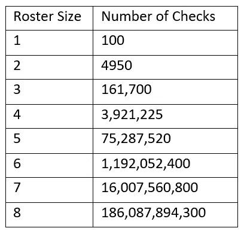
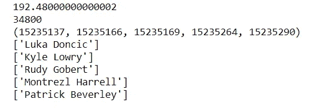
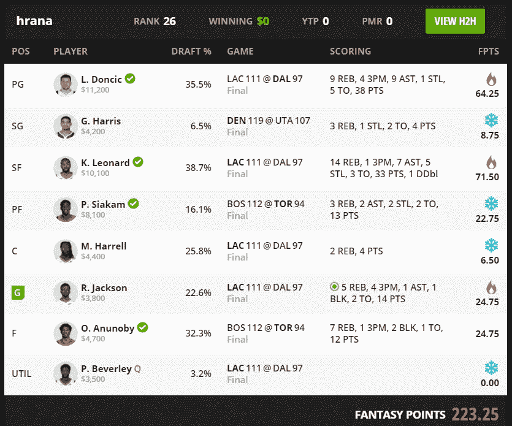
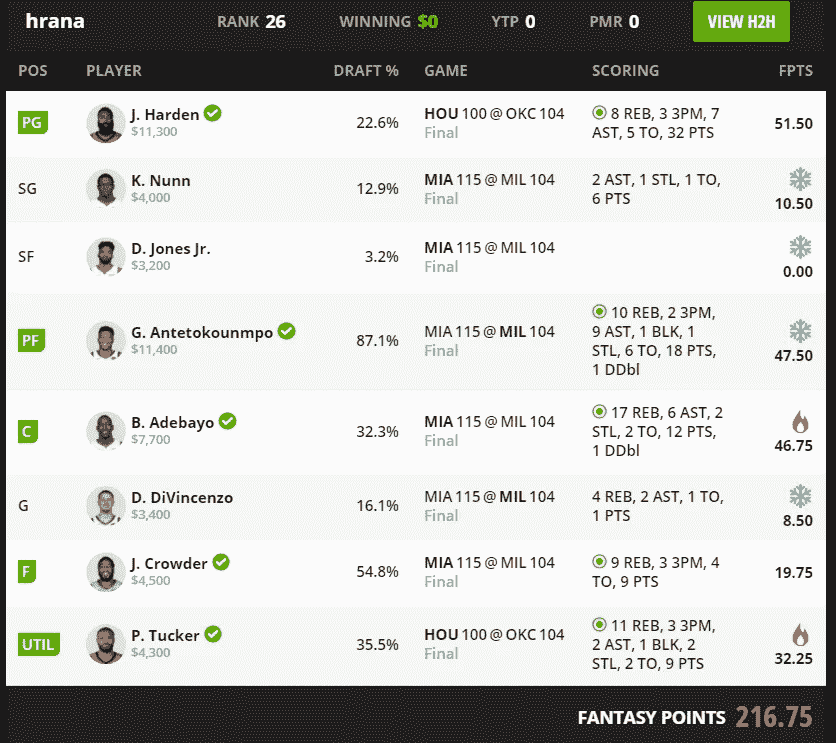
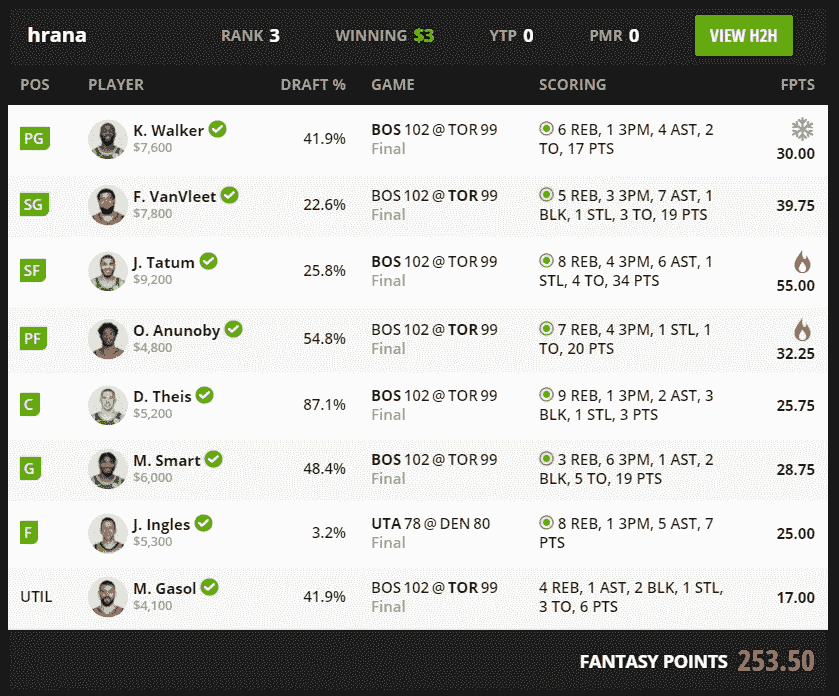

# 一个算法能选出一个获胜的 NBA 梦幻选秀吗？

> 原文：<https://towardsdatascience.com/can-an-algorithm-pick-a-winning-nba-fantasy-draft-c05342f130f2?source=collection_archive---------20----------------------->

## 使用数据分析、建模和优化来挑选获胜团队

照片由来自 [Pexels](https://www.pexels.com/photo/ball-basketball-basketball-court-basketball-hoop-1752757/?utm_content=attributionCopyText&utm_medium=referral&utm_source=pexels) 的 [Markus Spiske](https://www.pexels.com/@markusspiske?utm_content=attributionCopyText&utm_medium=referral&utm_source=pexels) 拍摄

***来自《走向数据科学》编辑的提示:*** *虽然我们允许独立作者根据我们的* [*规则和指导方针*](/questions-96667b06af5) *发表文章，但我们并不认可每个作者的贡献。你不应该在没有寻求专业建议的情况下依赖一个作者的作品。详见我们的* [*读者术语*](/readers-terms-b5d780a700a4) *。*

我喜欢篮球。这是一个快节奏的竞技游戏，我喜欢玩和看它已经很久了。NBA 以生成[非常干净的数据](https://stats.nba.com/)而闻名，这些数据长期被爱好者(比如我自己)用于[数据可视化](https://buckets.peterbeshai.com/app/#/playerView/201935_2015)、[建模](https://sports.sites.yale.edu/nba-model-math)和[比赛预测](/predict-nba-games-make-money-machine-learning-project-b222b33f70a3)。

最近， [DraftKings](https://www.draftkings.com/lobby) 联系我，询问一份潜在工作的面试事宜。作为准备工作的一部分，我开始使用他们的平台并参加模拟比赛，以熟悉 DraftKings (DK)比赛流程。正是在这段时间里，我真正开始有了用数据来建模和预测一个获胜名单的想法。

我迭代地构建了这个算法，并且从头开始——从一个简单的版本 1 开始，一个更健壮的版本 2，现在我正在开发一个成功的版本 3。

> 我迭代地构建算法，从头开始

在本文的其余部分，您可以跟随我的算法设计之旅。

# 快速水平集:评分和规则

DK 为他们的 **NBA 经典**幻想竞赛制定的规则和评分相当直观，即使你之前没有篮球知识。简而言之，目标是:

> 创建一个 8 人阵容，同时保持 5 万美元的工资上限。

玩家因不同的动作获得不同的分数(更多细节见下文)，在一个晚上所有游戏结束时，分数最高的选秀获胜。听起来很简单:)

导致正(或负)分的不同行动的分类如下所示。

NBA 梦幻积分细分。作者照片。

最后一个使起草稍微复杂的限制是球员的位置。根据 DK: *阵容将由 8 名球员组成，必须包括至少 2 场不同 NBA 比赛的球员。*

进一步，这 8 名球员按位置细分，如下图所示。

NBA 梦幻球员位置。作者照片。

你有它！带有一组约束的简单优化问题。听起来像是算法擅长的事情。**或者会吗？**

# **算法版本 1-幼稚**

我用这个算法的目标是尽可能快地构建它，几乎没有获胜的希望。主要是因为我对建立强大的基础感兴趣，而不担心在过程早期构建复杂的逻辑。为了做到这一点，我从 DK 下载了一个球员数据集，并启动了一个 Jupyter 笔记本。如果你有兴趣，你可以找到完整的原始数据[这里](https://github.com/hr23232323/draftkings_nba/blob/master/previous_day_salaries/08-26/DKSalaries.csv)和我的笔记本[这里](https://github.com/hr23232323/draftkings_nba/blob/master/optimize-%20V1.ipynb)。

让我们看看我们的数据是什么样的。

玩家数据集- DraftKings。作者照片。

马上，我们可以看出，对于一个简单的算法，给定我们的需求和约束，我们会发现以下几列很有用:ID、Salary 和 AvgPointsPerGame(幻想点数)。这将允许我们挑选“最好的”球员，同时保持在 50，000 美元的工资帽之下。当然，没有位置信息，我们可能会有重叠等。但这是以后版本的问题。请记住，版本 1 应该是您的产品的最简单的实现。

给定这些数据，我们的第一遍优化算法可以分为以下简单步骤:

1.  从数据集中随机选择 8 名玩家。
2.  如果球员工资之和大于 5 万美元:回到步骤 1(太贵)。
3.  否则，对花名册中每个球员的 AvgPointsPerGame 求和，并与主最大值进行比较。如果更大，替换最大值和花名册。
4.  除非已经探索了所有可能的组合，否则返回步骤 1。一旦不再有组合，返回最大值和花名册。

我们有了:一个简单的天真算法，随机挑选 8 名球员，他们将拥有最大的预期幻想点数，同时保持在 50，000 美元的薪金上限之下。但是这种算法有几个明显的问题:

*   无法控制球员的位置。因此，该算法可以生成一个包含多于 3 个职位(G/F)的名册，在这种情况下，该名册将是无效的。
*   没有检查受伤或未安排比赛的球员。这将导致最确定的损失，因为所有球员的分数对一个获胜的选秀都很重要。
*   最后，该算法效率非常低。考虑到我们需要检查每个可能的花名册:对于给定的球员数量 n 和花名册大小 r，可能的花名册的数量将是-

> C( n，r ) = n！/ (n — r)！。r！

为了更好地理解这种复杂性，请看下表，它显示了如果玩家总数为 100 时的检查次数。

第一种算法的时间复杂度。作者照片。

可以肯定的是，我们的算法需要很长时间来输出 8 名球员的名单。但是，因为这是一个第一遍算法，我们很高兴我们得到了什么。你可以看到下面的算法，选出前 5 名球员的总工资为 35，000 美元。还不错。

算法 1 的输出-最大期望点数低于 35，000 美元总工资的前 5 名球员。注意:第一行显示的是期望的梦幻组合点数，第二行是组合薪水，第三行是玩家的 id，后面是名字。作者照片。

因为我们的任务是构建一个成功的算法，所以我们来谈谈版本 2 的优化。

# 算法版本 2-中级体育投注者

现在，这就是我们的算法从一个幼稚的优化器变成一个中级体育投注者的地方。基于版本 1 的缺点和阶乘时间复杂性，我决定实现一些数据和算法级优化。

首先，我清理了数据，只包括确认玩游戏的玩家。这是一个将可用玩家总数从 100 人减少到 85 人的简单方法。这可能看起来是一个小的增长，但实际上，对于一个 8 人的花名册来说，当球员总数减少时，我们的检查次数会急剧减少。支票数量的变化如下所示。

*   C (100，8)= 186087894300
*   C (85，8) = 48，124，511，370

**我们在算法中的操作(或检查)总数下降了大约 75%！**

接下来，我修改了算法本身来挑选特定的位置。现在，算法不是从所有可用的球员中挑选每一个可能的名单，而是从所有可用的后卫中挑选 3 名后卫，然后是 3 名前锋，最后是 1 名中锋。如你所见，这里总共只有 7 个玩家，最后的选择留给用户。这是在算法上节省一些额外时间的快速方法，因为用户可以手动找到剩余的最佳球员(给定剩余工资的最高期望分数)。

这是一个巨大的优化，因为后卫和球员总数的比例是 40 比 85。前锋的数据差不多，中锋的数据更少。请注意，每个类别的球员之间有轻微的重叠，因为一些球员踢多个位置，但这很容易处理:我在选择前锋之前，删除了已经被选作后卫的球员。上述更改带来的性能提升如下所示:

*   C (85，8) = 48，124，511，370
*   C (40，3) x C (40，3) x C (20，1)= 1952288000

这是巨大的。**现在，该算法执行的操作减少了约 95%**,我们拥有按职位分列的最佳名单，并且在我们的工资帽范围内。让我们来测试我们的结果！

# 真实世界的结果

如果你已经做到了，恭喜你。你已经解决了技术问题，现在是时候看结果了！我在 DK 的经典乘数竞赛中尝试了三天的算法选择。**每次我的报名费是 1 美元，前 30%的参赛者的回报是 3 美元。**你可以在下面看到算法生成的阵容和结果。

第一天——哦，不，以第 26 名结束，还输了钱。作者 DK 截图。

第二天——哦，不，又来了，排在第 26 位，又输了 1 美元。作者 DK 截图。

第三天-哇哦！排名第三，赚了 3 美元。作者 DK 截图。

正如你从上面的结果中看到的，比赛的真实结果是好的！在我用算法创建阵容的三天里，我们输了两次，赢了一次。我们的中级运动斗鱼算法做得比我预期的要好，但是还有很长的路要走。

我注意到结果的细微差别，包括我们的算法(在 v2 优化之前)在第一天犯了一个错误，一名受伤的球员被选入球队(P. Beverley ),导致了弱草案。这个问题在版本 2 中已经解决，不会再重复。此外，曾经很酷的事情是，尽管有混合的结果，该算法一直创造了超过 200 幻想点的阵容，这是相当高的！

# 下一步是什么？

好了，你知道了。到目前为止，我已经花了 3 美元的主菜费和 3 美元的奖金，总共 0 美元的变化！在我内心的警钟开始响起之前，我还有 25 美元可以花在这个项目上，所以我显然需要改进这个算法。在和一些比我更了解篮球的朋友交谈后，我有几个假设要验证。其中包括:

*   在过去的 *n* 场游戏中使用额外的玩家数据。这样，模型将有更多的上下文，而不仅仅是一个快照值
*   使用之前的球队比赛数据来调整某些比赛的权重。例如，这有助于避免在一场比赛中挑选一名(根据以前的比赛)表现不佳的球员
*   探索双重优化策略

还有更多！如果你对如何改进这个项目有任何想法，请随时通过 [LinkedIn](https://www.linkedin.com/in/harshrana1997/) 或电子邮件联系我，你可以在我的[网站](https://www.harshrana.com)上找到。此外，这个项目的所有数据和代码都可以在我的 [Github 库](https://github.com/hr23232323/draftkings_nba)中找到，所以请随意克隆/派生它并测试你自己的假设！一如既往，非常感谢所有反馈。

每个人都要保持安全，继续创造酷的东西。