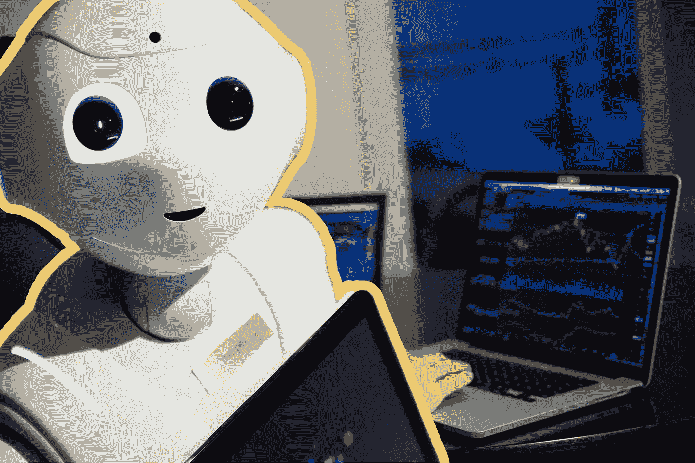
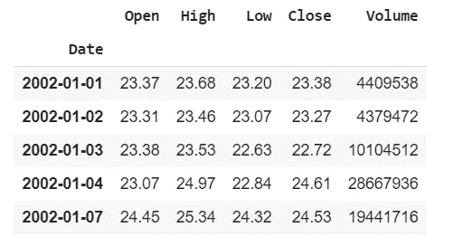
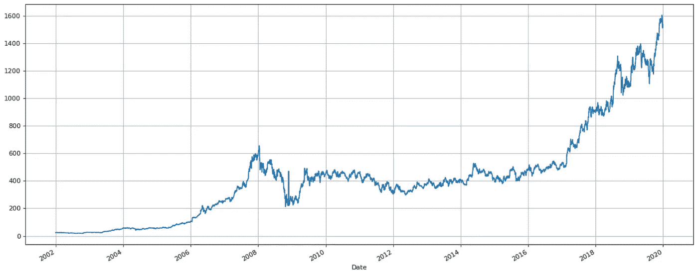
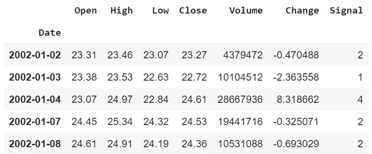
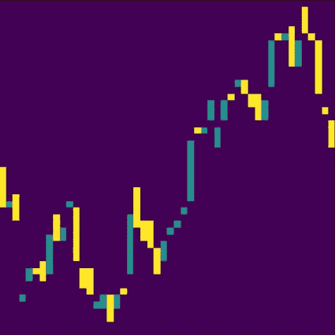
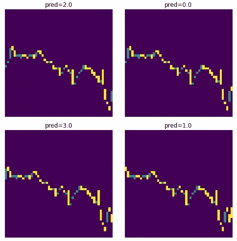
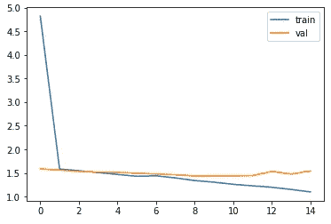
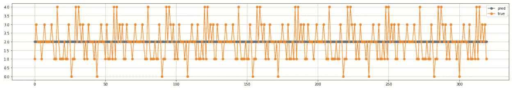

# 机器学习模型可以阅读股票图表并预测价格吗？

> 原文：<https://towardsdatascience.com/can-an-ml-model-read-stock-charts-and-predict-prices-fb73c551c7a4?source=collection_archive---------18----------------------->

## 如果你的机器学习模型可以像人类一样阅读股票价格图表，会怎么样？



[亚历山大·奈特](https://www.pexels.com/@agk42?utm_content=attributionCopyText&utm_medium=referral&utm_source=pexels)从[派克斯](https://www.pexels.com/photo/high-angle-photo-of-robot-2599244/?utm_content=attributionCopyText&utm_medium=referral&utm_source=pexels)和[亚当·诺瓦克斯基](https://unsplash.com/@adamaszczos?utm_source=unsplash&utm_medium=referral&utm_content=creditCopyText)在 [Unsplash](https://unsplash.com/s/photos/stock-market?utm_source=unsplash&utm_medium=referral&utm_content=creditCopyText) 拍摄的原始照片

***来自《走向数据科学》编辑的注释:*** *虽然我们允许独立作者根据我们的* [*规则和指南*](/questions-96667b06af5) *发表文章，但我们并不认可每个作者的贡献。你不应该在没有寻求专业建议的情况下依赖一个作者的作品。详见我们的* [*读者术语*](/readers-terms-b5d780a700a4) *。*

大多数 ML 模型都试图使用历史价格数据和其他技术指标(即数字输入)来预测股票价格(或股票价格的变化)。但是，我问自己，为什么 ML 模型不能精确地复制人类在股票市场的交易方式？

任何一个普通人都会打开股票价格图表([蜡烛图](https://www.investopedia.com/trading/candlestick-charting-what-is-it/))，试图在价格数据中找到一些模式。也许接下来，应用一些技术指标，查看一下公司基本面，最后根据所有图表和数字输入的综合输出，对股价的下一步走势做出决策。如果一个 ML 模型也能从视觉信息中得出这些结论，会怎么样？

因此，让我们将价格历史时间序列作为可视信息传递给 CNN 模型作为输入。模型会像人类一样识别视觉数据中的模式吗？这个模型的性能会比以数字数据作为输入的模型好吗？好吧，让我们来看看！

在我们开始之前，在我的上一篇文章中，我们探讨了为什么盲目使用 LSTMs 来预测股票价格会给你带来麻烦。你可以在这里阅读。已经看过了？很好，现在我们可以继续了。

**接下来，免责声明。** *这些都不是财务建议，你也不应该在实践中直接实施。把这当成一个实验，仅此而已。酷，现在先不说这个，我们可以继续我们的实验了！*

我们将预测第二天价格运动的**方向**，而不是预测股票价格，也就是说，股票价格将会上涨、下跌还是横盘整理。我们开始吧！

这篇文章的流程如下:

*   用 python 获取历史股票数据。
*   将价格数据转换为可视化表示
*   用 Tensorflow Keras 建立并训练一个模型。
*   预测和解释结果。

# 第一步:获取股票数据

python 中有多种方法可以访问历史股票价格，但是最简单的库之一是 [**yfinance**](https://pypi.org/project/yfinance/) 。非常方便和免费，它通过从雅虎财经收集数据来完成工作。

```
!pip install yfinance## Import the required libraries
import yfinance as yf
import pandas as pd
import numpy as np
import matplotlib.pyplot as pltfrom pandas.plotting import register_matplotlib_converters
register_matplotlib_converters()
```

*在本文中，我将采用印度股票市场上最大的公司“Reliance”的股票价格，但也可以随意尝试其他工具。*

下面这段代码下载 Reliance 大约 18 年(我有意避开 COVID 周期)的股票价格数据，分辨率为 1 天，并将其存储在 pandas 数据帧中。你可以根据你的实验改变这些参数。

打印出熊猫数据框架的头部，你可以看到各种参数，如“开盘价”、“收盘价”、“高”、“低”、“成交量”，可用于股票数据。



熊猫数据框架顶部为 Reliance 股票数据

画出“收盘”价格以可视化数据，看看股票在过去几年中上涨得有多好。



Reliance 股票数据的收盘价

现在我们将为我们的数据添加一些额外的特征。首先，计算与前一天收盘相比的百分比变化。接下来根据这一变化，产生一个信号:

*   0(如果变化小于-2.5%)
*   1(如果变化在-2.5%和-1%之间)
*   2(如果变化在-1%和 1%之间)
*   3(如果变化在 1%和 2.5%之间)
*   4(如果变化大于 2.5%)

数据帧现在看起来像这样:



具有附加功能的数据帧

现在，这完全是任意的，你可以随意改变它。您可以将更改分成更多/更少的部分(相应地调整模型的最后一层)。

# 第二步:股票价格的视觉表现

现在，这一步非常重要，因为它将决定模型看到什么。在这篇文章中，我想让图像尽可能接近人类交易者看到的蜡烛图。一个约束条件是，每个输入图像必须具有相同的尺寸，并且必须包含足够的信息，以便模型从中得出结论。

我们要有一个**回望期**，比如说**过去 50 天** (10 个交易周)，要有代表性。为了简单起见，对于这 50 天中的每一天，**开盘和收盘**，以及价格运动的**方向**都将被编码。

由于相同维度的图像将被输入到神经网络，它可能不理解这个图像在整个 15 年中的位置。例如，在 2002 年，价格为 80-90 英镑，而随着时间的推移，价格缓慢上升至 1800 英镑。虽然价格模式可能(也可能不)独立于绝对股票价格，但我想在图像中也编码一些这种信息。因此，为了给过去价格及其绝对价格水平的图像提供一些背景，50 天的价格表示将在一个更大的时间窗口中进行缩放，该时间窗口考虑了额外的先前价格值。

生成这个可视化表示的代码是:

从股票价格数据生成图像表示的代码



50 天回顾期内开盘和收盘的直观表示

*注意:这是一个非常接近我们在烛台图表上看到的视觉表现(这是重点)。但是，您也可以利用您的想象力(和一些判断力)用其他编码参数创建一个完全不同的视觉表示。因为 CNN 模型从图像中观察和学习的方式可能(也可能不会)与我们的方式大相径庭！*

接下来，让我们创建一个**数据生成器**，它将遍历 15 年的数据，并创建图像对和相应的第二天预测。

这些数据生成图像预测批次，如



一批 4 个生成的图像及其预测

# 步骤 3:构建和训练 ML 模型

由于我们将输入作为图像，并要求输出作为三个类别之一(向上、向下、无运动)，我们的模型将有几个卷积层，然后是几个密集层，最后是一个 softmax 函数。

让我们启动生成器对象并开始培训。

初始化所有数据生成器对象，并开始训练模型

# 步骤 4:可视化结果

训练后，损失可绘制为:

```
plt.plot(history.history['loss'], label='train')
plt.plot(history.history['val_loss'], label='val')
plt.legend()
plt.show()
```



绘制损失图

现在让我们看看测试数据的准确性。

```
## Evaluating the performance of the model
print(model.evaluate(test_gen,steps = (len(data)-split_test)//batch_size))>>> loss: 1.3830 - accuracy: 0.4375
```

好吧，给定 5 种可能的结果，随机猜一个的准确度是 0.2。所以这个模型相对来说表现的还不错。还是有？

绘制出预测的输出，很清楚发生了什么。该模型还没有学到任何有用的东西，所以它最终预测“2”作为每个输出，从而导致相对较高的准确性。



预测产出与真实产出

那我们再多训练一下模特吧。但现在，验证损失大大增加。另外，测试给出的精度小于 0.3。不太令人鼓舞的是，该模型可能过度拟合了训练数据。一个非常明显的原因是**与模型大小**相比，训练数据的大小较小。

# 结束语…

尽管表现并不十分令人鼓舞，但这是一种研究预测股票价格这一古老问题的创新方法。还有一些想法是提供多时间段的输入(比如，也将周数据作为输入)，或者额外提供数字数据形式的技术指标(与可视图表并行)，或者将价格数据转换到其他可视域(不一定是我们看到的图表)，等等。你认为我们还能做些什么来改进这个模型？你还有其他有趣的想法吗？

**在尝试了所有这些想法之后，问题仍然存在——视觉数据提供了数字数据无法提供的优势吗？**你怎么看？

你可以在我的 [GitHub 库](https://github.com/virafpatrawala/StocksPredict-ImageCNN)中找到完整的代码。

最后，我并不是说我是这些领域的专家——我只是提出了我对这个话题的探索，所以请随意指出我的错误或补充我遗漏的任何内容。我很想听到你的反馈。

*你想在股票中使用 ML 一夜暴富吗？这篇文章(不)适合你！*

[](/how-not-to-predict-stock-prices-with-lstms-a51f564ccbca) [## 如何(不)用 LSTMs 预测股票价格

### 股票和机器学习——天作之合。但是事情真的像看起来那么简单吗？

towardsdatascience.com](/how-not-to-predict-stock-prices-with-lstms-a51f564ccbca) 

或者看看我的其他机器学习文章。我相信你会发现它们很有用……

[](/master-the-coco-dataset-for-semantic-image-segmentation-part-1-of-2-732712631047) [## 掌握用于语义图像分割的 COCO 数据集

### 使用 PyCoco、Tensorflow Keras Python…探索和操作 COCO 图像数据集进行语义图像分割

towardsdatascience.com](/master-the-coco-dataset-for-semantic-image-segmentation-part-1-of-2-732712631047) [](/create-a-synthetic-image-dataset-the-what-the-why-and-the-how-f820e6b6f718) [## 创建一个合成图像数据集——“什么”、“为什么”和“如何”

### 缺少图像来训练你的模型？以下是如何使用合成图像将数据集的大小增加数倍…

towardsdatascience.com](/create-a-synthetic-image-dataset-the-what-the-why-and-the-how-f820e6b6f718)