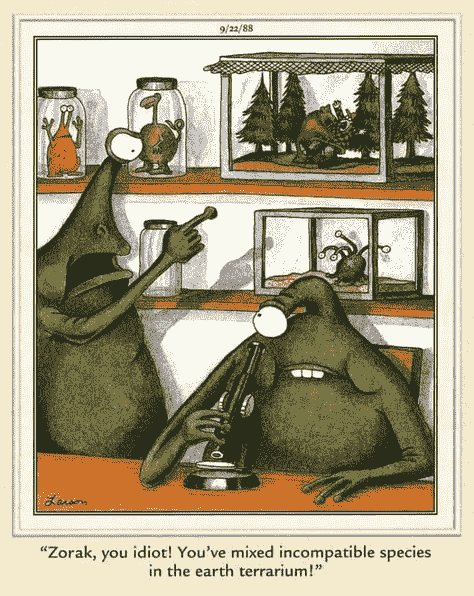
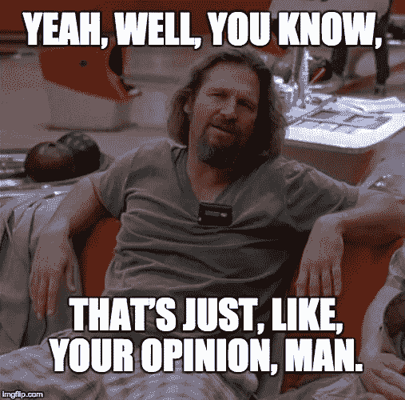
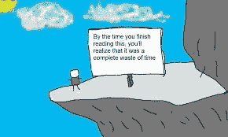
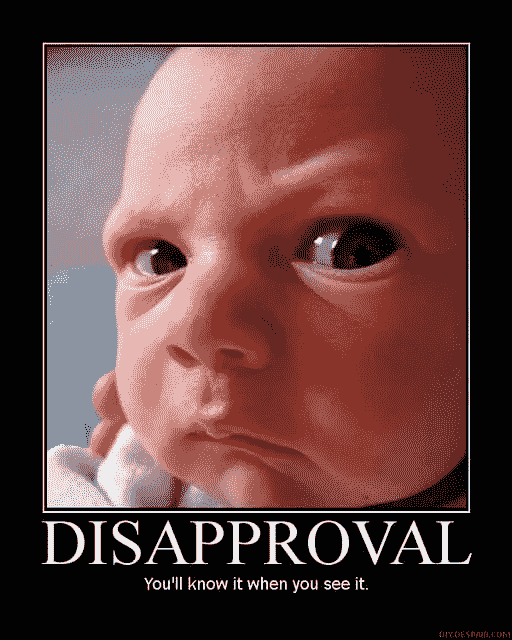
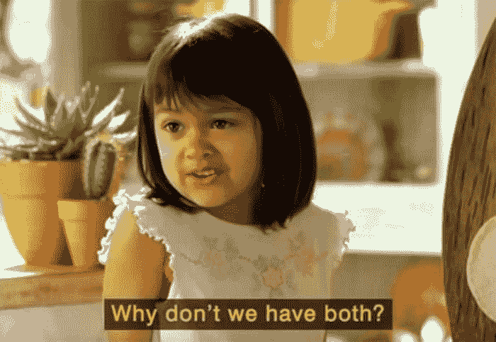
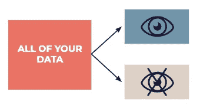

# 分析师和统计学家能相处吗？

> 原文：<https://towardsdatascience.com/can-analysts-and-statisticians-get-along-5c9a65c8d056?source=collection_archive---------5----------------------->

## 数据科学专业之间微妙的战争

图片:[来源](https://www.google.com/imgres?imgurl=https%3A%2F%2Fi.ytimg.com%2Fvi%2FpzcOxS5JXTM%2Fmaxresdefault.jpg&imgrefurl=https%3A%2F%2Fwww.youtube.com%2Fwatch%3Fv%3DpzcOxS5JXTM&docid=QYZzG6otr7A2AM&tbnid=1DkBFN7GFTIf2M%3A&vet=10ahUKEwj4uZC_7pznAhVDSN8KHSDFAIwQMwhGKAAwAA..i&w=1280&h=720&bih=667&biw=1440&q=fight%20funny&ved=0ahUKEwj4uZC_7pznAhVDSN8KHSDFAIwQMwhGKAAwAA&iact=mrc&uact=8)。

在[之前的一篇文章](http://bit.ly/quaesita_versus)中，我解释了在[统计](http://bit.ly/quaesita_statistics)和[分析](http://bit.ly/quaesita_hero)中的典型培训项目赋予毕业生[不同的技能组合](http://bit.ly/quaesita_universe)。

当你处理不确定性时，分析师会帮你提出更好的问题，而统计学家会提供更严谨的答案。这看起来像是合作梦想的组成部分，然而不知何故，这些职业最终会相互争斗。让我们看看我们是否能够理解分析和统计之间的奇怪战争(并建议和平条约)。

分析师和统计学家:玻璃容器中不相容的物种？图片:[来源](https://i.pinimg.com/474x/09/88/7f/09887f48af95256c8e522183005cd499.jpg)。

# 定义

由于[数据科学职称](http://bit.ly/quaesita_bubble)可能无法准确反映人们的实际工作，让我来定义一下我的术语:

*   那些关注于看数据来总结数据并从中提取灵感的人，就是我所说的 [*分析师*](http://bit.ly/quaesita_hero) 。
*   那些关心严格测试数据驱动决策的假设的人，我称之为统计学家。
*   懂得两者兼顾的人……都是*都是*。这篇文章没有提到分析师和统计学家的混合体，但是你可以在这里找到我对他们的想法。
*   那些对两者都敷衍了事，却至少误解了其中一个的人是数据骗子。前往[这篇文章](http://bit.ly/quaesita_charlatan)了解更多信息。
*   那些既懂得如何做又*也*拥有 [ML/AI](http://bit.ly/quaesita_emperor) 专长的人我称之为*数据科学家*。这种全才确实少见。你可以在我的其他文字中读到他们:[ [1](http://bit.ly/quaesita_datasci) ，[ [2](http://bit.ly/quaesita_bubble) ，[ [3](http://bit.ly/quaesita_hero) ，[ [4](http://bit.ly/quaesita_roles) ，[ [5](http://bit.ly/quaesita_roles) ]。请注意，对于如何定义数据科学角色，不同的组织有不同的标准，因此在假设之前，最好检查每个人都在谈论相同的事情。

> 分析帮助你形成假设，而统计让你测试它们。

当分析师们专门研究如何快速探索你的一堆混乱的数据集时，统计学家们则更关注于推断出更多的东西。

# (数据)贫困的负担

由于收集数据的努力和在 20 世纪的小型硬盘上存储数据的成本，上个世纪的数据集往往很小。即使是一个值得尊敬的数据集，也很难收集到足够的数据，这意味着[数据分割](http://bit.ly/quaesita_sydd)很少是一个选项。这迫使专业人士在两种截然不同的心态中做出选择。

> 数据行业之间的对立是数据饥荒的一个挥之不去的影响。

图片:[来源](https://www.pinterest.com/pin/299770918939487893/)。

*(为了理解本文中的一些细微差别，你需要理解一个数据点可以用来* [*产生灵感或者测试一个理论*](http://bit.ly/quaesita_history) *，但不能两者都用。通过数据分割，你可以鱼与熊掌兼得。如果你想更深入地探究为什么这是真的，请阅读***。)**

> *无论你属于哪一个阵营，你可能会认为另一个阵营正在试图做你的工作……而且他们在这方面做得出奇的差。*

*如果您在数据饥荒的黑暗时代接受了数据科学培训，您可能会怀有一种讨厌的刻板印象，这种印象源于未能理解分析师和统计学家扮演不同的角色。无论你属于哪一个阵营，你可能会认为另一个阵营正在试图做你的工作……而且他们在这方面做得出奇的差。*

# *讨厌的刻板印象(以及为什么你会有它们)*

**

*图片:[来源](https://bleacherreport.com/articles/2452546-floyd-mayweather-vs-manny-pacquiao-results-boxing-is-mega-fights-big-winner)。*

## *统计学家如何看待分析师*

*一句话:*邋遢*。与统计学家不同，大多数分析师没有受过严格思考不确定性下哪些结论有效的训练，但这没关系……只要他们不试图做出超出数据的结论。相反，分析师最大的优点是速度——尽可能快地找出数据集中的内容。*

*在数据中随意跳跃的想法惹恼了许多统计学家。最近，我参与了一次对话，对话中一位统计学家(不是我！)反对开发更快的分析工具，因为“这会招致误用。”没错。用一只泥泞的大靴子践踏整个[分析生涯](http://bit.ly/quaesita_hero)的有效性。*

**

*图片:[来源](https://www.primogif.com/p/xUPGchynt251wOIbdK)。*

*事情是这样的:他是对的，这些工具对统计学家不利。不过，工作是不同的。不幸的是，大多数人——包括他——都不理解这种差异。*

*如果你不能[分割你的数据](http://bit.ly/quaesita_sydd)并且你在决定问哪些问题之前查看所有的数据，那么你是在做分析，而不是统计。这不一定是一件坏事；分析很重要也很有用——它让我们产生灵感，从而找到前进的方向。当[分析师试图将](http://bit.ly/quaesita_bsides)灵感作为更严谨的东西出售时，麻烦就开始了。*

> *遵循一条黄金法则:在出手之前先做决定，或者坚持描述你面前的事物。*

*真正的统计学家会对你所谓的“洞察力”嗤之以鼻，如果你没有遵循一条黄金法则:在做出决定之前先做出决定。否则，坚持描述你的数据集，不要超越它。请不要把自己看得太重，也不要要求任何人。*

**

*关于如何使用[未拆分数据](http://bit.ly/quaesita_sydd)响应分析的手册。*

*事实上，如果我们把每个人都视为在做描述性分析，直到被证明并非如此，那么我们在数据推理中都会是最安全的。*

> *来自未拆分数据的“见解”？那只是你的看法，伙计。*

*除非你向我证明你的理论让你在出手之前*出手，否则我会假设你向我展示的东西只存在于你发现它的地方。[人们在各种事物中发现模式](http://bit.ly/quaesita_inkblot)——特别是当他们被激励尽可能随心所欲地思考时——所以你不会给我留下深刻印象，除非你在*看到模式之前*预测到模式的存在。除非你能保证(并证明)数据访问日志，有人吗？)你的假设先于你的数据，你告诉我的任何事情都应该被视为“那只是你的观点，伙计。”**

> *方程是不够的，它们不能把一个破碎的过程变成一个可信的概括。*

*为了让对数据的探索不仅仅是描述性分析，你必须遵循一个特定的过程。仅仅因为你的软件吐出一个 [p 值](http://bit.ly/quaesita_puppies)并不意味着真正的[统计推断](http://bit.ly/quaesita_fisher)发生了。你必须着手[构建背景](http://bit.ly/quaesita_default)并收集数据，以某种方式释放你正在做的事情的哲学有效性。等式是不够的，它们不能把一个破碎的过程变成一个可信的概括。让我们小心地使用我们的语言，称一切事物为"*灵感"*或"*分析"*，直到被证明不是这样。*

*对分析师的抨击够多了。让我们去找一些统计学家吧！*

## *统计学家在分析师眼中的形象*

*一句话:*迂腐*。与分析师不同的是，大多数统计学家没有接受过帮助你了解哪些兔子洞值得挖的粗略扫描训练。对于一个分析师来说，你的普通统计学家可能看起来像是皇家的浪费时间者，尤其是如果他们参与了项目的错误阶段。*

**

*许多统计学家喜欢正确地做事，即使这些事情一开始并不总是值得去做。这让人想起一个严厉的五岁小孩对待沙堡就好像它是神圣的一样，并且对想要加入建造乐趣的四岁小孩大喊大叫。不足为奇的是，分析师将这些统计学家视为一种强力胶，会粘在第一个飘过的东西上。(这种自以为是的态度也于事无补。)图片:[来源](https://fee.org/articles/build-a-sandcastle-get-fined-500-and-maybe-go-to-jail/)。*

**

> *大多数决策最不需要的就是统计暴政。*

*生活中的许多决定根本不值得付出太多努力，如果我们对每件事都采取仔细的统计方法*，我们就不会完成太多事情。如果你在第一件引起你注意的事情上全力以赴，你确定你没有错过更有价值的利用时间的机会吗？(当然，这不是仔细的数学，但拜托，我只是在这里点餐。)**

****

**当统计学家在对探索性数据的不恰当探索中大声表示反对时，他们在有商业头脑的人看来是可笑的。图片:[来源](https://www.pinterest.com/pin/283375001523213594/)。**

**我经常想知道*为了严谨而严谨*的现象是否是上数学课的产物，在数学课中，例子是琐碎的废话，计算越来越华丽。幼儿园的*“如果萨莉在一块地里有二十只兔子……”*一直坚持到研究生院，在那里它需要三倍积分才能获得金星。**

**在经历了这么多兔子之后，谁能责怪一个统计学家把一切都看得太重呢？这些课程实际上要求你为愚蠢的问题提供复杂的答案，那么，你对一群在这些课程中成长了十年的员工有什么期望呢？大量雇佣数学/统计崇拜者会让你避免一些问题，但也会让你暴露给其他人，包括那些让那些没有 110%用心建造每一座沙堡的人日子不好过的恶霸。**

**撇开我随意的因果推论不谈，如果你有一个队友会全身心地投入到严谨的工作中，那么希望这种严谨是*值得*追求的。如果你的队友不知道去哪个兔子洞，他们需要有人给他们指出正确的方向。**

**有了分析师的帮助，统计学家不再需要在黑暗中摸索，在头脑中构建一个宇宙，以找出如何提出问题。相反，他们可以让分析师去启发他们的假设和设想。**

**那么，为什么统计学家不乐意让分析师帮助他们确定什么是值得做的，为什么分析师不乐意把检验我们的结论不是废话的那部分交给统计学家呢？为什么对立和缺乏尊重？**

****

## **解锁协作**

**在[糟糕的过去](http://bit.ly/quaesita_history)，数据集太小[无法分割](http://bit.ly/quaesita_sydd)，所以[必须在使用它们进行分析和统计之间做出选择](http://bit.ly/quaesita_versus)。这意味着这两个组将不得不为每个数据集而战。**

> **在采用现代数据科学方法的组织中，分析师(灵感/探索)和统计学家(严谨/测试)之间的紧密合作是文化的一部分。**

**由于硬件的改进和更低的存储成本，今天许多努力正在突破一个数据集的天花板，迎来了一个数据丰富的时代。***

****

**将您的数据分成一个探索性数据集和一个测试数据集，每个人都可以从中获得灵感，测试数据集稍后将由专家用于对探索阶段发现的任何“见解”进行严格确认。**

**现在，分析师和统计学家可以收到他们自己的原始数据集，让勘探专家与测试专家和谐地工作，每个小组都贡献自己最擅长的东西……假设他们可以放弃一见面就互相争斗的习惯。**

> **假设的产生和检验之间有效合作的代价是数据量。**

**分析师可以将他们的文章作为指导思考，以找出什么是值得追求的，当他们缩小了企业最关心的问题时，剩余的文章让统计学家有机会严格检查分析师的直觉是否值得采取行动。**

**组织*可以*在数据学科之间建立共生关系…而且他们应该这样做！欢迎来到数据丰富的现代时代！***

****

**图片:[来源。](https://www.bernardmarr.com/img/blog/what-is-big-data.png)**

## ***旺盛阻尼器**

**尽管今天的典型数据集比上世纪的数据大得多(并且[更容易共享/访问](http://bit.ly/quaesita_datasearch)),但仍有一些用例被困在单一数据集时代，因为初始数据收集非常费力或昂贵。我职业生涯中的一个例子是 [fMRI 数据](http://bit.ly/wiki_fmri)——即使在今天，扫描一个人的大脑也是非常昂贵的，所以具有几十次扫描的神经科学数据集仍然被认为是令人印象深刻的。这也是认为所有的数据都是大数据的幼稚想法的一个原因。在某些主题中，信息非常匮乏，从事这些主题工作的人面临着一个数据集的现实。**

**如果这听起来像你的环境，试着考虑一下哪个阵营说了算，并尊重来自其他阵营的人——他们提供的服务与你的完全不同，你最好记住他们是自己领域的专家，即使你的企业选择了你的服务而不是他们的。**

# **感谢阅读！人工智能课程怎么样？**

**如果你在这里玩得开心，并且你正在寻找一个为初学者和专家设计的有趣的应用人工智能课程，这里有一个我为你制作的娱乐课程:**

**在这里欣赏整个课程播放列表:[bit.ly/machinefriend](http://bit.ly/machinefriend)**