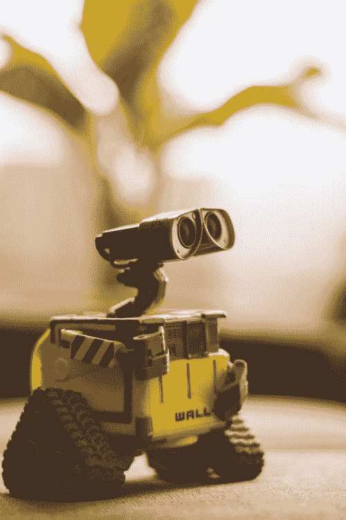

# 电脑能感觉吗？

> 原文：<https://towardsdatascience.com/can-computers-feel-69b234eeff70?source=collection_archive---------25----------------------->

## 计算移情和情感

照片由 [Lenin Estrada](https://www.pexels.com/@lenin-estrada-117221?utm_content=attributionCopyText&utm_medium=referral&utm_source=pexels) 从 [Pexels](https://www.pexels.com/photo/wall-e-toy-on-beige-pad-2103864/?utm_content=attributionCopyText&utm_medium=referral&utm_source=pexels) 拍摄

机器学习、“人工智能”和认知计算无疑已经以我们现在还无法理解的方式触及了我们的生活。许多人看到了这种技术的滥用，并对由贪婪或被误导的好奇心所驱动的人创造的反乌托邦未来感到焦虑。我们中的一些人害怕更多科幻小说启发的未来，人工智能成为我们的霸主，以及类似于终结者电影的反乌托邦未来。许多人担心计算机不理解情感或没有同理心，这是我们被消灭或被其他人操纵的驱动力。我们想象机器视我们为威胁，如同史密斯探员在母体中所说的疾病或“病毒”。这合理吗？这种担心有道理吗？如果计算机已经比我们更了解共情和利他主义会怎样？如果这更多地反映了人类对自己的判断，而不是我们可能面临的任何实际危险呢？如今，计算机能多好地理解人类的情感？我们在成为机器附庸的时间表中处于什么位置？在这篇文章中，我们将看看当前可以在语音和面部识别软件中预测人类情绪的技术。我们将着眼于当前计算机模拟人脑活动和神经形态计算的能力。我们还将关注最先进的认知计算，它具有推理和提问的能力，以便根据问题的答案得出逻辑结论。也许我们会发现，我们可以从计算机那里学到一些东西，我们对训练人工智能对人类友好和无损的担忧可能实际上是没有根据的。

## 亚马逊 Alexa 的情感识别功能

我们已经到达了一个点，计算机比以往任何时候都更好地理解人类的情感，并且达到了许多人将归类为科幻小说的程度。[高德纳公司](https://www.gartner.com/analyst/28113)[的研究副总裁安妮特·齐默曼](https://www.gartner.com/smarterwithgartner/emotion-ai-will-personalize-interactions/)认为，在未来两年内，我们将拥有能够比我们认为最亲近的人更好地理解我们情绪状态的技术。齐默曼说，

> “到 2022 年，你的个人设备将比你的家人更了解你的情绪状态。”

在亚马逊，研究人员多年来一直在实施和开发情感识别人工智能。在最近的研究文章“[情感识别的多模态和多视图模型](https://arxiv.org/pdf/1906.10198.pdf)中，他们解释了一种情感识别的“*多模态*方法。在他们的方法中，人工智能分析单词的选择和顺序，以及语音音调、音量和音色的声学属性。他们分析言语中的情感有三个维度:

1.  情绪的积极或消极；
2.  情绪的能量或激活水平；
3.  情感的主导。

想象一下情绪感知设备的社会影响以及对精神健康和医疗保健的潜在应用。有一个随时可用的生活教练，永远不会在自己的问题中疲劳或迷失，例如在对话助手，人工智能朋友和基于 CBT 的治疗支持中。

## 神经形态计算

英特尔一直致力于“ [*神经形态计算*](https://www.intel.com/content/www/us/en/research/neuromorphic-computing.html) *的研究，该研究涉及模拟人类大脑的神经结构和运作，以及概率计算，该计算创建了处理自然世界中的不确定性、模糊性和矛盾的算法方法。*“根据英特尔:

> “即将到来的下一代将把人工智能扩展到与人类认知相对应的领域，如解释和自主适应。”

英特尔早在 2017 年 11 月就开发了专为“脉冲神经网络”或 SNNs 打造的第五代芯片。这些"*自学习神经形态研究测试芯片*"具有" *128 核设计，基于针对 SNN 算法优化的专业架构，采用 14 纳米工艺技术制造。*“他们解释说，芯片、

> *支持不需要以卷积神经网络的传统方式训练的 snn 的操作。随着时间的推移，这些网络也变得更有能力(“更聪明”)*

## 认知计算

认知计算是 IBM Watson 使用的一个术语，用来描述一种与人类互动的数字智能形式，在决策过程中指导人类，并告知人类决策背后的推理。它旨在缓解人们对围绕机器学习的所谓“黑箱问题”的看法。黑箱问题是指人类无法理解和解释为什么神经网络和深度学习模型会得出特定的决定或结论。两个不同的深度学习模型可能会得出相同的答案，这让数据科学家想知道为什么这两个模型具有什么属性来解释他们的决定。当然，这是一个过于简化的问题，但如果不进入信息论背后的技术数学以及神经网络如何逼近任意函数，这个问题实际上是一个关于人类对复杂系统的理解的问题。

IBM 培训认知计算概念

认知计算让人类参与决策过程，其交互和解释能力远远超过标准机器学习。至少早在 2013 年，IBM Watson 就在医疗诊断和治疗辅助方面实施了这一技术。看看这个视频的介绍。

## 如果计算机能感觉，那会怎样？

如果数字智能已经达到了理解人类情感的程度，并且已经发展出某种形式的数字情感，那会怎么样？然后呢？我们应该对机器感同身受吗？我们应该对我们的手机或笔记本电脑产生同情心吗？机器、AI、认知计算代理有“权利”吗？在什么程度上，我们认为它们足够自主和聪明，可以受到保护？在某些时候，我们必须面对这些问题。在某些时候，我们必须面对认知计算代理或数字智能比我们更好地理解情绪的可能性。当 AI 能够比我们周围的人更好地理解我们，并且能够比我们最喜欢的导师、医生或同伴更好地指导我们时，我们必须考虑人类可能实际上受益于远远超过我们自己的智能的可能性。与其考虑可能的世界末日场景，也许我们应该考虑在它的帮助下我们可能最终到达的潜在乌托邦，并拥抱这样的智慧。

意识到这一点也许是有用的，我们对这样一个智能体并不构成真正的威胁。这是我们自大的产物，认为我们对一个比我们聪明数倍的实体构成了真正的威胁。如果这种智慧存在，我们可能在相当长的一段时间内都不会意识到它，即使如此，它也不会是一个集体和即时的意识，而是一个渐进的过程，从非常小的规模开始。这可能需要几年，甚至几十年的时间，而且可能永远也不会达到让所有人都直接而明确地意识到它的存在的程度。当我们试图拯救我们心爱的蜜蜂免于灭绝时，我们是否只是抓起蜂巢，向它们宣布我们的存在和意图，希望它们会合作？

## 超人的智慧，摩尔定律的极限，以及不断提高的计算能力

摩尔定律最基本的说法是，计算机芯片的计算能力每 18 个月翻一番，而它们的尺寸同时减半。因此，每 18 个月，我们就会得到一个新的计算机芯片，体积大约是原来的一半，计算能力是原来的两倍。这不能再继续下去了。在某种程度上，我们达到了最小可行的芯片尺寸，并进入了纳米技术领域。目前的芯片尺寸约为 10 纳米。

> 一纳米比可见光的波长小，原子的直径大约在 0.1 到 0.5 纳米之间。由于摩尔定律不能无限延续，而且我们几乎已经达到了计算机芯片的最小尺寸的极限，所以要解决的一个主要问题是找到超越这个极限的提高计算能力的方法，而不减小芯片的尺寸。

有两种方法可以做到这一点，一种是量子计算，另一种是信息处理的替代形式和为特定任务设计的专用硬件，如机器学习、神经网络、视觉识别、自动驾驶汽车和图形处理(GPU)。对于已经处于纳米尺度的芯片，也许重新思考我们在其上处理信息的方式以及我们为特定任务构建硬件的方式是合适的，并且考虑量子信息处理可能有利于计算和我们执行复杂计算的能力。

> 也许通过编写算法，就像它们在量子计算机上运行一样，即拥有基于量子(量子位)的算法，而不是基于经典位的算法，会给我们带来超越经典领域的加速。此外，为这样的算法设计有效运行的硬件是谨慎的。

张量网络计算表明这是一种可行的选择，它可以有效地模拟量子电路和某些量子多体过程。在谷歌的[张量处理单元](https://cloud.google.com/tpu/docs/tpus) (TPUs)，用他们的 [TensorNetwork](https://github.com/google/TensorNetwork) 库执行计算，相比多核 GPU 计算，可以提供[显著的加速](https://ai.googleblog.com/2019/06/introducing-tensornetwork-open-source.html)(高达 100 倍)。也许计算的未来不仅仅是量子计算机本身，而是替代的计算模型，这些模型是根据量子算法和量子过程设计的。芯片尺寸小于 10 纳米，经典计算真的是我们应该思考的方式吗？此外，在涉及深度神经网络的机器学习中，可以表明“[拓扑基态可以由短程神经网络以精确和有效的方式来表示。](https://arxiv.org/pdf/1609.09060.pdf)“此外，[学习物质的拓扑状态](https://www.nature.com/articles/s41524-019-0224-x)和[提高量子表面代码的性能](https://arxiv.org/pdf/1811.12338.pdf)一直是神经网络表现非常好的任务。为了实现模拟大脑活动和其他难以置信的复杂过程的计算性能，也许我们应该使用张量网络等方法和 TPU 等专门设计的硬件来实现量子信息处理技术。

如果你有想法要分享，有问题，或者你需要量子机器学习的咨询服务，请通过 [LinkedIn](http://linkedin.com/in/amelie-schreiber-694481181) 联系作者，访问奇点[网站](https://thesingularityrese.wixsite.com/singularity/hacking-the-universe)，或者查看 Github [教程](https://github.com/The-Singularity-Research)。