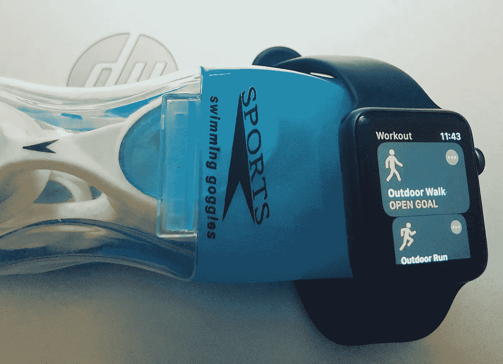
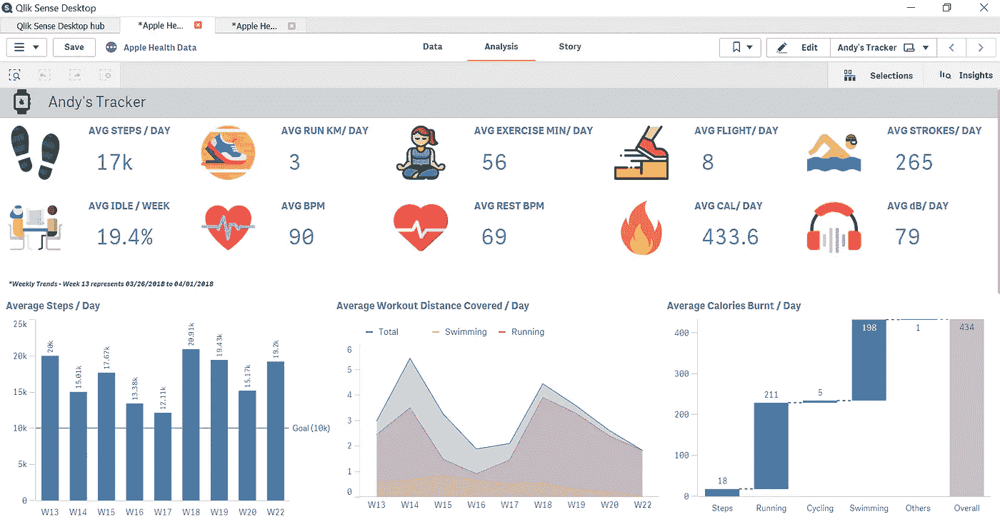
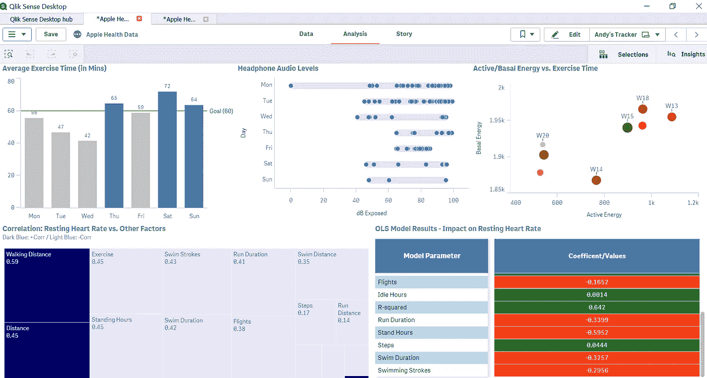

# 数据科学能成为我高效锻炼的教练吗？

> 原文：<https://towardsdatascience.com/can-data-science-become-my-trainer-for-efficient-workouts-d62ad533a20b?source=collection_archive---------23----------------------->

## 我如何使用 Apple Watch、Jupyter 笔记本和 QlikSense 来实现更好的静息心率；相关因果分析；

“我的手表，我的泳镜，我的笔记本电脑，我的规则”——P

> “在过去的一年里，我体重增加了近 10 公斤，这都要归功于辛辣的印度食物和海德拉巴的比里亚尼。然而，几个星期前，我下定决心要重新开始锻炼。以前，我花了几个月的时间来健身，却只能看到徒劳的努力和令人心碎的结果。这是我的最后一个作弊日，当我埋头吃新鲜烹制的香辣咖喱鸡时，我突然有了这个想法。
> 
> 如果我使用 apple watch 的历史数据来确定影响最大的健身程序，并据此制定每周计划，会怎么样？我知道你现在在想什么！私人教练或者好的教练呢？想象一下，如果数据科学最终成为你的教练，通过正确的常规组合来实现更好的健康，会怎么样？"

[Apple Watch Series 4 现在是 FDA 批准的 2 类医疗设备](https://www.forbes.com/sites/jeanbaptiste/2018/09/14/apple-watch-4-is-now-an-fda-class-2-medical-device-detects-falls-irregular-heart-rhythm/#126240532071)，具有跌倒检测和更好的心脏监测功能。健身追踪器将逐渐成为我们健康的“守护者”。现在是我们探索所获得的数据的时候了，而不仅仅是看数字和锻炼圈。为了更好地理解这一分析，让我们来看看一些关键指标(鸣谢:iPhone 健康应用)。

*   **步数** —一天中所走的步数。计步器记录任何涉及运动的活动的步数，包括走路、跑步、爬楼梯，甚至是你做日常家务时的运动
*   **楼梯段** —一段楼梯被计为大约 3 米(10 英尺)的高度增益(大约 16 级台阶。)
*   **游泳姿势**——自由泳、仰泳、蛙泳或蝶泳时手部的总动作
*   **站立时间** —站立时间代表我们一天中的一个小时，你站着并稍微走动至少一分钟。一个站立小时被分解成几个空闲和站立的实例
*   **心率** —你的心脏每天大约跳动 100，000 次，在休息和运动期间加速和减速。你的心率指的是你每分钟心跳多少次。计算为 BPM
*   **静息心率** —你的静息心率是在你静止或放松几分钟后测得的每分钟平均心跳次数。一般来说，较低的**静息心率**表明更有效的**心脏**功能和更好的心血管健康
*   **主动&基础能量** —主动能量是对行走、推轮椅、跳舞、锻炼或做家务等活动中消耗的能量的估计。另一方面，基础能量是对休息时你身体燃烧的卡路里的估计
*   **音量** —代表耳机音频的音量，以加权分贝(dB)为单位
*   **锻炼时间/所走距离/持续时间** —这些都是我们每天听到的常规。Apple Watch 可以通过**例行**即骑自行车、跑步、游泳&走路来追踪这些

*注意:当你开始使用健身追踪器时，最初的兴奋会让你的锻炼达到峰值。过了一点，身体就习惯了，你就看不到同样程度的卡路里燃烧了。因此，重要的是在更长的时间内分析相同的活动，以了解身体在强度方面的平稳状态。*

# 安迪的追踪器——健康决策板

苹果的健康应用允许你以 XML 格式导出你的健康记录。您可以使用 Python (Jupyter Notebook)处理和操作数据，并使用 QlikSense 等可视化应用程序导入数据，以创建自己的决策板。iPhone 健康应用程序和活动跟踪器都带有仪表盘。这对你做出明智的决定有帮助吗？部分是，部分不是！

> 你的教练能告诉你如果你多游半个小时或多跑一会儿会发生什么吗？是的，他们可以。标准答案是**“你的体能会提高”！但是，如果你只需要一千米的高强度跑步和半小时的游泳就能保持健康，那会怎么样呢？如果听着最佳音量的音乐，走几段楼梯，游一个小时的泳就足够了，那会怎么样？这就是数据科学和机器学习的用武之地。**

快照 1:使用 QlikSense Desktop 开发的决策板

***作者注:*** *我用* [*Marwyk 的代码*](https://github.com/markwk/qs_ledger/tree/master/apple_health) *把手机健康 App 的 XML 数据转换成结构化格式。运行 Marwyk 的代码创建了多个 CSV 数据集，每个数据集在时间戳级别单独跟踪一个指标(**YYYY-MM-DD hh:MM:ss*)。*然后我使用 Jupyter Note Book 在一天的水平上争论、操作、清理和总结数据，这形成了我的* ***分析数据集(ADS)。****ADS 用于启动* ***QlikSense 仪表盘*** *，最后进入* ***OLS 回归模型*** *，帮助我理解各种例程的交互。自从我一年半前开始锻炼以来，我可以访问从 3 月 18 日到 5 月 18 日的 3 个月的完整数据。*

# 建立回归模型——向分析我日常工作的潜在 DNA 迈进了一步

## 什么是线性回归，为什么我们需要线性回归？

多元线性回归用于解释一个连续变量和两个或多个自变量之间的相互作用。在这个例子中，静息心率(健康指标)是我的因变量/连续变量，以及其他因素，如锻炼时间、距离、航班等。是我们的独立变量。我们需要多元回归模型的原因是为了了解和量化多个锻炼因素对健康的综合影响，而不是孤立地看待它们。注意，单独跑步和游泳结合起来对我们健康的影响可能是不同的。多元线性回归帮助我们理解这些相互作用。

让我更多地关注调查结果，而不是谈论提出仪表板或最终模型所涉及的过程。因为我没有每天记录体重，所以我用静息心率来代表我的整体健康状况。我回归了静息心率的其他变量，如步数、锻炼时间、基础能量、游泳持续时间、游泳次数、音量、跑步等。在开发模型时，牢记线性回归的所有五个假设，即线性关系、多元正态性、没有或很少多重共线性、没有自相关和同方差。对数据集进行了缺失值处理和 Z 分数标准化。因为我不会每天执行所有的程序，所以所有缺失的值都被替换为零。我有 90 天的数据，因此我使用 K-Fold 交叉验证技术来获得最终的模型结果。 ***请注意，这只是初步结果，模型统计数据(R 平方=0.642)仍可改进。***

快照 2:包含其他摘要和模型结果的仪表板

# 为什么我称之为决策委员会？

决策板是仪表板的另一个名称，其中包含**关键见解&发现。**想象一下看着你手机的内置追踪器。它只是向你展示纯粹的数字和精美的图表。你的数据应该告诉你一个故事，这是我的发现。

*   **游泳 vs 跑步？—努力更少，影响更大。**如果我游完了跑步机或正常跑步距离的三分之一，我会看到类似的卡路里燃烧*(参考快照 1)*
*   我应该控制我的音量吗？—是的，但可能是在周一和周二，我观察到全天的音量变化较大。了解我们暴露在嘈杂音频中的时间有多长是有帮助的，因为这会影响我们的听力和整体健康*(参考快照 2)*
*   **我的目标在哪里？**——在锻炼方面低于标准。 ***与锻炼*** 相比，步数没有太大影响(见模型结果)，锻炼可以显著提高我的静息心率。大多数时候，我的运动量都比我的目标少*(参考截图 2)*
*   **什么最适合我的身材？** —确保有足够的站立时间。我们大部分时间都无所事事地坐在笔记本电脑前。确保每小时快走一分钟*(参考快照 2 的模型结果)。*与跑步相比，游泳作为一种独立的日常活动对静息心率有更好的影响。然而，当两者都做的时候，确保例行程序被均匀地分开，因为它们在一起不会压倒另一个

# 后续步骤

*   更好地理解参数相互作用，以及按时间间隔(如上午、下午和晚上)分解参数是否会改善模型结果
*   调查其他可追溯的因素，如会议时间、社交媒体聊天时间、工作时间等。并将它们作为独立变量
*   由于较高的自相关性，很少变量被遗漏。像 PCA 这样的降维技术有用吗？
*   向仪表板中的运行状况 KPI 添加目标指标

我希望你觉得这是有用的。我目前正利用这些结果来计划我的日常活动，主要集中在一小时的游泳和一些初始热身跑上。我养成了提高站立时间的习惯，将空闲时间减少了 2 个百分点。在未来的日子里，数据科学将对医疗保健行业产生更大的影响。我坚信我的分析只是一切可能的开始。如果您想在这个分析上进一步合作，或者想重用代码片段并改进模型结果，请随时给我留言。

***注来自《走向数据科学》的编辑:*** *虽然我们允许独立作者根据我们的* [*规则和指导方针*](/questions-96667b06af5) *发表文章，但我们不认可每个作者的贡献。你不应该在没有寻求专业建议的情况下依赖一个作者的作品。详见我们的* [*读者术语*](/readers-terms-b5d780a700a4) *。*