# 数据科学能帮助我们找到是什么造就了一部热门电视剧吗？

> 原文：<https://towardsdatascience.com/can-data-science-help-us-find-what-makes-a-hit-television-show-861d103c6e44?source=collection_archive---------36----------------------->

## 使用 Keras-Tensorflow-LSTM、沃森 NLU 和沃森个性洞察对谈话记录进行文本分析。


照片由[乔纳斯·雅各布森](https://unsplash.com/@jonasjacobsson?utm_source=unsplash&utm_medium=referral&utm_content=creditCopyText)在 [Unsplash](https://unsplash.com/s/photos/audience?utm_source=unsplash&utm_medium=referral&utm_content=creditCopyText) 上拍摄

我最近在洛杉矶的数据科学沙龙上谈到了从情景喜剧脚本中获得属性，以及确定学习制作一部流行电视节目的本质的可能性。这篇文章将介绍所进行的调查，以及我在神经网络训练以及利用预先训练的沃森 NLU 和人格洞察模型后得到的结果。旅程中最具挑战性的部分是通过在互联网上随机搜索这些节目的公开网络记录来准备数据。

洛杉矶数据科学沙龙，2019 年关于“数据科学能帮助我们找到什么是热门电视节目吗？”

一般来说，我通过询问许多基于直觉领域的问题来处理数据科学项目，寻求专家的反馈，并添加/修改我的问卷。逆向工作让我知道我的成功标准，除非我确信结果，否则我会继续迭代更好的问题、模型和更好/更多的数据。请注意，令人信服的结果绝不意味着得到与我的期望一致的结果。我们做数据科学是为了调查导致事实的因素，然后使用这些属性作为基本事实进行预测，而不是相反。这是一门基于科学的艺术。

在做这个项目的时候，我也写了两篇文章[这里](/sentiment-analysis-of-the-lead-characters-on-f-r-i-e-n-d-s-51aa5abf1fa6)和[这里](https://medium.com/ibm-garage/watson-personality-insights-a-novel-use-case-on-tv-sitcoms-d556944a9045)。

在这里，我提出了以下问题

# 什么构成了热门电视节目？

> 1.是各个角色说话和行为方式的一致性吗？
> 
> 2.是在不同的地点重复拍摄，从而让你的观众觉得随着时间的推移他们了解这个地方吗？
> 
> 3.是不同角色说话和行为方式的相似/不同？
> 
> 4.是快乐、悲伤、恐惧、愤怒、厌恶等情绪的平衡分布吗？这让节目变得有趣。
> 
> 5.是人物性格的相似/不同让观众保持联系吗？
> 
> 6.是有趣的倒叙吸引了观众吗？

我将逐一回答这些问题。显然还会有更多的问题，这就是为什么在开始任何数据科学项目之前，必须寻求/研究领域专家的反馈，以确认您问的是正确的问题集。

对于这个分析，我计划使用以下三个节目——**《老友记》、《生活大爆炸》和《绝命毒师》**,我认为这将为分析创造一个公平的组合。

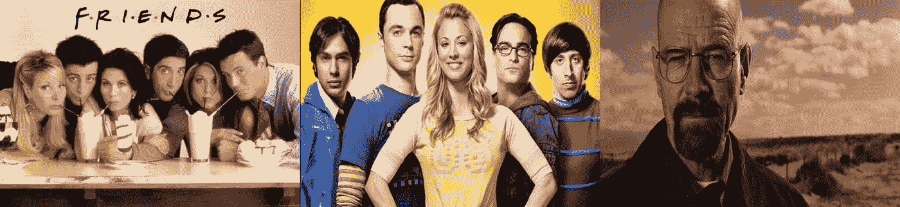

# 0.数据可用性

在广泛搜索互联网后，我从以下网址获得了 html 脚本。

*   老友记—【https://fangj.github.io/friends/】T2—10 季
*   《生活大爆炸》——【https://bigbangtrans.wordpress.com/】T4——10/12 季
*   绝命毒师—[https://en.wikiquote.org/wiki/Breaking_Bad](https://en.wikiquote.org/wiki/Breaking_Bad)—5 季(数据缺失)

以下是这些抄本的样本。

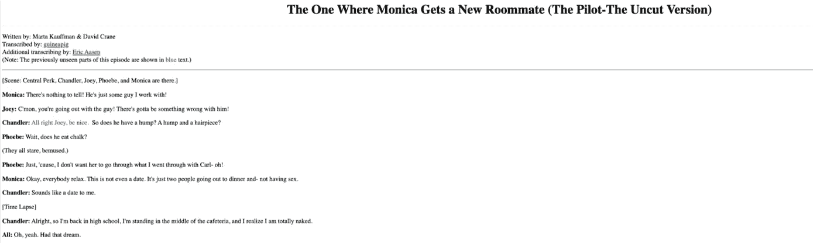

下面是一个简单的例子，说明了我是如何从上面的链接中获得的原始 html 脚本中准备用于建模的数据集的。

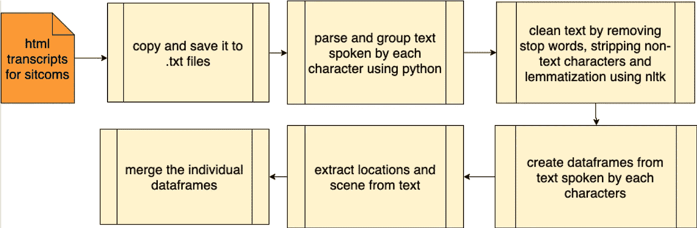

情景喜剧数据集的数据工程

请注意，我只是将这里的 html 内容复制到。txt 文件。我们甚至可以使用网页抓取来代替复制+粘贴。但是，请记住，在抓取网页之前，我们可能需要授权。运行上述步骤后，我为每个情景喜剧准备好了数据集，可以用于建模。创建的数据集中的一个示例如下所示。

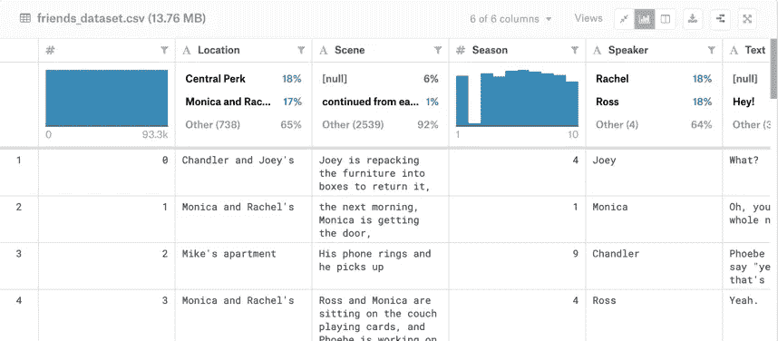

我花了很大力气来生成这些数据集。所以，我把它们上传到 Kaggle 上，以便感兴趣的人使用。可以找到[朋友](https://www.kaggle.com/shilpibhattacharyya/the-big-bang-theory-dataset)、[生活大爆炸](https://www.kaggle.com/shilpibhattacharyya/friends-sitcom-dataset)、[绝命毒师](https://www.kaggle.com/shilpibhattacharyya/breaking-bad-sitcom-dataset)的数据集。

每个情景喜剧[的数据准备和工程代码可以在这里](https://github.com/shilpibhattacharyya/sitcom_analysis---emotion-extraction-and-personality-detection/tree/master/section-0:%20create_dataset_for_sitcoms)单独找到。

# 1.沃森自然语言理解(NLU)用于字符的情感检测

我正在使用沃森自然语言理解(NLU)的字符情感检测。自然语言理解是通过自然语言处理提供文本分析的 API 的集合。这组 API 可以分析文本，帮助您理解它的概念、实体、关键字、情感等等。自然语言处理的核心是文本分类。沃森自然语言分类器(NLC)允许用户将文本大规模分类到自定义类别中。NLC 结合了各种先进的 ML 技术来提供尽可能高的精度，而不需要大量的训练数据。在幕后，NLC 利用分类模型的集合，以及无监督和有监督的学习技术来实现其准确性水平。在你的训练数据被收集后，NLC 使用 IBM 的[深度学习即服务(DLaaS)](https://www.ibm.com/cloud/deep-learning?S_PKG=AW&cm_mmc=Search_Google-_-Watson+Core_Watson+Core+-+Discovery-_-WW_NA-_-+deep++learning++service_Broad_&cm_mmca1=000019OO&cm_mmca2=10008718&cm_mmca7=9004366&cm_mmca8=kwd-385106408047&cm_mmca9=_k_Cj0KCQ) 针对多个支持向量机(SVMs)和一个卷积神经网络(CNN)评估你的数据。在这里可以找到[对应于第 **1、2、3** 段的每个情景喜剧的代码。](https://github.com/shilpibhattacharyya/sitcom_analysis---emotion-extraction-and-personality-detection/tree/master/section-1%2C2%2C3:%20emotion_distribution_nlu)

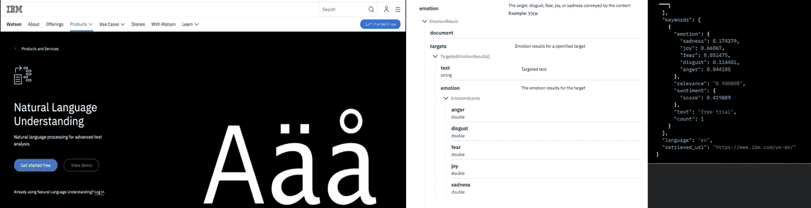

## 1.1.美国国防科学技术研究所。

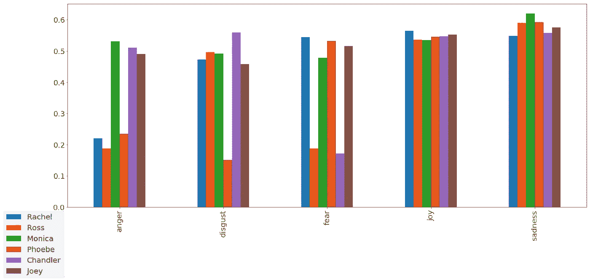

## 1.2.生活大爆炸理论

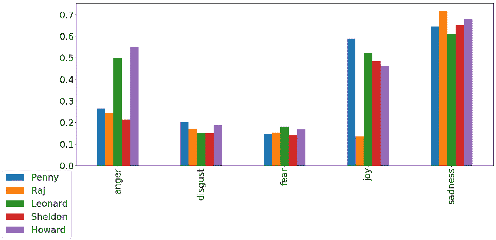

## 1.3.绝命毒师

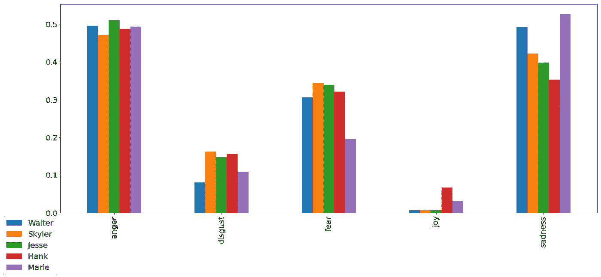

# 2.人物的情商

我引入了一个变量**‘情商’**来了解相对于节目中的其他情绪，哪种情绪是最突出的。我把它定义为:

```
Individual_Emotion_Quotient = Individual_Emotion_Score/Total_Emotion_Score
```

以下是个人情商的散点图结果。

## 2.1.美国国防科学技术研究所。

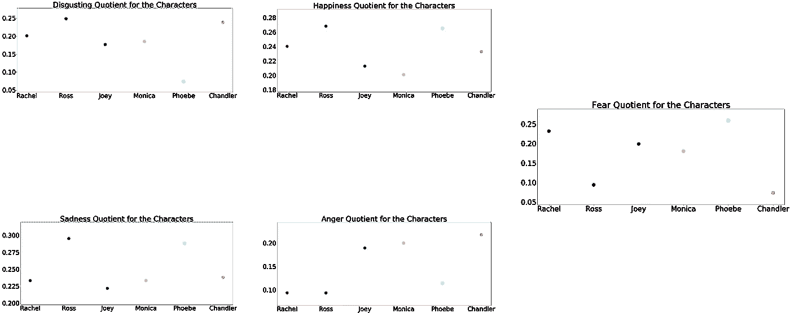

> `*We can infer that Happiness and Sadness are the key emotions of the Characters on Friends.*`

## 2.2.生活大爆炸理论

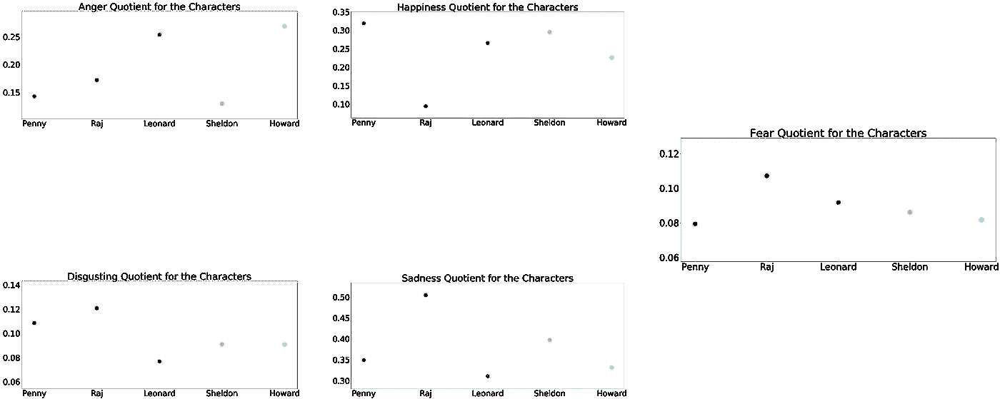

> `We can infer that Happiness is most dominant emotion of the Characters on the Big Bang Theory.`

## 2.3.绝命毒师

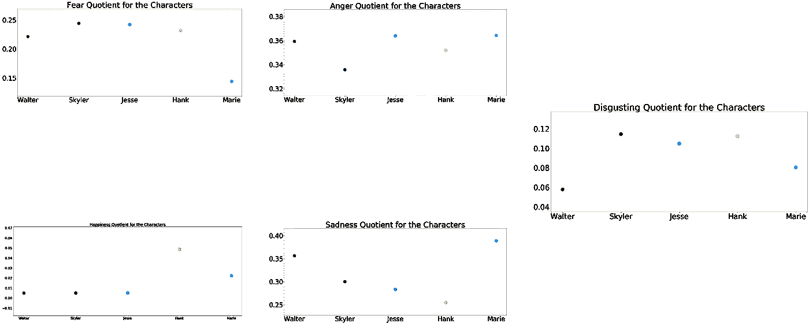

> `We can infer that Sadness and Anger are the key emotions of the Characters on The Breaking Bad.`

代码可以在[这里](https://github.com/shilpibhattacharyya/sitcom_analysis---emotion-extraction-and-personality-detection/tree/master/emotion_distribution_nlu)找到。

# 3.人物的情感密度

饼状图很好地展示了分布情况，这显然有助于生动地理解甚至很小的百分比差异。

## 3.1.美国国防科学技术研究所。

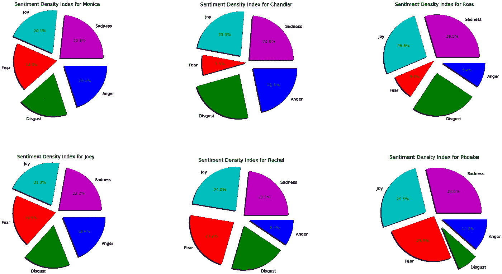

> `All the Characters are biased towards joy and sadness on Friends.`

## 3.2.生活大爆炸理论

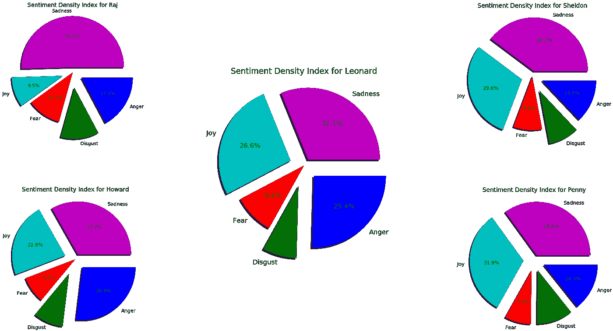

> `All the Characters are biased towards sadness on The Big Bang Theory.`

## 3.3.绝命毒师

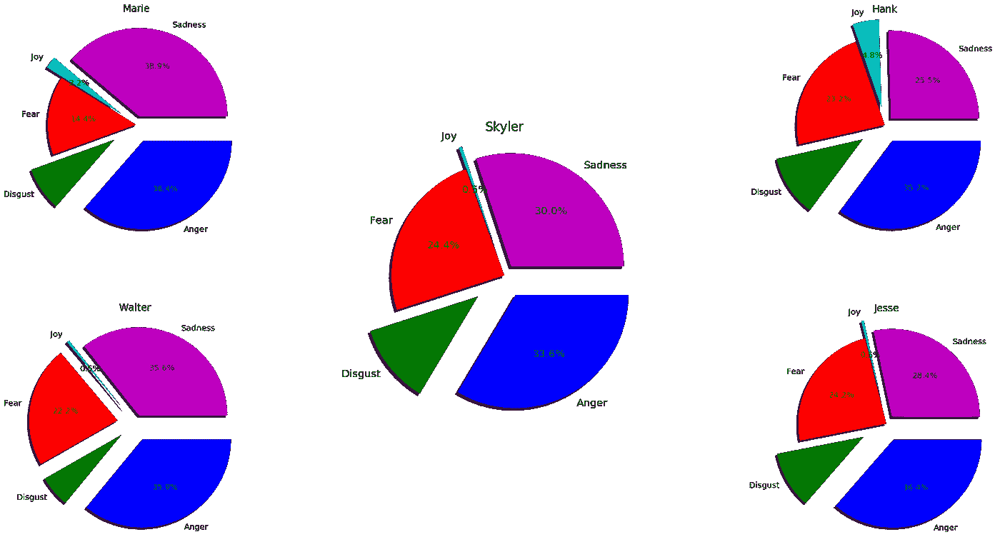

> `All the Characters are biased towards sadness and anger on The Breaking Bad.`

# 4.沃森人格洞察力(WPI)用于人物的人格调查

我在用人格洞察，通过文字来预测人格特征、需求和价值观。IBM Watson Personality Insights 服务使用语言分析从一个人通过博客、推文、论坛帖子等生成的文本数据中提取一系列认知和社会特征。沃森发现特朗普“爱吵闹”。我会把它用在剧本上，以了解每个角色的个性。第 4 段**和第 5 段**的每部情景喜剧对应的代码可以在[这里](https://github.com/shilpibhattacharyya/sitcom_analysis---emotion-extraction-and-personality-detection/tree/master/section-4%2C5:%20personality_insights)找到。

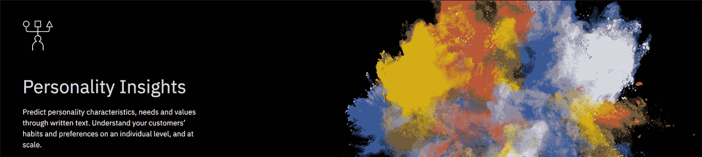

图片来源:[https://www.ibm.com/cloud/watson-personality-insights](https://www.ibm.com/cloud/watson-personality-insights)

我主要关注 WPI 的五大结果，定义如下。

1.  对他人富有同情心和合作精神。
2.  有组织的或深思熟虑的行动。
3.  **外向**在他人的陪伴下寻求刺激。
4.  **情绪范围**一个人的情绪对其所处环境的敏感程度。
5.  一个人对体验不同活动的开放程度。

## 4.1.美国国防科学技术研究所。

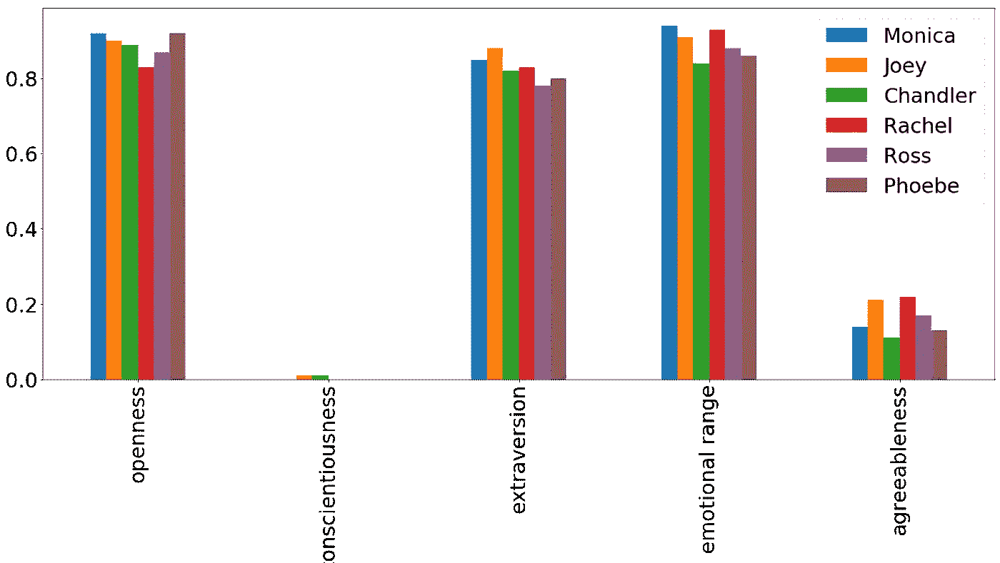

> 《老友记》里所有角色的性格看起来都差不多。

## 4.2.生活大爆炸理论

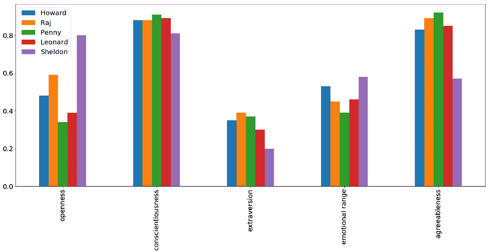

> 《生活大爆炸》中所有角色的性格看起来都很相似。

## 4.3.绝命毒师

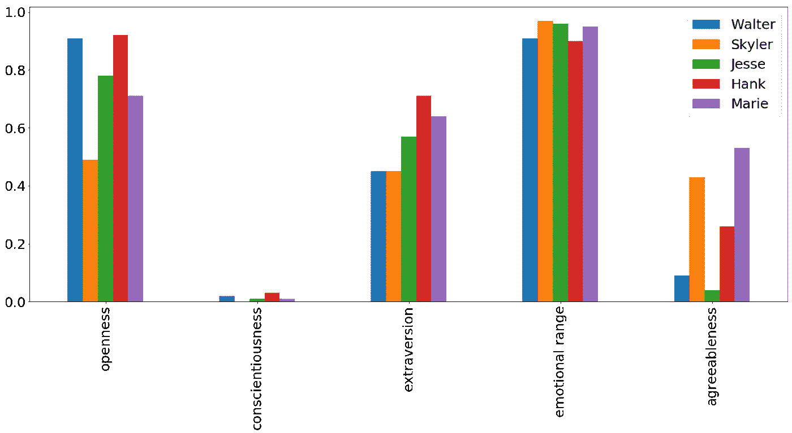

> 《绝命毒师》中所有角色的性格看起来并不十分相似。

# 5.人物的个性密度

## 5.1.美国国防科学技术研究所。

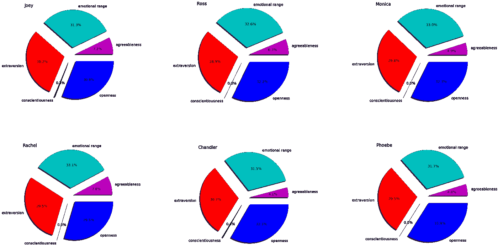

> 《老友记》中所有角色的性格都有类似的属性分布。

## 5.2.生活大爆炸理论

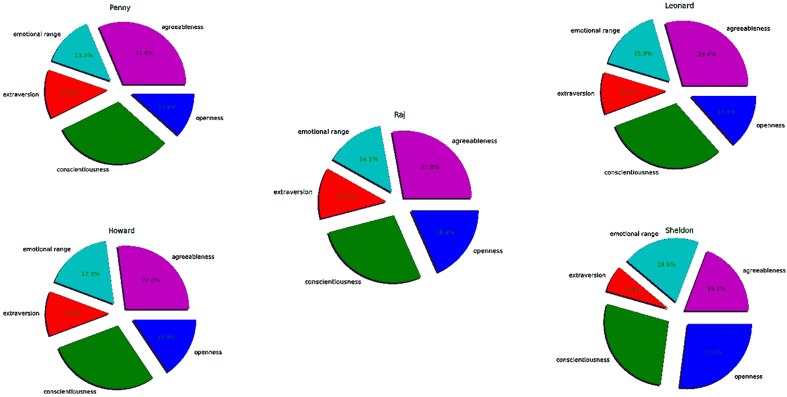

> 《生活大爆炸》中所有角色的性格都有相似的属性分布。

## 5.3.绝命毒师

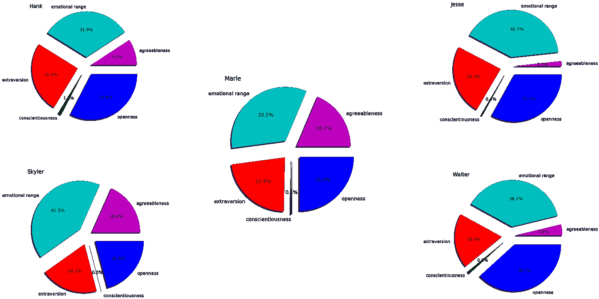

> 所有角色的个性都有相似的属性分布。

# 6.热门拍摄地点

我们经常注意到一些节目在相同的地点重复拍摄。例如，当我们想到朋友时，我们脑海中的画面往往是在中央公园或莫妮卡或钱德勒的公寓。对于《生活大爆炸》，我们想到的是莱纳德和谢尔顿的公寓。所以，我想，为什么不找出这些节目的前五个地点，并推断/发现其中的潜在策略。第 **6** 节的代码可以在[这里](https://github.com/shilpibhattacharyya/sitcom_analysis---emotion-extraction-and-personality-detection/tree/master/section-6:%20shooting_locations)找到。

## 6.1.美国国防科学技术研究所。

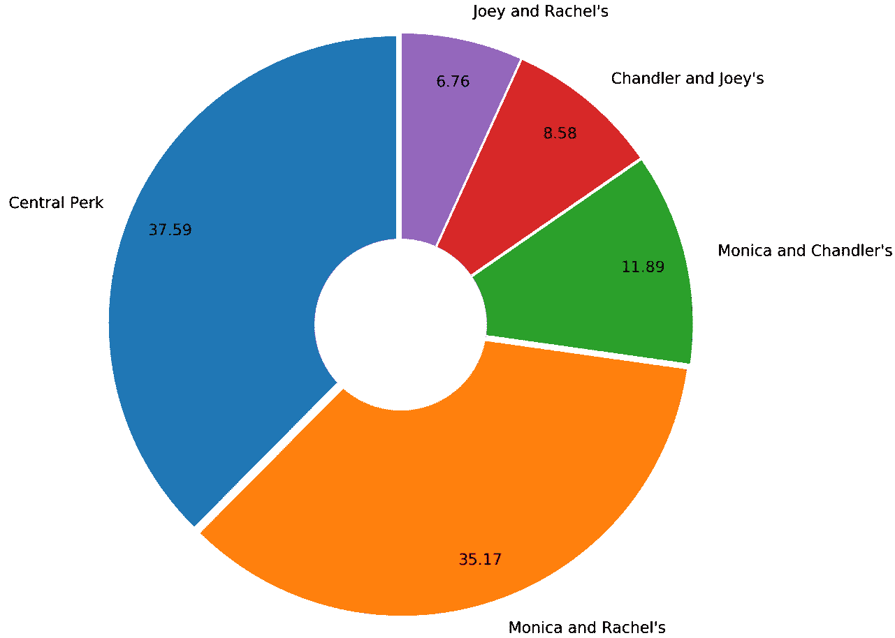

> 朋友们在事情发生的地方没有太多的变化。成功地吸引了观众。

## 6.2.生活大爆炸理论

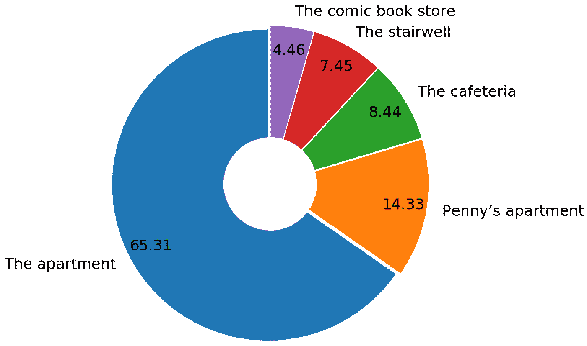

> 大爆炸理论在它发生的地方没有太多的变化。成功地吸引了观众。

## 6.3.绝命毒师

我没有《绝命毒师》的数据来绘制这个时候的热门地点。

# 7.区分彼此的字符

我正在使用神经网络(keras-tensorflow)来识别彼此不同的字符。在这里可以找到**第 7 段**每部情景喜剧对应的代码[。](https://github.com/shilpibhattacharyya/sitcom_analysis---emotion-extraction-and-personality-detection/tree/master/section-7:%20lstm_notebooks)

混淆矩阵绘制如下。

## 7.1.美国国防科学技术研究所。

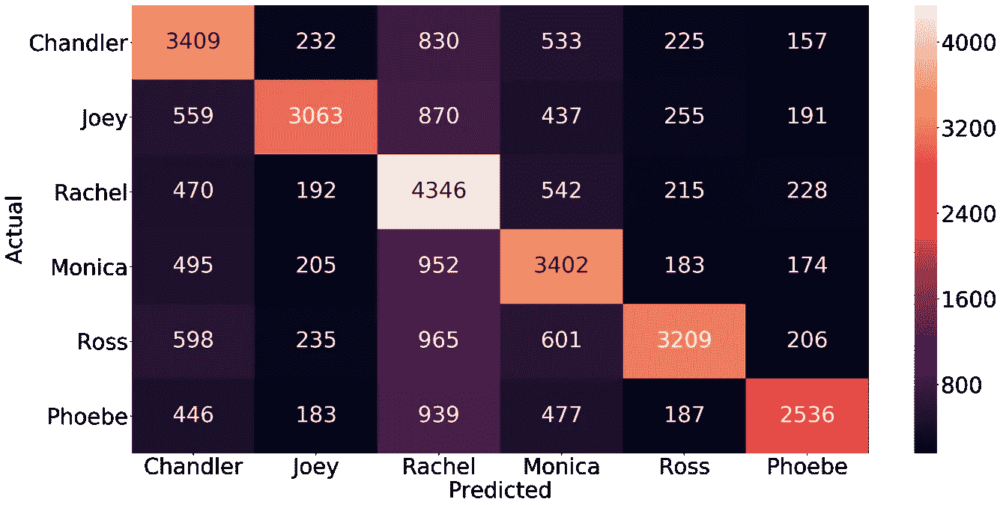

> 《老友记》上的人物差别很大，彼此可以辨认。

## 7.2.生活大爆炸理论

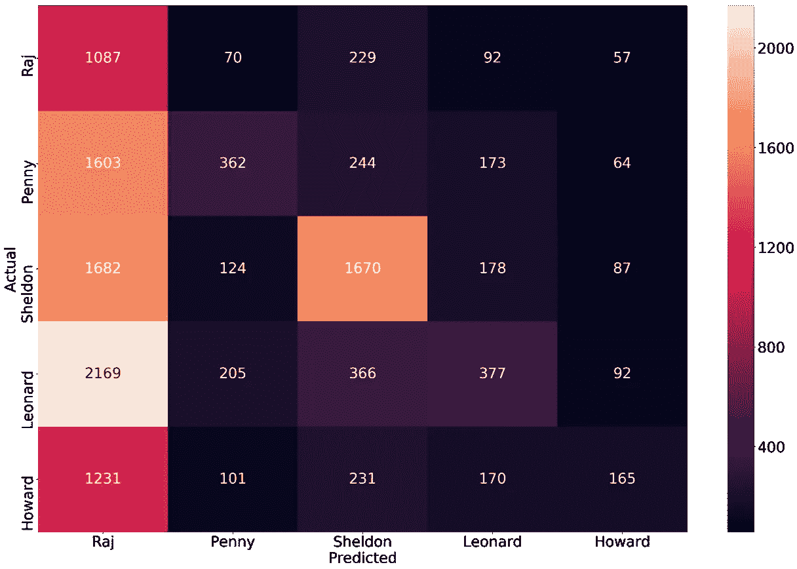

> 《生活大爆炸》中的角色非常相似，除了谢尔顿之外，彼此无法辨认。

## 7.3.绝命毒师

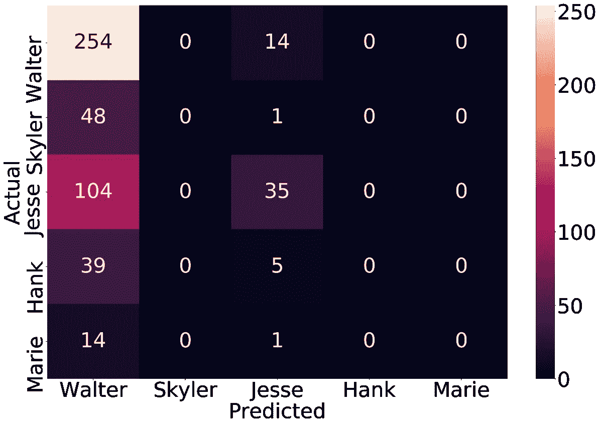

> 《绝命毒师》中的角色非常相似，除了沃尔特之外，彼此无法辨认。

# 8.角色交流方式的一致性

## 8.1.美国国防科学技术研究所。

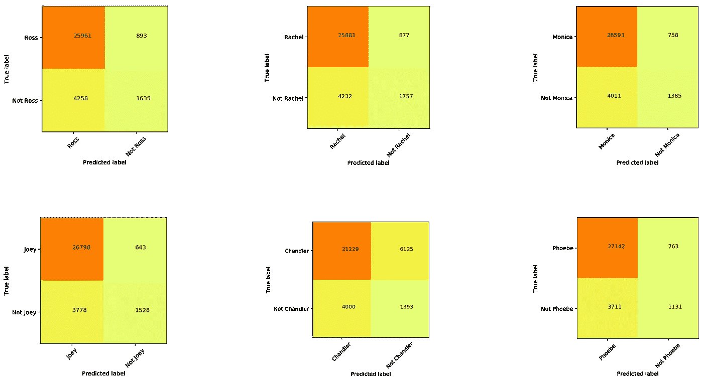

没错。他们大多是这样

## 8.2.生活大爆炸理论

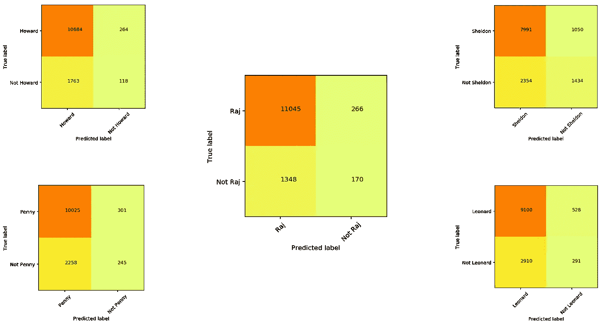

没错。他们有

## 8.3.绝命毒师

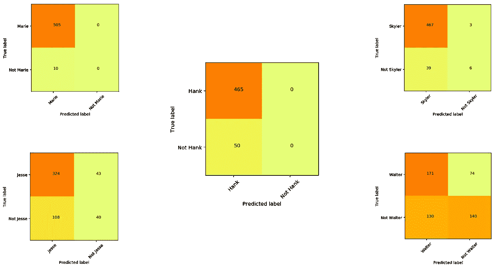

大多数情况下，他们会。沃尔特表现出矛盾是因为他的另一个角色——海森堡

在这里可以找到 **8** 的每部情景喜剧对应的代码[。](https://github.com/shilpibhattacharyya/sitcom_analysis---emotion-extraction-and-personality-detection/tree/master/section-8:%20consistency%20in%20the%20speech)

# 9.我们现在知道是什么让情景喜剧受欢迎了吗？

让我们一个接一个地看看最初提出的每个问题。

## 问:是因为各个角色说话和行为的一致性吗？

A.我们可以推断出这一点，因为所有三个受欢迎的节目都在他们的分析中反映了这一点。

## 问:是在不同地点重复拍摄，从而让你的观众觉得他们知道这个地方吗？

A.是的，这两部剧《神盾局》和《生活大爆炸》都证实了这一点。不幸的是，我找不到《绝命毒师》的位置数据。

## 问:是不同角色说话和行为方式的相似/不同吗？

A.它们可以非常相似，也可以不同。我们在这三场演出中观察到的混淆矩阵中没有得到确凿的证据。

## 问:是快乐、悲伤、恐惧、愤怒和厌恶等情绪的均衡分布让一部电视剧变得有趣吗？

A.是的，沃森 NLU 对三个节目输入的结果证实了这一点。

## 问:是角色相似/不同的个性让观众保持联系吗？

A.结果显示，显然是个性的相似性在这里胜出。

## 问:是有趣的倒叙吸引了观众吗？

A.不幸的是,“闪回”这个词没有出现在记录中，所以无法分析。

# 10.这一分析给节目制作人带来的启示很少

> 如果你有幸让一部电视剧持续很长时间，试着在每集中让每个角色的言语和行为保持一致。"
> 
> 在**拍摄地点**的集合中，应该有**最小方差**。这将向观众灌输对情景喜剧的环境和文化的归属感。
> 
> 情景喜剧中人物的**性格**应该**融合**在一起，正如性格洞察结果所强调的。
> 
> **情绪的分布都倾向于某个特定的情绪**。F.R.I.E.N.D.S .主要展示快乐和悲伤；《生活大爆炸》也倾向于快乐和悲伤。《绝命毒师》是一部充满愤怒和悲伤的电视剧。关键是**在一段时间内保持节目**的情商**连贯**。
> 
> 只要满足上述标准，字符可以彼此不同或相似。

# 11.最受欢迎的角色

最后，我想看看这三部电视剧中最受欢迎的角色以及他们的性格特征。

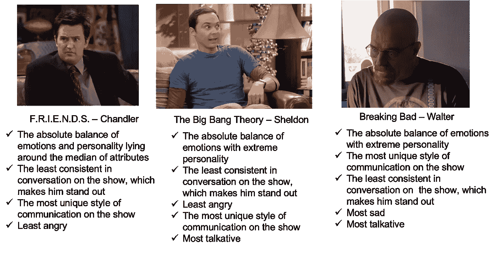

# 评论

在我演讲的问答环节，我得到了一些有趣的问题和评论，如下。

> ***问:如果我们使用计算机视觉技术添加面部表情分析，结果将如何改善/增强？***
> 
> A.如果有时间，我很想尝试一下，或者如果有人尝试了，请分享结果:)。
> 
> ***问:《权力的游戏》在多个地点拍摄？这些结果如何证明这一点呢？***
> 
> A.我同意它是在几个地方拍摄的，但最主要的还是像维斯特洛、临冬城等少数地方。所以，结果看起来是一致的。
> 
> 问:如果这部剧是在现场观众面前拍摄的，会有什么不同？
> 
> A.我相信这会积极地影响节目，因为喜欢和快乐是很有感染力的。如果我看到观众笑着欣赏，肯定会对内容产生兴趣。

我在这里遵循的方法是一种理解导致热门电视节目的因素的方法。也可以有替代的方法。因为我在这里有很多可视化结果，所以后端动态支持的仪表板表示是我很想尽快做的事情。