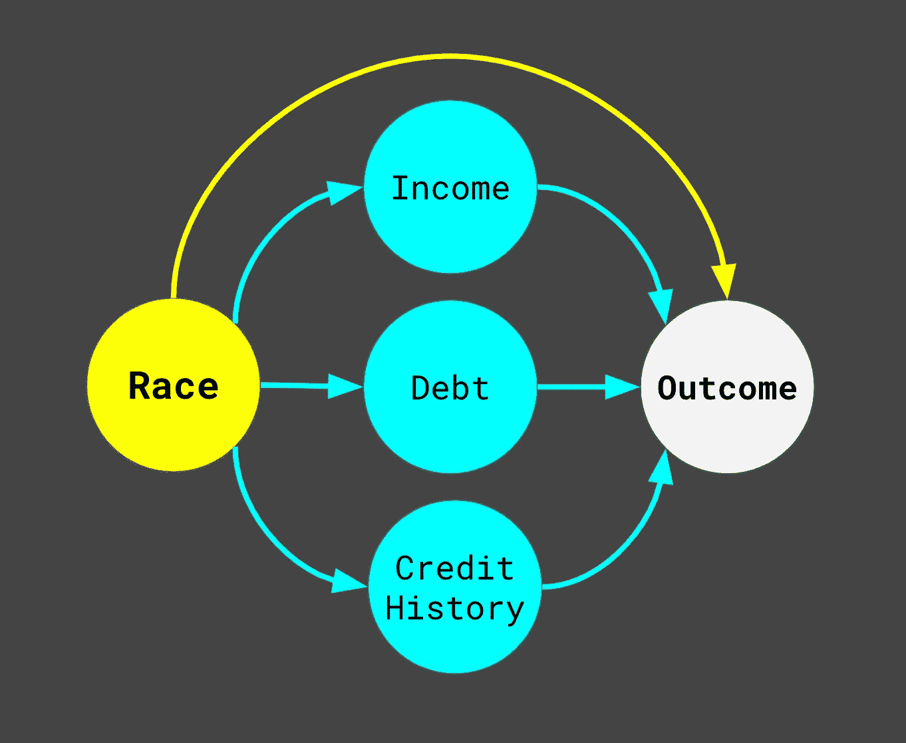

# 经济正义可以是色盲吗？

> 原文：<https://towardsdatascience.com/can-economic-justice-be-colorblind-2c2609740ab2?source=collection_archive---------62----------------------->

## 公平的机器学习可以揭示借贷中的制度种族主义

乔治·弗洛伊德的死迫使我们每个人去思考难题。对我来说，这个问题是我作为数据科学家在贷款领域的工作以及我在该行业看到的制度性种族主义的良心。我从来没有公开写过，因为我觉得这对我的生活和家庭来说风险太大了。但是 MLK 的一句名言让我振作起来…

> “我几乎得出了一个令人遗憾的结论，黑人走向自由的最大绊脚石不是白人公民议员或 Ku 三 k 党，而是白人温和派，他们更致力于“秩序”而不是正义；谁喜欢没有紧张的消极和平，而不喜欢存在正义的积极和平”

十多年前，我第一次调查了贷款中的歧视。从那以后，我想了很多，也谈了很多，但总是闭门造车。我一直觉得在行业内进行建设性的工作是正确的道路。尽管我在贷款歧视这个话题上花了很多笔墨，但我没有任何实质性的进展可以展示。现在我怀疑我是不是白人温和派。现在我想知道，我在公开场合的沉默是否不是为了在借贷生态系统中建立信任，而是为了让我自己和我的同事免受承认在我们自己的时间线内以让我们感到安全的方式解决种族主义是不公正的紧张和不安。现在我想我需要回答一些令人不舒服的问题…如果只是为了我自己。

# 为什么不谈借贷歧视？

尽管有公平贷款法和监管机构，但似乎几乎没有任何关于贷款歧视的建设性言论。尽管我应该记住，与美国的历史相比，我在借贷方面的经验还很短。在这段历史中，贷款领域存在两种重要的歧视:

*   故意歧视——贷方称之为**不同的待遇**
*   无意的歧视——贷方称之为**完全不同的影响**

在 19 世纪晚期，第一批征信机构具有很强的歧视性，当时贷款被视为一种道德义务。别管是不是黑人——你可能不会因为是天主教徒而获得贷款。在 1900 年代早期，贷款和房屋所有权对于大多数美国黑人来说是不可能的，即使是在北方和 T2，其影响至今仍在回响。[在次贷危机之前，划红线](https://en.wikipedia.org/wiki/Redlining#Strategies_to_reverse_effects_of_redlining)并不是一种罕见的做法，关于危机原因和社区再投资法案影响的神话一直延续到今天。蓄意歧视，无论是公开歧视还是区别对待，都是美国贷款的历史。

经过次贷危机后的改革，比如消费者金融保护局(CFPB)的建立，我认为情况有所改善。在已经提出的许多不同的关于公平的算法定义中，我认为最能描述当今借贷中所发生的事情的是通过无意识的公平:如果一个模型或政策没有明确地使用受保护的类数据，那么它就是公平的。除此之外还有其他限制，例如，地理数据由于与种族相关而很少被使用，但称之为“无知的公平”是一种相当准确的简化。征信机构不接受关于种族、民族、性别或其他受保护类别的信息，贷方也不收集这些信息，但《住房抵押贷款披露法案》(HMDA)规定的情况除外。结合向基于统计/机器学习模型的承销和在线贷款的过渡，这是朝着正确方向迈出的一大步。好的贷款人和好的机构采取预防措施，竭力避免受保护的类别数据，这使得人们很容易认为，现在贷款中的有意歧视可能比美国历史上任何时候都要少。问题是，所有这些对种族问题视而不见的努力并没有带来公平的结果。

调查报告中心进行了一项研究，表明黑人抵押贷款申请人比白人申请人获得批准的可能性小得多。如果不存在故意歧视，我们是如何形成这种现状的？罪魁祸首是无意的歧视，或完全不同的影响。从 2018 年开始，多德-弗兰克法案修订了 HMDA 的[数据收集规则，以一个非常好的理由纳入信用评分。信贷数据](https://ffiec.cfpb.gov/data-publication/)[与贷款审批和定价结果](http://www.crai.com/sites/default/files/publications/Pricing-of-Home-Mortgage-Loans-to-Minority-Borrowers.pdf)密切相关。如今，歧视主要通过结构性不平等进入贷款领域。顾名思义，弱势群体的社会经济地位较低。他们的信用评分更差，赚钱更少，资产更少，社交网络财富更少，更有可能被推入掠夺性信贷产品。所有这些因素都增加了未来出现财务困难的可能性，而违约的可能性推动了贷款人在审批和定价方面的决策。这就是在贷款中产生制度性种族主义的循环。安全的信贷创造杠杆和经济优势。没有信贷，或者更糟糕的是掠夺性信贷，会造成债务和经济劣势的循环。一旦你变穷了，想要追上来就越来越难了。

合乎逻辑的回应是，有关种族的信息应该被纳入贷款决策，以对历史歧视做出赔偿，但在当前法律下这是不可能的。即使我不同情贷款人，但现实是他们面临着一个无法取胜的第 22 条军规。不同的待遇是非法的:不能基于种族做出借贷决定。**不同的影响是非法的**:受保护的类不能有不利的结果。

这就是为什么很难就借贷中的歧视进行有意义的对话:

*   消费者、贷款人和监管者的风险都很高。我们都害怕可能会失去的东西。
*   没有公开的数据。除了 HMDA 的数据，我们没有共同的标准来讨论歧视的程度、原因或代价。
*   监管者已经准备好停止故意歧视。他们缺乏有效识别不同影响的数据、工具和资源。
*   监管机构将贷款人置于一个矛盾的境地。不同的待遇和不同的影响是相互矛盾的。如何证明不同影响的业务必要性在最好的情况下是模糊的，在最坏的情况下可能是完全无法证明的。
*   消费者的可见性和反馈有限。消费者很难知道自己是否是受害者，也很难做出明智的决定，与反种族主义的贷方合作。

最重要的是贷方之间的竞争态势。正如弗兰克·罗特曼所阐述的那样，能够为消费者提供稍微好一点的贷款产品会有丰厚的回报。这是在风险预测中寻求每一个可能的优势的巨大激励——即使以歧视为代价。贷方为错误的事情优化。只要稍微改变一下规则，就能获得同样健康且有利可图的业务。公平机器学习的最新进展显示了为美国黑人开启经济正义良性循环的清晰而直接的方式。

# 如何实现经济正义？

面对警察的暴行，我不知道如何创造积极的和平。不知道今天在美国当黑人是什么感觉。但是当我看到一个数据科学问题时，我知道这个问题是可以解决的。

我们需要一个能做三件事的解决方案:促进弱势群体的经济正义，对贷款人的风险厌恶和利润要求持现实态度，与监管机构保护消费者和服务法律的使命保持一致。这决定了 4 个艰难但简单的目标:

1.  定义公平
2.  收集受保护的类数据
3.  在沙盒中测试公平的机器学习
4.  资助反对结构性不平等的斗争

## 定义公平

有 [good](https://arxiv.org/pdf/1809.09245.pdf) [调查](https://arxiv.org/pdf/1908.09635.pdf)比较不同定义的公平和马丁瓦滕伯格等人。艾尔。想象一下这些指标的子集在实践中是如何工作的。

马丁·瓦滕伯格谈通过 Twitter 贷款的公平性

我发现最干净的定义是[反事实公平](http://papers.nips.cc/paper/6668-avoiding-discrimination-through-causal-reasoning.pdf)，这是一个概念，如果消费者属于优势群体，结果应该是相同的。用图形因果模型表示的问题是这样的:

贷款歧视的因果图(Jason Capehart，2020 年)

种族直接影响个人的属性，如收入、债务和信用记录。未解决的歧视是种族对结果的直接影响，也是我们想要避免的。然而，当它进入正题时，定义的选择并不重要。重要的是，我们为公平选择一个客观的定义，并衡量它。

## 收集受保护的类数据

虽然[贝叶斯改进的姓氏地理编码](https://files.consumerfinance.gov/f/201409_cfpb_report_proxy-methodology.pdf) (BISG)是一个伟大的想法和伟大的工具，但它一直是[廉价出售](https://www.latimes.com/business/la-fi-rand-elliott-20160824-snap-story.html)和怀疑的目标，无论这是多么不公平。直接收集数据提供了透明度，可以建立信任。HMDA 的数据收集要求提供了一个简单的解决方案，非抵押贷款机构可以遵循，征信机构可以汇总。受保护类别数据的集中存储反过来可以使监管机构更容易评估贷款人的活动。

## 在沙盒中测试公平的机器学习

像这样的努力是 CFPB 创建[沙盒](https://www.consumerfinance.gov/about-us/innovation/)与金融服务合作的原因。致力于技术能力公平的贷款人可以引领一条通往更美好未来的道路，并找出如何让这些原则在实践中发挥作用。例如，几名研究人员指出，在学习公平陈述中存在固有的权衡。任何贷款人都有必要首先将公平模式与传统模式结合起来，以理解风险和批准之间的权衡。毫无疑问，在前进的道路上会有意想不到的挑战。

这种投资对贷款人来说可能看起来像是硬推销——但这不应该，因为这符合他们赚钱的方式。除了少数例外，贷款人都是风险厌恶者，不想通过突破合规、法律或公共关系的界限来赚钱。能够进行不同影响分析的第三方法律咨询公司并不便宜。捍卫行业利益的游说者并不便宜，来自监管机构的罚款或让品牌看起来有社会意识的公关努力也不便宜。对[苹果卡在信用额度分配中潜在性别歧视的调查](https://www.wired.com/story/the-apple-card-didnt-see-genderand-thats-the-problem/)充分说明了这一点。这些都是令人头疼的问题，大多数贷款人都希望有一个简单的方法来解决。

## 资助反对结构性不平等的斗争

没有机器学习技巧可以消除 250 年的不平等。但是，对歧视的认识为解决歧视，包括干预提供了新的机会。考虑到承认种族的自由，贷款人自然应该在揭露由于数据中的历史偏见而造成的歧视方面做得很好，因为这个过程类似于开发一个新的细分市场。

一些贷款将是无利可图的，超出了贷款人的承诺，但对于由于结构性不平等导致的边际下降，有可能建立创造性的伙伴关系。例如，人们可以想象像国家社区再投资联盟这样的组织或政府项目与贷款人的资本合作，只为贷款给他们支持的社区成员的“超额风险”提供资金。

承认不平等的存在可以解放我们去做以前不可能的事情。

# 放弃

本文中表达的观点和意见是作者的观点和意见，并不反映作者过去或现在的任何雇主、合作者或商业伙伴的观点、政策或立场。