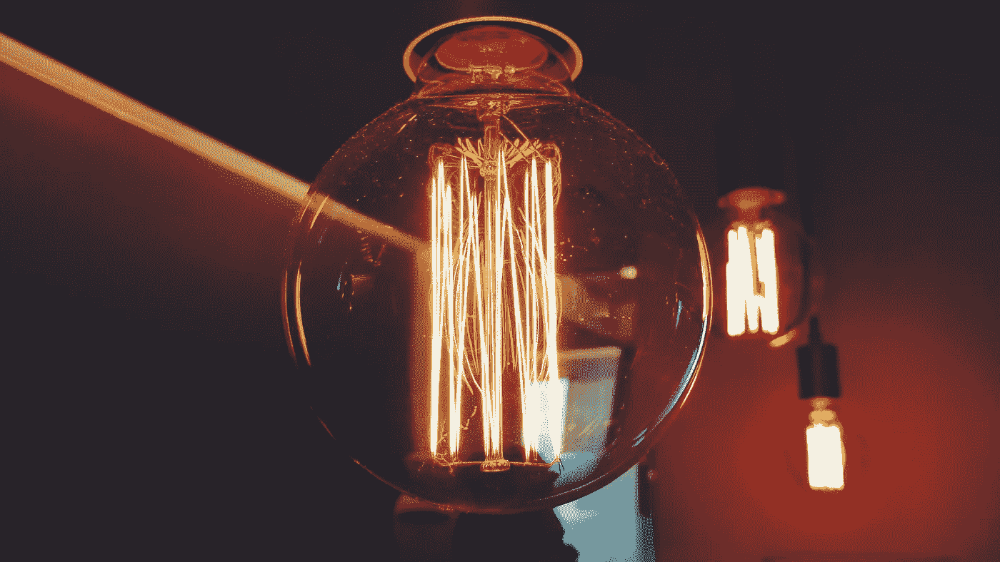
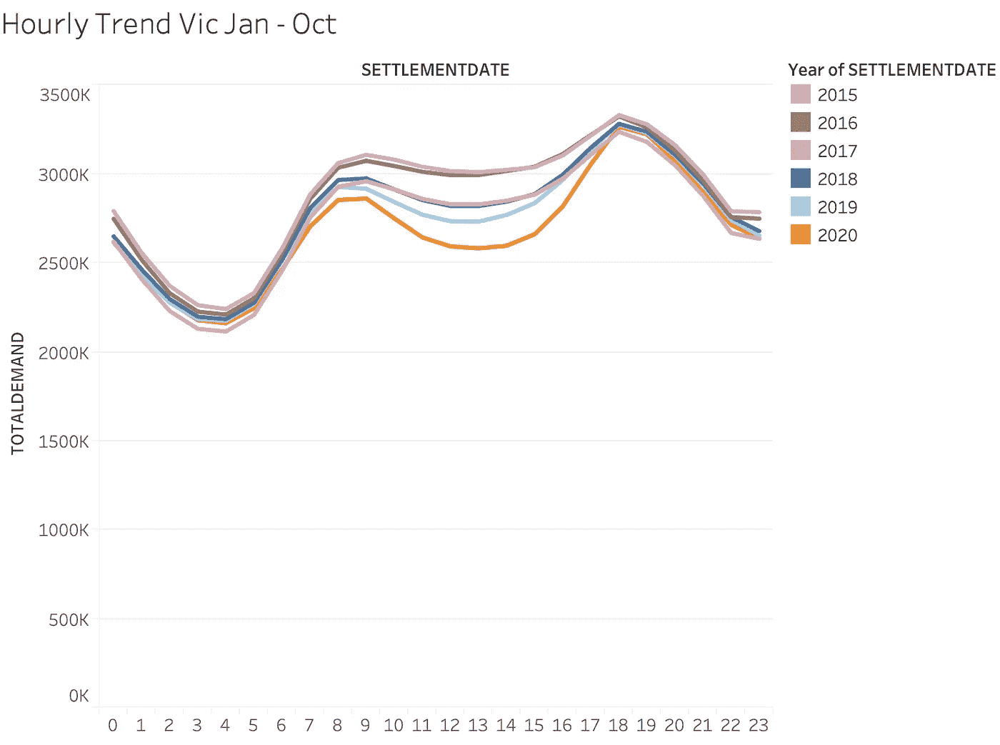
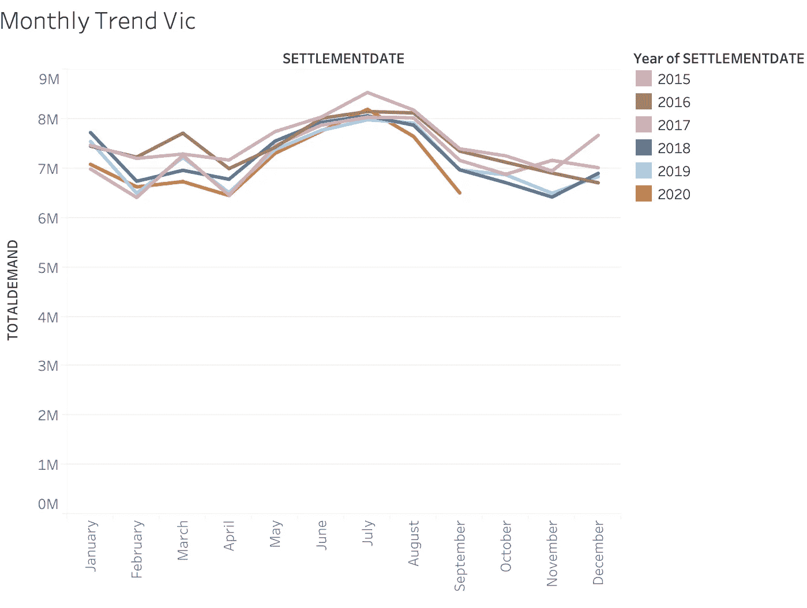
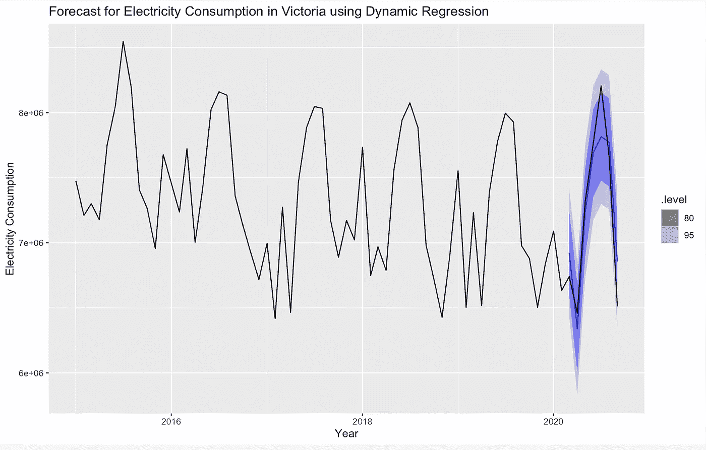

# 电力消耗能告诉我们关于疫情的任何事情吗？

> 原文：<https://towardsdatascience.com/can-electricity-consumption-tell-us-anything-about-the-pandemic-f4147c676f51?source=collection_archive---------49----------------------->

## 分析澳大利亚维多利亚州的电力数据，探索疫情对其电力消耗的影响。

Alessandro Di Credico 在 [Unsplash](https://unsplash.com/?utm_source=unsplash&utm_medium=referral&utm_content=creditCopyText) 上拍摄的照片

2020 年 3 月，新冠肺炎抵达澳大利亚，并导致全国范围的封锁。这意味着我们大多数人的家、工厂、餐馆、学校、公共场所都关闭了。这种封锁无疑影响了我们的世界以前运行的几种方式，但我们的世界运行的一个关键部分是:电。

发生了什么事？第一个想法是，我们一定看到了电力消耗的减少。该研究试图简要回答两个问题，并基于 AEMO 记录的维多利亚时期的电力消耗:

1.新冠肺炎对我们的用电方式产生了怎样的影响？

2.传统模型还能很好地预测和预报我们未来的消费需求吗？

# 新冠肺炎影响了我们用电的方式吗？

图 1(作者图片)

图 1(作者图片)

是也不是。

从图 1 可以看出，维多利亚州的用电量没有明显变化。低谷和高峰主要归因于天气。例如，7 月的高峰是由于供暖的使用增加，7 月是一年中最冷的月份。

然而，从图 2 中可以看出，与其他年份相比，在过去的九个月中，从每小时的角度来看，电力需求发生了变化，或者说是显著下降。这个时间窗口是早上 8 点到下午 5 点，这是自然光透过我们家窗户渗入的办公时间。

这些想象可以在[的画面上找到。](https://public.tableau.com/profile/anuradha.tulsian#!/vizhome/MelbourneDatathon/Dashboard3?publish=yes)

现在，真正的问题是。

# 传统模型还能很好地预测和预报我们未来的消费需求吗？

我们消耗电力的方式取决于几个因素，如天气、商业周期、星期几，在这里，我们试图了解封锁是否对这种消耗有影响。在为这项研究建立模型时，考虑了以下因素——每月时间序列(从 2015 年到 2020 年),这些月份的平均温度和代表我们是否处于锁定状态的分类变量。

我尝试了 ETS、ARIMA、线性回归、动态回归等一系列时间序列预测方法来预测 2020 年的消费量。这些模型中的大多数表现相同，在模型精度方面有小的变化。

相对优于其他模型的模型是具有平均温度和 ARIMA 误差的时间序列线性模型。我使用 2015 年 1 月至 2020 年 2 月的数据训练了模型，并对 2020 年 3 月至 2020 年 9 月(维多利亚被封锁的几个月)进行了预测。这个模型的更多细节可以在这里找到，这是预测的样子。

图 3(作者图片)

# 结论

那么，关于疫情和电力消耗，所有这些告诉了我们什么呢？

好吧，至少在维多利亚州，在过去的五年里，维多利亚州的电力消耗一直呈下降趋势，由于疫情，这 2%的下降是不难预测的。工业、办公室和商业用电现在被重新引向我们的家庭。

然而，在一天的办公时间内可以观察到一个不同之处，即在封锁的几个月中，电力消耗显著下降。如果我们能建立一个模型，将此作为一个因素，这可能是一个改进的空间。

你可以在我的 [GitHub](https://github.com/AnuradhaTulsian/MelbourneDatathon) repo 上找到代码和更多细节。