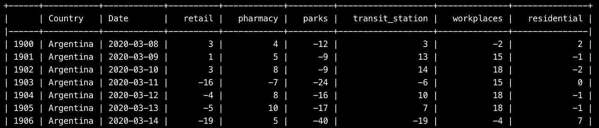
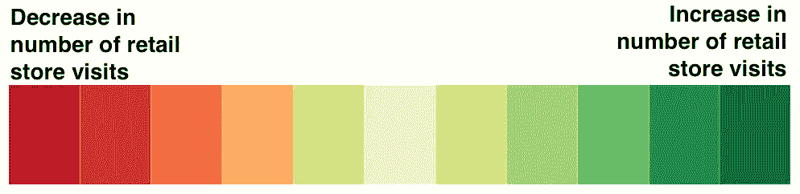
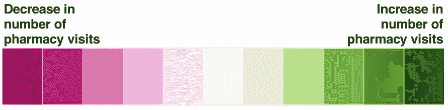
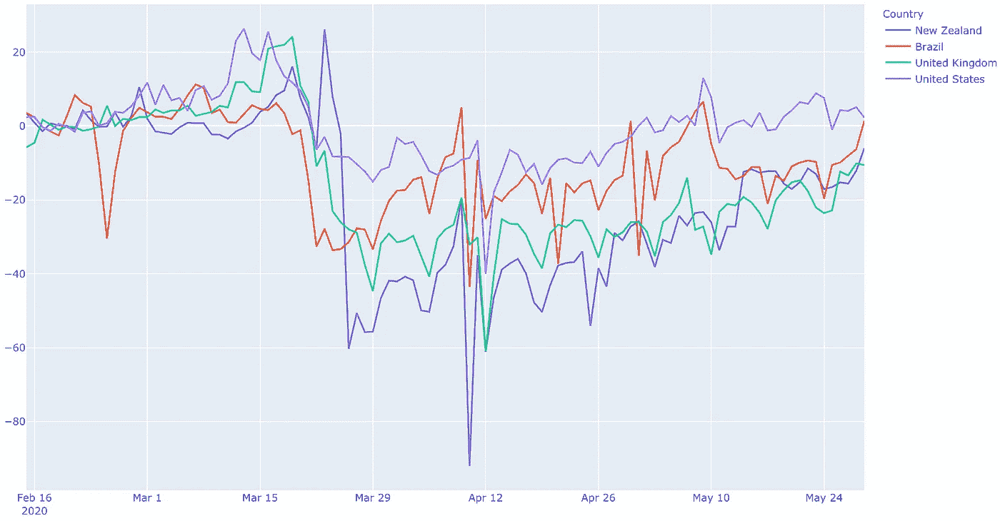
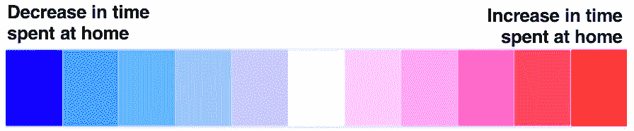
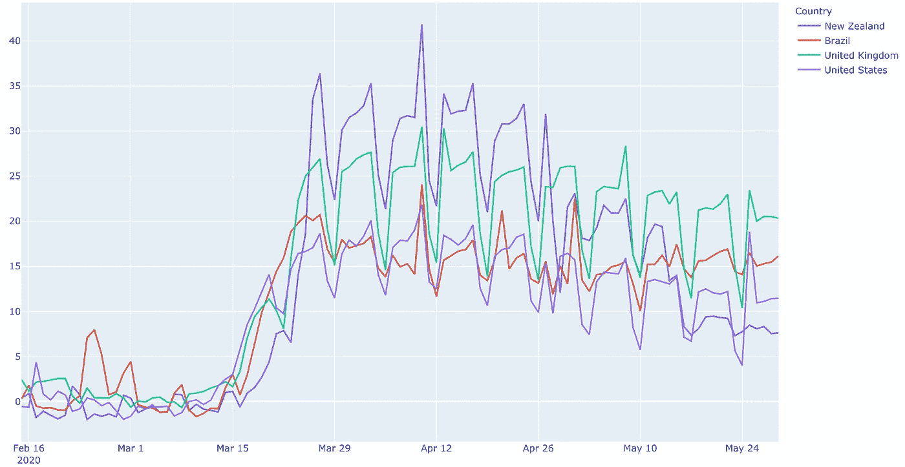

# 谷歌的移动报告能解释新西兰战胜病毒的原因吗？

> 原文：<https://towardsdatascience.com/can-googles-mobility-report-explain-new-zealand-s-win-against-the-virus-9e036ace0a2?source=collection_archive---------49----------------------->

## 对疫情早期社会距离和锁定政策的数据驱动分析。


罗曼·科斯特在 [Unsplash](https://unsplash.com/s/photos/mobility?utm_source=unsplash&utm_medium=referral&utm_content=creditCopyText) 上拍摄的照片

经过几个月不安的封锁，欧洲已经慢慢开始开放，这让我希望最坏的情况已经过去。在家工作和与朋友的虚拟葡萄酒之夜已经成为新的“常态”。这些措施已经付诸实施，以加强物理距离，并最终减缓致命病毒的传播。

## 在这篇文章中，我们将直观地展示政府实施的政策对公民流动性的影响。

*这些政策在减少人口流动方面的效果如何？对人们的生活、工作和移动方式产生了什么影响？*

# 数据集(又名谷歌移动报告)

谷歌推出了使用从谷歌地图等应用程序收集的匿名数据的新冠肺炎社区流动性报告。这个数据集由谷歌自己定期更新，可以在[这里](https://www.google.com/covid19/mobility/)找到。用于本分析的最新日期是 5 月 24 日。

在谷歌的研究中已经确定了目的地的具体类别，并且他们已经**测量了这些目的地的游客数量**。然后将每天的访问次数与基线日(选择为疫情前的平均日)进行比较。

*   杂货店
*   药房
*   在家度过的时间



## 什么是基准日？

基线日是“正常的一天”(不是假日、体育赛事、情人节、圣帕特里克节等)。基准日为一周中的某一天提供了可靠的客观值。这意味着我们有一个人们在周一、周二、周三、周五、周六和周日去杂货店的基线值。

## 为什么基线值很重要？

例如，创建基线日是区分周末和工作日的一个聪明的方法。我通常在周末去杂货店购物，而不是在星期二。我怀疑我并不孤单。

在西班牙、法国或比利时，超市**周日不开门，**基线值将低于所有商店都开门营业的国家。

# 可视化

数据显示在**百分比变化中，**这可以是正的(当到达目的地的流动性增加时)或负的(当流动性减少时)。

> **choropleth** 地图是一种专题地图，其中各区域按照代表每个区域内地理特征汇总的统计变量的比例进行着色。

此外，我选择使用一个*线图来描绘受病毒影响特别严重的四个国家的流动性变化:美国、巴西和英国。我还加上了新西兰，因为他们最近根除了最后一例冠状病毒。印象深刻！*

# ***1。走访零售店***

*零售和娱乐:自疫情开始以来，零售商和娱乐中心的游客数量有什么变化？*

**

*下图显示了与基线值相比，迁移率的百分比变化。*

**

*可以做出一些观察:*

*   ***3 月 15 日**是 mainland China 境外记录的冠状病毒病例多于境内的第一天。这引发了本研究中所有国家人口流动模式的变化。*
*   *与基线值相比，流动性变化最显著的国家是新西兰。他们减少了 90%的店铺访问量！比其他任何国家都多。*
*   **需要注意的是，从 4 月 12 日开始，美国的商店访问量****n 呈上升趋势。****

## *这是什么意思？*

**

*照片由[斯凯勒杰拉尔德](https://unsplash.com/@skylergeraldphoto?utm_source=unsplash&utm_medium=referral&utm_content=creditCopyText)在 [Unsplash](https://unsplash.com/s/photos/coronavirus-protest?utm_source=unsplash&utm_medium=referral&utm_content=creditCopyText) 上拍摄*

*在 3 月 29 日达到顶峰的行为剧变之后，美国人允许自己去越来越多的零售店。相比之下，英国的商店访问量持续下降，在 3 月 29 日达到最低，但在整个隔离期间，商店访问量一直保持不变。*

# *2.对药店的访问*

**

*从下图可以看出，与基线相比，不同国家去药店的次数差异很大。对于美国来说，访问数量的变化在 3 月 22 日从正转变为负。这一天，**冠状病毒病例数为 26747 例，超过了西班牙、伊朗和德国等国家**。这使它们成为世界上受影响第三大的国家。*

***新西兰**再次位于图表顶部，变化百分比最高，这意味着新西兰人去药店的次数最少。*

**

# *3.锁定——在家度过的时间*

**

> *注意:与前两个图表不同，这里的百分比是正数，它们在**中显示了在家时间的增加**(之前我们谈论的是去商店或药店的次数减少)。*

*可以进行一些观察:*

*   *美国是第一个实施呆在家里的政策的国家，但是这仅仅意味着在家的时间比基准日多 15 -20%。在 4 月和 5 月，这一比例下降到 5 -15%。这与之前的观察结果一致，因为在此期间，商店和药店的访问量增加了。*
*   *令人惊讶的是，美国的行为与巴西非常相似。*
*   *新西兰是最后一个实施居家政策的国家，但他们的变化最大，居家时间平均增加了 35%。这一数值一直保持不变，直到 5 月初政府允许更多的行动自由。*

**

*从谷歌移动性报告提供的信息中可以得出更多的见解。本文只是一个初步的评价。更多更新即将到来，**请在下面评论您希望在即将到来的更新中看到您的原籍国或居住地。***

# *代码*

```
*# Import libraries
import numpy as np
import pandas as pd
import plotly as py
import plotly.express as px
import plotly.graph_objs as go
from plotly.subplots import make_subplots
from tabulate import tabulate

# Read Data
df = pd.read_csv("data/Global_Mobility_Report.csv"**,** low_memory=False)

# Rename columns
df = df.rename(columns={'country_region':'Country'})
df = df.rename(columns={'date':'Date'})
df = df.rename(columns={'retail_and_recreation_percent_change_from_baseline':'retail'})
df = df.rename(columns={'grocery_and_pharmacy_percent_change_from_baseline':'pharmacy'})
df = df.rename(columns={'parks_percent_change_from_baseline':'parks'})
df = df.rename(columns={'transit_stations_percent_change_from_baseline':'transit_station'})
df = df.rename(columns={'workplaces_percent_change_from_baseline':'workplaces'})
df = df.rename(columns={'residential_percent_change_from_baseline':'residential'})
df.drop(['country_region_code'**,**'sub_region_1'**,** 'sub_region_2']**,** axis=**1,** inplace = True)
print(tabulate(df[**20000**:**20050**]**,** headers='keys'**,** tablefmt='psql'))

# Manipulate Dataframe
df_countries = df.groupby(['Country'**,** 'Date']).sum().reset_index().sort_values('Date'**,** ascending=False)
df_countries = df_countries.drop_duplicates(subset = ['Country'])

# Manipulating the original dataframe
df_countrydate = df
df_countrydate = df_countrydate.groupby(['Date'**,**'Country']).sum().reset_index()
min_cases = df_countrydate['residential'].min()

df_country = df.groupby(['Country'**,**'Date']).sum().reset_index()
c2 = df_country[df_country['Country']=="New Zealand"]
c3 = df_country[df_country['Country']=="Brazil"]
c4 = df_country[df_country['Country']=="United Kingdom"]
c5 = df_country[df_country['Country']=="United States"]

frames = [c2**,** c3**,** c4**,** c5]
countries = pd.concat(frames)

fig = px.line(countries**,** x="Date"**,** y="pharmacy"**,** title='pharmacy'**,** color = 'Country')
# fig.show()

fig = px.choropleth(df_countrydate**,** locations="Country"**,** locationmode="country names"**,** color="retail"**,** hover_name="Country"**,** animation_frame="Date"**,** # range_color=(0, 20000),
                    range_color=(-**500, 500**)**,** color_continuous_scale=px.colors.diverging.Picnic**,** color_continuous_midpoint=min_cases**,** )
fig.update_layout(
    title_text='Stay at home (quarantine) during coronavirus pandemic'**,** title_x=**0.5,** geo=dict(
        showframe=False**,** showcoastlines=False**,** ))

# fig.show()*
```

# *Github 知识库*

*所有代码都可以在 Github [上的 **world_covid.py** 文件中找到这里](https://github.com/alejandra-gutierrez/LondonCovid.git)！*

# *非常感谢你的阅读！*

*如果你喜欢我的作品，如果你能在这里跟随我，我将不胜感激。*

*如果您对如何改进有任何问题、建议或想法，请在下面留下评论或通过 LinkedIn [这里](https://www.linkedin.com/in/alejandra-g-283595b8)取得联系。*