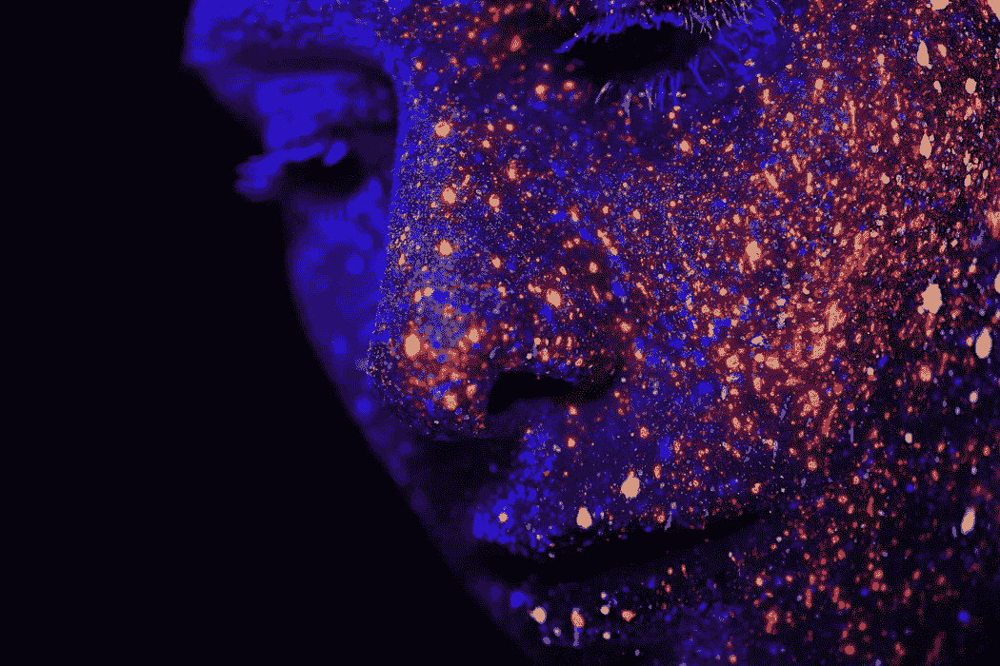

# 人类能信任 AI 吗？

> 原文：<https://towardsdatascience.com/can-humanity-trust-ai-b1e0fa7b024d?source=collection_archive---------76----------------------->

## 如果说数字伦理不是什么新鲜事，那么每一代信息技术都在放大开发人类智慧的伦理挑战

照片由 h. heyerlein 在 Unsplash 上拍摄

随着人工智能在商业和社会中的应用变得更加雄心勃勃，数字伦理已经成为个人和政府越来越关注的问题。伦理与一系列社会习俗有关，这些习俗发展了“我们批判性思考道德价值的能力，并根据这些价值指导我们的行动”。[【我】](#_edn1)数字伦理的特殊性是什么，这些考虑与一般的伦理有什么不同？这些担忧与其说是种类问题，不如说是程度问题，因为每一代新的信息技术都给人类带来越来越突出的挑战。在这篇简短的文章中，我们调查了有助于构建当前辩论的四个关键问题的起源。

*AI 能理解人类的价值观吗？*

第二次世界大战结束后，诺伯特·维纳在控制论方面的工作集中在人类能在多大程度上信任自动化的问题上。在研究反导弹通信系统的过程中，维纳对人类和机器的通信和控制系统之间的相互依赖性产生了兴趣。尽管他是发展自动化的强烈倡导者，但他在《人类对人类的利用》中的文章表达了对人类的非人化和从属地位的日益担忧。他特别概述了将决策托付给不能抽象推理的计算机程序的危险，因此很可能无法理解人类价值的本质。

 [## 《诺伯特·维纳人类利用人类》全文

### 这是我们这个时代的基本文件之一，这个时代的特点是…

archive.org](https://archive.org/stream/NorbertWienerHumanUseOfHumanBeings/NorbertWienerHuman_use_of_human_beings_djvu.txt) 

*信息技术会产生新的伦理问题吗？*

30 年后，医学教授兼研究员沃尔特·曼纳(Walter Maner)创造了“计算机伦理”一词来描述“计算机技术加剧、改变或创造的”伦理问题。在关注因使用计算机技术而产生的伦理决策的特殊性时，他认为计算机应用与以前的技术创新有着根本的不同，因为它们的设计、复杂性和可延展性允许它们应用于无数的领域。他认为，每当政府和社会觉得技术创新落后时，由此产生的伦理决定往往不得不在政策真空中做出。他进一步指出，在讨论计算机技术时，伦理困境的性质和范围经常被扭曲。他得出结论，计算机参与人类行为会产生全新的伦理问题。

科技可以被编程来模仿人类吗？

信息技术本质上在伦理上是中立的，还是它的使用会产生伦理后果？在他四十年前的开创性文章《*什么是计算机伦理？James Moor 总结了他对技术的伦理足迹的想法。他认为，至少，计算机是程序和算法的伦理影响因素，挑战了人性，不管这是不是有意的。他预见到计算机可以被编程为隐含的道德代理，换句话说，人类可以选择监管信息技术以避免不道德的结果。他还提出了一种更具挑战性的可能性，即利用编程后的算法，将计算机创造成明确的道德代理人，从而按照道德规范行事。最后，他设想了一个全伦理代理人的世界，在这个世界里，机器将能够阐明与人类相容的伦理选择。*

 [## 什么是计算机伦理？*

### 点击文章标题阅读更多内容。

onlinelibrary.wiley.com](https://onlinelibrary.wiley.com/doi/abs/10.1111/j.1467-9973.1985.tb00173.x) 

*如今的数字伦理是道德行为的代表吗？*

如果人工智能完全是关于环境的，那么环境是如何影响我们对伦理的看法的？Krystyna Górniak-Kocikowska 对伦理学辩论的主要贡献被称为 Górniak 假说:计算机伦理学是应用伦理学的未来，并将很快成为全球伦理系统的基础。戈尔尼亚克认为，伦理因素在过去反映了当地的经历、历史和习俗，这反过来解释了为什么伦理立场在不同的文化中会有所不同。她提出，计算机伦理不受局部约束，即计算机逻辑构成了人类和机器如何互动的真正普遍观点。她总结道，自动化的普及将导致“计算机伦理”成为信息时代道德行为基础的伦理代理。尽管 Górniak 假说受到了 Deborah Johnson 等作者的质疑，但不可否认的是，计算机伦理与全球商业、教育和立法的发展息息相关。

*构建当前关于数字伦理的辩论*

今天关于数字伦理的讨论将这些论点向前推进了一步。这场辩论超越了计算机和自动化的伦理后果，涉及到数据驱动决策的伦理问题。伦理挑战不仅仅来自数据本身的质量和相关性，而是来自人类如何使用数据来感知、预测和评估行动过程。每一代新的信息技术都扩大了人类和人工智能的目标和应用领域，并因此改变了伦理选择产生的背景。数字伦理的终结不是一个区分对错的问题，而是为数字技术的开发者和最终用户构建适当的框架，以验证可接受的数据实践。

*Lee sch lenker 博士是 http://baieurope.com*[*商业分析学院的商业分析和数字化转型教授。【www.linkedin.com/in/leeschlenker.】*](http://baieurope.com.)*你可以在推特上关注我们*[*https://twitter.com/DSign4Analytics*](https://twitter.com/DSign4Analytics)

*有兴趣了解更多关于数字伦理的想法吗？我们最近的贡献包括:*

> 解决艾的秘密议程
> 
> [数据科学的伦理](/the-ethics-of-data-science-e3b1828affa2)
> 
> [数据科学和 DPO](/data-science-and-the-dpo-f8bfb31c75b1)
> 
> [身份、信任和价值:开放银行的未来](/identity-trust-and-value-s-the-future-of-open-banking-7926e22f085b)
> 
> [以人为中心的 AI 对管理意味着什么？](/what-does-human-centric-ai-mean-to-management-a56a50da1d6)

— — — — — —

丘吉尔先生，我们是专业人士吗？批判地看待生物伦理学家的社会角色”。代达罗斯。1999.第 253-274 页。

[【ii】](#_ednref6)拜纳姆、特雷尔，《计算机与信息伦理》，《斯坦福哲学百科全书》(2018 年夏季版)，爱德华·n·扎尔塔(ed .)