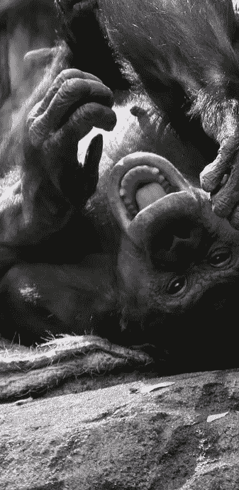

# 机器能识别一个笑话吗？

> 原文：<https://towardsdatascience.com/can-machines-recognize-a-joke-6f9e853c6068?source=collection_archive---------50----------------------->

## 检测幽默的歧义是衡量自然语言理解可靠性的一个很好的基准

一只倭黑猩猩在笑。(由 Mark Dumont 的“Tickle Tickle”剪辑而成，由 CC BY-NC 2.0 授权。要查看该许可证的副本，请访问[https://creativecommons.org/licenses/by-nc/2.0/](https://creativecommons.org/licenses/by-nc/2.0/)

[杰·雷诺](https://en.wikipedia.org/wiki/Jay_Leno)经常通过阅读真实报纸上模糊的[标题](https://www.youtube.com/watch?v=zxU1jiwidtc)来表演简单的喜剧片段。观众对这些标题的反应表明，一旦我们意识到可能含义中的矛盾，模棱两可的措辞就很有趣。例如，标题“当地高中将辍学人数减半”可以解释为帮助青少年或暗杀他们。

当然，幽默并不仅限于反对模棱两可。有些笑话之所以好笑，是因为一个[同音](https://en.wikipedia.org/wiki/Homophone)的歧义:

*   意大利桥上的卡通标志" [Ducka You Head](https://en.wikipedia.org/wiki/A_Pizza_Tweety_Pie) ，[*Lowla Bridgeada*](https://en.wikipedia.org/wiki/Gina_Lollobrigida)
*   “你肯定不是认真的。”“我是认真的，不要叫我雪莉。”

有些很搞笑，因为一个[同音异义词](https://en.wikipedia.org/wiki/Homonym)的歧义:

*   "你多久开一次化学玩笑？"“周期性地。”
*   我太无聊了，以至于我背了 6 页字典。我几乎什么都没学到。”

有些很有趣，因为[音素的微小变化](https://en.wikipedia.org/wiki/Phoneme)会导致一个众所周知的短语的意义发生重大变化:

*   "如果食物变脏了，就穿上它."
*   “…让梅尔·法梅陪我们散步的啤酒”

有些很有趣，因为令人欣慰的节奏或韵律与不太令人欣慰的主题相冲突:

*   [打油诗](https://en.wikipedia.org/wiki/Limerick_(poetry))
*   "[我宁愿面前有一瓶酒，也不愿做额叶切除术。"](https://www.goodreads.com/quotes/178437-i-d-rather-have-a-bottle-in-front-of-me-than)

有些很有趣，因为预期的设定与突然的转折相冲突:

*   “……[我是一只公鸭。](https://www.reddit.com/r/Jokes/comments/1birev/an_eagle_goes_looking_for_a_mate/)你犯了个错误。”
*   “… [一只山羊](https://www.youtube.com/watch?v=YtB97uAoR0c)。”

识别所有不同类型的幽默目前超出了任何实现的自然语言理解系统的能力。然而，可能有一天，自然语言理解领域已经足够先进，评估系统的自然语言理解能力只需要测量系统识别各种各样幽默的成功率，因为识别幽默是理解歧义的证明，而理解歧义是理解自然语言的核心。在那一天到来之前，我们都必须继续互相帮助，偶尔放松一下。你听说过那个关于…