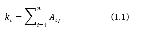
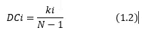
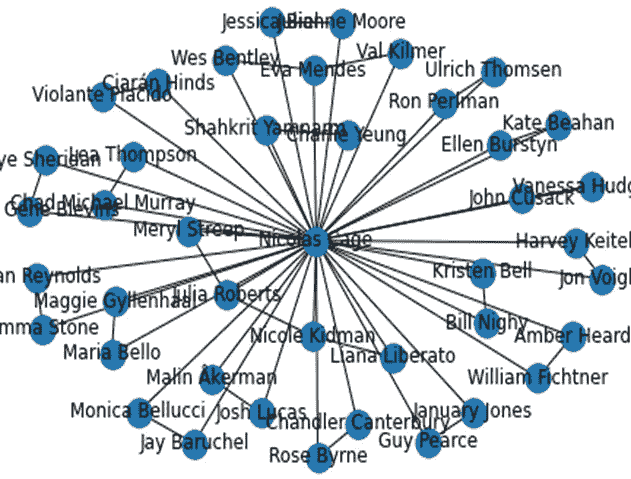

# 网络分析能否成功预测票房收入？

> 原文：<https://towardsdatascience.com/can-network-analysis-work-for-predicting-success-of-box-office-revenue-c8370c8427f9?source=collection_archive---------53----------------------->

## 我分析了网络中心性指标来预测影院电影的票房收入。


杰森·登特在 [Unsplash](https://unsplash.com/s/photos/movies?utm_source=unsplash&utm_medium=referral&utm_content=creditCopyText) 上拍摄的照片

**网络理论与分析简介**

网络理论是图论的一部分，图论是计算机科学中的一门普通学科。它有带属性的节点和边(例如，节点的名称或边的权重)。节点对应于个人、团体、公司或一些对象。边对应于它们之间的连接。这是一个热门话题，被用于电网络分析、社会网络分析、生物网络分析、叙事网络分析等等…


图片来自 [Pixabay](https://pixabay.com/?utm_source=link-attribution&utm_medium=referral&utm_campaign=image&utm_content=3846597) 的[戈登·约翰逊](https://pixabay.com/users/GDJ-1086657/?utm_source=link-attribution&utm_medium=referral&utm_campaign=image&utm_content=3846597)

*我们如何分析这些网络？*

文献中有很多方法，但是在本文中，我们将集中讨论中心性度量。我们通过中心性测量来确定网络中节点的值。常见的中心性度量是程度中心性、中间中心性和接近中心性。我在这个项目中使用了度中心性度量，所以我将给出一个数学解释。其他人也可以为这个项目工作，但我不想打扰你的细节。

*度中心性*

度中心性被计算为节点的邻居数量与图中所有节点(除了它自己)的比率。



节点 I 的度



节点 I 的度中心性

**1.1** 对应于评估节点 I 的度，A 表示邻接矩阵，如果 I 和 j 连通 Aij 变为 1。

**1.2** 对应于评估节点 I 的度中心性

**数据集**

我使用了 Kaggle 上的完整 MovieLens 数据集。你可以从[这里](https://www.kaggle.com/rounakbanik/the-movies-dataset)进入。在基本的数据预处理步骤之后，我提取了 3 个最有价值的男/女演员。我把它表现为三个特征:第一颗星，第二颗星和第三颗星。在数据集中，每一行代表一部电影，按上映日期排序。

**创建电影明星网络**

我使用 Python [Networkx](https://networkx.github.io/) 包来创建网络。Networkx 包对于创建图形和玩图形非常有用。

创建网络时，我们应该使用迭代方法，因为电影明星网络取决于电影上映的日期。我们不要忘记，电影预测问题是一个时间序列问题。甚至当我们想把它从时间序列中解救出来时，也要先根据时间序列创建特征，否则会造成过拟合。例如，2002 年，丹尼尔·戴·刘易斯在纽约黑帮中扮演角色，他与莱纳多·迪卡普里奥和卡梅隆·迪亚兹有关系。
当我们在 2002 年无法预见丹尼尔·戴·刘易斯会与 2007 年的电影《血色将至》中的保罗·达诺和塞伦·希德联系在一起的时候(顺便说一下我一直最喜欢的电影)。让我们转到编码部分。

*使用 Python Networkx、Pandas 和 Numpy 库创建网络。还将恒星名称转换为它们的中心度值。*

请注意:在将明星加入网络之前，我们正在评估程度中心性，因为在这个项目中，我们专注于预测预发布功能的票房收入。

太好了！我们有一个庞大的网络，它由许多明星组成。让我们分析一下我们的最终网络。首先，我们将提取哪些参与者具有最高的中心度值，并绘制其中一个参与者的子图。

让我们看看尼古拉斯·凯奇的关系网。



示例子图

**实验结果**

让我们看看目标值和程度中心性特征之间的显著相关性。有关显著相关性的更多信息，请访问参考文献[1]和[2]。

运行上述代码片段后，我们可以看到以下输出:

```
correlation coefficient is : 0.21864498150201786 and p-value is : 2.7900600450069023e-14
firstStarCent has statistically significance correlation with revenue : rejected null hypothesis ------------------******************------------------------
correlation coefficient is : 0.16237961734262799 and p-value is : 1.9229172482701102e-08
secondStarCent has statistically significance correlation with revenue : rejected null hypothesis ------------------******************------------------------
correlation coefficient is : 0.12800805379342114 and p-value is : 9.952492664089648e-06
thirdStarCent has statistically significance correlation with revenue : rejected null hypothesis
```

明星的中心度和电影票房收入之间有显著的相关性。对于首星特征，我们有一个 **0.21** 相关系数。

**最后备注**

在这篇文章中，我与你分享了一些新颖的票房收入预测功能。你可以通过查看过去在一起很成功的演员来推荐其他演员出演一部新电影。可以通过添加边权重来实现。此外，您可以尝试其他中心性度量。

我希望你喜欢阅读这篇文章。如果你对这篇文章有任何疑问，你可以在 Linkedin 上找到我。

**参考文献**

[1]-[https://courses . lumen learning . com/Odessa-introstats 1-1/chapter/testing-the-significance-of-the-correlation-coefficient/](https://courses.lumenlearning.com/odessa-introstats1-1/chapter/testing-the-significance-of-the-correlation-coefficient/)

【2】-[https://docs . scipy . org/doc/scipy-0 . 14 . 0/reference/generated/scipy . stats . Pearson r . html](https://docs.scipy.org/doc/scipy-0.14.0/reference/generated/scipy.stats.pearsonr.html)

[3]-罗德里格斯，弗朗西斯科·阿帕雷西多。"网络中心性:导论."*从非线性动力学到复杂系统的数学建模方法*。施普林格，查姆，2019。177–196.

【4】-[https://en.wikipedia.org/wiki/Centrality](https://en.wikipedia.org/wiki/Centrality)

【5】-[https://en.wikipedia.org/wiki/Network_theory](https://en.wikipedia.org/wiki/Network_theory)

[6]-[https://www . data camp . com/courses/network-analysis-in-python-part-1](https://www.datacamp.com/courses/network-analysis-in-python-part-1)