# NLP 能读懂斯波克先生的情绪吗？

> 原文：<https://towardsdatascience.com/can-nlp-read-mr-spocks-sentiment-79959b4e324a?source=collection_archive---------28----------------------->

## 逐步建立和训练一个定制的 NLP 情感分析器。


我们能对瓦肯人进行情感分析吗？也许不是…维基共享照片[0]

火神是不是没有感情的表达情操？借助机器学习的力量，我们可以找到答案。我们将使用这个(又一个)自然语言处理(NLP)和情感分析(SA)方法的基本指南来评估著名的**斯波克语录**。

> “一旦你排除了不可能，剩下的，无论多么不可思议，都一定是真相。”——斯波克先生&夏洛克·福尔摩斯

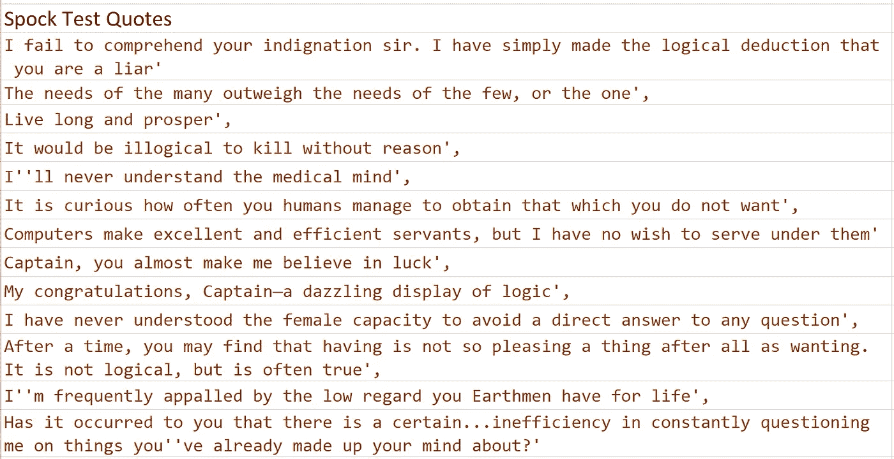

斯波克引用——他表现出情感了吗？？或者至少是情绪？

## 构建情感分析器的基本步骤:

1.  选择/查找/窃取用于训练的数据集
2.  清理数据集
3.  构建单词嵌入
4.  挑选一个模型并训练它
5.  评估模型
6.  生产化！

# 1.明智地选择(你的数据集)

训练语料的选择**非常**重要。它需要标签和足够的广度和一致性来建立一个坚实的模型。我找到了几个选项(使用谷歌新的数据集搜索):

*   **Stanford movie review**—240k 短语/单词级别分解和梯度评分 0.0–1.0——缺点是分解使其无法用于矢量嵌入(*稍后详细介绍*)。[3]
*   **微软 Cortona**——多类情感标签悲伤、空虚、中性等(0，1 二进制)——有前途
*   **Twitter**—140 万条推文，0 表示负面，1 表示正面。推特上有很多俚语，所以好坏取决于你是否想评价 vs 俚语。[4]
*   **亚马逊** —产品评论—text+1–5 星评分—也很有前景。
*   **Yelp**——有用、有趣、酷+星级(pos/neg 1–5)的多张选票——前途无量，还有许多方面需要改进。[7]

我用 Twitter 的原因超出了逻辑。参见下面的例子(错别字、脏话等等):

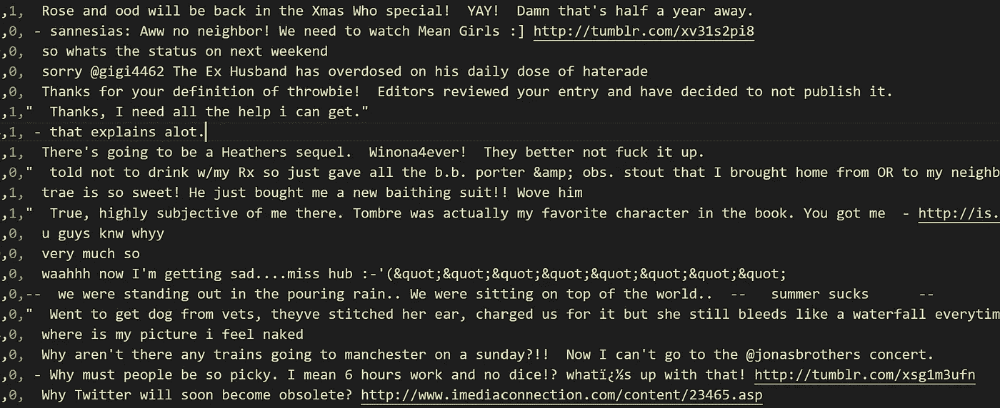

Twitter 数据示例— 0 为负，1 为正。注意互联网上免费出现的俚语、诅咒、糟糕的拼写和语法。注意不是所有的分数都匹配…有些接近 50/50，但是这个标签是二进制的。

# 2.清洁(就像虔诚一样)

清洁有几个主要步骤，其中大部分都很简单:

*   使单词大小写一致，并扩展缩写
*   删除特殊字符、数字和重音符号
*   删除常用的小词，如“a”、“the”、“and”→也就是停用词
*   词干或词干化——词干化就是把一个单词多余的部分切掉，即‘词干化’→‘词干’，以及‘词干化’→‘词干’。词汇化更复杂，即:“鹅”→“鹅”，“研究”→“学习”
*   将字符串转换成记号/数组(假设模型需要数组格式)
*   有时你想标记词类(PoS)——比如动词、名词短语——现在跳过这个

在现实世界中，请使用 [NLTK](https://www.nltk.org/) 而不是自己编写！

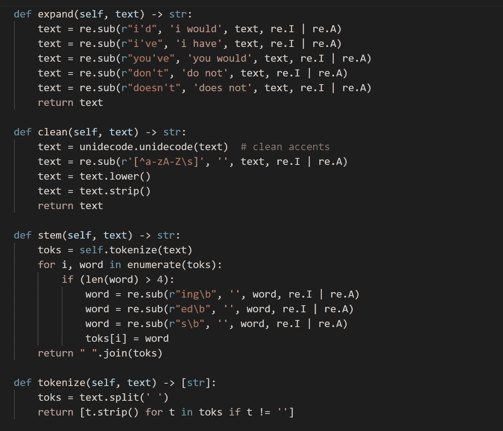

FooNLP 原型代码的愚蠢例子..对于实际工作，使用 NLTK 之类的标准库，它更健壮，而且不仅仅是词干化，还进行了词干化

# 3.嵌入(你的邻居)

ML 模型只接受数字作为输入。将文本“编码”或“嵌入”为数字表示的过程是一个关键步骤。存在两种主要方法(标量字数统计和嵌入矩阵)，后者是当今的最新技术。

**标量表示**——*计数向量*编码方法是让列表示单词(每个单词一列)，行表示一个例句。每个单词的出现次数存储在每一列中(非常稀疏，即，给定一个 700k 单词的 vocab，每个样本句子大部分是 0)。参见示例(上表为简单计数，下表为加权“tfidf”):

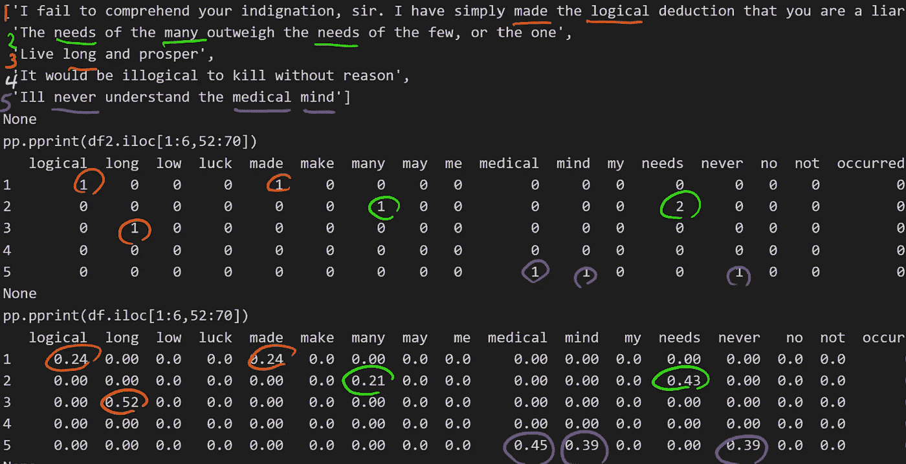

标量嵌入—向量计数(上)和 tfidf(下)—用于 5 个样本 spock 引用的虚拟编码。构建所有推文的表示会产生 140 万行和 70 多万列特征(单词)

“长命百岁，兴旺发达？”(第 3 行)对大多数列用 0 编码，对“long”列用 1 编码，因为单词 long 只出现一次。**很** **简单**。(第二个表是 tfidf 编码，它也是一个字数，但占它在其他句子中出现的次数)。

```
**Code to build a Count Vector:**from sklearn.feature_extraction.text import CountVectorizercv = CountVectorizer()  # or - TfidfVectorizier()
toks = <array of sentences from twitter>
matrix = cv.fit_transform(toks)   
columns = cv.get_feature_names() 
```

**矢量表示** —一个“*嵌入矩阵”*(像 word 2 vec【13】和 GloVe【19】)是一个更复杂的&强大的表示。像前面的方法一样，列表示单个单词(像计数向量)，但是行不是单个样本，而是一个固定的数字向量。样本引用被分解并训练成“*单词特征*”的 n-elem 向量。*(本例中为 10 elems，而实际系统有 50、100、300+elem)。*

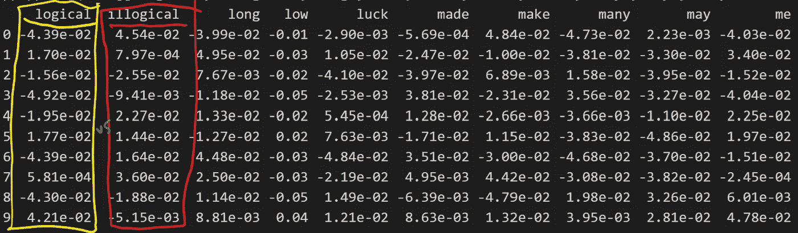

Word2Vec 编码只是使用 10 维 CBOW 编码的样本 Spock 报价。数字本身没有什么意义，但是比较前两列，注意数值的不同？

```
**Code to train a Word2Vec matrix and test similarity:**toks = <array of sentences from twitter>
w2v = gensim.models.Word2Vec(toks, min_count=1, size=100, window=5)
columns = w2v.wv.vocab     # 732k words
matrix =   wv2.wv[columns] # 732k x 100 matrixprint(w2v.similar_by_word('love'))
```

#的含义超出了这篇介绍文章(和大多数文章！)—简而言之，它嵌入了上下文信息，这使得它在查找相似/相关单词等方面非常强大。在 150 万 Twitter 数据集上训练的 100 维嵌入的几个例子:

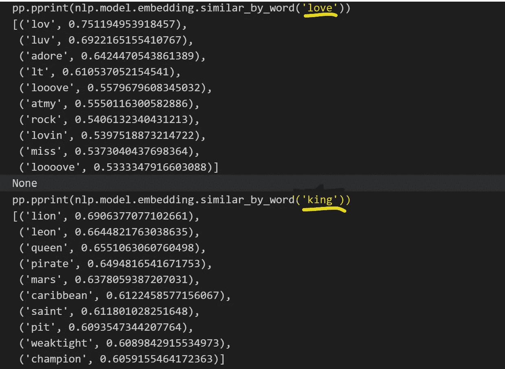

令人惊讶的是，相似性匹配是如此的精确，全部使用无监督的现成 Word2Vec！

下一步训练和检测:“斯波克必须死”→阳性/阴性情绪得分？！

# 4.火车 La(超级)模型！

训练过程从步骤 3 中提取单词嵌入，并使用它们作为输入，以及步骤 1 中的推文和情感标签来训练模型。使用逻辑回归是最容易解释的(这就像一个单层神经网络，或感知器，不要与霸天虎混淆)。

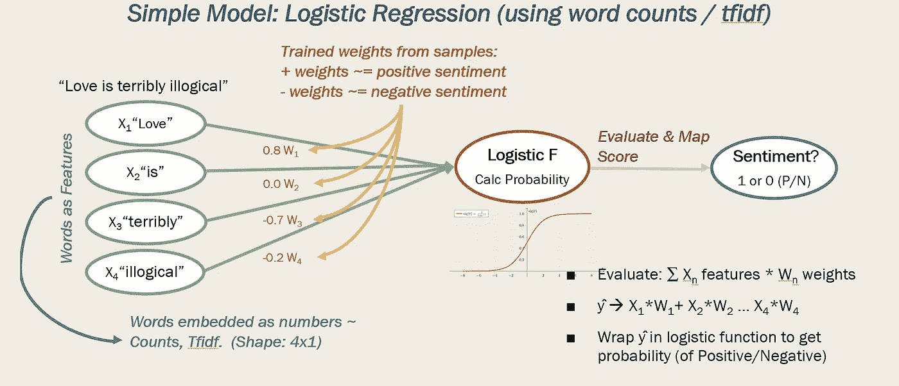

foo stack . ai——模型的评估步骤(注意，真实模型中有 70 万个单词，但只评估我们想要对其进行情感评分的句子。

“训练”模型的过程为每个特征(单词)设置一个权重(值),以从整体上最小化模型的错误猜测。它对涉及正得分的单词设置较高的正权重，反之亦然。*(它大致遵循了赫布边关于大脑突触如何放电的理论【11】)*。注意，完整的模型有 70 万个以上的特征(单词)，对“爱是非常不合逻辑的”这样的句子的评估将激活如上图所示的句子/分数计算。使用 SKLearn 的简单示例:

```
from sklearn.linear_model import LogisticRegressionX = <rows of 1.5m tweets, CountVectorized into onehot cols>
y = <rows of 0 and 1 labelled scores>model = LogisticRegression().fit(X, y)    # train model
results = model.predict(['Love is terribly illogical'])    #eval
prob = model.predict_proba('Love is terribly illogical'])  #score> results: 1 (Positive)
> prob::   99.996%
```

这些 SKLearn[14]模型对于简单的 CountVectors 或 Tfidf 非常有效，但是对于 Word2Vec CBOW 矩阵，您确实需要一个具有嵌入层(每个输入单词的可训练节点)的神经网络。你必须稍微思考一下才能理解为什么——在 CV/tfidf 中，特征是唯一的词，训练创建了每个唯一的词→单个值的表。在 W2V 每个单词→ n 个唯一值中，可以认为每个单词有 n 个特征(在我的例子中是 10，更大的模型有 100 个)。每个单词的“特征”数量赋予了它寻找相似性等的能力。

将 W2V 嵌入到简单模型中的一种快捷方法是通过将单词 val 平均为如下所示的单个值来“挤压”句子中的单词:

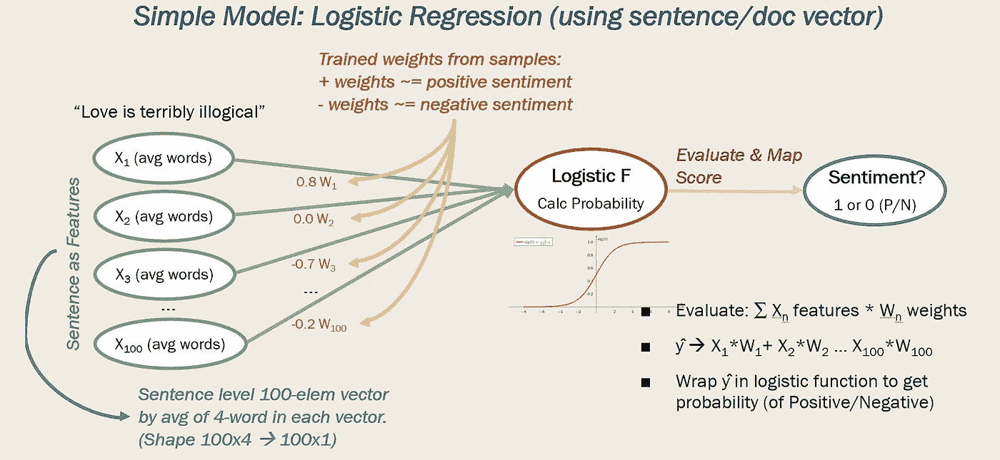

FooStack.ai — w2v 模型产生更高维度的模型，因此我们需要将其“压缩”到 2d，以便与逻辑回归模型一起使用。对于每个 n 输入单词，可以使用带有 n 个隐藏层的单词向量和神经网络。

或者，我们可以将每个单词的 100 个值压缩成一个平均值，但这似乎更糟，因为您丢失了向量包含的所有上下文信息。如果你想保留两个特征维度，你需要一个权重更大的神经网络。查看 FooNLP 包[的完整源代码。](https://github.com/dougfoo/machineLearning/tree/master/nlp)

*下个月我们将会看到更多关于完整 w2v 矩阵的 NN 实现。*

# 5.Evaluate^(一次又一次)

第一次尝试几乎不可能拿到最好的成绩。科学本质上需要实验。除非你是曼哈顿博士，能够预见未来[20]，或者使用 AutoML，否则你应该计划在这里花大量时间摆弄参数，以理解结果。

下面的基本评价是每个组合都有很大不同！一些偏斜的结果比另一些更负面。“ ***迷人的***……”就像斯波克先生会说的那样。

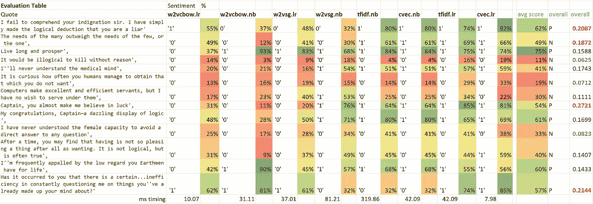

在 Spock 报价上运行 8 种不同的模型+嵌入组合后的分析。请注意许多项目上的显著标准偏差

## *性能快速说明:*

*Word2Vec 可能是资源密集型的，150 万条推文中只有 100 个向量，训练一个嵌入&逻辑回归模型的 CBOW 需要 15 分钟。即使是简单的计数向量，训练也需要 6 分钟。然而，我是在机场的超便携 Surface 6 上做这个的……不完全是美国企业的力量..*


训练时间..更快的 CPU 会有所帮助。我开始序列化模型，并在可能的时候从磁盘加载。1.5m 的句子模型占用 1.2gb 的空间，但在几秒钟内加载，而从头开始训练需要 20-30 分钟！

# 6.部署

FooStack 从将作品投入生产中获得满足感。我们将包装在 [nlp.py](https://github.com/dougfoo/machineLearning/blob/master/nlp/nlp.py) 中的工作插入到我们现有的 Python REST 应用程序中，很快——我们的客户现在可以看到更多的实时情感评分(以及 w/ Azure、Google 等)。斯波克先生会感到骄傲(不带感情色彩地)。

考虑到每个序列化模型的巨大规模(CV/Tfidf 为 250mb，Word2Vec 为 1.2gb)和训练时间，我挑选了两个精简的模型(w2v cbow w/ logistic regression 和 tfidf w/ naive bayes)。

```
# Flask static init app.py
nlp = FooNLP()
models = {}
models['tfidf.nb'] = nlp.load('models/tfidf.nb.ser')
models['w2v.lr'] = nlp.load('models/w2vcbow.lr.ser')print('loaded models', models)
```

这里的满瓶代码是。之前关于构建情感分析器的文章[在这里](/cross-platform-nlp-gui-on-flutter-75d59170864?source=---------2------------------)。

```
# also added to 
#    def sa_predict(model='all'):
#        ... def custom_nlp(text):
    nlp = models['w2v.lr']
    label, prob = nlp.predict([text])
    print(label, prob) resp = {}
    resp['model'] = 'Foo W2V LR'
    resp['extra'] = 'model returns 0 to 1'
    resp['url'] = '[http://foostack.ai/'](http://foostack.ai/')
    resp['rScore'] = prob[0]return resp
```

如果我支付了我的 Azure 账单，你可以在[http://foostack.ai/nlp](http://foostack.ai/nlp)*【编辑——停机维护——有重大 Azure 部署问题……然后放弃了！]*

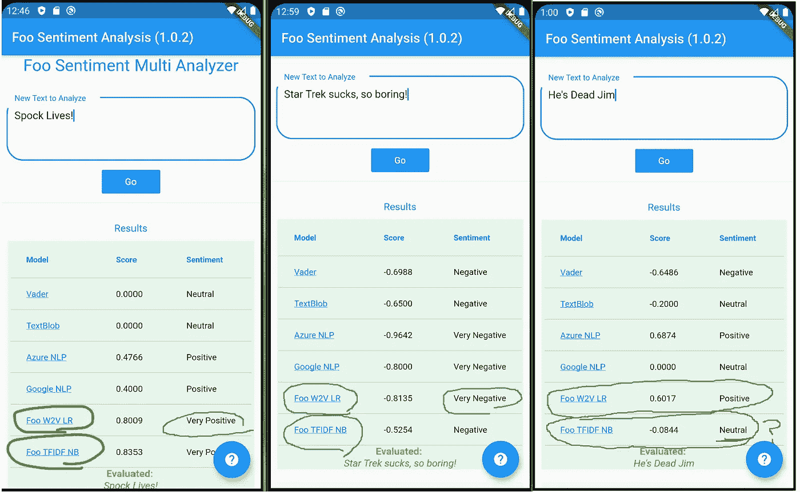

一些例子——一些命中，一些未命中..所有型号都不一样！

# 7.结论—斯波克的观点是…

基于这一非科学研究的结论是，斯波克确实是一个没有感情、没有情感、无情的生物(即一个瓦肯人)。数据显示了一点偏向消极的倾向——也许人类的(情感)社会观在缺乏情感时是消极的！

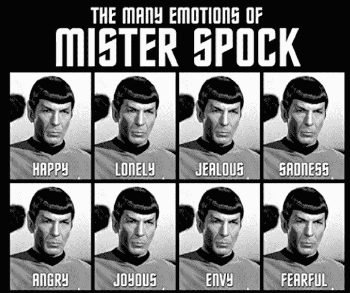

你可以从亚马逊买到这张海报

寻找我的下一篇关于使用神经网络和著名的 BERT 架构进行情感分析的文章。下次再见， ***万岁，*** ！

# **参考与启示:**

[0]封面照片—[https://commons . wikimedia . org/wiki/File:Leonard _ Nimoy _ Mr _ Spock _ Star _ Trek。JPG](https://commons.wikimedia.org/wiki/File:Leonard_Nimoy_Mr._Spock_Star_Trek.JPG)

[1]自定义 NLP 指南—[https://towards data science . com/understanding-feature-engineering-part-3-traditional-methods-for-text-data-f6f 7d 70 ACD 41](/understanding-feature-engineering-part-3-traditional-methods-for-text-data-f6f7d70acd41)

[2]各种 NLP 技术的高级指南—[https://towards data science . com/beyond-word-embedding-part-2-word-vectors-NLP-modeling-from-bow-to-Bert-4 EBD 4711 d0 EC](/beyond-word-embeddings-part-2-word-vectors-nlp-modeling-from-bow-to-bert-4ebd4711d0ec)

[3] Twitter 情绪数据—[http://thinknook . com/Twitter-perspective-analysis-training-corpus-dataset-2012-09-22/](https://www.win.tue.nl/~mpechen/projects/smm/)和[http://thinknook . com/Twitter-perspective-analysis-training-corpus-dataset-2012-09-22/](http://thinknook.com/twitter-sentiment-analysis-training-corpus-dataset-2012-09-22/)

[4]史丹福电影情感数据—[https://nlp.stanford.edu/sentiment/](https://nlp.stanford.edu/sentiment/)

[5]词语向量/嵌入的简易解释—[http://xplordat . com/2018/09/27/Word-Embedding-and-document-Vectors-part-1-similarity/](http://xplordat.com/2018/09/27/word-embeddings-and-document-vectors-part-1-similarity/)

[6]谷歌情感数据集搜索—[https://datasetsearch.research.google.com/search?查询=情绪% 20 分析&docid = 0 rbimum 78% 2B % 2 fk 2 MP 2 aaaaaa % 3D % 3D](https://datasetsearch.research.google.com/search?query=sentiment%20analysis&docid=0rbimuM78%2B%2Fk2mp2AAAAAA%3D%3D)

[7] Yelp 数据集—[https://www.kaggle.com/yelp-dataset/yelp-dataset](https://www.kaggle.com/yelp-dataset/yelp-dataset)

[8]多重标签情绪—[https://data.world/crowdflower/sentiment-analysis-in-text](https://data.world/crowdflower/sentiment-analysis-in-text)

[9]嵌入—https://stack abuse . com/python-for-NLP-word-embedding-for-deep-learning-in-keras/

[10]嵌入矩阵 Petuum 公司的“嵌入:意义矩阵”[https://link.medium.com/onbeDUAzL3](https://link.medium.com/onbeDUAzL3)

[11]赫布边学—[https://en.wikipedia.org/wiki/Hebbian_theory](https://en.wikipedia.org/wiki/Hebbian_theory)

[12]NB 上的原始信息—[https://medium . com/datadriveninvestor/implementing-naive-Bayes-for-sensation-analysis-in-python-951 fa 8 DCD 928](https://medium.com/datadriveninvestor/implementing-naive-bayes-for-sentiment-analysis-in-python-951fa8dcd928)

[13]word 2 vec API—[://radimrehurek . com/gensim/models/word 2 vec . html](https://radimrehurek.com/gensim/models/word2vec.html)

[14]sci kit-Learn vector/TF dif & models—[https://sci kit-Learn . org/stable/modules/generated/sk Learn . feature _ extraction . text . count vector izer . html](https://scikit-learn.org/stable/modules/generated/sklearn.feature_extraction.text.CountVectorizer.html)

[15]NLP Flutter—[https://towardsdatascience . com/cross-platform-NLP-GUI-on-Flutter-75d 59170864？来源= - 2 -](/cross-platform-nlp-gui-on-flutter-75d59170864?source=---------2------------------)

[16]后端 GitHub 回购—[https://github.com/dougfoo/flaskml3/](https://github.com/dougfoo/flaskml3/)

[17]用于 NLP lib 的 GitHub Repo—[https://github.com/dougfoo/machineLearning/tree/master/nlp](https://github.com/dougfoo/machineLearning/tree/master/nlp)

[18]miko lov(Google)的原始 Word2Vec 论文:[https://arxiv.org/pdf/1301.3781.pdf](https://arxiv.org/pdf/1301.3781.pdf)和[https://papers . nips . cc/paper/5021-单词和短语的分布式表示及其组成性. pdf](https://papers.nips.cc/paper/5021-distributed-representations-of-words-and-phrases-and-their-compositionality.pdf)

[19]手套嵌入—[https://nlp.stanford.edu/projects/glove/](https://nlp.stanford.edu/projects/glove/)

[20]曼哈顿博士，守望者—[https://en.wikipedia.org/wiki/Doctor_Manhattan](https://en.wikipedia.org/wiki/Doctor_Manhattan)