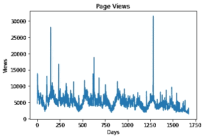
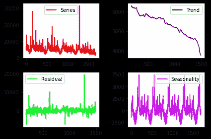
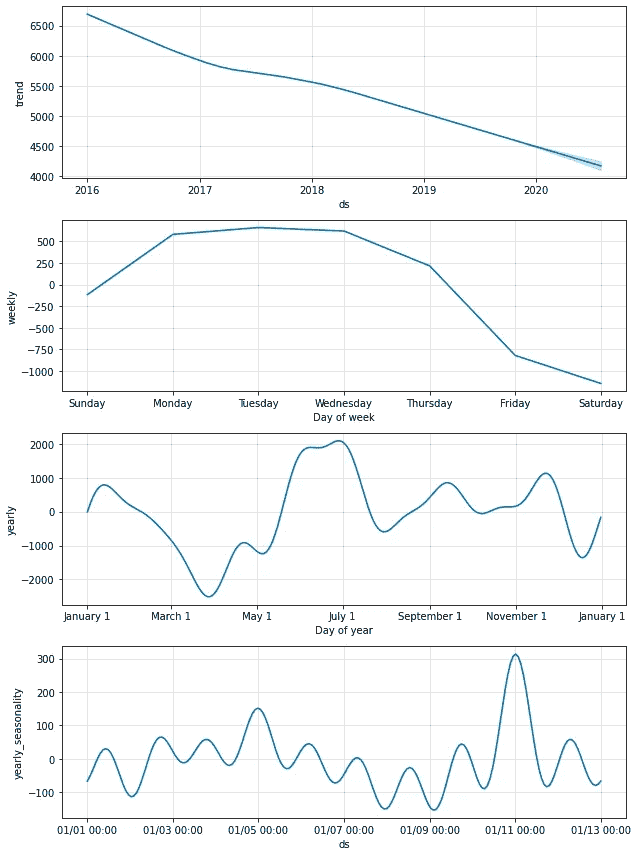
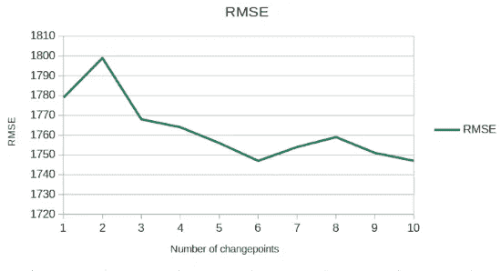
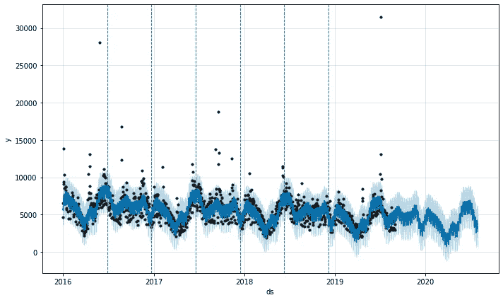
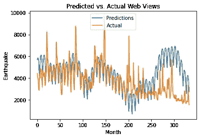

# Prophet 能准确预测网页浏览量吗？

> 原文：<https://towardsdatascience.com/can-prophet-accurately-forecast-web-page-views-3537fe72e11b?source=collection_archive---------44----------------------->

## 使用 Prophet 预测网页流量

预测网页浏览量可能相当棘手。这是因为页面浏览量往往会在数据中看到显著的“峰值”，即浏览量远远高于平均水平。

让我们根据 2016 年 1 月至 2020 年 8 月维基媒体工具库的统计数据，以“地震”一词的页面浏览量为例:



来源:维基媒体工具锻造

我们可以看到，虽然总体趋势有所下降，但在特定时间点，页面浏览量仍有大幅上升。这符合我们的预期——人们很自然地认为“地震”一词的峰值会出现在实际发生地震的地方。

虽然时间序列不可能预测这种峰值，但仍然可以使用时间序列模型来预测更普遍的趋势。

在这方面，为了预测该搜索项的页面浏览量，建立了一个 Prophet 模型。

# 模型配置

**Prophet** 是脸书开发的一个预测模型，它通过对季节性、假期和变点等因素进行特殊调整来预测时间序列。

以下是用 Python 对上述时间序列的分解:



来源:Jupyter 笔记本输出

从上面可以看出，随着时间的推移，我们可以观察到一个强有力的下降趋势。此外，对季节性图表的直观检查表明了每年的波动。

具有年度季节性且傅立叶阶为 10 的加性模型定义如下:

```
prophet_basic = Prophet(seasonality_mode='additive')
prophet_basic.add_seasonality('yearly_seasonality', period=12, fourier_order=10)
prophet_basic.fit(train_dataset)
```

这是 Prophet 指出的组件的分解。

```
fig1 = prophet_basic.plot_components(forecast)
```



来源:Jupyter 笔记本输出

既然已经确定了趋势和季节性因素，下一个任务就是确定数据中的变点数量。

简单地说，变点是时间序列的轨迹发生重大变化的地方。正确识别这些有助于提高模型的准确性。

在这点上，改变变点参数，并计算测试集的 RMSE(均方根误差)分数:



来源:作者的计算

RMSE 通过 **6** 变点最小化，因此该型号将配置相同的变点。

这是一个转变点的图表:

```
import matplotlib.pyplot as pltfigure = pro_change.plot(forecast)
for changepoint in pro_change.changepoints:
    plt.axvline(changepoint,ls='--', lw=1)
```



来源:Jupyter 笔记本输出

# 结果

上面的 Prophet 模型是在 80%的数据集(训练集)上训练的。现在，针对数据集(测试集)的后 20%生成预测，并计算出**均方根误差**和**平均预测误差**。

```
>>> from sklearn.metrics import mean_squared_error
>>> from math import sqrt
>>> mse = mean_squared_error(actual, predicted)
>>> rmse = sqrt(mse)
>>> print('RMSE: %f' % rmse)RMSE: 1747.629375>>> forecast_error = (actual-predicted)
>>> mean_forecast_error = np.mean(forecast_error)
>>> mean_forecast_error-681.8562874251497
```

测试集中的均方根误差为 **1，747** ，最大值为 **9，699** ，与最大值相比，误差似乎是合理的(误差大小约为整个范围的 **17%** )。

当将第 90 百分位作为最大范围时(为了排除异常大的值)，获得最大值**5378**。

```
>>> np.quantile(actual, 0.9)5378.3
```

假设该值为最大值，均方根误差的大小占总范围的**32%**——这明显更高。

以下是预测值与实际值的对比图:



来源:Jupyter 笔记本输出

我们可以看到，虽然 Prophet 模型通常预测整体趋势，但它未能预测数据中的这些大“峰值”，这导致了更高的预测误差。

从这个角度来看，虽然 Prophet 在确定数据的长期趋势方面仍然很有用，但使用蒙特卡罗分布可以更有效地预测异常。

具体而言，网页查看统计似乎遵循帕累托分布，例如，在任何给定的 100 天中，80%的页面查看将在 20%的日子中被记录。如果您感兴趣，参考资料部分包含了关于这个主题的另一篇文章。

# 结论

在这个例子中，我们看到 Prophet 是一个有用的时间序列工具，可以用来预测序列的整体趋势，并识别时间序列中的变点或重大的突变。

然而，网页浏览量在某种程度上是独特的，因为它们受到高度异常的影响，并且 Prophet 在预测不一定依赖于季节性或其他时间相关因素的极值方面可能是有限的。

非常感谢您的阅读，欢迎任何问题或反馈。

*免责声明:本文是在“原样”的基础上编写的，没有担保。本文旨在提供数据科学概念的概述，不应以任何方式解释为专业建议。*

# 参考

*   [预言者:趋势转折点](https://facebook.github.io/prophet/docs/trend_changepoints.html)
*   [走向数据科学——帕累托分布和蒙特卡洛模拟](/pareto-distributions-and-monte-carlo-simulations-bee46113211d)
*   [Wikimedia Toolforge:浏览量分析](https://pageviews.toolforge.org/?project=en.wikipedia.org&platform=all-access&agent=user&redirects=0&start=2015-07-01&end=2020-08-02&pages=Earthquake)