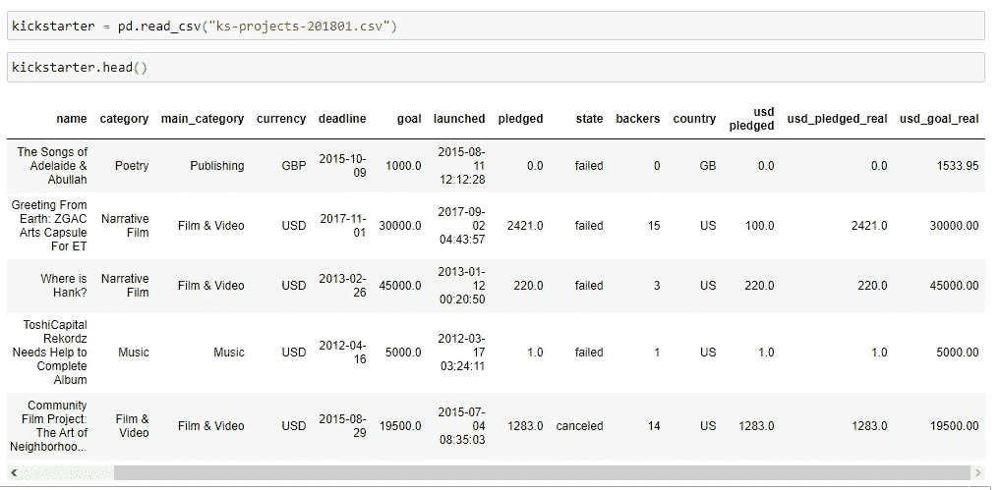
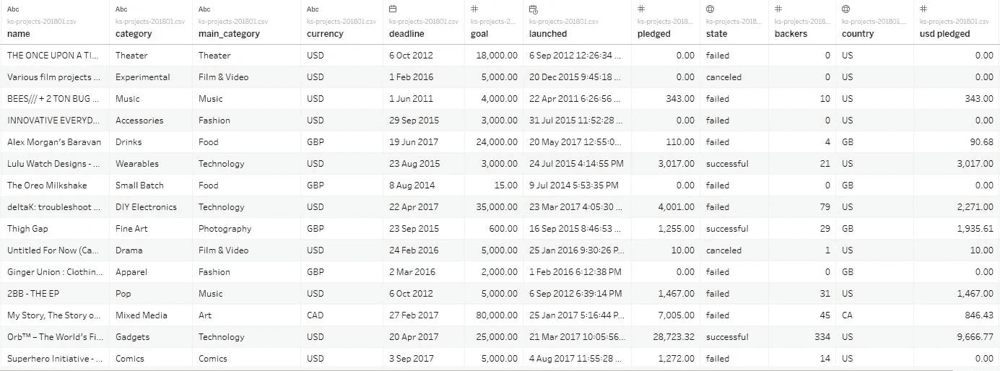
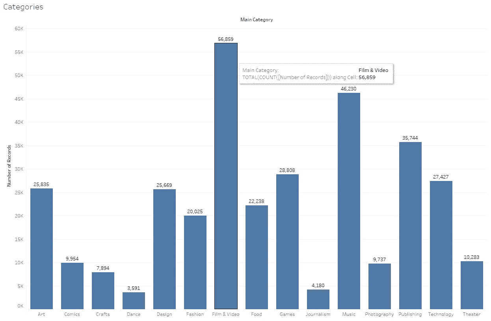
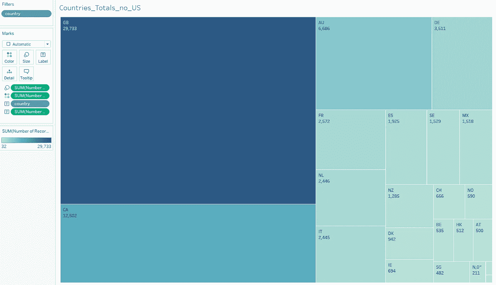
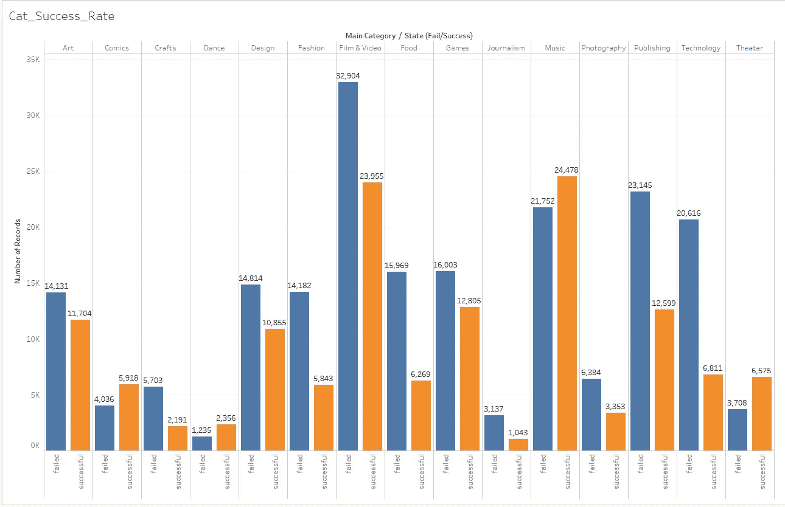
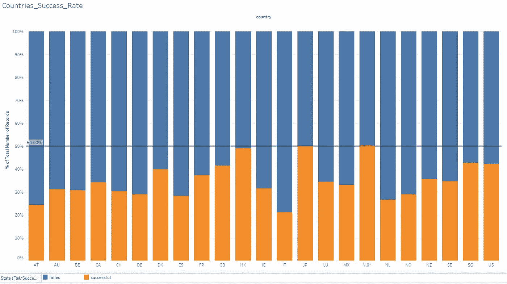
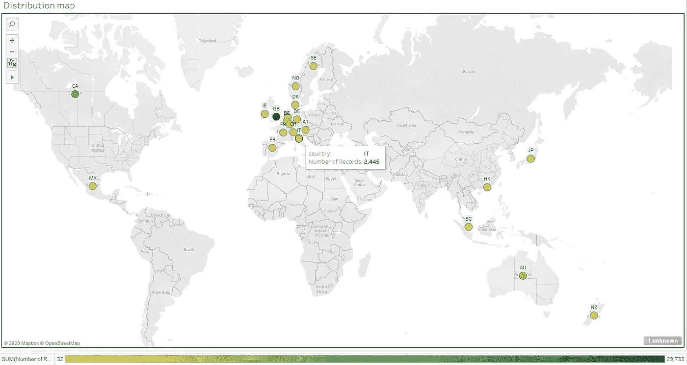

# Python DataViz 库能否重现 Tableau 工作表？

> 原文：<https://towardsdatascience.com/can-python-dataviz-libraries-repeat-the-tableau-worksheet-e38ef2876f04?source=collection_archive---------10----------------------->

## 数据可视化技巧

## 我对 Tableau 用法及其与 Python 代码的比较的第一印象

简单来说，答案是肯定的。尽管如此，在我探索画面的过程中，我还是注意到了一些很酷的事情。

罗曼·博日科在 [Unsplash](https://unsplash.com?utm_source=medium&utm_medium=referral) 上拍摄的照片

Tableau 是我进入数据科学和数据可视化之旅的必去之地。对于快速了解数据集和初步探索性可视化来说，这是一个非常酷和方便的工具。它为原始数据分析和进一步探索提供了许多必要的工具。因此，作为一名初学数据的科学家，我对它感兴趣并不奇怪。不过，首先，我是一名软件开发人员，所以我不仅想得到一个新的奇特工具，还想了解它是如何工作的。主要目标是**用 Jupyter notebook 和任何 Python 库(如 plotly 或 matplotlib)从 Tableau 重新创建任何可视化**。

## 让我们从一个数据集开始

我们的任务需要对数据进行一些探索性的分析，所以我选择了一个数据集，它可以展示很多有趣的东西。就是来自 Kaggle 的 2018 年 Kickstarter 项目(失败和成功都有)[的](https://www.kaggle.com/kemical/kickstarter-projects)[表。它包含足够用于分组的分类变量(如项目类型和国家)、一些日期和日期范围(它们都有开始日期和截止日期)以及用于合计的数字变量(金额)。](https://www.kaggle.com/kemical/kickstarter-projects)

请注意数据:

虽然我的第一个冲动是使用熊猫，但我现在必须借助 Tableau 来查看数据。

## 第一印象

Tableau 只需点击几下就可以打开数据集，相当于熊猫的一行代码。虽然它带来了额外的功能，如自动列类型识别:日期/时间、地理数据、数字等..因此，Tableau 方法看起来更有吸引力，所以我把我的数据集…

…我遇到了数据类型的问题，我的数据没有被解析。简单看了一下，发现问题出在本地的 Windows 语言设置上。我住在乌克兰，所以我有母语的月份名称，但数据集包含英语格式，Tableau 在当前的语言设置下无法识别。我有点失望，这个程序需要本地设置，我不能在程序中调整它们。不管怎样，问题解决了，我继续工作。

现在我们可以看到自动类型识别的所有优点:

正如我们所见，它正确地识别了货币、日期和地理数据。除了一个小错误:“state”列被识别为地理数据，而不是原始文本。然而，这是一个很好的特性，有助于分析。

## 点击几下即可清洁

数据集清理是数据分析过程中最耗时的步骤。所以我们需要使用任何工具来保持我们的时间。Tableau 在这个过程中是一个优秀的助手，它有别名、计算列和过滤系统。例如，我们在 Kickstarter 数据集中有“state”列。它保持几个值:“成功”、“失败”、“活动”、“暂停”和“取消”。尽管我们只希望与“成功的”和“失败的”项目合作。让我们继续下一步:

1.  为“state”列创建一个过滤器，这样我们只留下“successful”、“failed”和“live”状态。
2.  创建一个计算字段，将“实时”转换为“成功”。我们需要下一个公式:`if [state] = “live” then “successful” else [state] end`
3.  如果需要，可以使用别名。
4.  将列重命名为“状态(失败/成功)”。

首先，所有这些步骤都可以通过几次点击来完成，这是可视化界面的一个明显优势。此外，计算字段允许执行任何复杂的条件。过滤器让我们可以快速访问该列的所有值。

由于我们使用的是比较，以下是相同工作的 Python 代码:

当然，虽然我们已经完成了我们的例子，但是还有很多清理工作要做，所以让我们转到图表上来，这是本文的主要目标。

## 每个值都是一个可视化对象

这是我在数据分析中遇到的最佳实践:Tableau 将每一列(要素或测量或过滤器或计算字段)转换为拖放对象。所以你可以通过几次鼠标移动来创建一个完整的信息可视化。例如，我刚刚在列中添加了“主类别”特性，并在行中自动生成了“记录数”,条形图就准备好了。再移动一次以将总计数添加为条形标签，这是每个条形上带有额外视觉提示的结果:

同样的操作将花费更多的时间，但是 Jupyter 笔记本中的几行代码:

更复杂的图形呢？没问题:将“Country”列和“Number of records”行一起拖动，改变可视化类型，我们就有了树形图。更重要的是:将“Country”特性拖到 filters 部分，从可视化中删除 USA 行(这样会更清晰，因为 USA 有最多的记录)。结果仍然是交互的:

尽管如此，可视化仍然可以用 Python 代码再现:

所以我们了解到，我们可以通过点击几下鼠标来创建简单的可视化。尽管我们还需要几行代码来在 Python 中得到相同的结果。让我们创造一些更复杂的东西。

## 自动聚合

简单的图形向我们展示了两个变量之间的联系。如果我们需要显示三个以上的特征，我们使用聚合技术。例如，如果我们需要显示每个类别中成功和失败项目的数量，该怎么办？对 Tableau 来说这是个简单的任务。我们已经有了一个类别条形图，所以，让我们将“State”变量作为颜色属性添加到工作表中:

一个动作，我们就收集了更多的信息。代码呢？嗯，我们需要大量的数据来制作这张图片:

现在让我们为“国家”特性创建一个类似于 AB-test 的东西，并显示成功和失败项目的比例。我们对“Country”执行与前面对“Category”相同的步骤，并更改聚合的属性以显示百分比:

这是代码。尽管这次更加复杂:

此外，Tableau 对颜色方案、标签字体和自定义线条有不同的设置，正如我们在可视化中看到的那样。

现在让我们转向另一种方法。

## 从头开始绘制地图

正如标题所示，我们将创建一个地图。Python 有许多额外的包来处理地理数据，如 follow。不过，Tableau 具有识别地理数据(如国家代码)并使用它构建地图的内置功能。与前面的部分一样，只需将变量拖放到工作表中，Tableau 就会自动生成地图:

再点击几下，我们就有了一个漂亮的交互式地图，上面用彩色符号标出了 Kickstarter 记录的数量。我们仍然可以完全控制标记、颜色、标签和其他设置。

如上所述，我们使用 GeoPy 和 GeoPy(将国家代码[转换为地理数据](/geolocations-and-geocodes-instrument-set-for-data-analysis-5eb4e33a1677))来创建相同的地图:

这不像 Tableau 那么简单，但仍然是可复制的。

## 那又怎样？

这是一个合理的问题。我们已经知道，matplotlib、seaborn、plotly 和其他 Python 库功能非常强大，几乎可以实现任何可视化。另一方面，Tableau 是一种著名而又酷的乐器，具有非常相似的功能。我们可以从一开始就预测文章标题的答案。尽管如此，我相信这种比较对于展示一些不明显的思想是非常重要的:

*   将每个特征表示为一个可视对象可以多次加速可视化过程(只需记住使用 matplotlib 轴)；
*   Tableau 内置了很多乐器，不需要每次都记住所有的包名或者组成一个新的环境；
*   在另一次过滤后，您实际上可以看到数据和您应用的所有更改。甚至—每个筛选器或计算列都是一个单独的对象；
*   Tableau 有自己的模拟脚本语言，用于构建复杂的条件和过滤器；
*   大量的聚合能力、默认类型检测和特性选择；
*   它只是漂亮，看起来像一件艺术品；

但是

*   代码给了我们更多的定制能力，特别是颜色、图例、附加元素、并行可视化等。你可以自由地用你的数据做任何事情；
*   Tableau 适用于已经清理过的数据集。它有很酷的设备，但是对于先进的清洗技术来说还不够；
*   Tableau 中的每一个可视化都可以在 Jupyter notebook 中重现(只是没那么好看)。

尽管我的结论是，我相信每个人都应该使用他喜欢和习惯的工具。我发现 Tableau 易于使用，在快速的主要数据集分析方面表现良好，并且能够在几次点击中创建分组并保存就绪的图像。虽然 Python 库可以做同样的工作，但 Tableau 可以做得更快，做得更漂亮。所以，**我肯定会在我的作品**中使用它，尤其是当我需要一张艺术般的照片时。尽管如此，我仍然更喜欢 Jupyter notebook 进行复杂的分析，及时显示几幅图像，快速记录，并在项目期间给予很大的自由。

您可以在我的 Github 上找到包含所有工作示例和内置图形的 Jupyter 笔记本，以及 Tableau 工作表:

 [## 中级/中等 _jupyter_notes

### permalink dissolve GitHub 是 4000 多万开发人员的家园，他们一起工作来托管和审查代码，管理…

github.com](https://github.com/Midvel/medium_jupyter_notes/blob/master/tableau_vs_python/tableau_vs_python.ipynb) 

此外，你可以自由分享一些有趣的技巧，用在 Tableau 中。