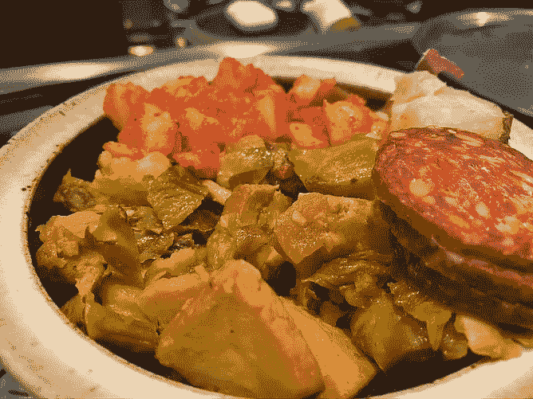
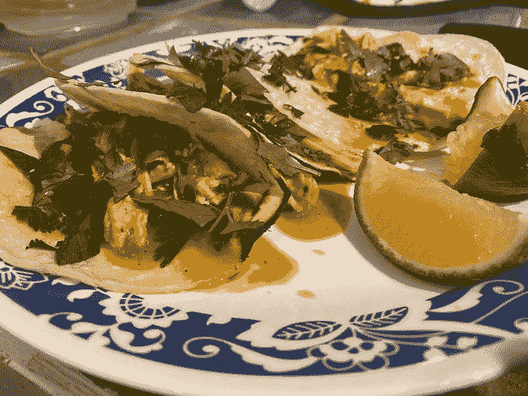

# 机器人厨师能重新开餐馆吗？

> 原文：<https://towardsdatascience.com/can-robot-chefs-re-open-restaurants-3cccd23b1aa8?source=collection_archive---------83----------------------->

## 机器人餐厅行业调查。

R obots？餐馆？这在 2019 年看起来太科幻了，但由于冠状病毒，我们即将跳过自动化采用的十年。未来就在这里，我们不再需要人类在汽车餐厅给我们买薯条——这些公司声称*。*

免费的 Pexels，有一些来自资金雄厚的机器人初创公司的访客。

实现机器人厨房的技术有哪些？这些公司看起来都像是在与**餐饮服务行业**相关的特定背景下框定了**机器人领域的经典问题**。他们不需要突破研究前沿的极限，他们需要将研究放在正确的位置。

这对我们得到的食物意味着什么？我认为，采用这些方法的餐厅将会因为潜在的 100%一致性而损失 10%的风味和体验。

## 挑选和放置—一个合理的挑战

拾取和放置是机器人学中的一个经典问题。我已经听到我的许多同事大声抱怨这个问题的无聊，但是它到处出现:物流、制造、运输、烹饪等等。

> 你在位置 A 有一个物体，它需要移动到位置 b。

这最终是 90%的大规模烹饪。**配料 *i* 需要在时间 *t* 放入盘中 *j* 。**我不认为机器人有一个好的机制来根据味道进行反馈(例如*将一道菜从 0 腌制到完美并让许多味道出现的魔法*)，但我确实认为机器人可以重复这些任务。

就我个人而言，如果一个机器人在地铁里为我做三明治，我会非常高兴，也许我只是一个洁癖者。(不是说我在赛百味吃饭，而是你明白了。)

 [## 味噌机器人|食物的未来就在这里

### Flippy 是世界上第一个自主机器人厨房助手，可以从周围环境中学习并获得新的…

misorobotics.com](https://misorobotics.com/)  [## Dexai Robotics |您厨房里的智能副厨

### DEXAI ROBOTICS 服务条款和隐私政策条款通过访问 DEXAI 网站，您同意成为…

www.dexai.com](https://www.dexai.com/) 

对**和**感兴趣？在这里阅读更多关于它的[，或者也许看这个](https://6river.com/what-is-a-pick-and-place-robot/)[视频](https://www.youtube.com/watch?v=6RKXVefE98w)，或者检查一下[我在伯克利的同事](http://autolab.berkeley.edu/)。什么使它变得困难:

1.  潜在对象的无限**号**。
2.  所述物体的无限**方位**。
3.  人类真的是很好的**竞争者**。

我在这里写了这方面的进展。

 [## 机器人已经为现实世界做好了准备

### 加州大学伯克利分校人工智能研究所的新创公司 Covariant 显示，机器人可以在大范围内完成这项工作

towardsdatascience.com](/robots-are-ready-for-the-real-world-32808cb1a4eb) 

## 规划和路线选择——安全的选择

这是一个已经解决的问题。我记得我在脸书实习时看过关于机器人如何在没有地图的情况下导航的演讲:[它们只需要一个目标](https://www.technologyreview.com/2020/01/22/276139/facebook-has-trained-an-ai-to-navigate-without-needing-a-map/)。当你给机器人一张地图时，这是一个简单的问题。

> *这似乎是一个保持社交距离规则完整无缺的惊人方法。*

用冗余传感器绑住机器人，告诉它在未知物体过于靠近(客户)时停止移动，并到达一张桌子前送食物。记住:餐馆老板可以扫描他们的楼层地图并上传到机器人上，这样它就能准确地知道哪里会有椅子、桌子、其他机器人等等。

> 这是否意味着我的食物永远不会被留在厨房和服务器的边界上冷藏？可惜，没有

 [## 贝尔机器人公司|餐馆的未来

### 使用机器人和人工智能彻底改变餐馆和食品服务业。总部位于加利福尼亚州雷德伍德城的贝尔机器人公司…

www.bearrobotics.ai](https://www.bearrobotics.ai/) 

## 灵巧的操作——非常出色

在这个网站上滚动一个标签，你会看到一个复杂的机器人手。要么这家初创公司有一些没有分享的研究，要么它试图炒作。机器人刚刚开始解决像魔方和转动手指这样的任务，他们期待它用搅拌器轻轻打鸡蛋吗？

我确实认为有一天这一切都是可行的，但是让机器人做所有灵巧的烹饪工作在未来几年内是不可能的(我认为需要十年)。

 [## moley——世界上第一个机器人厨房

### 亲爱的客户！谢谢你对我们的产品感兴趣。目前该产品正在开发中，但是您…

www.moley.com](https://www.moley.com/) 

## 一些其他报告和相关领域。

已经有很多尝试通过开设无人餐厅或咖啡店来捕捉机器人的新奇感。将食物自动送上餐桌比餐馆里的几个机器人需要更多的协调。从供应链的角度来看，这可能是更有价值的 venter — *找出如何在没有人参与的情况下实现供应链的自动化和优化。*

 [## 食品机器人先驱接受订单满足日益增长的行业需求——机器人报告

### 本周，我参加了在旧金山举行的为期一天的食品机器人峰会。此次活动的演讲者来自许多…

www.therobotreport.com](https://www.therobotreport.com/food-robotics-pioneers-take-orders-for-growing-industry-appetite/)  [## 旧金山的一些机器人餐厅正在倒闭。可能只是因为我们仍然想…

### 旧金山的机器人革命已经开始。还是有？这座以科技为中心的城市出现了自动化餐厅…

www.businessinsider.com](https://www.businessinsider.com/san-francisco-robot-restaurants-failing-eatsa-cafex-2020-1) 

我喜欢上一篇文章的观点“也许我们仍然希望由人类来服务”，我认为这是我们推动自动化时被忽视的一点。我认为我们需要确保自动化对所有人都有好处(身体上，情感上，等等)，然后我们才把钱投入到一些技术品牌的支票账户中。

 [## 自动化大众化

### 让每个人都从人工智能热潮中受益可能比一些人预期的更具挑战性。

towardsdatascience.com](/democratizing-automation-744bacdc5e97) 

作为一个 AI 研究者，一个厨师，也许这就是我的天职？实际上，我认为这样的应用程序让我很感兴趣:1)它们创造了一些感动世界的东西，2)我确信在这个过程中有很多有趣的问题。

 [## 自动化大众化

### 一个关于机器人和人工智能的博客，让它们对每个人都有益，以及即将到来的自动化浪潮…

robotic.substack.com](https://robotic.substack.com/)