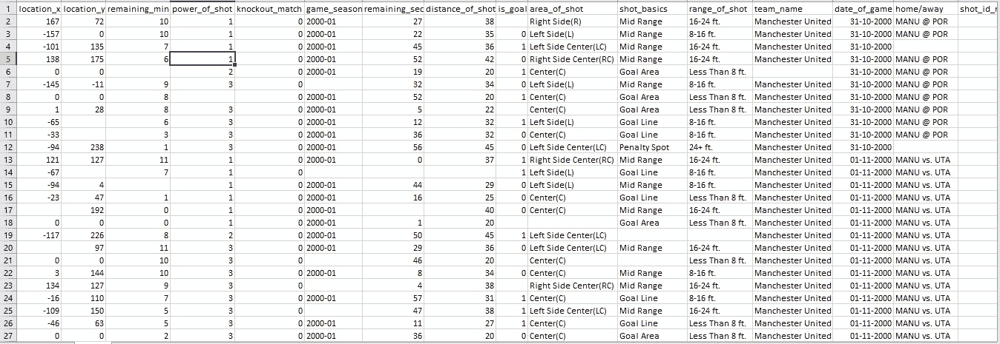

# c 罗能进球吗？让我们使用人工智能来找出答案！

> 原文：<https://towardsdatascience.com/can-ronaldo-score-a-goal-let-us-find-out-using-an-ai-b6fc3364f0c5?source=collection_archive---------60----------------------->

## 在这篇文章中，我将讲述我们如何使用人工智能和机器学习算法来研究和预测克里斯蒂亚诺 *罗纳尔多是否进球。*


# **简介**

在观看任何足球比赛时，我们都希望我们支持的球队能够进球。我们耐心地等待，直到我们支持的球队的一名球员足够靠近球门并射门，这似乎是要进球，但遗憾的是没有击中。但是，人工智能可以使用数据分析和机器学习来预测和解释为什么那个球员错过了那个特定位置的投篮吗？在这篇文章中，我们将实验不同的 ML 算法，并教一个 AI 预测一个球员是否会进球！

机器学习在许多不同的应用中发挥着关键作用，如计算机视觉、数据挖掘、自然语言处理、语音识别等。ML 在上述所有领域提供了潜在的解决方案，它肯定会成为我们未来数字文明的驱动力。在这里，我们将看到我们如何使用不同的机器学习算法，并建立一个简单的二进制分类器，该分类器将根据给定的输入数据对目标是否可以得分进行分类。这个项目是作为我参加的黑客马拉松的一部分完成的，这个项目的数据集也是由他们提供的。

在下一节中，我们将回顾不同机器学习算法的一些基本理论，我们将在本文的后面部分尝试编码和应用这些算法。

此外，整个项目代码可以在我的 Github 这里找到—[https://github.com/rajatkeshri/ZS-HACK-predict-ronaldo-goal](https://github.com/rajatkeshri/ZS-HACK-predict-ronaldo-goal)

# **有些理论**

现在有很多机器学习算法。在这个项目中，我们将使用分类算法，因为我们在这里将需要预测是否进球得分。这也称为二元分类。

如果你对机器学习中不同的机器学习算法和分类类型有基本的了解，可以随意跳过理论部分。

机器学习中的分类有两种方式——监督和非监督。监督学习涉及给定的数据集以及每个数据点应该产生的输出。该算法学习产生特定输出的模式，并试图在监督下对其进行概括。监督学习基本上包含数据集中要预测的输出标签，并学习如何通过回溯和泛化来预测这些值。无监督学习对数据进行训练，并试图在不知道每个数据点属于哪个类别的情况下盲目地进行归纳。它创建一个模式，并根据其特征概括数据点，并在训练过程中为它们创建输出标签。

这里，我们将只关注监督学习方法。我们将尝试的一些监督学习方法有——线性回归、逻辑回归、随机森林和神经网络。要了解这些算法是如何工作的，请查看以下链接，这些链接解释得非常清楚，可以让您了解这些算法的工作原理。

1.  线性回归—[https://towards data science . com/linear-Regression-detailed-view-ea 73175 F6 e 86](/linear-regression-detailed-view-ea73175f6e86)
2.  逻辑回归—[https://towards data science . com/logistic-Regression-detailed-overview-46 C4 da 4303 BC](/logistic-regression-detailed-overview-46c4da4303bc)
3.  随机森林—[https://towards data science . com/random-Forest-and-its-implementation-71824 ced 454 f](/random-forest-and-its-implementation-71824ced454f)
4.  神经网络—[https://towards data science . com/first-neural-network-for-初学者-用代码解释-4cfd37e06eaf](/first-neural-network-for-beginners-explained-with-code-4cfd37e06eaf)

现在让我们开始了解我们预测进球与否的工作和方法。在我们开始任何代码之前，我们应该做的第一件事是彻底检查数据集。我们必须完全理解数据集，并试图从我们将用于训练模型的数据集中找出最重要的特征。采样和提取错误的要素有时可能会导致模型不准确。

# **先决条件**

以下软件包将用于该项目的开发。此外，我们将在这里使用 Python 3.6，但任何高于 3.6 的版本都可以使用。

1.  Sklearn —机器学习库
2.  Pandas —用于导入 csv 文件和解析列的库。
3.  Numpy —用于在数组中存储训练数据的库。Numpy 数组最广泛地用于存储训练数据，sklearn 库接受 numpy 数组形式的输入数据。

如果您的系统中没有任何库，只需 pip 安装那个特定的库。以下是使用 pip 的指南—[https://www.w3schools.com/python/python_pip.asp](https://www.w3schools.com/python/python_pip.asp)

下面的代码片段显示了所有要导入的库。

```
import pandas as pd
import numpy as np
import math
import scipy
from sklearn.preprocessing import LabelEncoder, OneHotEncoder
from sklearn.model_selection import train_test_split
from sklearn.linear_model import LinearRegression
from sklearn.model_selection import train_test_split
from sklearn.datasets import load_boston
from sklearn.metrics import mean_squared_error
from scipy.stats import spearmanr
from sklearn.ensemble import RandomForestClassifier
from sklearn.preprocessing import scale
from sklearn.linear_model import LogisticRegression
from sklearn.model_selection import train_test_split
from sklearn import preprocessing
from sklearn import svm
from sklearn.ensemble import RandomForestClassifier
from sklearn.neural_network import MLPClassifier
```

# **数据集预处理**

这里使用的数据集是一个 CSV 文件，包含皇家马德里与不同球队进行的不同比赛的信息。数据集包含描述罗纳尔多在不同情况和场景下进球的不同字段，如进球时间、距离球门多远、射门力量、进球角度等。如前所述，这个数据集是在一次黑客马拉松中给我的，我不确定它是否在 Kaggle 或任何其他网站上公开。不管怎样，数据集都在我的 Github 链接上，你可以从这里下载——https://github.com/rajatkeshri/ZS-HACK-predict-ronaldo-goal

下图显示了数据集的一些列。从数据集中，我们将使用以下各列作为输入数据-位置 x、位置 y、拍摄功率、拍摄距离、剩余时间和目标列作为输出标注。您也可以使用其他字段来训练模型并进行实验，但是在本文中，我将解释这 5 个输入字段数据列的用法。



我们注意到有许多字段是空的，并且在这个数据集中有许多噪声。我们的第一步是检查数据集，修复有噪声的数据，并删除所有的空字段。

现在让我们跳到代码。首先，我们使用 pandas 打开数据集 csv 文件，并定义类似输入数据的列和作为训练输出标签的列。这里，列 10 是“is_goal”列，其作用类似于输出标签，而 2、3、4、5、9 列分别是输入标签 location_x、location_y、remaining_sec、power_of_shot、distance_of_shot。如果您想尝试使用 data.csv 中的其他要素列来训练您的模型，只需在数组中添加这些列号。

```
datasets = pd.read_csv('data.csv')output=pd.DataFrame(datasets)
cols = [10]
output = output[output.columns[cols]]df = pd.DataFrame(datasets)
cols = [2,3,4,5,9]
df = df[df.columns[cols]]
```

一旦我们从 csv 文件中读取了特性，我们必须仔细检查并移除这些列中的所有干扰。我们遍历这些特性，检查该列的特定值是否为 NAN。如果是 NAN，我们就删除整行，去掉所有有噪声的数据。一旦去除了噪声数据，我们将多个列特征的整个二维数组存储在变量 X 和 y 中。

```
#Removing rows with Output label not defined
k=0
x=[]
for i in df["is_goal"]:
    if math.isnan(i):
        x.append(k)
        #print(i)
    k+=1
df=(df.drop(x))#Removing rows with distance of shot not defined
k=0
x=[]
for i in df["distance_of_shot"]:

    if math.isnan(i):
        x.append(df.index[k])
        #print(i)
    k+=1
df=(df.drop(x))#Removing rows with power of shot not defined
k=0
x=[]
for i in df["power_of_shot"]:

    if math.isnan(i):
        x.append(df.index[k])
        #print(i)
    k+=1
df=(df.drop(x))#Removing rows with X axis location not defined
k=0
x=[]
for i in df["location_x"]:
    if math.isnan(i):
        x.append(df.index[k])
        #print(i)
    k+=1
df=(df.drop(x))#Removing rows with Y axis location not defined
k=0
x=[]
for i in df["location_y"]:
    if math.isnan(i):
        x.append(df.index[k])
        #print(i)
    k+=1
df=(df.drop(x))
#print(df)#Removing rows with remaining time not defined
k=0
x=[]
for i in df["remaining_sec"]:
    if math.isnan(i):
        x.append(df.index[k])
        #print(i)
    k+=1
df=(df.drop(x))
#print(df)X = df.iloc[:, :-1].values
Y = df.iloc[:, 4].values
```

现在，我们有了干净的数据集，任何行或列都有噪声和空值。我们在这里要做的下一步是将整个数据分解成列车和测试数据。这样做是为了在训练数据上训练我们的模型，然后测试它的准确性和在测试数据上的分数。这将帮助我们理解我们的模型在预测中的地位，从而帮助我们调整模型。

在这里，我们使用从 sklearn 库中导入的函数 train_test_split 来分割训练和测试数据。随机状态基本上是指用作训练和测试数据的数据的百分比。0.2 表示 20%。

```
(X_train, X_test, Y_train, Y_test) = train_test_split(X, Y, random_state=0.2)
```

# **训练**

我们完成了对数据集的理解，并通过一些预处理清理了数据集。剩下的唯一步骤是训练模型。如前所述，我们将使用线性回归、逻辑回归、随机森林回归和神经网络来训练我们的模型。这些算法可以直接在 sklearn 库中获得，这就是我们将要使用的。

首先，我们创建不同机器学习算法的对象，然后将带有输出标签的输入特征传递给它们。这些算法基于我们提供给它们的数据进行了推广。为了训练这些模型，我们称之为”。适合”在这些物体上。关于每个机器学习算法类的更多信息，请参考本网站—[https://scikit-learn.org/stable/](https://scikit-learn.org/stable/)。

```
LR=LinearRegression()
Lr=LogisticRegression(random_state=0, solver='lbfgs', multi_class='ovr')
RF = RandomForestClassifier(n_estimators=100, max_depth=2, random_state=0)
NN = MLPClassifier(solver='lbfgs', alpha=1e-5, hidden_layer_sizes=(5, 2), random_state=1)LR.fit(X_train,Y_train) #linear regression
Lr.fit(X_train,Y_train) #logistic regression
RF.fit(X_train, Y_train) #random forest
NN.fit(X_train, Y_train) #neural network multi-layer perception model
```

培训完成后，我们会检查不同型号的表现。这可以通过调用。评分”的方法。”的声音。score”方法打印出我们的模型在测试数据上表现的准确性。

```
print(LR.score(X_test,Y_test))
print(Lr.score(X_test,Y_test))
print(RF.score(X_test,Y_test))
print(NN.score(X_test,Y_test))
```

此外，如果我们想检查对测试数据的预测，或者给出新的数据值，并预测是否进球，我们可以使用。预测”的方法。预测方法后产生的输出为 1 或 0，其中 1 表示“是的，他进球了！”0 代表“运气不好，他下次一定会得分”。

```
loc_x = 10
loc_y = 12
remaining_time = 20
distance = 32
power_of_shot = 3
custom_input=[[loc_x,loc_y,remaining_time,power_of_shot,distance]]print(LR.predict(X_test))
print(Lr.predict(X_test))
print(RF.predict(X_test))
print(NN.predict(X_test))print(Lr.predict(custom_input))
```

# **结果**

首先，祝贺您，我们成功构建了二元分类模型 AI，可以预测罗纳尔多是否能进球。我们观察到这是一个基本的二进制分类问题，逻辑回归以约 95%的准确率表现最好，但其他机器学习模型表现良好，准确率约为 60-70%。通过在模型的训练中加入更多的特征，这种准确性肯定会得到提高。

谢谢你的时间。希望你喜欢这篇文章。干杯！