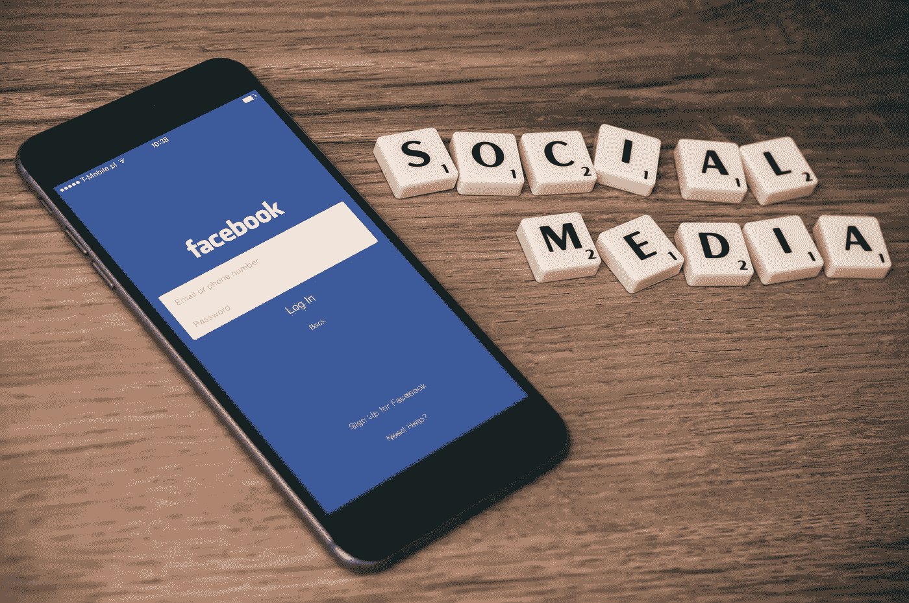

# 社交平台如何利用深度学习预防精神疾病

> 原文：<https://towardsdatascience.com/can-social-platforms-detect-mental-illness-using-deep-learning-models-6475716a2f71?source=collection_archive---------45----------------------->

## 韩国最近的大学研究表明，他们可以。但是他们应该吗？

乔希·里默尔在 [Unsplash](https://unsplash.com/s/photos/brain?utm_source=unsplash&utm_medium=referral&utm_content=creditCopyText) 上的照片

想象一下:这是一个下雨天，由于一级防范禁闭，你已经几个月没有出门了。在过去的几个月里，你一直感到昏昏欲睡，除了抱怨之外，通常没有心情做任何事情。你写了一篇关于脸书的文章给你的朋友，再次发泄对生活的不满。突然，你的手机上弹出一条脸书通知，建议你向附近一位专门从事抑郁症和认知行为治疗的治疗师寻求医疗建议，提供免费咨询。

我们可能很快就会生活在这样一个世界，你上传的每一篇社交媒体帖子都经过预先筛选，以检查你的心理健康:经过科学验证的模型和算法可以预测你是否有患精神疾病的风险。这是一个你认为可能的世界吗？这是你想生活的世界吗？

心理健康的重要性不能低估。根据疾病控制和预防中心的数据，自杀是美国青少年死亡的第二大原因。CDC 的另一项研究[也发现，从 2007 年到 2017 年，青少年自杀率上升了 56%——这一上升与我们今天所知道和喜爱的许多社交媒体平台的推出和采用增长相吻合。](https://www.cdc.gov/nchs/products/databriefs/db352.htm)

随着现代脆弱性和透明度变得越来越普遍，社交媒体用户越来越多地在帖子中分享详细的感受或情绪状态。这数以百万计的帖子被用于资本主义目的，如在线广告，但它们同样可以用于帮助用户的健康。

# 这项研究

韩国成均馆大学和卡内基梅隆大学的研究人员 Kim，Lee，Park 和 Han (Kim 等人，2020 年)最近进行的一项研究展示了一种深度学习模型，该模型可以根据一个人发布的信息来识别他的精神状态。这项研究扩展了 Gkotsis 等人(2014 年)以前的研究[,这些研究使用深度学习模型来自动识别与精神疾病相关的帖子以进行分类。](https://www.nature.com/articles/srep45141.pdf)

通过分析和学习用户写的帖子信息，Kim 等人(2020)提出的模型可以准确地识别用户的帖子是否属于特定的精神障碍，包括抑郁症、焦虑症、躁郁症、边缘型人格障碍、精神分裂症和自闭症。该模型为基于用户的帖子来检测用户是否有患精神障碍的风险提供了基础。

这项研究促使我们向我们选择的社交平台提出一些基本问题:

*   **是否有可能创建一个普遍的深度学习模型来帮助识别潜在的精神疾病患者**？
*   **社交媒体平台应该监控其用户的心理健康** **状态吗？**
*   **如果社交媒体平台的数据显示某个用户有严重的精神疾病风险，那么该平台有什么责任？**
*   什么样的干预会有用？

在试图回答这些问题之前，让我们仔细看看这项研究。

迈克尔·朗米尔在 [Unsplash](https://unsplash.com/s/photos/research?utm_source=unsplash&utm_medium=referral&utm_content=creditCopyText) 上的照片

# 但首先，什么是深度学习？

已经有各种各样的帖子涵盖了深度学习的基础知识。如果你想要一个关于它的简短入门，我推荐阅读这个由 [Radu Raicea](https://medium.com/u/d540942266d0?source=post_page-----6475716a2f71--------------------------------) 撰写的优秀的 [medium post](https://medium.com/free-code-camp/want-to-know-how-deep-learning-works-heres-a-quick-guide-for-everyone-1aedeca88076) 。我从中学到了很多，我相信那些给了 40K+掌声的人也同意！

简而言之，深度学习是一种机器学习方法，它允许我们在给定一组输入的情况下，训练一个人工智能(AI)来预测输出。

更具体地说，深度学习方法通过创建数据和处理动作的神经网络，使用神经网络来模仿动物智能。神经网络处理有三层神经元:输入层、隐藏层、输出层。

深度学习方法中的输入可以是:

*   ***监督***——给模型输入，告诉它预期输出。Radu 举了一个预测天气的人工智能的例子。它学习使用历史数据预测天气，其中模型具有训练数据输入(压力、湿度、风速)和输出(温度)。
*   ***无监督****——使用没有指定结构的数据集，让 AI 对数据进行逻辑分类。Radu 以一个电子商务网站的行为预测人工智能为例。虽然它不会通过使用输入和输出的标签数据集来学习，但它会对输入数据进行分类，并告诉你哪类用户最有可能购买不同的产品。*

*深度学习通过基于*监督*和*非监督*数据训练 AI，结合了两个世界的最佳之处。然而，模型需要巨大的数据集和计算能力来得出有意义的结果和预测，因为中间需要多个隐藏的计算层。*

# *创建深度学习模型*

*Kim 等人(2020 年)提出了一个关键的研究问题:*

> ***研究问题:**我们能否在社交媒体上鉴别一个用户的帖子是否属于精神疾病？*

*他们从红迪网(Reddit)收集用户的帖子，红迪网是一个受欢迎的社交媒体，包括许多与精神健康相关的社区(或所谓的“子社区”)，如`r/depression`、`r/bipolar`和`r/schizophrenia`。*

*他们的研究论文详细介绍了他们的方法[，但简而言之，他们采用了以下方法:](https://www.nature.com/articles/s41598-020-68764-y.pdf)*

**

*马库斯·斯皮斯克在 [Unsplash](https://unsplash.com/s/photos/data?utm_source=unsplash&utm_medium=referral&utm_content=creditCopyText) 上拍摄的照片*

## *数据收集*

*Kim 等人(2020 年)从以下六个与精神健康相关的子主题中收集帖子数据，每个子主题据报告都与一种特定的障碍有关:`r/depression`、`r/Anxiety`、`r/bipolar`、`r/BPD`、`r/schizophrenia`、*、*和*、*、`*r/autism*`*

*此外，他们还进一步从`r/mentalhealth` *、*收集帖子数据，以分析具有一般心理健康信息的帖子。从每个子编辑中，他们收集了至少有一篇与精神健康相关的帖子的所有用户 id。*

## *数据预处理*

*需要对数据进行清理和格式化，以便模型能够有效地处理数据，例如对用户的帖子进行分词(将句子拆分成独特的单词)并过滤掉频繁使用的单词(停用词)。在这个过程之后，他们能够获得 228，060 个用户的 488，472 个帖子进行分析。*

## *数据分类*

*创建六个二进制分类模型，每个模型将用户的特定帖子归类到以下子类别之一:`r/depression`、`r/Anxiety`、`r/bipolar`、`r/BPD`、`r/schizophrenia`和`r/autism`。*

*Kim 等人(2020 年)发现，之前的一项研究(Gkotsis，2017 年)用有多种症状的用户的帖子训练了一个模型，结果受到噪音数据的影响。通过开发六个独立的模型，每个模型都使用用户只遭受一种特定精神问题的数据，他们能够准确地识别用户的潜在精神状态。*

## *建立建模架构*

*这部分相当复杂，所以如果你对内部工作感兴趣，我建议你直接进入 Kim 等人(2020)的研究。对于那些想知道模型应用了什么原则的数据科学技术人员来说，以下是主要标题:*

*   *他们把上面的数据分成两部分:80%用于训练，20%用于测试*
*   *他们使用了两种最流行的机器学习方法:卷积神经网络(CNN)方法(T11)和 XGBoost 方法(T13)*
*   *他们应用了至少四个不同的计算层:嵌入层、卷积层、最大池层、密集层*
*   *他们发现，该模型在他们的模型中显示了积极的准确性(输出):所有类别的`Accuracy`在 70%到 95%的范围内，但`F1-Score`(通常被认为是比`Accuracy`度量更好的错误分类案例的度量)在 45%到 55%的范围内。*

*请注意,`F1-Score`的范围是从 0 到 1——越接近 1(完美),您的分类器就越精确(即，它正确分类了多少个实例),模型预测就越稳健。*

## *结果和局限性*

*总而言之，Kim 等人(2020)提出的模型在检测可能有心理障碍的潜在用户方面显示了相当大的潜力。*

*该研究确实存在一些局限性，如阶级不平衡、社会人口统计和地区差异对数据的影响，以及数据来自 Reddit 的事实，这可能使用户更倾向于表达他们相对于其他社交网络的情绪。研究人员承认，他们将把该模型重新应用到脸书和 Twitter 等其他社交媒体平台，以进一步验证该模型。*

**

*威廉·艾文在 [Unsplash](https://unsplash.com/s/photos/facebook?utm_source=unsplash&utm_medium=referral&utm_content=creditCopyText) 上的照片*

# *问题和影响*

*数据科学表明，我们可以预测用户何时有患精神疾病的风险。但是，我们现在面临着一个道德和使用数据检测和治疗精神健康状况的十字路口。让我们重温一下这个故事开头的考题:*

## *是否有可能创建一个普遍的深度学习模型来帮助识别潜在的精神疾病患者？*

*如上所述，准确的深度学习模型在技术上是可行的，并且有了适量的数据，就可以创建强大的预测引擎。Kim 等人(2020 年)和 Gkotsis 等人(2017 年)的研究显示了巨大的潜力，但仅限于 Reddit 数据。然而，这些模型可以被验证并扩展到其他社交平台数据源，包括:*

*   ***脸书搜索术语、帖子和评论，**无论是在他们的墙上，还是在他们朋友的墙上，以及任何一般性的评论。*
*   *Twitter 搜索词、帖子和主题。根据用户是否在其转发帖子中陈述观点或评论，转发也可能提供一些指示。*
*   ***Instagram 照片评论，**可能包括一些基于光学字符识别的数据分类，以检查用户发布的图像在情感上是积极的还是消极的。*

*上面提到的数据必须以保护用户隐私的方式使用，但稍后会详细说明。*

## *社交媒体平台应该监控其用户的心理健康状况吗？*

*“是”的拥护者可能会说，这些平台应该监控我们的帖子，只要用户同意平台以道德的非滥用方式进行健康检查。毕竟，许多用户签署了将他们的数据用于资本主义营销目的的条款和条件，因此使用数据来帮助拯救某人的生命(例如，在确定某人有自杀风险的情况下)似乎是一个良好的社会结果。*

*“不”的倡导者可能会指出数据隐私法，以及将数据和见解进一步转售给广告商，然后出售针对精神健康问题的私人健康解决方案的风险。特朗普总统 2016 年竞选活动聘请的政治数据公司剑桥分析公司(Cambridge Analytica)在那段时间影响用户行为以及他们的政治观点，这一风险没有得到更好的证明。也就是说，脸书已经走了很长的路来重建他们的声誉和数据滥用，稍后讨论。*

## *如果社交媒体平台的数据表明一个用户有严重的精神疾病风险，那么他们有什么责任？*

*社交媒体平台或许应该注意一些责任，包括:*

*   ***在保护隐私的同时向研究人员和卫生从业者提供数据:**2018 年，[脸书宣布了一项举措](https://newsroom.fb.com/news/2018/04/new-elections-initiative/)，帮助独立研究人员分析该平台对选举的影响。社交媒体平台可以做和脸书一样的事情，但是使用与用户心理健康相关的数据，而不是选举数据。可以使用上述研究人员建议的模型对精神健康数据进行分类，并且可以使用[差分隐私](https://research.fb.com/blog/2020/02/new-privacy-protected-facebook-data-for-independent-research-on-social-medias-impact-on-democracy/)等技术，以符合隐私法的方式向研究人员安全地提供对数据的访问。*
*   ***与学术界合作，征求使用数据造福社会的独立研究:**脸书在 2018 年公布的计划成立了一个委员会，以制定关于社交媒体对社会影响的研究议程——从选举开始。该委员会制定了研究提案请求，并选择了哪些受资助者(研究人员)应获得继续其研究的机会和资金。*
*   ***根据经过验证的研究结果更新产品路线图:**仅仅将数据提供给学术界是不够的——社交媒体平台应该开辟出专用的产品路线图容量，以改善其用户的心理健康。困难的部分是，假设研究人员将随着时间的推移提供有效的建议，将优先考虑首先建立哪个计划。评估社会影响的优先化框架是我将来想探索的一个话题。*

**

*Marcelo Leal 在 [Unsplash](https://unsplash.com/s/photos/treatment?utm_source=unsplash&utm_medium=referral&utm_content=creditCopyText) 上拍摄的照片*

## *什么样的干预会有用？*

*从产品的角度来看，我可以看到各种有用的功能，但它们取决于需要验证的不同假设:*

1.  ***当一组特定的条件被触发时，向用户推送关于附近精神健康护理的详细信息的通知:**假设有人在抑郁状态下发帖:可以在社交媒体平台的屏幕上显示警报或弹出窗口，向用户建议一些精神健康预防提示或潜在的治疗中心(例如，治疗实践或用户可用的电话热线)*
2.  ***发送到用户的健康应用程序的数据或事件，其中精神健康风险评分发生变化，供应用程序采取行动:**例如，一旦用户使用社交媒体平台的访问(登录)凭证登录到冥想应用程序(例如 [Headspace](https://medium.com/@bigdchang/getting-into-your-headspace-ad20263cabb1) 、 [Calm](https://medium.com/@jesscarpenterwrites/day-2-of-30-my-unbiased-review-of-the-calm-app-654db3038ff9) )，应用程序可以从社交媒体平台接收某些事件已被触发的通知，并且应用程序可以使用该数据来建议针对用户定制的治疗或补救措施。*
3.  ***采取预防措施，使用户在短时间内无法部分或全部使用社交媒体平台。**这一点需要验证，因为缺乏表达想法的社交媒体渠道也可能对有风险的用户产生负面影响。从社交媒体平台的角度来看，暂停用户可能也很难消化，因为它会导致平台参与度和采用度下降。*
4.  ***广告被公共心理健康公告取代**。作为一项公共服务，广告或许应该被精神健康公告所取代。另一种选择是使用私营部门精神健康治疗产品的广告空间；然而，这些公司可以利用这一优势，通过简单地比竞争对手出价更高的价格，向不老练的用户出售无效的产品。*

*无论干预是什么，都需要大量的实验和安全控制测试来确保任何心理健康干预措施的有效性。*

# *结束语*

*我很想知道你是否认为社交媒体平台确实在预防精神健康问题的发生方面发挥了作用。当这样的问题出现时，我主张平台在对待或帮助用户理解他们有什么资源可以帮助自己方面扮演更积极的角色。*

*你有什么想法可以提供什么样的干预(也许是特征)来预防或治疗心理健康疾病吗？渴望在下面的评论中听到他们！*

# *参考*

1.  *Kim，j .，Lee，j .，Park，E. *et al.* 从社交媒体上的用户内容中检测精神疾病的深度学习模型。 *Sci Rep* **10，** 11846 (2020)。[https://doi.org/10.1038/s41598-020-68764-y](https://doi.org/10.1038/s41598-020-68764-y)*
2.  *Gkotsis，g .，Oellrich，a .，Velupillai，S. *等人*使用知情深度学习表征社交媒体中的心理健康状况。 *Sci Rep* **7、** 45141 (2017)。[https://doi.org/10.1038/srep45141](https://doi.org/10.1038/srep45141)*