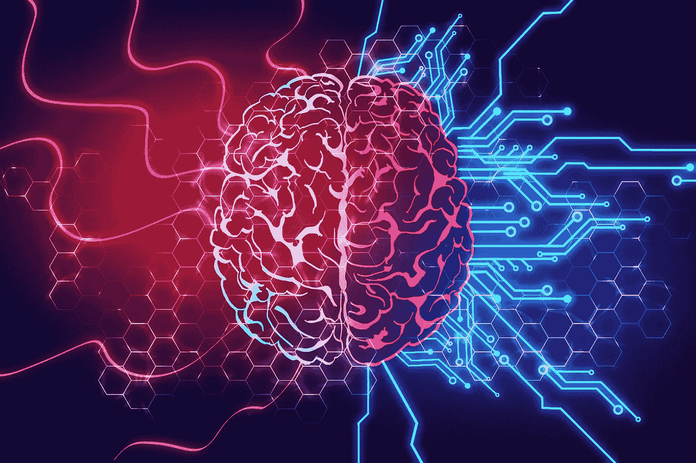
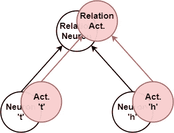
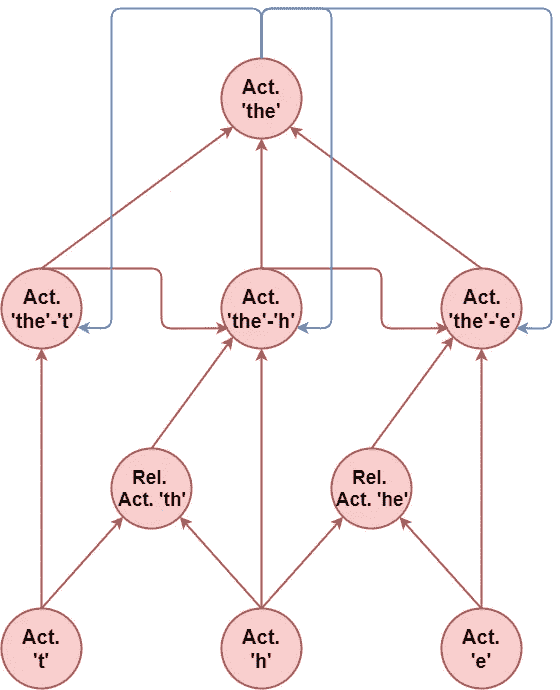
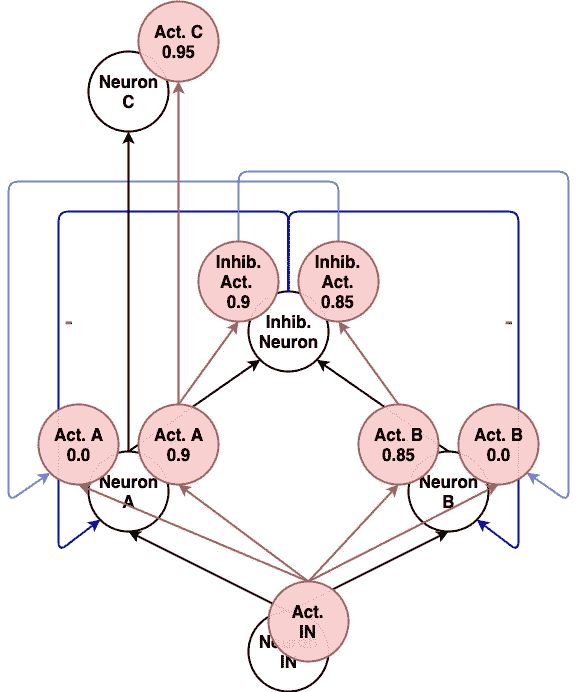

# 神经激活的动态链接能让我们更接近强人工智能吗？

> 原文：<https://towardsdatascience.com/can-the-dynamic-linking-of-neural-activations-bring-us-closer-to-strong-ai-bc85b64c9f82?source=collection_archive---------17----------------------->

## 大多数人工神经网络忽略了生物神经网络的尖峰性质，以简化底层模型并实现诸如反向传播的学习技术。但是这样做，我们不就有可能拒绝了生物神经网络最核心的原则之一吗？

在大多数人工神经网络模型中，激活只是与神经元本身相关联的实数。但这并不是生物神经网络中发生的事情。这里，当神经元的阈值被超过并且存在与之相关联的确切时间点时，激活发生。此事件发生的先决条件是在当前激活之前已经触发了其他几个输入激活。例如，如果我们有这样一个事件驱动的神经网络，其中一个神经元代表单词“the”，那么代表字母“t”、“h”和“e”的神经元需要首先激活，然后才能激活代表单词“the”的神经元。如果发生这种情况，我们就有了连接单个字母神经元激活和单词“the”神经元激活的激活链。这些激活链接对应于已经被激活的神经元的突触。这些链接的特别之处在于，它们可以将输入数据中的所有激活接地。单词“The”可能在给定的文本中出现数百次，但是激活链接允许这些出现的任何一个的激活被精确地引用。在本文中，我将展示激活链接也可以用于另外两个重要的任务，这将允许网络处理符号信息。首先，激活链接可以用来表示输入数据中的对象之间的关系，例如单词或短语。我之前在关于将符号推理集成到深度神经网络的文章[中讨论过这个问题。然而，当时这种方法仍然需要对神经模型进行一些丑陋的扩展，如突触之间的激活和关系链接中的位置槽。不幸的是，没有简单的方法来为这些关系链制定一个适当的培训机制。第二，激活链接允许文本中的歧义信息被同时评估。在文章《](/on-integrating-symbolic-inference-into-deep-neural-networks-22ed13ebbba9)[关于给神经网络](https://medium.com/p/25a28409a6f2?source=post_stats_page---------------------------)添加负向循环突触》中，我描述了如何使用二叉查找树系统地搜索给定文本的不同解释。但是对于这种评估，搜索树真的有必要吗？

## 关系

如果我们看一下前面表示关系的模型，我们可以看到，每个激活中的槽用于确定每个激活的开始和结束位置，突触之间的关系链接用于确保字母以正确的顺序出现。

现在，如果我们想摆脱插槽和关系链接，我们应该问自己是否有一种方法来表示这些规则的神经元。因此，我们需要采取的第一步是添加一些代表字母之间关系的神经元。这可能如下所示:

这里我们有一个关系输入神经元，当且仅当神经元‘t’和‘h’的两个输入字母激活连续发生时，它才会被激活。这种关系信息在先前的模型中通过槽位置彼此之间的关系被隐含地给出。现在我们有一个神经元明确地表达了这些信息。请注意，激活链接是这种表示的组成部分。由于关系神经元只是一个输入神经元，突触不用于计算关系激活的激活值。到目前为止，我们只有网络的输入层，但我们如何将单词“the”的神经元与该输入层匹配呢？如果我们再看看旧模型，我们会发现我们需要某种方法来替换突触之间的关系。只用单个神经元很难做到这一点，但如果我们分裂神经元，并为之前的每个突触添加一个新的神经元，会怎么样呢？然后，这些新的神经元代表某个输入字母的出现，例如单词“the”模式中的“t”。因此，这个网络的模型可能如下所示:

蓝色的激活链接来自阳性循环突触，这意味着它们最初被认为是完全活跃的。为了保持激活的关系完整性，我们需要确保激活不会任意链接到任何输入激活。例如，如果单词“the”的各个字母属于不同的单词，那就没有意义。为了实现这一点，**添加到激活中的任何输入链接都必须与该激活的其他链接之一共享一个共同的祖先激活**。如果我们查看激活' the'-'h '，我们可以看到它有激活' t '，' h '，' the'-'t '和' the '作为连接各个输入链接的共同祖先激活。通过其输入链接，激活“the”-“h”验证输入字母“h”的激活存在，激活“the”-“t”存在，将字母“t”与整个单词的模式相关联，并且存在将这两个输入绑定在一起的关系激活。一旦一个单词被识别，另一个神经元就可以代表与前一个或下一个单词的关系。这就是我们识别更大的模式如短语所需要的。

## 学问

现在你可能会认为，对于每个音节、每个单词或每个短语，有大量的神经元和突触需要反复训练，并且需要大量的训练数据。嗯，不是。使用文章'[中描述的元神经元使用元神经元从单个训练示例](/using-meta-neurons-to-learn-facts-from-a-single-training-example-781ca0b7424d)中学习事实，可以用很少的示例训练一个新单词。这些元神经元可以捕捉我们激活的动态结构，并将它们存储为新的记忆。在这个过程中，产生了新的神经元和新的突触。换句话说，这种机制允许将“工作记忆”中表现为激活和激活链接的知识转移到由神经元和突触组成的“长期记忆”中。因此，不需要单独的知识库来存储关于世界的事实。

## 解释

当负循环突触被添加到神经网络的架构中时，神经网络获得了很大的灵活性。这对于许多现实世界的推理任务来说至关重要。这些负向循环突触允许在网络内产生相互排斥的状态。基本上，在这种情况发生的每一点，输入数据的可能解释都会发生分支。许多优秀的老式人工智能研究都与搜索这类状态空间有关。例如，语法分析树在非常有限的语法域中搜索状态空间。这种限制的问题是解析结果不仅取决于语法信息，还取决于文本中包含的所有其他信息。此外，歧义不仅发生在句法层面，也发生在语义或语用层面。

在我以前的工作中，我使用二叉查找树来寻找给定目标函数的全局最优解，该目标函数基于各个激活的*净*值。然而，这种方法存在一些问题。首先，人脑进行类似的搜索似乎不太可能。第二，通过对搜索路径上的权重求和并选择权重最高的一个，在网络本身的架构之外发生了一种信息的反向传播，直观上这似乎是不对的。那么还有什么选择呢？难道不可能同时跟踪所有这些分支解释的传播吗？这种方法的先决条件是这些不同的解释不会混淆。因此，在一个分支中推断的激活不应该对另一个分支可见。**但是因为我们已经在激活链接期间要求一个共同的祖先激活，我们可以简单地检查我们是否进入了一个不同的分支。**现在我们已经有了在不同解释中传播的所有激活，我们仍然需要决定我们想要选择哪个解释。这个决定不一定是二元的。它可能是一个概率，然后传播到所有依赖的激活。这种方法的一大优势是我们现在可以在本地做出这些决定。这并不意味着这些决定不应该受到未来结论的影响。前面提到的搜索过程中的信息反向传播在某种形式上仍然是必要的，但有一种更简单、更优雅的方式来实现这一点——只需使用正向循环突触来实现。这些允许推理链的早期阶段被告知随后得到的结论。

举个例子，请看下面的网络图。这里我们有两个互斥的神经元 A 和 B，它们通过一个抑制性神经元和负性循环突触相互抑制。现在，如果我们将一个激活输入到 IN 中的输入神经元，我们将在神经元 A 和 B 中产生激活。由于这些神经元相互排斥，因此会发生一个分支，其中激活 A 或激活 B 被抑制。

从这一点开始，网络将同时遵循输入数据的两种互斥解释。这非常类似于使用一阶逻辑规则和非单调逻辑进行推理的正向链接专家系统。当然，这意味着我们正在遇到同样的问题，这个问题严重困扰着基于一阶逻辑的系统——也就是说，当把这些规则堆叠在一起时，会出现组合爆炸。当一个神经网络这样做的时候，它就会变得神经错乱。但与二进制的基于逻辑的系统不同，具有软加权突触的神经网络为这个问题提供了一个优雅的解决方案。在训练中，我们可以简单地惩罚被其他更可能的解释所抑制的过度激活。

这里的抑制性神经元是分离的，这意味着一旦它的一个输入被激活，它就会激活。抑制性神经元的目的是防止必须连接所有互斥的兴奋性神经元，这将导致负突触数量的平方增长。

## 与其他网络的比较

在处理文本或图像数据时，每个神经元需要多次激活，这一点已被 LSTMs 等其他神经网络架构所认识。他们通过重复复制整个网络来实现固定级别的令牌化，从而解决了这个问题。这些循环神经网络必须付出的代价是不灵活，这来自每个神经元所需的固定激活次数。对于文本中需要处理的所有不同类型的信息，如字符、音节、单词、短语、句子、段落等，根本没有最佳的标记化级别。**因此，每个神经元的激活数量需要取决于数据，而不是网络的架构。**

## 因果关系

事件驱动的神经网络甚至有一个简单的机制来处理因果关系。干预当然是不可能的，因为网络只是观察，但它可以得出结论，如果激活 A 发生在激活 B 之后，A 很可能不是 B 的原因。这一知识可以用于减少从 A 到 B 的突触的权重。

## 观点

大多数其他神经网络架构是由神经元如何相互连接的拓扑来定义的。相比之下，我认为这里描述的人工神经网络应该从一张白纸开始，只包含原始的输入神经元。然后，在训练过程中，某些输入神经元会反复一起放电。这种激活的共现可以随后用于[诱导和训练新的兴奋性神经元](/using-information-gain-for-the-unsupervised-training-of-excitatory-neurons-e069eb90245b)。随着时间的推移，当越来越多的兴奋性神经元得到训练时，这些兴奋性神经元中的一些神经元之间会有一些相似性。通过相似性，我的意思是这些神经元与特定的其他神经元或一组其他神经元共享共同的输入突触，这些突触通过抑制性突触被引用。然后，这些相似的兴奋性神经元可以与其抑制性神经元一起聚集成元神经元。然后，抑制性神经元充当整个兴奋性神经元组的类别神经元。另一方面，元神经元能够检测在特定情况下，是否存在应当由该组的兴奋性神经元覆盖的知识缺失。正如你所看到的，这种神经网络的架构不是由神经元之间预定义的一组连接给出的，而是通过不同类型的神经元和突触的规范给出的。

## 结论

如前所述，激活链接有两个重要的作用。**它们对链接输出激活的激活值有贡献，并将激活绑定到输入数据中已呈现的真实世界对象。**

**项目页面:** [aika.network](http://aika.network)

**GitHub 页面:**[https://github.com/aika-algorithm/aika](https://github.com/aika-algorithm/aika)