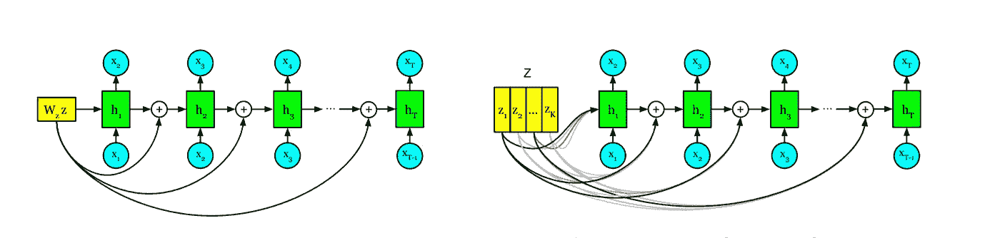
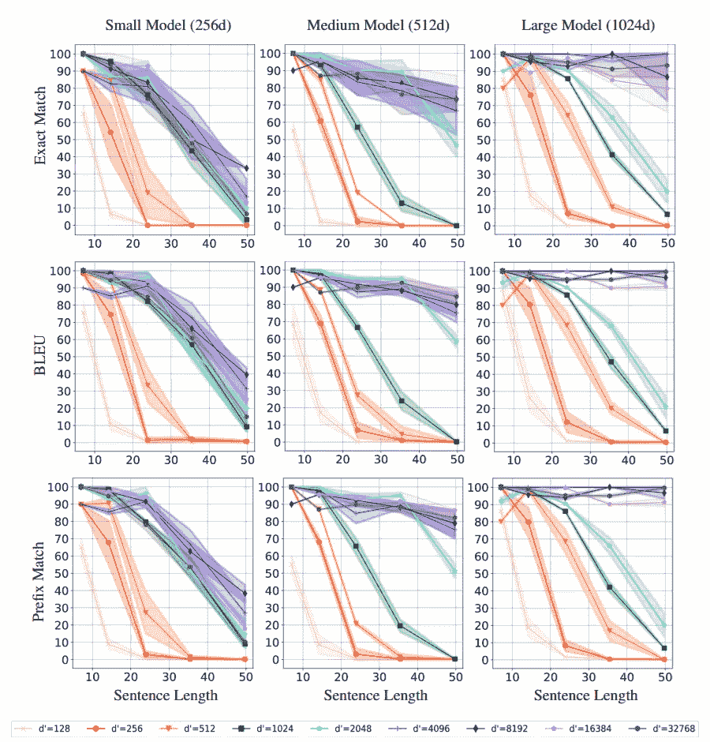
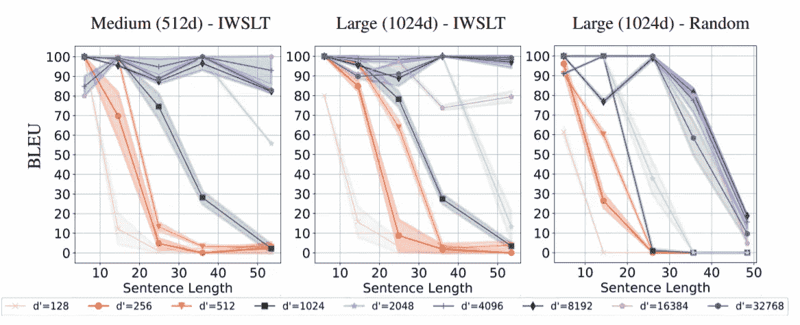

# 无条件语言模型能恢复任意句子吗？—论文摘要

> 原文：<https://towardsdatascience.com/can-unconditional-language-models-recover-arbitrary-sentences-a-paper-summary-98530f2316c7?source=collection_archive---------42----------------------->

## 针对预训练语言模型的非常规方法的总结，以确定它们是否可以用作通用解码器

这些天来[伯特](https://arxiv.org/pdf/1810.04805.pdf)、[埃尔莫](https://arxiv.org/pdf/1802.05365.pdf)和[厄尼](https://arxiv.org/pdf/1905.07129.pdf)让人想起预先训练的生成模型，而不是芝麻街人物，这就是他们在自然语言处理领域的霸权。这些模型可以用作通用编码器，甚至可以执行一些任务，如文本分类，而无需进一步修改。然而，对相反情况的研究有限，将这些模型用作通用解码器。这篇文章是纽约大学研究人员的论文的摘要，该论文试图确切地确定这一点，即这些模型是否可以从编码表示中恢复任意句子。

# 摘要

为了证明可用于恢复句子的编码表示的存在，本文介绍了将这些表示馈送到自回归训练的递归语言模型****中的方法，以及将句子映射到这个*【重新参数化】*空间中和从这个空间中映射出来的方法，同时保持主要语言模型参数不变。****

# ****方法****

## ****回顾递归语言模型****

****在我们开始之前，让我们快速地看一下递归语言模型，以及如何对它们进行自回归训练。****

********

****自回归语言模型的数学表示。(来源:[论文](https://papers.nips.cc/paper/9661-can-unconditional-language-models-recover-arbitrary-sentences.pdf))****

****回想一下，在自回归模型中，我们将所有先前的标记作为输入，将其与先前的隐藏状态相结合，并计算下一个标记。这种隐藏状态经常被实现为一个[**【LSTM】**](https://en.wikipedia.org/wiki/Long_short-term_memory)**递归网络，最终输出无非是一个[**soft max**](https://deepai.org/machine-learning-glossary-and-terms/softmax-layer#:~:text=The%20softmax%20function%20is%20a,can%20be%20interpreted%20as%20probabilities.)**函数，它表示特定单词成为下一个令牌的专用概率。********

## ******想象和重新参数化句子空间******

******好的，现在我们知道了循环语言模型是如何工作的，我们试着想象一个特定的句子在空间中是什么样子的。如果我们假设隐藏状态具有维度“*d”*(其本身基于 LSTM 单位的维度)，那么一个句子可以被想象为这个 *d* 维度空间中的**轨迹**，因为这个轨迹在考虑了先前发出的令牌之后发生了演变。******

****对于这个给定的轨迹，从这个空间恢复特定的句子会变得困难，主要是由于 1)句子长度没有被编码在轨迹中，以及 2)单个错误表示的标记可能完全偏离轨迹的事实。因此，研究人员希望将这种**轨迹**转换为平面向量表示，他们通过在网络中的先前和细胞状态中添加额外的隐藏偏差来实现这一点。****

********

****添加所描述的附加偏置通过左)投影时偏置尺寸< model dimension and Right) use of soft-attention when bias dimension >模型尺寸。(来源:[论文](https://papers.nips.cc/paper/9661-can-unconditional-language-models-recover-arbitrary-sentences.pdf))。****

****在所提出的重新参数化下，句子空间中的隐藏状态的轨迹映射到变换后的句子空间中的向量(比如维度*“d*“₁*”*)，并且最终充当在该句子空间中来回移动的容器。需要注意的一点是，如果这个维度*" d*"₁*"*小于模型维度，随机矩阵会将偏差投射到隐藏状态上。反之，如果 *"d* ₁ *"* 较大，则[软注意](https://arxiv.org/abs/1409.0473)用于将投影缩小到模型尺寸(如下图所示)。****

## ****向前和向后估计****

****因此，有了在这个空间中来回移动的概念，研究人员试图描述这样做的机制，包括向前移动——将一个句子从模型投射到新描述的空间中的一个点，以及向后移动——从这个空间中的这个点恢复一个句子。****

****对于正向估计，他们从任意偏差开始，如前所述，将任意偏差添加到所有状态。然后，他们对这种偏差(比如说 *z)* 进行优化，以提高这种偏差产生完全相同句子的概率，同时保持语言模型参数不变。这种优化是通过任何基于梯度的算法实现的，例如非线性共轭下降。****

****为了从这一点(表示为 *z* )返回，遵循上述相同的过程，唯一的不同是优化被反向以产生相同的句子序列，而不是在*z*上。由于向后估计不是直接的过程，所以采用了[波束搜索](https://en.wikipedia.org/wiki/Beam_search#:~:text=In%20computer%20science%2C%20beam%20search,that%20reduces%20its%20memory%20requirements.)，一种检测最有希望的序列的启发式算法。****

# ****实验和观察****

****为了证明上述假设，分别为小型、中型和大型语言模型构建了具有 256、512 和 1024 个 LSTM 单元的两层神经模型。这些模型接受了来自[英语 Gigaword](https://catalog.ldc.upenn.edu/LDC2011T07) 新闻语料库的 5000 万个句子的训练，最终产生了 20234 个子单词的词汇。****

****对于可恢复性质量的测量，讨论了三种方法。****

1.  ****精确匹配:它展示了一个句子(令牌序列)从其编码表示中的完美可恢复性。****
2.  ****[BLEU](https://www.aclweb.org/anthology/P02-1040.pdf) :上述的平滑版本，其中考虑到最大 n-gram 重叠给出了标准化评级(0-1，1 为精确匹配)。****
3.  ****前缀匹配:这度量从句子的开头完美恢复的最长的连续记号序列，然后在句子长度上标准化。****

****最后，对于每个语言模型，将偏差的维度 *z* (表示为上面的 *d* ₁)设置为 128，256，512，1024 …到 32768，并评估 100 个句子的可恢复性，结果如下所示。****

********

****在所有三种类型的测量中，三种不同模型尺寸的可恢复性。(来源:[论文](https://papers.nips.cc/paper/9661-can-unconditional-language-models-recover-arbitrary-sentences.pdf))****

****据观察，可恢复性随着尺寸 *z* 的增加而增加，直到其等于模型尺寸，之后达到稳定状态。我们还观察到，大型模型的可恢复性接近完美，达到精确匹配≥ 99，中型模型的可恢复性非常高，达到精确匹配≥ 84。此外，观察到对于长度为> 30 的句子，句子恢复失败，这表明较长序列的固定向量表示不能充分包括来自该序列的所有基本信息的限制。****

****为了研究域外句子的可恢复性，模型在 TED talk 上进行测试，在中型和大型模型上都观察到了近乎完美的 BLEU 度量。在域外句子上的这种异常表现表明，该模型不仅记住了例子，而且实际上学习了关于语言的信息来执行这种恢复。****

********

****域外句子的 BLEU 可恢复性。(来源:[论文](https://papers.nips.cc/paper/9661-can-unconditional-language-models-recover-arbitrary-sentences.pdf))****

# ****结论****

****因此，上面描述的方法证明了可以存在一种特定的编码表示，我们可以从中恢复任意的句子。小型模型的低可恢复性和大型模型的近乎完美的可恢复性表明需要一个相当合适的模型来实现高可恢复性。****

****随着句子长度的增加，可恢复性下降，还观察到恢复较长句子的总体困难。然而，从甚至域外句子的高度可恢复性可以推测，随着模型大小的进一步增加，退化点可以延长。****

****最后，模型的隐含句子空间可以被正则化，从而增加可恢复性以及作为通用解码器的无条件语言模型的适用性。****

# ****参考****

*   ****[N·苏布拉马尼，S·鲍曼，K·乔(2019)。**无条件语言模型能恢复任意句子吗？** *神经信息处理系统进展 32 (NIPS 2019)*](http://papers.nips.cc/paper/9661-can-unconditional-language-models-recover-arbitrary-sentences)****