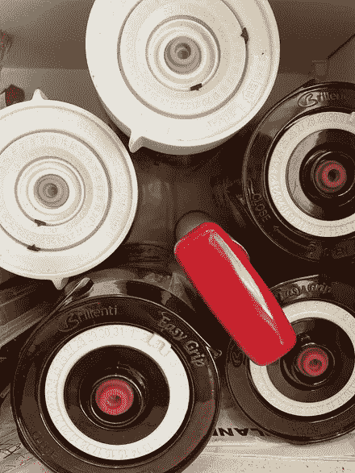
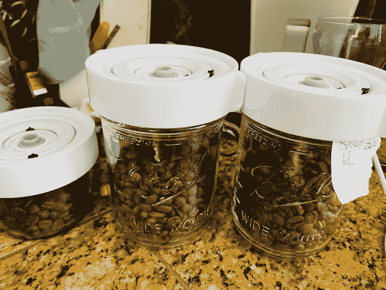
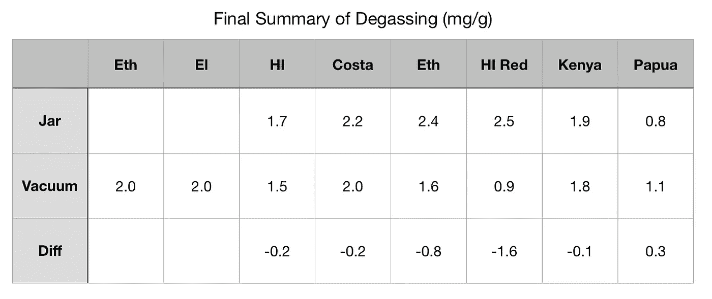

# 真空罐能更快的去除咖啡豆中的气体吗？

> 原文：<https://towardsdatascience.com/can-vacuum-jars-remove-gas-from-coffee-beans-faster-4a5a40981be2?source=collection_archive---------41----------------------->

## 咖啡数据科学

## 一项关于味觉和提取的小研究

几个月前，我阅读并总结了一篇优秀的关于咖啡豆脱气速度快慢的研究文章。我想，也许真空可以加速排气。在烘焙的前两周，我很难取出一杯浓缩咖啡，我认为这主要是因为二氧化碳。

本文所有图片均由作者提供

咖啡通常用真空密封袋装运，袋内空间相对较小。我想我可以用一个真空罐来加速脱气，其中一半的空间是空的。希望我能尽快使用这些豆子，而不是等上几个星期。

**结果**:它没有帮助加速脱气，但它确实改善了口感，正如我在[收集的一些数据](https://link.medium.com/g9BKDWKHhbb)中展示的那样。然而，脱气速度的数据仍然很有趣，即使我使用廉价的硬件来测量重量。我仍然能够看到真空罐脱气比密封罐稍快。

图片来自之前出版物的作者:[https://link.medium.com/d6dmEwaQhbb](https://link.medium.com/d6dmEwaQhbb)

这项研究的另一个结果是，由于普通罐子和真空罐子之间的脱气大致相同，真空罐子豆子和非真空罐子豆子之间的味道改善可能更多地与氧化有关，而不是任何其他变量

# 脱气数据

每次烘焙后，我将烘焙食物分成两个容器(除了第一次烘焙的埃塞俄比亚和萨尔瓦多豆，在前两列)。在豆子进入罐子之前，我称了它们的重量，我称了罐子和豆子以及盖子的重量。目的是能够在一天内多次快速称量咖啡豆。每次烘焙，我分别烘焙两种咖啡豆，所以每种咖啡豆通常都是成对的。

我做了一个快速测试，以了解规模如何受到位置的影响。因此，我的目标是中心位置保持一致。

测量使用精确度为+/-0.03 克的标尺。根据之前的脱气工作，几天后的差异应该在每 100g 咖啡 0.20g 左右或者 2 mg/g 左右，这是我发现的左右，但是几天之间的结果有点嘈杂。

所有图片由作者提供

与真空罐相比，更容易总结罐的所有数据。在最后的比较中，真空似乎没有改善脱气。

即使观察一段时间内的数据，体重下降的幅度似乎也很相似。

这张图显示了秤的精度问题，因为损失是负数，这是不可能的。通常，一天中的时间会影响测量，因为我的房子一整天都会有几度的轻微温度变化。

我们可以观察随时间推移的累积效应，在过去的 5 天里，我没有很好地称量每天的咖啡重量，所以它显示罐子的平均值高于真空。该平均值还假设过去 5 天未测量的咖啡豆脱气量保持不变。我认为这可能只是噪声的一部分，因为 0.4 毫克/克的差异约为 0.04 克。0.04 克非常接近秤的噪声(0.03 克)。

总的来说，这些结果表明，真空密封并没有像提取时间或两周前提取的能力所表明的那样，在脱气方面产生很大的差异，但之前的一项使用这些豆子的研究表明，它改善了味道。因此味道的下降一定是由咖啡豆的氧化引起的，而不是 CO2 和香料的释放。

如果你愿意，可以在 [Twitter](https://mobile.twitter.com/espressofun?source=post_page---------------------------) 和 [YouTube](https://m.youtube.com/channel/UClgcmAtBMTmVVGANjtntXTw?source=post_page---------------------------) 上关注我，我会在那里发布不同机器上的浓缩咖啡照片和浓缩咖啡相关的视频。你也可以在 [LinkedIn](https://www.linkedin.com/in/robert-mckeon-aloe-01581595?source=post_page---------------------------) 上找到我。也可以在[中](/@rmckeon/follow)关注我。

# 我的进一步阅读:

[按地区、工艺、等级和价格分类的咖啡](/coffees-by-region-process-grade-and-price-7e17c3c44baf)

[家庭烘焙咖啡的经济学](/the-economics-of-home-roasting-coffee-93003ea31ee8)

[咖啡豆脱气](/coffee-bean-degassing-d747c8a9d4c9)

[解构咖啡:分割烘焙、研磨和分层以获得更好的浓缩咖啡](/deconstructed-coffee-split-roasting-grinding-and-layering-for-better-espresso-fd408c1ac535)

[浓缩咖啡的预浸:更好的浓缩咖啡的视觉提示](/pre-infusion-for-espresso-visual-cues-for-better-espresso-c23b2542152e)

[咖啡的形状](/the-shape-of-coffee-fa87d3a67752)

[搅拌还是旋转:更好的浓缩咖啡体验](https://towardsdatascience.com/p/8cf623ea27ef)

[香辣意式浓缩咖啡:热磨，冷捣以获得更好的咖啡](/spicy-espresso-grind-hot-tamp-cold-36bb547211ef)

[断续浓缩咖啡:提升浓缩咖啡](https://link.medium.com/vmI2zVeQabb)

[用纸质过滤器改进浓缩咖啡](/the-impact-of-paper-filters-on-espresso-cfaf6e047456)

[浓缩咖啡中咖啡溶解度的初步研究](/coffee-solubility-in-espresso-an-initial-study-88f78a432e2c)

[断奏捣固:不用筛子改进浓缩咖啡](/staccato-tamping-improving-espresso-without-a-sifter-b22de5db28f6)

[浓缩咖啡模拟:计算机模型的第一步](https://towardsdatascience.com/@rmckeon/espresso-simulation-first-steps-in-computer-models-56e06fc9a13c)

[更好的浓缩咖啡压力脉动](/pressure-pulsing-for-better-espresso-62f09362211d)

[咖啡数据表](https://towardsdatascience.com/@rmckeon/coffee-data-sheet-d95fd241e7f6)