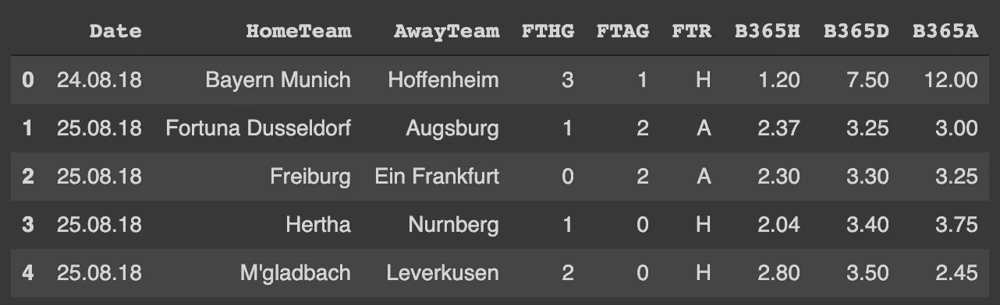
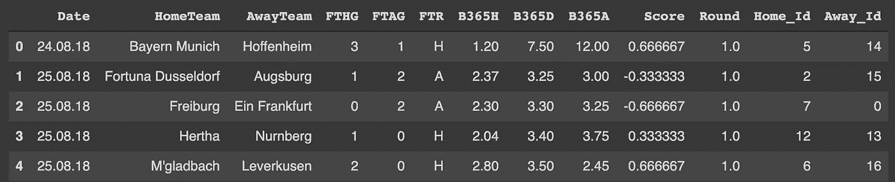
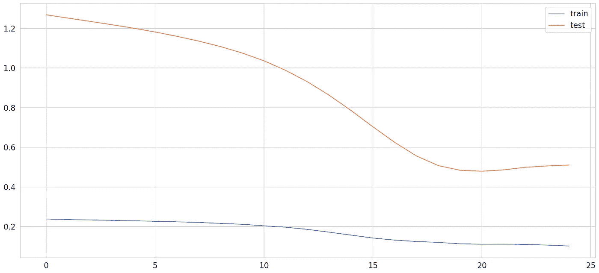
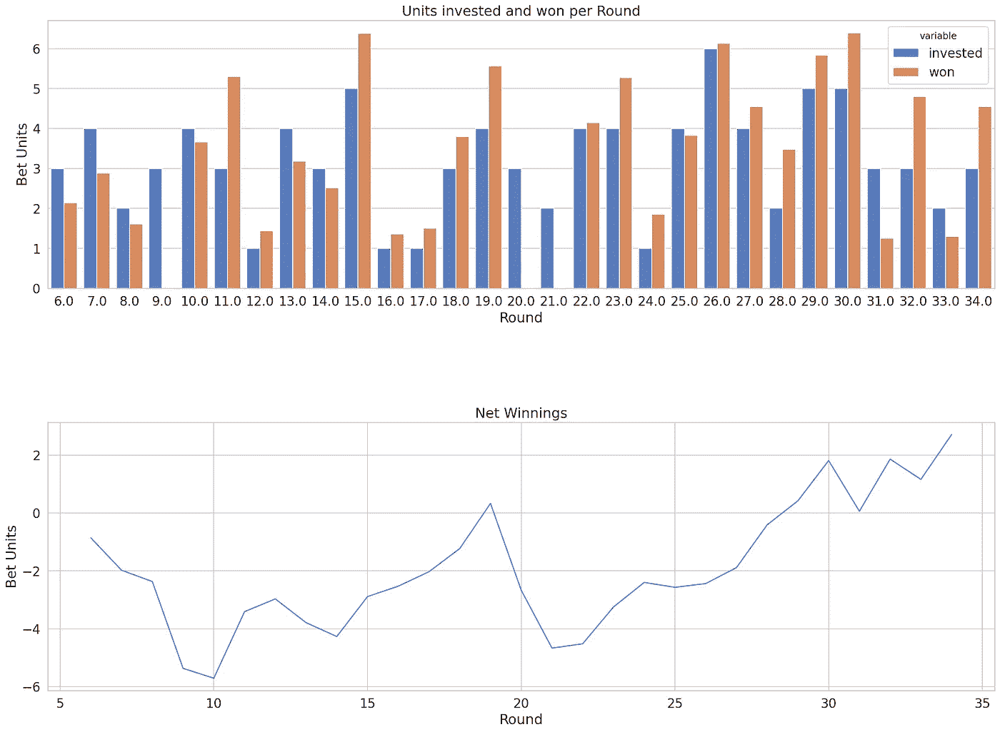

# 我们能用机器学习打败庄家吗？

> 原文：<https://towardsdatascience.com/can-we-beat-the-bookmaker-with-machine-learning-45e3b30fc921?source=collection_archive---------29----------------------->

## 用 LSTM 模型预测足球博彩的利润

埃里克·麦克林在 [Unsplash](https://unsplash.com?utm_source=medium&utm_medium=referral) 上的照片

***编者注:*** *本文仅供教育娱乐之用。如果你想用这个模型进行真正的下注，那么你要自担风险。请确保这是符合你的庄家的条款和条件。*

随着疾病的爆发和相应的经济关闭，数百万人不幸失去了工作。非常时期需要非常手段，我们可能会对创造新的非常规收入来源感兴趣。使用机器学习来预测足球比赛结果，从而帮助我们进行有利可图的下注，怎么样？

在本文中，我们使用一个简单的长短期记忆(LSTM)模型来预测足球比赛的结果。我们建立一个程序，在预测下一轮的结果之前，迭代地训练前几轮的模型。

你可以跟着[**这款 Google Colab 笔记本**](https://colab.research.google.com/drive/1t81lv6pB4n0iPdm84taWOwaqVDEmsKUD?usp=sharing) 。

# LSTMs

如果你不知道什么是 LSTM 模式，我强烈推荐 [Michael Phi](https://medium.com/u/1bdc81ea939d?source=post_page-----45e3b30fc921--------------------------------) 在他的[优秀文章](/illustrated-guide-to-lstms-and-gru-s-a-step-by-step-explanation-44e9eb85bf21)中解释它们。

简而言之，LSTMs 是一种特殊的递归神经网络，通常用于序列模型(例如自然语言处理)或时间序列预测(例如股票市场、需求、温度)。由于一个赛季的足球比赛代表一系列数据，模型可以使用以前的事件来预测未来，我们尝试使用 LSTM 博彩模型。

# 获取数据

每个机器学习模型的基础都在于数据。幸运的是，我们可以很容易地用谷歌搜索包含游戏分数和博彩赔率的数据集。对于我们的模型，我们将使用 2018/2019 德甲联赛的数据，这些数据可以从[这里](https://www.football-data.co.uk/germanym.php)下载。

由于下载的 csv 包含了很多我们的模型不需要的数据，让我们简单地删除不必要的列。在[我的 GitHub 储存库](https://github.com/guggio/soccer_bets)中，你会发现一个精简的数据集，只包括比赛日期、球队、进球和全职成绩，以及 B365 的下注赔率(主场赢、平局和客场赢)。让我们看看前五排。

# 数据准备

我们不是建立模型来预测忽略净胜球的全职结果，而是希望它预测主队和客场队之间的净胜球。此外，我们希望按轮协调结果的训练和预测，例如，在前 9 轮训练模型，并预测第 10 轮的结果以下注，等等。

由于神经网络需要浮点数据或整数的张量，我们不能简单地使用团队的名称作为我们模型的输入(Chollet，2018 年，第 101 页)。为了让我们的模型能够使用团队作为输入，我们为每个团队分配一个唯一的整数值。为此，我们创建了一个团队名称词汇表，并根据每个团队在词汇表中的索引，用他们各自的 id 来表示每个团队。对于实际的训练，我们将把这些指数输入到一个嵌入层中，这将在下面解释。

Chollet (2018 年，第 101 页)还建议，应该对数据进行归一化(所有值都应该很小，并且在同一范围内)，以促进网络的训练过程。由于我们预测主队和客场队的进球之差，而这些数值实际上可以在-5 (0:5)到 5 (5:0)的范围内，甚至进一步分布，所以我们肯定要对数据进行缩放。

准备好数据后，前五行应该如下所示:

# 建模

如上所述，模型应该在前几轮中进行训练，然后对下一轮的比赛进行预测。为了创建区别特征(X)和标签(y)集，我修改了[维尼林·瓦尔科夫](https://medium.com/u/102e34a0beb1?source=post_page-----45e3b30fc921--------------------------------)的[需求预测模型](/demand-prediction-with-lstms-using-tensorflow-2-and-keras-in-python-1d1076fc89a0)的 create_dataset 函数来满足我们的需求。如果你对 LSTMs 的进一步应用感兴趣，我绝对推荐他的文章。

假设我们想在下注前观察赛季的前五轮。因此，这些观察轮次的数据被用来对模型的结构进行一些调整。具体来说，我们想弄清楚模型在过度拟合之前需要多少训练。

正如我们在上面的图表中看到的，在模型似乎开始过度拟合之前，火车损失减少了大约 20 个时期。因此，在进行预测之前，我们稍后将对模型进行 20 个时期的训练。

> 注意:运行模型时，您可能会看到不同的结果。不幸的是，Keras 的[建议](https://keras.io/getting_started/faq/#how-can-i-obtain-reproducible-results-using-keras-during-development)使模型可复制，这似乎对 Google Colab 不起作用。

# 创建程序

为了建立一个程序来反复训练前几轮比赛，预测下一轮比赛的结果，然后下注，我们应该将整个过程分成几部分，并为每一步定义函数。

*   **数据选择**:选择前几轮进行训练，选择当前轮进行预测
*   **建模、训练和预测**:创建和训练模型以及进行预测和格式化输出的功能
*   **下注**:根据模型的预测选择下注的游戏
*   **汇总**:迭代训练、轮次预测、结果汇编

## 数据格式编排

因为我们在数据集上循环，并且在我们想要预测的回合之前的回合上训练模型，所以我们必须在每个回合之后重新创建数据集。我们使用上面的 create_dataset 函数为每次迭代创建一个训练和测试集。因为我们需要返回多个值，所以让我们将它们放入字典中。

## 建模、训练和预测

上面我已经概述了我们将如何建模我们的 LSTM，你可能想知道，什么是嵌入层，为什么我们需要它。根据 Chollet (2018 年，第 186 页)的说法，这一层可以理解为一个字典，它将整数索引(即团队索引)映射到密集向量，然后这些向量可以用作模型的输入。我们需要它，因为否则我们的毫无意义的团队指数(从 0 到 17)可能会被我们的模型误解。

我对超参数使用了相当随机的值，并明确鼓励您测试不同的组合，以优化模型的性能。

因为我们让模型预测缩放的游戏分数，我们必须反向转换这些预测，以便以想要的格式检索预测。为了创建一个包含模型预测的新数据框，我们需要对反向转换后的游戏分数进行整形。最后，我们将实际分数和预测分数堆叠到一个字典中，然后由函数返回。

## 打赌

基于模型的预测，我们想要下注。我肯定不是博彩专家，但我建议只在模型非常有信心主队或客场队会赢(得分≥ |1.1|)的情况下下注。

calculate_bets 函数创建两个列表，一个包含我们投资的赌注单位(如果我们在这个游戏上下注，则为 1，否则为 0)，另一个包含赢款。对于我们没有考虑下注的游戏或我们下注失败的情况(例如，预测主场获胜，但它是平局)，赢款为 0。如果模型正确预测了主场或客场获胜，则该游戏的获胜机会等于该结果的相应赔率。

在我们可以创建一个将所有内容放在一起并预测赛季每一轮的循环之前，我们基于测试集(一轮 9 场比赛)创建一个新的数据框，并添加重新转换的实际和预测分数以及投资和获胜下注单位的列。

**将所有这些放在一起**

现在，我们可以将上面的所有部分加在一起，并定义一个循环的函数，创建训练、测试集和模型。然后对模型进行训练，对结果进行预测，然后放入数据框中。

# 让我们打败庄家

把所有的碎片放在一起，是我们打败庄家的时候了！

正如我上面已经提到的，模型不能产生可重复的结果，这意味着，你的结果可能与我的不同。

我的模型总共下了 92 注，这意味着它投入了 92 个下注单位。该模型可能是一个比我更好的游戏预测工具，赢得了 94.71 个下注单位，这意味着净赢款占 2.71 个下注单位🔥

为了分析我们的模型在每一轮中的表现，并随着时间的推移看到胜利，让我们绘制数据。

我们可以看到，第 9、20 和 21 轮是最差的，因为我们没有赢得任何赌注。为了改进模型，进一步观察这些回合并弄清楚是什么导致了这些结果肯定是有意义的。很有可能，明显的热门被失败者击败，或者我们的模型只是做出了错误的预测。

# 结论

恭喜你，你刚刚赢了庄家。好吧，至少假设，2018/2019 年。

我们都知道这种模式远非完美，但这是一种简单的方法，似乎适用于 2018/2019 德甲赛季。此外，我们处理了一些数据，用 Keras 建立了一个 LSTM 模型，并绘制了结果。我相信这种模式也可以应用到其他联赛，甚至不同的运动，如冰球，篮球或美式足球。

如果您对可能改进模型的其他特性或模型架构有任何建议，请告诉我。我考虑在以后的文章中用更高级的特性扩展当前的模型。

非常感谢您的阅读！

保持保存和快乐编码！

# 参考

f . chollet(2018)。用 Python 进行深度学习。纽约:曼宁出版公司