# 我们能用 Twitter 打败股市吗？

> 原文：<https://towardsdatascience.com/can-we-beat-the-stock-market-using-twitter-ef8465fd12e2?source=collection_archive---------19----------------------->

## 一份关于如何利用 Twitter 和情绪分析在分析师自己的游戏中击败他们的详细指南

(Pixaby — Pexels，2020 年)

照片由[于切尔·莫兰](https://unsplash.com/@yucelmoran?utm_source=medium&utm_medium=referral)在 [Unsplash](https://unsplash.com?utm_source=medium&utm_medium=referral) 上拍摄

## 人们关心来自 Twitter 的数据吗？

Twitter 的数据许可服务在 2019 年为其赢得了**5 亿美元**，占其收入的近 20%。

## **为什么？**

交易员已经意识到，利用社交媒体获得影响股价的最快新闻不再是一个理论，而是一个现实，Twitter 正在提供一个甚至可以超越最可靠的新闻供应商的平台。

## 怎样才能用推文预测股票？

本质上，我们正在使用机器学习算法来衡量推文中的情绪，以预测股票是否会以某种方式移动。例如，如果一条推文中的正面词多于负面词，我们的算法会将其标记为较高的分数，并预测股价向上移动。

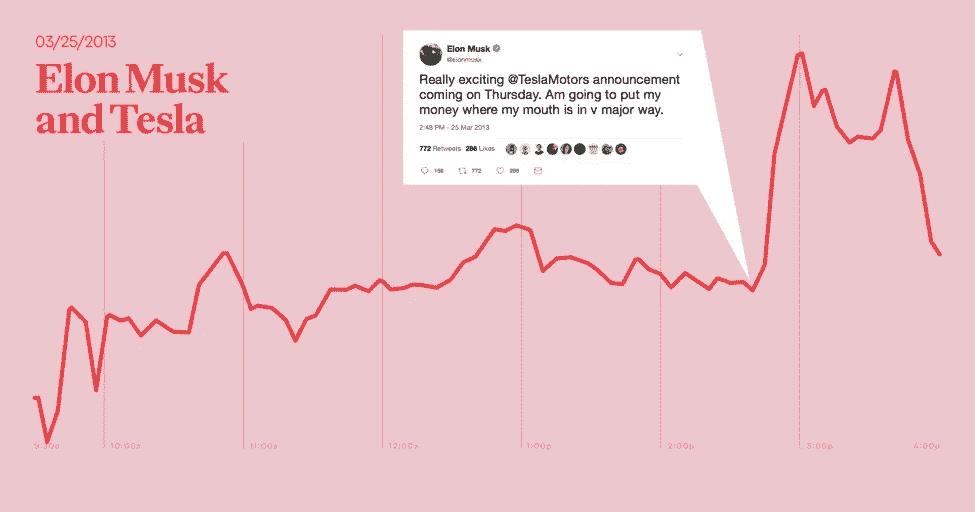

(埃德温·孔比厄塔——平布尔，2020 年)

## 我们要用什么来训练我们的模型？

为了理解 Twitter 情绪如何与股票价格联系起来，我们需要一个不同公司的丰富的 Twitter 数据集，以推断是否有可能使用在线情绪来预测股票价格。此外，Twitter 的指标，如喜欢、关注者和参与度，可以作为关于公司或行业的特定推文的可靠性和反应概率的良好指标。

在解释这些步骤之前，重要的是要重申一个事实，即使是最好的分析师也无法建立超过约 4–5%的 R 平方值的模型，即使有数千个预测器，**那么** **我们能找到一种方法来击败所有只使用 Twitter 的人吗？**

[杰米街](https://unsplash.com/@jamie452?utm_source=medium&utm_medium=referral)在 [Unsplash](https://unsplash.com?utm_source=medium&utm_medium=referral) 上拍摄的照片

# 以下步骤解释了我们的数据构建方法:

## 步骤 1:从 Twitter 中提取数据

数据集是从“*followthehashtag.com*”网站下载的。这是一个丰富的基于 Twitter 现金标签的纳斯达克 100 上市公司推文库。

该数据集被世界各地的研究人员使用，包含大约一百万条推文。在这个项目中，下载了 2016 年 3 月 28 日至 2016 年 6 月 15 日期间 4 家公司的推文。

## **第二步:**计算推文的情感得分

我们使用 VADER (Valence Aware 字典和情感推理器)库来检测每条推文的情感。VADER 是一个基于词汇和规则的情绪分析工具，专门针对社交媒体中表达的情绪。

(Pixaby — Pexels，2020 年)

**积极**:推文有多乐观和积极

**负面**:这条微博有多悲观和负面

**中立**:推特有多中立

**复合**:融合了上述所有内容的专有措施

## **情绪得分**:复合情绪指标和账户每条推文的关注者数量之间的乘积。

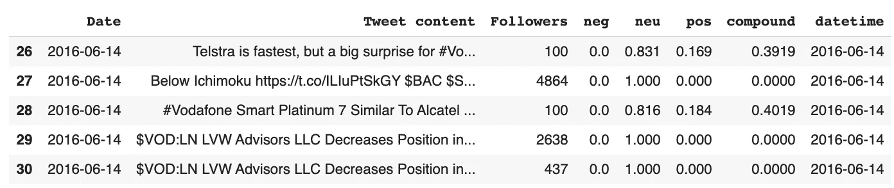

这一措施将允许我们通过优先考虑拥有更多追随者的 Twitter 用户来捕捉推文的重要性和影响。

## **步骤 3:** 按天对每家公司的总体情绪得分进行分组

## **步骤 4:** 从雅虎财经中提取数据

使用 pandas 中可用的 API 连接到 Yahoo Finance，然后下载并提取所选 74 天内每家公司股票的数据。

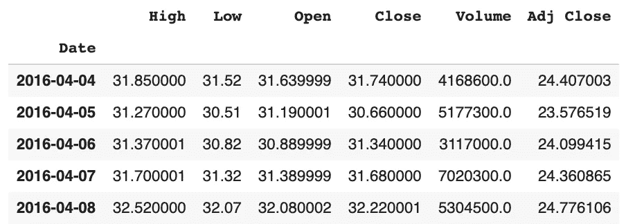

雅虎财经的 API-74 天的股票价格

## 第五步:捕捉股票的波动性

每日股票价格被标准化，以便遵守基于距离的算法规则并捕捉波动性而不是绝对价格变化。

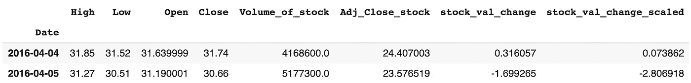

通过标准化每日股价变化来捕捉波动性

## 第六步:创建买入/卖出信号

然后，我们开始创建一个初步的买入和卖出信号，这个信号是基于投资者在某一天是否会获得正回报，换句话说，就是我们试图预测的。

然后，完全基于推文背后的情绪来计算买卖信号。

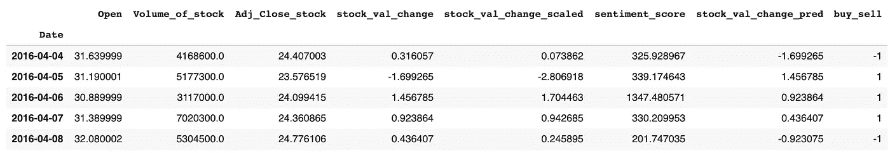

根据情绪得分添加买入/卖出信号

## **步骤 7:** 运行 36 种不同的机器学习二进制分类模型

数据集被分为训练和测试，以便训练我们的模型并客观地衡量它们的性能。由于这是一个时间序列数据，最好根据日期范围分割数据。

一系列不同的算法被计算出来，首先预测股票价格在给定情绪的情况下是倾向于上升还是下降，其次测量价格变化的幅度。

运行的模型有 KNN，逻辑回归，决策树，随机森林。SVM 和安。

## **第八步:**预测股票价格

一个基于模型的复杂公式被用来预测股票价格，该模型是根据推文的情绪训练的。

# 使用我们的模式来尝试和赚钱

> **预测 EA、T-Mobile、沃达丰、& Cerner 的表现**

我们决定对不同的公司进行分析，这些公司理论上会有各种各样的关于它们的推文。

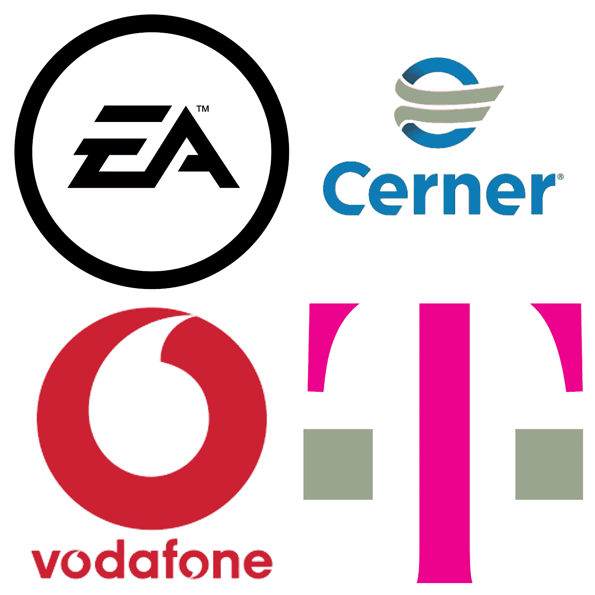

电子艺界(EA)，Cerner，沃达丰，T-Mobile

## 选择 1:电子艺术(EA)

我们首先选择了电子游戏制造商 EA，因为很多人会在 Twitter 上直言不讳地表达他们对电子游戏的感受。

## 选择二:电信公司

此外，选择电信公司(T-Mobile 和沃达丰)是因为我们认为他们的客户倾向于在网上表达他们的投诉，因此会表达强烈的情绪。

## 选择 3: Cerner(医疗保健)

最后，我们分析了美国健康信息技术解决方案供应商 Cerner 的推文。医疗保健技术领域通常倾向于发布公众做出反应的信息(无论是创新的正面信息还是有争议的负面信息)。

# 判决

第一次分析的结果总结在下表中:

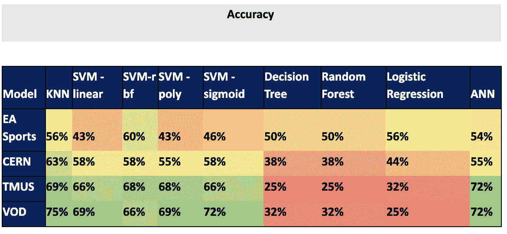

准确度分数—人工智能、神经网络和机器学习算法

正如所观察到的，与基于决策的算法相比，基于图形的算法在预测价格变动方面表现出优越得多的性能。沃达丰和 T-Mobile 的平均准确率高达 72%,这在股票市场中是非常了不起的。

# 电子艺术

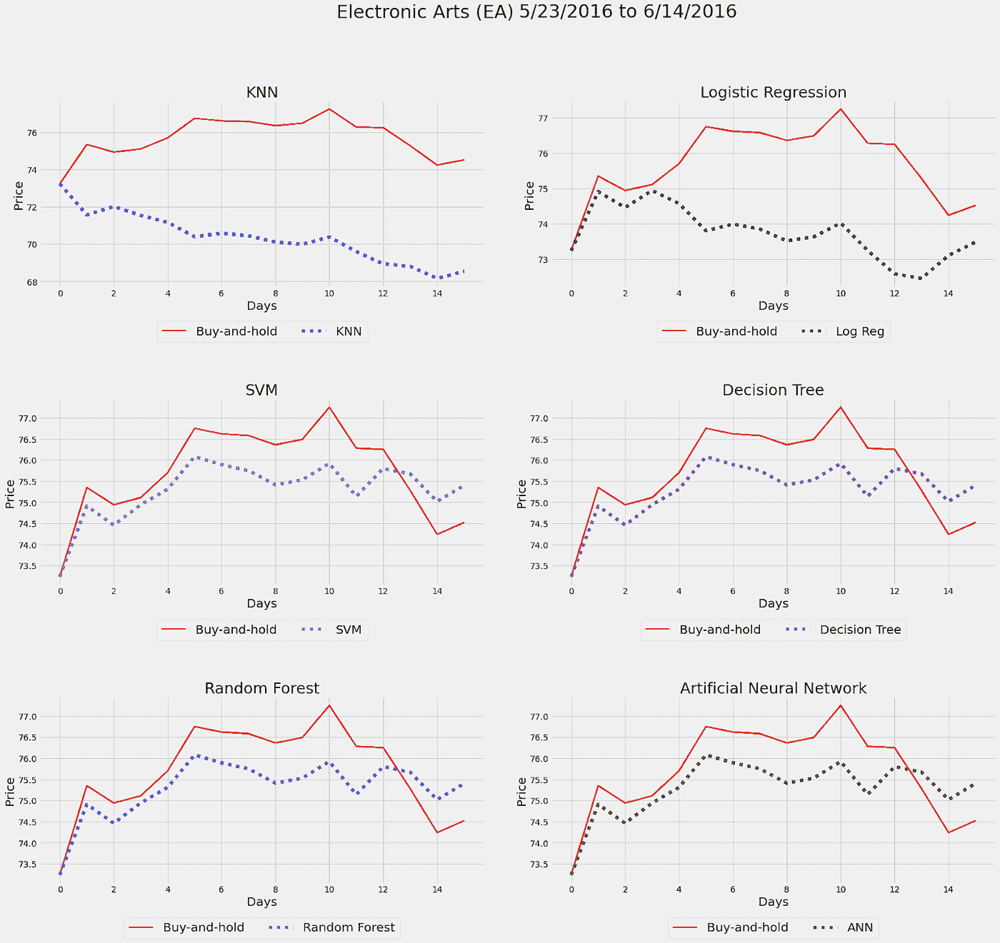

# 沃达丰集团(VOD)

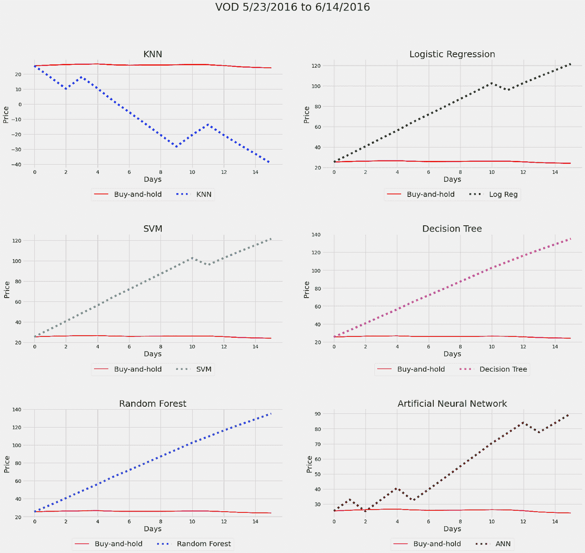

# T-Mobile 美国(TMUS)

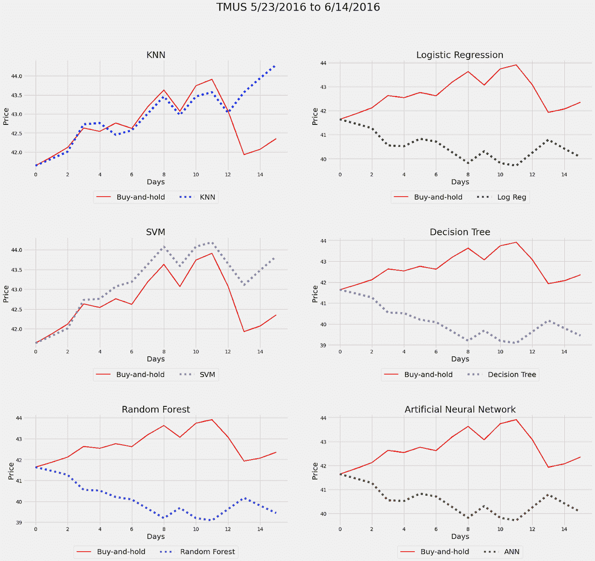

# 欧洲原子核研究组织

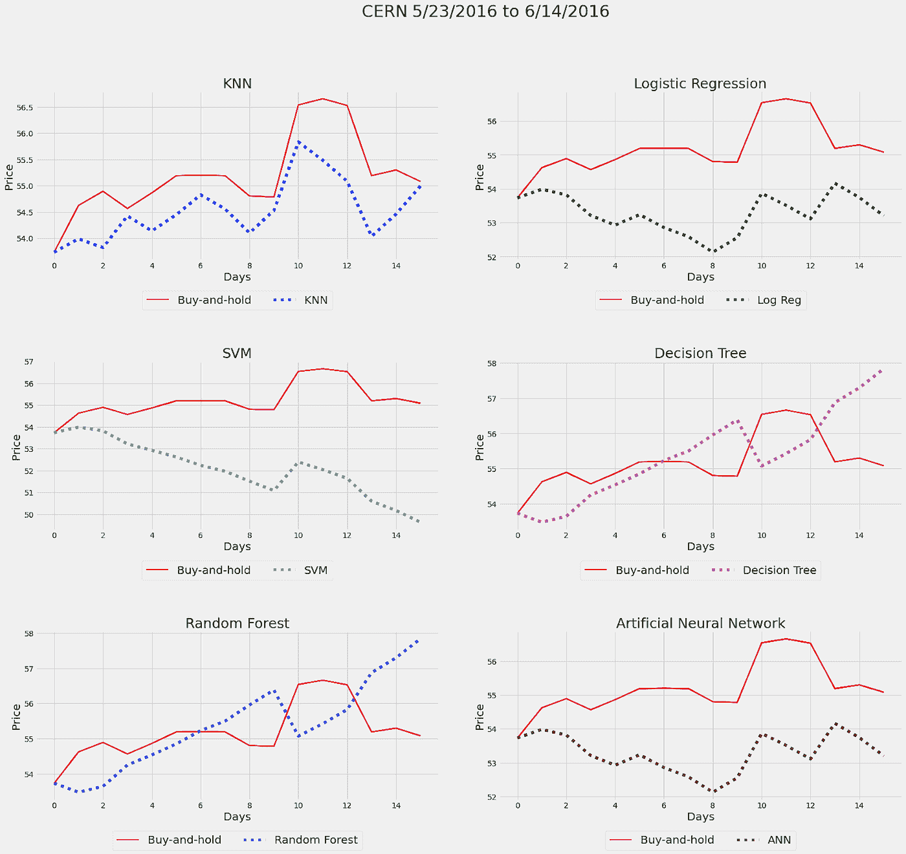

# 群体的智慧

总的来说，股票市场围绕着谁能够运行最复杂和最有效的机器学习算法，这些算法包含尽可能多的预测器，然而，我们能够通过利用群众的智慧胜过所有这些预测器。

# 推荐

我们最后的建议是，不要孤立地使用我们的模型，而是根据交易者的风险偏好，尝试从外部证实信息，如果仍然对建议犹豫不决，最好是在 Twitter 之外。

如果从几个来源有一个普遍的共识，即市场将向某个方向收敛，那么就有理由相信我们的模型的建议是正确的。

我们的模型通过利用社区的力量帮助个人做出明智的投资决策，对于任何交易者来说都是一个完美的补充工具，无论他们是初学者还是专业人士。

# 商务化人际关系网

 [## 诺亚·穆赫塔尔-分析师- BDC |领英

### 未来的分析硕士毕业于麦吉尔大学的商业分析专业从…

www.linkedin.com](https://www.linkedin.com/in/nmukhtar/)  [## Venkatesh Chandra - Aon Canada |解决方案架构师-分析顶点项目- McGill…

### 我有 4 年的数据科学家经验。我曾与财富 100 强公司合作进行外部分析…

www.linkedin.com](https://www.linkedin.com/in/venkateshchandra/)  [## Ramy Hammam -顾问团队领导-数据科学&业务战略-普惠& Whitney…

### 在世界上最大的职业社区 LinkedIn 上查看 Ramy Hammam 的个人资料。Ramy 有 5 份工作列在他们的…

www.linkedin.com](https://www.linkedin.com/in/ramy-hammam/) 

## GitHub 代码

 [## chandravenky/使用 Twitter 预测股价

### 通过在 GitHub 上创建一个帐户，为 chandravenky/使用 Twitter 进行股票价格预测的开发做出贡献。

github.com](https://github.com/chandravenky/Stock-price-prediction-using-Twitter)