# 我们能用人工智能检测无现金后新冠肺炎经济中的数字欺诈吗？

> 原文：<https://towardsdatascience.com/can-we-detect-digital-fraud-in-a-cashless-post-covid-19-economy-using-ai-1b4243cf30e2?source=collection_archive---------48----------------------->

## 新冠肺炎改变了我们的支付方式，数字支付的使用越来越多，在我们即将成为无现金经济的时代，数字欺诈的可能性达到了前所未有的高度


照片由 Muhammad Raufan Yusup 和 Pixaby 在 Unsplash & Pexels 上拍摄

# 新冠肺炎的数字化加速

在世界卫生组织(World Health Organization)宣布现金可能携带冠状病毒后，一些国家立即采取措施隔离或销毁大部分货币供应，一些国家甚至完全禁止使用现金，迫使客户完全接受数字支付。

# 这是现金的尽头吗？


布莱克·维斯兹在 [Unsplash](https://unsplash.com?utm_source=medium&utm_medium=referral) 上的照片

分析师现在预计，到 2024 年，全球非现金交易将超过 1 万亿美元的里程碑**。不仅如此，电子交易的数量和金额的快速增长使得分析家们预测在不久的将来，政府将通过立法完全取消现金交易，以防止疫情的再次蔓延。**

此外，数字支付的快速发展不仅改变了消费者、企业和政府转移资金的方式，也改变了犯罪分子窃取资金的方式:**数字欺诈。**

# 数字欺诈的增长

2019 年，在线欺诈增长了 13%，达到 169 亿美元，尽管欺诈事件从 2019 年的 1440 万起下降到 1300 万起，但黑客们成功地将注意力转移到了价值更高的欺诈事件上，而不是多次价值较低的欺诈事件，一年内总共窃取了 35 亿美元，减少了 140 万笔交易。


Clint Patterson 在 [Unsplash](https://unsplash.com?utm_source=medium&utm_medium=referral) 上拍摄的照片

由于被隔离的人比以往任何时候都更多地转向在线平台，这种欺诈的稳步上升趋势现在正在升级，预计到 2020 年，尝试在线支付欺诈将至少增加 **73%** 。

# 建立预警系统——数字欺诈

为了更好地为数字时代带来的所有威胁做好准备，我们决定创建一个**自动编码器欺诈检测模型**，它不仅能**检测欺诈**，还能**模拟罕见的欺诈案例**，创造更多“异常”交易进行检查。


由 [Ales Nesetril](https://unsplash.com/@alesnesetril?utm_source=medium&utm_medium=referral) 在 [Unsplash](https://unsplash.com?utm_source=medium&utm_medium=referral) 上拍摄的照片

# 问题:不平衡的数据集

我们正在使用的数据集包含 2 天内发生的信用卡交易，其中 **492** **欺诈**发生在 **284，807 笔交易**中，这意味着我们的数据集只有 **0.17%** 有欺诈实例。

本质上，我们的数据集是高度不平衡的，这意味着我们的模型将学习如何更好地识别正常交易而不是欺诈交易，这使得它在应用于新的欺诈案件时完全无用。

## 权衡:召回与精确

我们的目标是最大限度地提高回忆和交易的准确性，因为预测非欺诈交易的“欺诈”比错过任何欺诈交易造成的经济损失都要小。

# 解决方案:自动编码器

自动编码器被称为复杂的无监督人工神经网络，它学习如何有效地压缩和编码数据以重建数据。

本质上，它将数据从简化的编码表示重新构建为尽可能接近原始输入的表示。

它主要通过学习如何忽略数据中的噪声来降低数据维度。

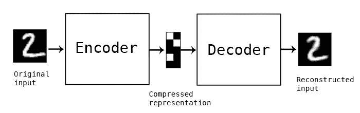

自动编码器:来自 MNIST 数据集的输入/输出图像示例

## 规划我们的模型

我们将以无监督的方式训练一个**自动编码器神经网络**，我们模拟的罕见事件将与原始事件略有不同，模型将能够仅通过输入来预测案件是否是欺诈性的。

## 评估我们的模型

在我们的项目中，用于确定交易是**欺诈(1)还是正常(0)** 的主要指标是**重构误差**，该误差将被模型最小化。

这将允许我们的**自动编码器学习数据**中存在的欺诈的重要特征，因为当一个表示允许其输入的良好重构时，它已经保护了输入中存在的大部分信息。

# 探索性数据分析

数据集的快速摘要显示了 31 列，其中 2 列是**时间**和**金额**。

**类(目标变量)**

> **1:欺诈交易**
> 
> **0:正常/非欺诈交易**

剩余的 29 个变量来自 PCA 变换，并且为了安全目的已经进行了变换。

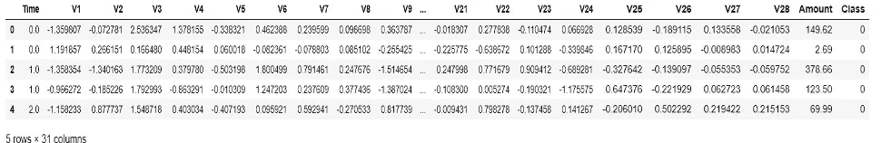

变量—数字欺诈模型

> 没有缺失值，因此我们可以继续绘制数据

## 可视化不平衡的数据集

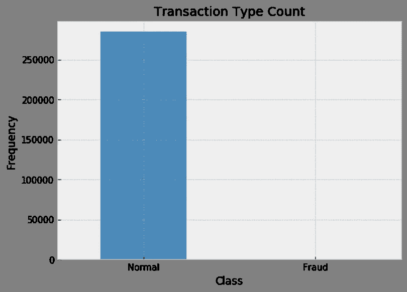

高度不平衡的数据集—对欺诈来说很正常

## 欺诈交易是否在特定的时间范围内发生？

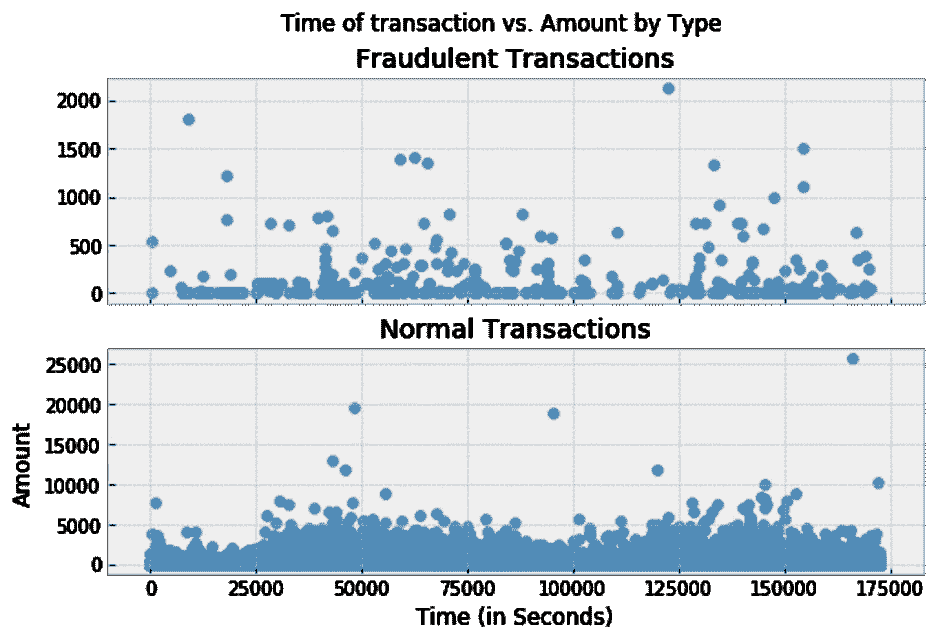

欺诈交易—时间框架分析

> 由于两种交易类型的交易长度似乎不同，因此无法从时间变量中提取可见的洞察力。

# 数据预处理

## 数据缩放

时间变量由于不相关而被丢弃，并且值被标准化以准备我们的自动编码器模型。

## 列车测试分离[80:20]

与大多数模型不同，我们的主要重点不是围绕建立分类模型，而是**检测异常**，因此我们的训练&测试分割将略有不同。

考虑到不平衡的数据集，我们将**仅在正常事务**上训练我们的模型**，然而，我们将**避免修改测试集**，并且它仍将保持原始的类划分，以保留对我们模型性能的准确&无偏评估。**

# 构建我们的模型

## 模型设置

接下来，使用 14 维的**输入来建立自动编码器模型，该输入被馈送到分别具有**大小 14、7、7 和 14** 的 **4 个全连接层** s。**

如前所述，**前 2 层**代表**编码**部分，剩余 2 层**代表**解码**部分。**

为了建立一个不太复杂的模型，并解决过度拟合和特征选择，我们纳入拉索(L1)正则化。

每一层的超参数是用设置为 glorot_uniform 的内核初始化程序以及交替的 sigmoid 和 RELU 激活函数来指定的。

我们选择这些超参数的原因是因为它们往往表现良好，并被视为行业标准。

```
X_train = X_train.valuesX_test = X_test.valuesinput_dim = X_train.shape[1]encoding_dim = 14**from** **keras.models** **import** Model, load_model**from** **keras.layers** **import** Input, Dense**from** **keras** **import** regularizersinput_layer = Input(shape=(X_train.shape[1], ))encoder1 = Dense(14, activation="sigmoid", kernel_initializer= "glorot_uniform",activity_regularizer=regularizers.l1(0.0003))(input_layer)encoder2 = Dense(7, activation="relu", kernel_initializer= "glorot_uniform")(encoder1)decoder1 = Dense(7, activation='sigmoid',kernel_initializer= "glorot_uniform")(encoder2)decoder2 = Dense(X_train.shape[1], activation='relu',kernel_initializer= "glorot_uniform")(decoder1)autoencoder = Model(inputs=input_layer, outputs=decoder2)
```

## 模特培训

用 32 个样本的**批量**对模型进行 **20 个时期**的训练，以允许模型学习最佳权重。**最佳模型权重**定义为**最小化**损失函数**(重建误差)的权重。**

**使用 Tensorboard 上的 ModelCheckpoint 回调保存模型。**

```
**from** **keras.callbacks** **import** ModelCheckpoint, TensorBoardautoencoder.compile(optimizer='adam', loss='mean_squared_error', metrics=['accuracy'])checkpoint = ModelCheckpoint(filepath=r"C:\Users\Ramy\Desktop\AI\autoencode.h", verbose=0, save_best_only=**True**)tensorboard = TensorBoard(log_dir=r"C:\Users\Ramy\Desktop\AI\logs", histogram_freq=0, write_graph=**True**, write_images=**True**)*#early_stop = EarlyStopping(monitor=’loss’, patience=2, verbose=0, mode='min')*history = autoencoder.fit(X_train, X_train,epochs= 20,batch_size=32,shuffle=**True**,validation_data=(X_test, X_test),verbose=1,callbacks=[checkpoint, tensorboard]).history
```

# **结果**

**为了评估我们模型的学习能力，我们绘制了训练和测试模型损失图，以验证历元数越多，我们的错误率越低。**

**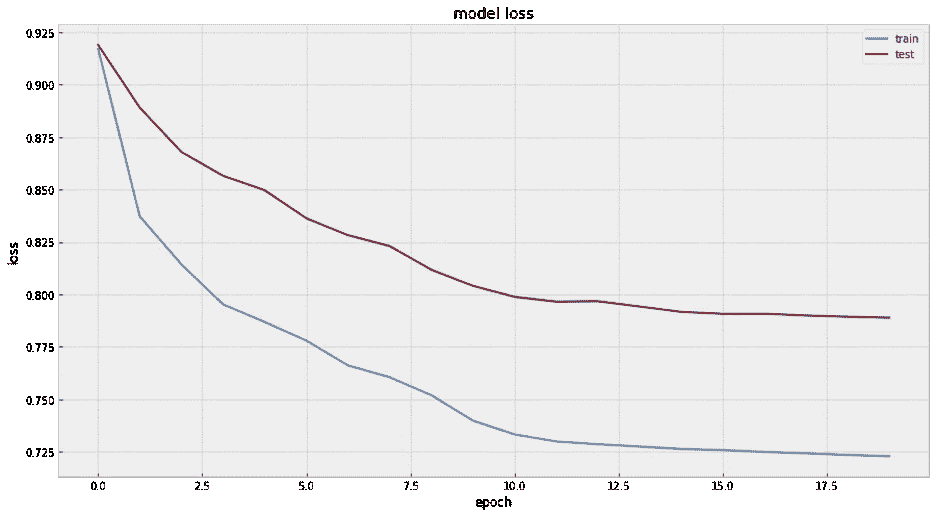**

**模型丢失—历元与丢失**

**我们的 MSE 被重新命名为重建误差，它似乎在测试和训练集上收敛得很好。**

## **重建误差和真实类的汇总统计**

**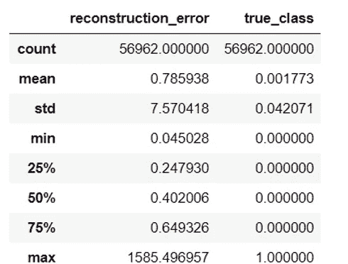**

**重构误差与真实类别**

**然后，我们绘制两种类别类型的重构误差(*正常和欺诈*)。**

**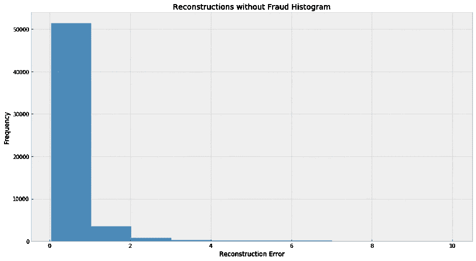**

**重建——没有欺诈**

**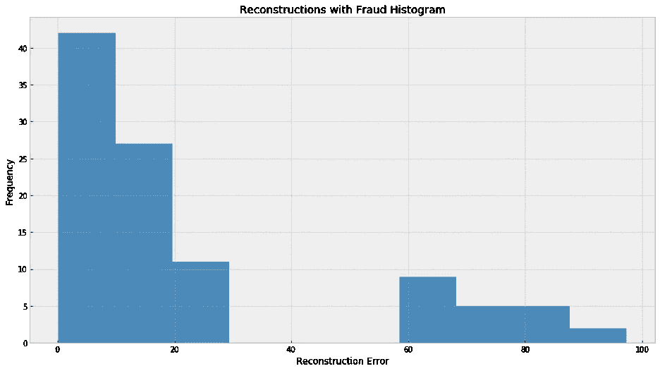**

**重建——欺诈**

# **确认**

## **召回与精确**

> ****精度高:**假阳性率低**
> 
> ****高召回:**低假阴性率**

**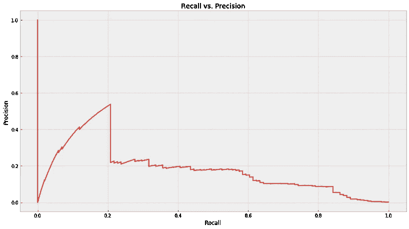**

**自动编码器模型:召回与精度**

**该图显示，在这种情况下，数值非常极端。该模型要么在精确度上做得很好，要么只在回忆上做得很好，但不能同时兼顾两者。**

****Autoencoder 模型的最佳点:****

> ****召回** : 20%**
> 
> ****精度** : 60%**

****精度粒度图&通过阈值召回曲线****

**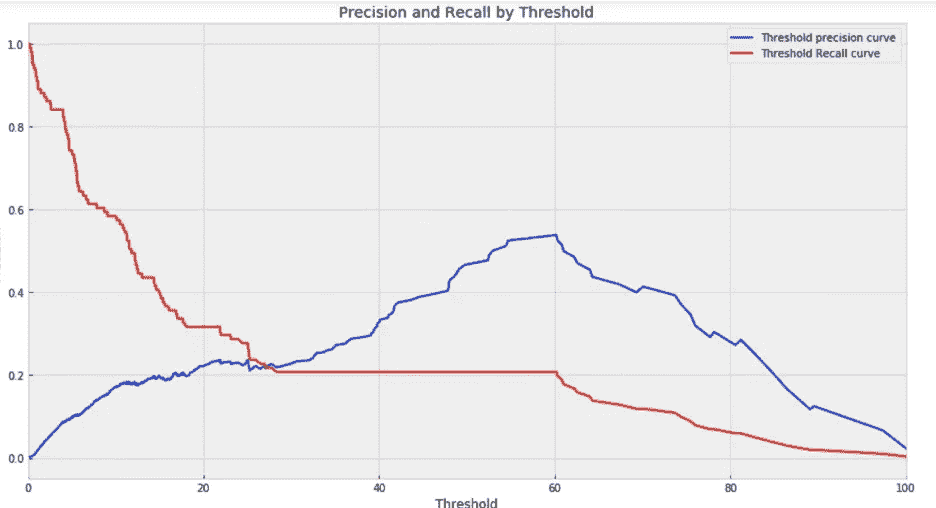**

**自动编码器模型:精度和召回阈值**

**该图显示，随着重建误差阈值的增加，模型精度也增加。然而，召回指标却相反。**

# **模型测试和评估**

**为了最终区分欺诈交易和正常交易，我们将引入一个阈值。通过使用来自交易数据的重构误差，如果误差大于定义的阈值，则该交易将被标记为欺诈性的。**

> ****最佳阈值** = 3.2**

**我们也可以从测试数据中估计阈值。然而，从长远来看，可能存在过度拟合的可能性，这可能是有害的。**

## **正常交易和欺诈交易之间界限的可视化**

**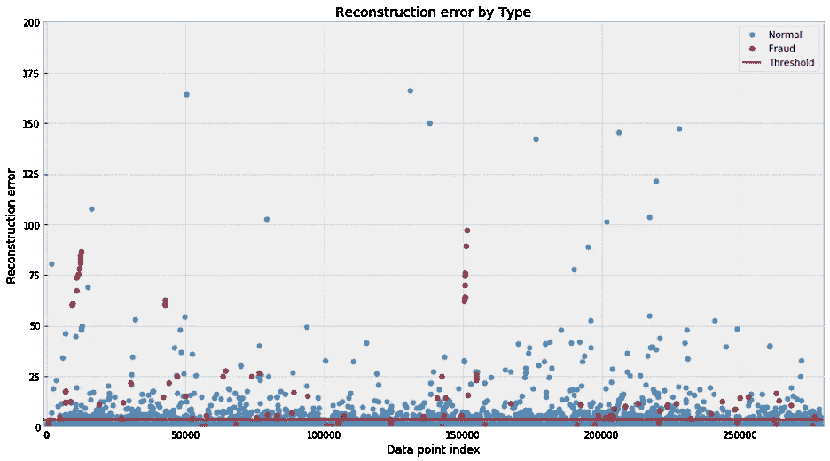**

**重构错误—正常与欺诈**

# **混淆矩阵**

**这为我们模型的精度和召回值提供了更全面的概述。总的来说，我们的自动编码器模型是**健壮的**，具有**高真阳性&真阴性**(欺诈与正常交易检测率)**

**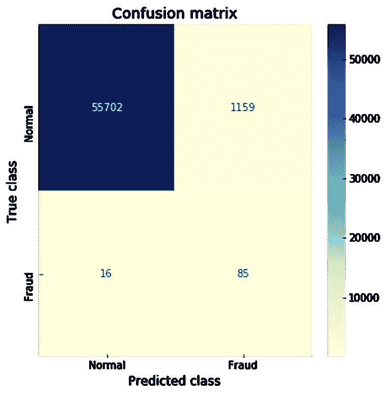**

## **欺诈交易**

**查看混淆矩阵，我们可以看到有 16+85 = **101 个欺诈交易**。**

**其中 **85 笔**被**正确归类**为**欺诈**，其中 **16 笔**被**错误归类**为**正常交易。****

## **正常交易**

**另一方面， **1159** 被**错误归类**为**欺诈**，相当于正常案例总数的约 **2%。****

## **最初目标**

**一般来说，将欺诈交易误认为正常交易的成本要高得多，反之亦然。**

## **解决办法**

**为了确保实现这一目标，我们试图通过牺牲我们准确预测正常交易的能力来提高检测欺诈交易的预测能力。**

# **结论**

**总体而言，该模型相对稳健，因为我们确实抓住了大多数欺诈案件。然而，如果我们的数据集更加平衡，这还可以进一步改善。**

# **商务化人际关系网**

**[](https://www.linkedin.com/in/nmukhtar/) [## 诺亚·穆赫塔尔——分析师——BDC | LinkedIn

### 未来的分析硕士毕业于麦吉尔大学的商业分析专业从…

www.linkedin.com](https://www.linkedin.com/in/nmukhtar/) [](https://www.linkedin.com/in/ramy-hammam/) [## Ramy Hammam —顾问团队负责人—数据科学&业务战略—普惠& Whitney…

### 在世界上最大的职业社区 LinkedIn 上查看 Ramy Hammam 的个人资料。Ramy 有 5 份工作列在他们的…

www.linkedin.com](https://www.linkedin.com/in/ramy-hammam/) [](https://www.linkedin.com/in/sjahangi/) [## Shaher yar Jahangir —顾问—项目经理&建模师— Aéro Montréal | LinkedIn

### 沙赫尔贾汉吉尔是麦吉尔大学分析管理硕士(MMA)项目的候选人

www.linkedin.com](https://www.linkedin.com/in/sjahangi/) 

# 开源代码库

[](https://github.com/RamyBot/Simulating-Fraudulent-Transactions-with-Autoencoders) [## ramy bot/用自动编码器模拟欺诈交易

### 有助于 RamyBot/模拟欺诈交易与自动编码器的发展，通过创建一个帐户…

github.com](https://github.com/RamyBot/Simulating-Fraudulent-Transactions-with-Autoencoders)**