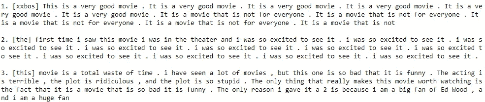
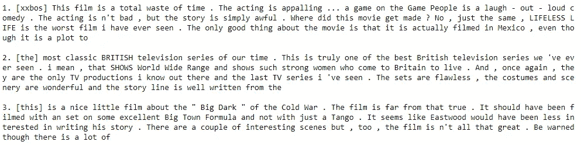
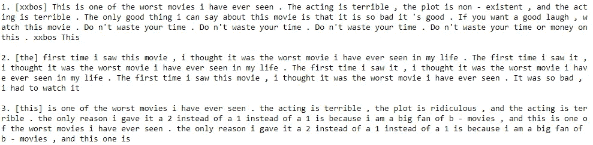
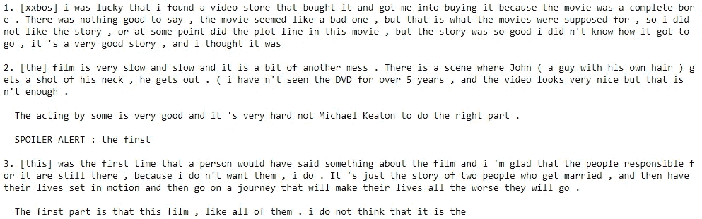
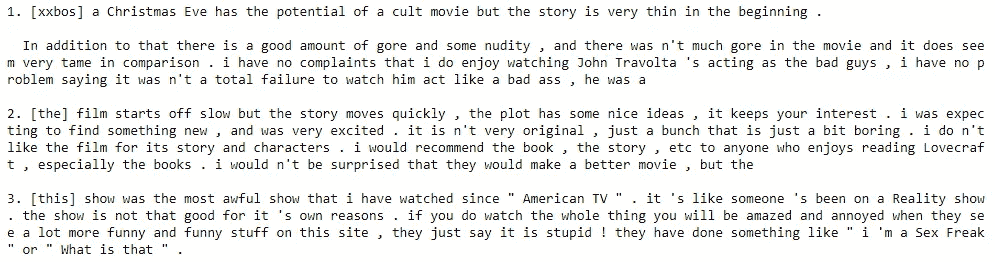

# 我们能用语言模型生成高质量的电影评论吗？

> 原文：<https://towardsdatascience.com/can-we-generate-high-quality-movie-reviews-using-language-models-5158f494aea7?source=collection_archive---------25----------------------->

## 微调 IMDB 电影评论的语言模型，并使用各种不同的方法生成电影评论。

Ahmet Yal nkaya 在 [Unsplash](https://unsplash.com?utm_source=medium&utm_medium=referral) 上拍摄的照片

# 介绍

最近，语言模型——试图预测句子中的下一个单词的模型，通常是深度神经网络——引起了严重的轰动，因为 OpenAI 宣布，他们已经成功训练了一个名为“[【GPT-2】](https://openai.com/blog/better-language-models/)的 15 亿参数语言模型，他们最初认为发布这个模型太危险了。它已经被释放了，现在你甚至可以和它说话了。

上面链接的 OpenAI 博客和“与变形金刚对话”网站上的例子真的让我震惊，我开始想知道我们是否能够以某种方式生成高质量的电影评论，类似于 [IMDb 数据集](http://ai.stanford.edu/~amaas/data/sentiment/)，其中包括 100，000 条电影评论，分为 25，000 条正面评论，25，000 条负面评论和 50，000 条未标记评论。然而，据我所知，完整的 GPT-2 模型——包含 15 亿个参数——如果不付出大量努力，就无法在单个 GPU 中安装，而且肯定也不适合我的个人 GPU。所以我很好奇——标准语言模型在 IMDb 数据集上训练后产生的评论质量会怎么样？

# 设置

我决定使用 fastai 的[提供的语言模型](https://docs.fast.ai/text.html)进行一些实验，该语言模型已经在维基百科上进行了预训练(关于该模型的更多细节，请参见 ULMFiT 论文[这里](https://arxiv.org/abs/1801.06146))。然后，我对整个 IMDb 数据集进行了微调，因为我不关心电影评论中表达的情感，我对情感分析也不感兴趣，所以我不需要维护数据集中提供的训练/测试分割。这种微调的目的是使模型专注于电影评论的领域，因为能够准确预测评论中的下一个词对于能够真实地生成电影评论中的下一个词是非常有用的，这是我们的目标。如果您对从另一个领域生成文本感兴趣，请随意使用您选择的语料库重复这些实验！

我最近看到了[“神经文本退化的奇怪案例”](https://arxiv.org/abs/1904.09751)，它深入探讨了现有的文本生成策略，强调了它们的不足，并提出了一些新的动机良好的成功方法，因此我决定比较每种方法生成的电影评论的质量。所有方法都有相同的提示(如下图)和复习长度(100 字)，使用相同的模型进行推理。

# 方法和结果

在这里，我将简要介绍评估的方法，并提供一些示例(为图像质量道歉)——这些示例是对每种方法运行一次模型的结果，没有经过挑选或篡改。

为了增加可读性，实现细节和更多的例子，请查看底部的 Github repo 链接。

*   贪婪的 top-1 方法——由于语言模型输出一个概率向量，其大小与我们的词汇量相当，我们可以简单地总是获取具有最高概率的标记并将其返回，通过重复这个过程并不断地将生成的标记添加到现有提示中，我们可以生成完整的评论。
*   贪婪多项式方法-在这个版本中，我根据概率分布对令牌进行采样，而不是总是选择最可能的一个-这个过程仍然是贪婪的(仅考虑当前令牌的概率分布)，但导致重复结果较少。

正如我们在例子中看到的，贪婪的 top-1 的评论是重复的，不像自然语言。在我看来，贪婪多项式方法产生的评论出奇的好，但还不太好。

使用“贪婪的前 1 名”方法生成评论的几个例子。方括号中的文字是给定的提示，“xxbos”代表一个评审的开始。

使用“贪婪多项式”方法生成评论的几个例子。方括号中的文字是给定的提示，“xxbos”代表一个评审的开始。

*   波束搜索方法—在这种方法中，不是最初只挑选具有最高概率的记号(top-1)，而是挑选具有最高概率的 top-k 记号。该参数也称为“波束宽度”。在每一步，我们将 k 个标记中的每一个添加到现有的提示中，并且只保留到目前为止的前 k 个组合。理论上，这允许我们不仅基于它们之前的标记，而且基于它们之后的标记来挑选标记。然而，在实践中，这种方法经常失败，并最终生成极其重复的文本-所有 top-k 结果似乎都是模型的重复和“安全”选择的链，因此即使是最终 top-k 的多项式分布在大多数情况下也不会产生好的结果。有关这种特殊故障模式的更深入的分析，请参考论文。正如我们在例子中看到的，这种方法倾向于产生短期意义的句子，但非常重复，总体上不能产生高质量的评论。

使用“波束搜索”方法生成评论的几个例子。方括号中的文字是给定的提示，“xxbos”代表一个评审的开始。

*   Top-k 方法——与波束搜索类似，我们现在选择具有最高概率的 top-k 记号，而不是总是选择具有最高概率的记号。正如我们在例子中看到的，结果可能是偶然的——有时整个评论是连贯的，似乎是现实的，但在其他时候，句子放在一起没有多大意义。总的来说，在我看来，它似乎比以前的方法产生了更有趣和更多样的结果。

使用“top-k”方法生成评论的几个例子。方括号中的文字是给定的提示，“xxbos”代表一个评审的开始。

*   Top-p nucleus 方法——本文提出这种方法是为了解决 top-k 方法中的“猜测 k 的数字”问题。与使用固定的 k 相比，根据概率分布来决定 k 更有意义— k 应该是所需的任何数字，以便前 k 个令牌包含大部分概率质量。因此，在 top-p nucleus 方法中，我们为函数提供概率 p，并且对于每个单词，它决定一个数字 k，然后像以前一样执行 top-k 采样。总的来说，对我来说，质量似乎与 top-k 非常相似，但它可能更好地处理边缘情况(其中概率密度相对均匀，因此当它相对达到峰值时，我们会想要一个高 k，而我们会想要一个小 k)。

使用“top-p”方法生成评论的几个例子。方括号中的文字是给定的提示，“xxbos”代表一个评审的开始。

更多的实现细节——我已经选择从生成中删除代表任何未知单词的特殊标记，并添加了对最小标记概率和概率分布温度的支持(除了每个方法采用的参数之外)。我还没有机会调整这些参数，所以通过一些实验，更好的文本生成是完全可能的。

# 结论

总之，我们观察到文本生成的质量不仅取决于所用模型的大小，还取决于生成方法本身，不同的方法生成的评论质量大不相同——贪婪的 top-1 文本生成似乎产生低质量的文本，beam-search 似乎产生极度重复的文本，top-k 和 top-p 似乎产生比 top-1 质量更高的非重复文本。希望文本生成方法仍然是一个活跃的研究领域，不久我们将不再需要 1.5B 参数模型来生成真实的文本！

# 参考

*   [Github repo](https://github.com/orendar/imdb_text_generation) 提供完整代码和更多示例。
*   [霍尔茨曼，a .，买斯，j .，福布斯，m .，&崔，Y. (2019)。神经文本退化的奇特案例。 *arXiv 预印本 arXiv:1904.09751* 。](https://arxiv.org/abs/1904.09751)
*   [Fast.ai 的代码优先 NLP 课程](https://www.fast.ai/2019/07/08/fastai-nlp/)，启发了我写这篇文章！视频播放列表[这里](https://www.youtube.com/playlist?list=PLtmWHNX-gukKocXQOkQjuVxglSDYWsSh9)。