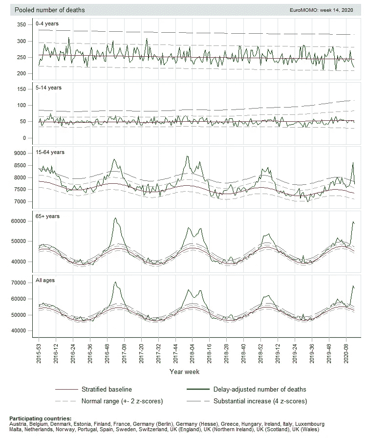
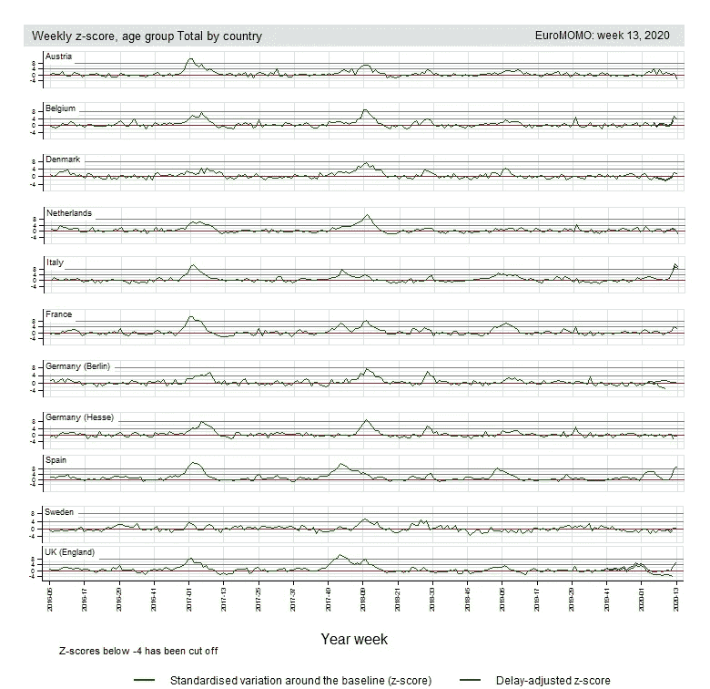
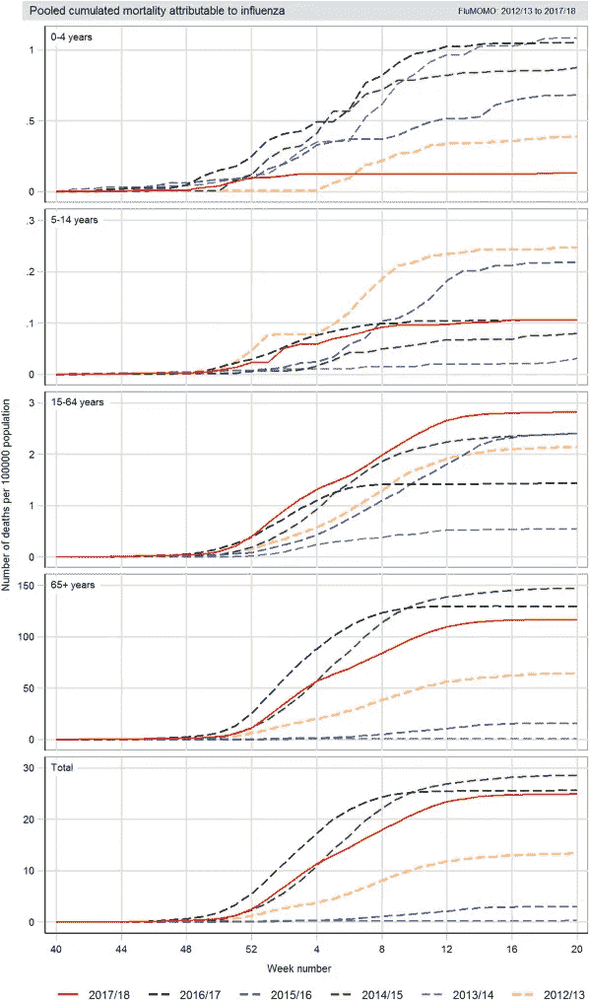
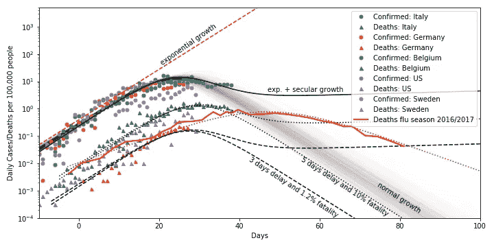

# 我们能从流感的发展中学到什么来更好地分析新冠肺炎疫情吗？

> 原文：<https://towardsdatascience.com/can-we-learn-anything-from-the-progression-of-influenza-to-analyze-the-covid-19-pandemic-better-b20a5b3f4933?source=collection_archive---------36----------------------->

## 近距离观察新冠肺炎的进展，并影响欧洲和美国的死亡人数

从一开始就把事情弄清楚，新冠肺炎不是流感。但是流感，就像新冠肺炎一样，是一种具有显著相似性的传染性病毒感染，并且它是我们所能看到的与新冠肺炎相关的研究最广泛的。通过比较新冠肺炎和流感在欧洲的传播和死亡人数，我们可以了解未来可能会发生什么，以及我们如何将疫情置于更大的事情中。

*我还通过概率建模* *看了看更接近于* [*对新冠肺炎传播的可预测性。*](https://medium.com/@thomasvergote/predictability-of-case-evolution-of-covid-19-using-mcmc-7e8476e5e56f)

# 流感不是无害的

开始关注显而易见的事实是有好处的:人们死于季节性流感。例如，在欧洲，流感季节导致“超额死亡”显著增加，从一个冬天到下一个冬天有显著变化。 [Nielsen 等人](https://www.sciencedirect.com/science/article/pii/S1198743X19300588)对 2014-2018 年的超额死亡率进行了很好的概述。 [EuroMOMO](https://www.euromomo.eu/) 每周更新死亡率数据。最新数字如下。一些观察结果:

*   从整个欧洲的数据来看，新冠肺炎病毒导致的死亡人数与前几年持平。前几年的高峰主要是由 65 岁以上年龄组造成的，尽管较年轻的年龄组在冬季也有所增加。
*   如果你看看每个国家的数字，那么在一些国家，如意大利和西班牙，由新冠肺炎引起的峰值清晰可见，而在其他国家(还)观察不到。

虽然现在对这些图表下结论还为时过早，但一个可能的假设是，很可能有一些有益的抵消现象在起作用，在当前的新冠肺炎时期减少了死亡人数。例如，也许这些措施和社会意识导致其他疾病的传播减少。

然而，这里的一大要点是，季节性流感可能导致过度死亡的显著和快速发生的高峰，例如在 2016/2017 流感季节。有趣的是，在意大利和西班牙，最大的峰值达到了严重流感季节的峰值。这与[福奇等人](https://www.nejm.org/doi/full/10.1056/NEJMe2002387)的假设一致，该假设指出，考虑到(轻度和无症状)病例总数被大大低估，新冠肺炎可能会变成类似于严重流感季节。

欧洲过去 4 年的死亡人数(EuroMOMO)

选择过去 4 年中死亡的国家(EuroMOMO)

# 与新冠肺炎相比，季节性流感流行期间的增长率

让我们看一下 [Nielsen 等人](https://www.sciencedirect.com/science/article/pii/S1198743X19300588)绘制的一个严重流感季节的进程，下面是值得复制的流感死亡率的完整数字。总体而言，在欧洲，严重的流感季节导致每 10 万人中约 28 人死于流感。目前，[新冠肺炎的死亡人数正在接近这个数字](https://www.worldometers.info/coronavirus/)，西班牙(28.3)，义大利(27.3)，纽约(24.3)。接下来的国家是比利时(14.1)和法国(13.7)。

每 100，000 人中可归因于流感的累计死亡人数

现在，我们可以将这些累积数字转换为每日数字，并将其与新冠肺炎每日病例和死亡的趋势进行比较。[我应用了一个增长模型来评估趋势，并使用马尔可夫链蒙特卡罗来拟合该模型。](https://medium.com/@thomasvergote/predictability-of-case-evolution-of-covid-19-using-mcmc-7e8476e5e56f)显示了一些欧洲国家和美国的每日确诊病例和死亡人数，这些国家的测量方法差异相对较大。可以看出，在过去两周内，每日病例数停滞不前:首先在意大利，然后在比利时和德国，现在在美国也是如此。许多因素在这里起作用，至少与检测量无关(在我的另一篇文章中，我对此看得更仔细)。然而，有趣的是，死亡人数会跟随病例趋势几天(3 到 5 天)，尽管比率变化很大(意大利和比利时约为 10%，德国为 1.2%，在德国，测试做得更广泛)。如果您假设测试过程随时间保持不变(例如，只测试关键案例)，并且关键案例的比率随时间保持基本不变，那么这是有意义的。

图中也给出了 2016/2017 年流感季节的每日死亡人数。你可以看到，流感每日死亡人数增加较慢(可能与 R₀下游有关)，但停滞在与比利时和意大利观察到的相同水平，略高于瑞典目前的每日水平，明显高于德国的水平。从美国确诊病例的趋势来看，预计未来几天每天的死亡人数将大致相同，停滞在同一水平。评估这种停滞在多大程度上归因于软/有针对性的措施(接触者追踪和隔离)、社会意识、硬措施(封锁)、季节变化和疫情的自然发展，将是一项有趣的(可能永远不会结束的)工作。后者当然取决于无症状病例的比例，这一比例[可能达到 50%](https://edition.cnn.com/2020/04/01/europe/iceland-testing-coronavirus-intl/index.html) 以上，而轻度病例可能占 40%(即有症状病例的 80%)。

随着时间的推移，流感导致的每日死亡人数增加的速度较慢，但下降的速度也相当缓慢。如果我们对新冠肺炎和流感使用相同的增长模型，但使用不同的 R₀，那么我们可以预计下降速度会更快。我补充了两个极端:正常增长模型，它应该转化为每日死亡病例的持续下降(我们在意大利和西班牙开始看到这种情况)，以及一个在末端长期增长的模型，这是由于措施和意识导致的传播放缓。如果有一些长期增长(在韩国和新加坡观察到，每天约 50 至 100 例)，病例将随着时间的推移保持稳定增长，而活跃病例数将稳定或开始下降，从而缓解医院的压力。在接下来的一周，我们应该能够观察到，在欧洲当前的条件下，这种长期增长是否是一个因素。

一段时间内每 100，000 人中的每日病例和死亡人数(截至 2020 年 4 月 4 日的数据)

***编者注:*** [*走向数据科学*](http://towardsdatascience.com) *是一份以研究数据科学和机器学习为主的中型刊物。我们不是健康专家或流行病学家，本文的观点不应被解释为专业建议。想了解更多关于疫情冠状病毒的信息，可以点击* [*这里*](https://www.who.int/emergencies/diseases/novel-coronavirus-2019/situation-reports) *。*