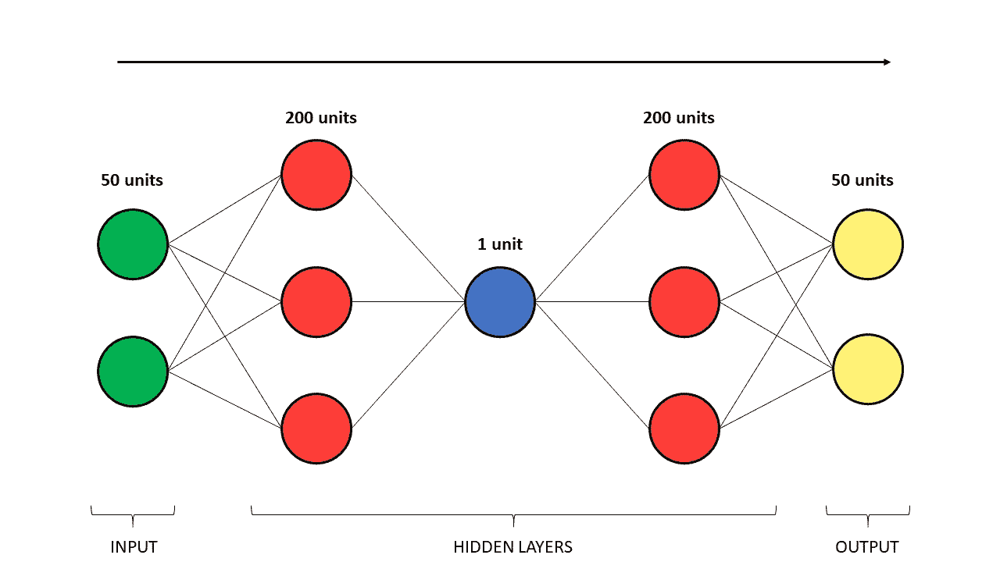
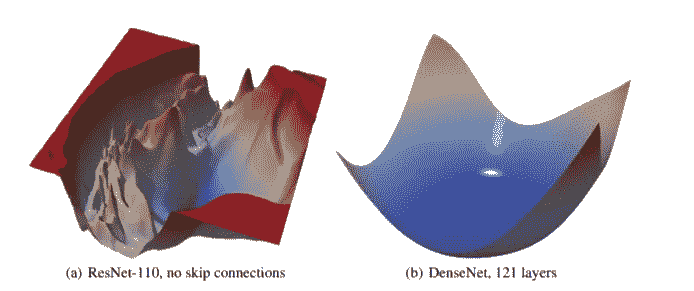

# 我们能让算法做出我们无法解释的决定吗？

> 原文：<https://towardsdatascience.com/can-we-let-algorithm-take-decisions-we-cannot-explain-a4e8e51e2060?source=collection_archive---------13----------------------->

今天的算法非常精确和复杂。不仅用户不理解他们，创造者也很难证明他们所做的决定是正确的。这导致了一个伦理问题，每个人工智能研究人员都应该牢记在心。

来源:https://pixabay.com/

# 人工智能无处不在

人工智能对我们日常生活的影响日益突出。人工智能似乎比我们更了解我们，其应用范围从预测我们将要狂看的下一部电视剧到我们将要约会的下一个人。我们不断地产生数据，随着存储容量和计算能力的最近改善，公司和组织已经加入了大数据的行列。你可能听说过大数据的三个 v:速度(兆字节到零字节)、量(数据分成批量到流数据)和多样性(结构化和非结构化数据)。这是定义大数据的经典方式。今天，我们在这三个 v 中是正确的，如果你将大数据与应用数学相结合，你将获得人工智能。人工智能利用数据做出小到优步汽车价格、大到 T2 法院判决的重大决策。

随着时间的推移，人类和人工智能的角色发生了巨大的变化。以前，人类是唯一的决策者，人工智能只是一个工具(以及其他工具)。然而，今天的算法在没有咨询人类的情况下做出了无数决定:它们成为了决策者，而人类被推入了由技术塑造的人工制品中。

从某种意义上说，这种转变是合乎逻辑的:算法已经达到了如此高的精确度和计算能力，以至于超过了人类。人工智能在游戏中击败人类(1997 年的[国际象棋](https://en.wikipedia.org/wiki/Deep_Blue_versus_Garry_Kasparov)，[危险边缘！2011 年](https://en.wikipedia.org/wiki/Watson_(computer)#Jeopardy!)、[围棋 2016 年](https://en.wikipedia.org/wiki/AlphaGo_versus_Lee_Sedol)、[星际争霸 2 2019 年](https://www.theverge.com/2019/1/24/18196135/google-deepmind-ai-starcraft-2-victory)、人脸识别([脸书 2014 年](https://research.fb.com/publications/deepface-closing-the-gap-to-human-level-performance-in-face-verification/)的 DeepFace)、语音识别([微软 2016 年](https://www.microsoft.com/en-us/research/wp-content/uploads/2017/01/ms_swbd16.pdf))、机器学习编码([谷歌的 AutoML](https://cloud.google.com/automl/) 和[微软的 DeepCoder](https://www.microsoft.com/en-us/research/publication/deepcoder-learning-write-programs/) )、疾病检测([癌症](https://www.ft.com/content/3b64fa26-28e9-11ea-9a4f-963f0ec7e134)、肺炎由于今天的技术进步(见上面提到的三个 v)，我们可以让模型根据需要变得既大又复杂，允许算法达到非常高的精度和效率，从而击败人类。

来源:[https://en.wikipedia.org/wiki/DeepMind](https://en.wikipedia.org/wiki/DeepMind)

算法在我们日常生活中扮演的角色带来了一个伦理问题:**我们能让算法做出我们无法解释的决定吗？**

> 在 2017 年举行的可解释人工智能研讨会期间，优步人工智能研究员 Jason Yosinkski 表示，*[*为了让机器学习模型被社会接受，我们需要知道他们为什么要做出这些决定*](https://qz.com/1146753/ai-is-now-so-complex-its-creators-cant-trust-why-it-makes-decisions/) *。”**

*事实上，算法经常被视为“黑匣子”，这在人们的脑海中产生了恐惧。理解算法做出的选择至关重要，主要有两个原因:*

*   *首先，用户**有权知道**他的个人数据如何被使用，以及算法如何试图影响他(以好的或坏的方式)。*
*   *第二，还有一个正在上升的**安全问题**。一些千禧一代已经习惯于接受人工智能的决定，而不去寻找解释。将人工智能视为甲骨文可能是危险的，因为算法可能是错误的，有偏见的，或有隐藏的意图。*父母让他们的孩子在没有监控的情况下观看 YouTube。但他们大概不知道，YouTube 唯一的 KPI 就是用户观看时间。他们想最大化它，不惜任何代价。问题是假新闻和阴谋论内容* *在广告收入方面表现很好……”*YouTube 前研究员 Guillaume Chaslot 承认。*

# *用户懂算法吗？*

*随着[通用数据保护法规(GDPR)](https://gdpr-info.eu/) 在 2018 年在欧盟的实施，有关个人数据收集和处理的法规向前迈进了一步。在本文件所述的所有原则中，我将集中讨论处理部分:“*对个人数据的任何处理都应合法和公平。关于自然人的个人数据的收集、使用、咨询或以其他方式处理，以及个人数据的处理程度，对自然人应该是透明的。透明度原则要求与处理这些个人数据相关的任何信息和通信都易于获取和理解，并使用清晰明了的语言。*”([*数据处理原理*，叙文 39](https://gdpr-info.eu/recitals/no-39/) )*

*简单来说:**每个人都有权了解其个人数据是如何被收集和处理的。***

*这对科技公司来说是一个巨大的挑战。YouTube 能详细解释为什么我的欢迎页面充满了滑板和爵士视频吗？更具体地说，我想知道为什么今天早上显示的顶部视频是“初学者的 10 个简单的迷你坡道技巧”。为什么是这个而不是另一个滑板视频？*

*让我们想象一下，社交网络可以深入到它的推荐算法中，查看所有的权重和超参数，并在给定输入(我的个人数据，可能还有一些外生数据)的情况下，向我解释显示的输出(滑板视频)。这在技术上是可行的…但我怀疑 YouTube 会这样做。该平台正在处理太多的数据(每天 3000 万访客，每分钟上传 300 小时的视频)，没有时间考虑我的请求。为了这个实验，想象一下 YouTube 确实回复了我，给我发了一个解释。我能理解它吗？*

> *“用户无法理解数学公式。这条法律鼓励公司给你一个模糊的解释来证明一个算法决策的合理性”——纪尧姆·查斯洛*

*GDPR 要求一个“简单易懂”的解释，使用“清楚明白的语言”。向我提供明确的数学公式和相关的超参数将是最“诚实”和“明确”的答案，但我能理解它吗？相反，过度的简化意味着信息的丢失。透明度的概念显然存在问题。纪尧姆·查斯洛向我证实了这一点:“*可解释性是伟大的，但它到底意味着什么呢？用户无法理解数学公式。这条法律鼓励公司给你一个模糊的解释来证明一个算法决策。通常，这是不够的。**

****

*来源:https://pixabay.com*

*需要考虑的是用户理解解释的**认知能力**。我的祖母学习英国文学，并在 5 年前收到了她的第一部智能手机，而我学习人工智能，目前正在该领域工作，很明显，所需的简化水平是不一样的。*

*从用户的角度来看，我相信有权利理解我们是如何被算法影响的。从提供商的角度来看，证明算法的每一个决定都是不容易的。这种合理性取决于几个因素:算法的复杂程度、处理过的数据流、要求解释的用户数量以及他们理解的能力。为了淡化这种情况，人们必须提醒自己，我们经常在不知道工具如何工作的情况下使用它们。例如，我不知道我的微波炉或锅炉是如何工作的，但我每天都在使用它们，我不介意。*

# *数据科学家懂算法吗？*

*我们已经看到，用户很难理解他们正在交互的算法。幸运的是，至少那些算法的创造者确实明白正在发生什么……不是吗？*

**

*前馈神经网络(FFNN)的图示*

*你知道那是什么吗？这是神经网络的一个非常简单的例子。让我们来计算一下它的参数个数:
*num_params
=层间连接+每层中的偏差
=(50×200+200×1+1×200+200×50)+(200+1+200+50)
= 20 851* 即使是这样一个基础的模型，结果也是巨大的！想象一下，当我们处理更大的架构(卷积神经网络或递归神经网络)时。*

*你可能已经理解了，我想在这里暂停一下深度学习。*

*深度学习并不新鲜(罗森布拉特的感知机是在 1958 年发明的)，但由于丰富的数据库(2012 年的 ImageNet)，令人印象深刻的计算机能力(GPU)，新的框架(PyTorch，Tensorflow，Keras)和深度学习大师(Yann Lecun，Geof Hinton，吴恩达，Alex Krizhevsky)，它在过去十年中发展非常快。深度学习在医疗保健、自动驾驶汽车、语音识别、翻译、图像识别、金融甚至艺术领域都有应用。而这仅仅是开始！*

*深度学习中的训练程序确定了数百万个参数的设置，这些参数以复杂的方式相互作用。对神经网络进行逆向工程极其困难。**我们已经到了一个地步，即使是算法的创造者也无法完全理解它**。"*算法很容易在结构化数据上解释，因为我们可以查看这个或那个特定特征的权重。*”Deep mind 的研究员 Grégoire Delétang 对我说，“*但当算法在图像、语音、文本等非结构化数据上训练时，它会变得更加复杂，深度学习就是这种情况。“我们有一个由人类设计的系统，它探索了如此多的可能性，以至于人类无法跟上它的步伐。**

> **“当算法在非结构化数据上训练时，它变得更加复杂”——grégoire deléTang**

*深度强化学习更是如此，代理通过与环境交互来自动学习。我们不能直接控制它；我们只能设置代理交互环境的规则。"*深度学习已经变得如此复杂，参数如此之多，以至于不可能解释一切。这对人类来说是令人沮丧的。作为生物学家或医生，我们正面临着非常复杂的机制，我们试图建模。除了研究对象是人类而非自然创造的这一事实之外，我在我的作品中看到了许多与生物学和物理学的相似之处*。格雷瓜尔·德莱唐说。*

> **“我在我的作品中看到了很多与生物学和物理学的相似之处”* —格雷瓜尔·德莱唐*

*有一种范式的变化是理解的基础:深度学习不再只是用来帮助人类做决定的工具。**深度学习是一种准自主对象，可以按原样进行研究。**我们提供输入，我们设计环境，网络以我们能够理解的格式提供输出。体制是怎么来的？我们不知道，面对现实吧，我们永远不会知道。但是我们可以通过深入研究网络的架构来获得一种直觉。学术界的聪明人已经思考了掌握这种直觉的技术。以下是最近出版物中的一些例子:*

*   *[特征可视化](https://distill.pub/2017/feature-visualization/) (Olah 2017):从带有随机噪声的图像开始，优化像素以激活经过训练的深度神经网络中的特定神经元，从而可视化该单元“学到了什么”。也可以研究单位之间的相互作用。*

**

*来源:https://distill.pub/2017/feature-visualization/*

*   *[Grad-Cam](https://arxiv.org/abs/1610.02391) (塞尔瓦拉茹等。艾尔。2017):使用来自最终卷积层的梯度来生成热图，该热图突出显示了图像中用于预测概念的重要区域。*
*   *[失景](https://arxiv.org/abs/1712.09913)(李等人。艾尔。2017):利用一系列可视化方法，探索神经损失函数的结构，以及损失景观对泛化的影响。*

***

来源:研究论文* 

*因此，深度学习算法是不可能理解的，即使对于它的创造者来说也是如此，但人们已经在努力解释它们了。一些研究人员表示，**深度神经网络与人脑有很强的联系，**人脑是宇宙中最复杂的系统之一。其实当我们认为人工神经元最初是受神经组织中的生物神经元的启发而产生的时候，这是说得通的。**深入研究 DNNs 不仅会帮助我们理解深度学习是如何工作的，它还会告诉我们人类大脑是如何工作的**。也许深度学习会揭示我们大脑的秘密！*

# *可解释的人工智能:过度简化的风险*

*总而言之，我认为让算法做出我们不理解的决定的问题是至关重要的，并且超出了它们实现的技术层面。*

*人工智能是用来自动完成任务的。它节省了我们的时间，给我们带来了准确性和可靠性。虽然它非常有用，但它在我们的日常生活中也变得越来越重要。人们必须小心，不要陷入一种“算法政治”，即规定“什么”而没有“为什么”。理解人工智能如何做出决定的需求将取决于这些决定的关键程度。理解 YouTube 网页上显示的视频不如理解审判的句子重要。*

*面对这种情况，最近出现了一种新的观念。可解释的人工智能(XAI)是新的黑色，2019 年已经看到了几十篇围绕这一领域的研究论文、会议和文章。*

> **“XAI 增加了一层新的庸俗:这是一种近似的近似”* —格雷瓜尔·德莱唐*

*如果 XAI 意味着选择对检查更透明的算法，如决策树或线性回归，那么 XAI 是伟大的。但如果这意味着继续使用复杂的算法(如深度神经网络)，并试图给出算法如何工作的直觉，那么我认为 XAI 可能会有风险。在我采访格雷瓜尔·德勒唐时，他对我说:“*你建立了一个模型，这是对现实的近似。XAI 增加了一层新的粗俗化:这是一种近似的近似。那你离真相有多远？**

*可解释性是有限的:有可能解释一切吗？大概不会。我们人类有时甚至无法解释自己的决定。我怎么认出那张脸的？人类的大脑是一个黑匣子。实验表明，人们只是在决定已经做出后为自己的行为编造解释，而这些解释因人而异。*

# *结论*

*今天，人工智能无处不在，算法正在做出对我们日常生活产生强烈影响的决定。这些算法的用户(美国)不理解它们，这是关于 GDPR 立法的一个问题。但还有另一个严重的问题:人工智能算法的创造者很难证明机器提供的输出是正确的。*

*在设计算法时，每个研究人员都必须面对准确性和可解释性之间的权衡。准确性通常需要更复杂的模型(深度神经网络、增强树、随机森林、SVM)，但不太容易解释。另一方面，简单明了的方法(线性/逻辑回归、决策树、最近邻法)往往不够准确。*

*在我看来，如果我们不想在 [*黑镜*](https://en.wikipedia.org/wiki/Black_Mirror) 的场景中结束，最重要的是将用户的兴趣放在我们思想的中心。我们可以想象一个独立的组织深入研究一家公司的代码，检查算法是否符合用户的利益。食品和化妆品行业已经有了无数的认证(生态、公平贸易、纯素食、生物)，为什么科技行业就没有呢？第三方认证将在数据隐私、匿名、可解释性和副作用方面为用户提供保证。Guillaume Chaslot 目前正在研究一个类似的想法:“*我们应该创建认证来指导用户的选择。商业模式和人工智能之间有很强的联系。在大多数网站上，我们的印象是一切都是免费的。但是不要忘记你的数据就是价值，这是这些公司如何将他们的服务货币化的。**